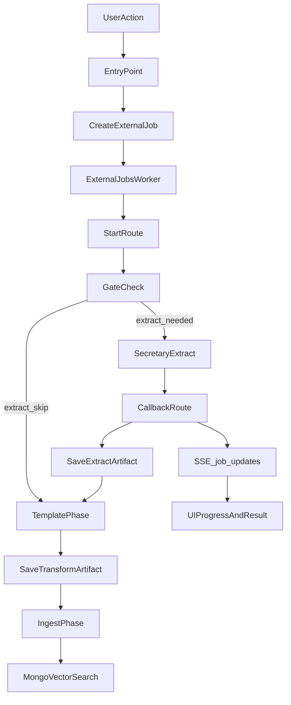

# Variante 3: Artefakt-zentrierte Pipeline (Secretary-only) – Plan

## Zielbild (kurz)

- **Template definiert Ergebnis**, nicht die Quelle.
- **Quelle liefert nur Artefakte** (Extract/Transcript + optional Assets); **Transformation** erzeugt finalen Bericht (Markdown+Frontmatter).
- **Idempotenz** über **Artefakt-Namensschema + Gates + Policies**.
- **Alle operativen Extractionen/Transformationen laufen im Secretary Service** (gemäß [`docs/_analysis/SecretaryService API overview.md`](docs/_analysis/SecretaryService%20API%20overview.md)).

## Scope für den 1. End-to-End Durchstich (vom Nutzer bestätigt)

- **Formate**: Audio + Video (inkl. YouTube) + PDF + DOCX + XLSX.
- **Template-Identität**: **nur Template-Name** in Artefakten (kein Version/Hash).
- Risiko/Guardrail: Template-Änderungen sind nicht reproduzierbar. Wir dokumentieren deshalb ein optionales **Frontmatter-Feld** `template_revision` (z.B. Timestamp/Hash), das beim Run gespeichert wird, aber **nicht** Teil des Artefakt-Namens ist.

## Rollen/Anwendungsbereiche (Personas)

### Archiv-Pro (technisch versiert)

- **Entry Points**: File‑Liste (Single‑File), Batch/Verzeichnis, Monitoring/Traces.
- **Ziel**: deterministische Verarbeitung, Resume/Skip, Kontrolle über Policies/Gates, saubere Facetten (Gallery/Archiv), Debugbarkeit.

### Wizard-User (nicht technisch)

- **Entry Points**: Wizard (Quelle wählen → Template wählen → Start → Ergebnis prüfen → Speichern).
- **Ziel**: sichere Defaults, verständlicher Fortschritt, wenig Entscheidungen, Ergebnis schnell nutzbar.

### Automation/Integration

- **Entry Points**: API/Jobs (ohne UI), Batch-Automation (optional später).
- **Ziel**: idempotent, standardisierte Artefakte/Outputs, klare Fehlercodes, reproduzierbare Runs (so weit möglich bei Template Name-only).

## Use-Case Liste (systematisch, für minimale Redundanz)

### Single-Source Use Cases (V1 + nahe Roadmap)

- **Audio**: Audio-Datei → Transcript (Originalsprache/TargetLanguage) → Template‑Bericht → Ingest.
- **Video**: Video-Datei → (Audio-Extraktion) → Transcript → Template‑Bericht → Ingest.
- **YouTube**: YouTube URL → Download/Extract → Transcript → Template‑Bericht → Ingest.
- **PDF**: PDF → Mistral OCR (Markdown) + Pages/Images → Template‑Bericht → Ingest.
- **Word (DOCX)**: DOCX → Extract (Text/Struktur) → Template‑Bericht → Ingest.
- **Excel (XLSX)**: XLSX → Extract (Sheets/Tables) → Template‑Bericht → Ingest.

### Single-Source Use Cases (später, aber vorgesehen)

- **Image**: Bild → OCR → Template‑Bericht → Ingest.
- **PowerPoint/Slides**: PPTX/Slides → Extract (Text + Bilder) → Template‑Bericht → Ingest.

### Multi-Source Use Cases (Ausblick; wichtig für Zielbild)

- **Event Bundle**: Slides + Vortrag (Video/Audio) + optional Web‑Text + optional PDF/Handout → Bundle‑Korpus → Template‑Bericht → Ingest.
- WICHTIG: Bundle braucht eine eigene stabile „source identity“ (z.B. FolderId oder WizardSessionId) für Artefakte/Gates.

## Einheitliche Use-Case Matrix (Schablone: wie/wo/warum)

Diese Schablone wird für **jeden Use Case** ausgefüllt (pro Rolle/Entry‑Point), um Redundanzen zu erkennen und die Implementierung minimal zu halten.

### Matrix-Felder

- **UseCaseId**: z.B. `pdf_mistral_report`, `audio_transcript_report`
- **Persona/EntryPoint**: Archiv-Pro/File‑Liste, Archiv-Pro/Batch, Wizard-User/Wizard, Automation/API
- **Input**:
- `sourceRef` oder `sourceBundle`
- `templateName`, `targetLanguage`, `policies`
- **Orchestrierung**:
- External Job: `job_type`, `operation`, `worker`
- Steps/Phasen: extract → template → ingest
- **Secretary Calls**:
- Endpoint + Parameter
- Sync vs Async (Job/Webhook)
- Erwartetes Callback-Payload (keys, URLs statt Base64)
- **Artefakte (Shadow Twin)**:
- Extract/Transcript: `{base}.{lang}.md`
- Transformation: `{base}.{template}.{lang}.md`
- Assets: pages/images archives (URLs) + Ablagekonvention
- **Gates/Policies**:
- Welche Artefakte skippen welche Phase?
- Welche Policies überschreiben Gates (`force`)?
- **Persistenz/Publishing**:
- Storage (Artefakte)
- Mongo (Ingest) + Facetten/Metadaten
- **UI/Ergebnis**:
- Status/Progress (SSE)
- „Ergebnis öffnen/selektieren“
- Fehlerdarstellung (verständlich, ohne internals)

## Strangler-Migrationsstrategie (Risiko-Minimierung)

### Leitprinzip

- **Bestehende External-Jobs-Orchestrierung bleibt die einzige Orchestrierung.**
- Wir bauen **keine parallele neue Pipeline**, sondern erweitern **additiv** (neue Job-Typen/Adapter, neue Gates nur wo nötig).
- Ziel: **Minimale Änderung am bewährten Core**, maximale Wiederverwendung der ausgelagerten Libraries/Phasen.

### Do-not-touch Liste (im V1-Vertical-Slice nur mit äußerster Vorsicht ändern)

- **Worker-Loop**: [`src/lib/external-jobs-worker.ts`](src/lib/external-jobs-worker.ts)
- **Job Start/Dispatch**: [`src/app/api/external/jobs/[jobId]/start/route.ts`](src/app/api/external/jobs/%5BjobId%5D/start/route.ts)
- **Callback-Orchestrierung**: [`src/app/api/external/jobs/[jobId]/route.ts`](src/app/api/external/jobs/%5BjobId%5D/route.ts)
- **Ingest-Senke**: `IngestionService.upsertMarkdown` (wird nur konsumiert)
- **SSE Stream** für Live-Updates: [`src/app/api/external/jobs/stream/route.ts`](src/app/api/external/jobs/stream/route.ts)

> Regel: Änderungen am Core nur, wenn sie (a) strikt rückwärtskompatibel sind und (b) durch Tests/Smoke-Cases abgesichert werden.

### Gezielte Extension Points (wo neue Logik hin darf)

- **Secretary-Adapter / Next API Routes** (Format-spezifisch): `src/app/api/secretary/*/route.ts`
- **Secretary Client & Response-Typen**: `src/lib/secretary/client.ts`
- **External Jobs: neue Jobtypen/Operationen + minimaler Start-Branch**: `src/types/external-job.ts`, `src/lib/external-jobs/*`
- **Phasenmodule** (wenn Format neu ist, möglichst als kleine Adapter-Funktion, nicht als neue Orchestrierung): `src/lib/external-jobs/phase-template.ts`, `src/lib/external-jobs/phase-ingest.ts`
- **Gates**: bevorzugt Wiederverwendung der bestehenden Artefakt-Prüfung; nur ergänzen, wenn ein neues Artefakt wirklich anders abgelegt wird.

### Rollout-Plan (sicher, inkrementell)

1. **Shadow-Twin Artefakte zuerst**: Für neue Formate müssen *mindestens* Transcript/Extracted + Transformation als Artefakt entstehen.
2. **Ingest unverändert wiederverwenden**: Ingest läuft immer auf dem transformierten Markdown (wie bereits in `runIngestPhase` vorgesehen).
3. **UI-Entry-Points schrittweise umstellen** (File-Liste → Wizard → Batch), jeweils mit Fallback.

### Checkliste pro neuem Format (DOCX/XLSX im V1)

- **Secretary Endpoint vorhanden?** (oder muss im Secretary ergänzt werden)
- **Input Contract**: Welche Parameter (file/url, targetLanguage, templateName, useCache, callbackUrl/job)?
- **Async Contract**: Job-ID + Webhook/Callback Payload + Progress Events.
- **Artefakt-Output**:
- Transcript/Extracted: `{base}.{lang}.md`
- Transformation: `{base}.{template}.{lang}.md`
- Speicherort: Shadow-Twin (Sibling/Dot-Folder) konsistent zur bestehenden Resolver-Logik.
- **Gate-Kriterien**: Welche Artefakte bedeuten „Phase darf skippen“?
- **Ingest-Kriterium**: Es existiert ein transformiertes Markdown mit Frontmatter (Template-Ergebnis).
- **Smoke-Test**:
- Start Job → SSE Update kommt → Completed → Artefakt existiert → Ingest (optional) erzeugt Vektoren.

## V0: Zentraler Use Case (PDF Mistral OCR + Pages/Images) + Definition of Done

### Warum dieser zentrale Use Case?

- Er zwingt alle kritischen Bausteine einmal sauber durch: **Job erstellen → Worker/Start/Callback → Mistral OCR + Pages/Images → Artefakte → Template → Ingest → SSE → UI-Ergebnis**.
- Er maximiert Wiederverwendung, weil PDF/External Jobs/Phasen/Gates bereits existieren.
- Wenn V0 stabil ist, sind weitere Formate (DOCX/XLSX) im Kern „nur“ neue Secretary‑Extractor/Adapter, die in dieselbe Orchestrierung einhängen.

### V0 Scope (hart)

- **Entry Point**: **File‑Liste Single‑File** (noch kein Wizard, kein Batch).
- **Quelle**: PDF
- **Extract**: **Mistral OCR** inkl. **Pages/Images** (ZIP via URLs, keine großen Base64 Blobs als Standard).
- **Template**: Template‑Name (Name-only) bestimmt Ziel‑Markdown + Frontmatter.
- **Ingest**: optional per Policy, aber technisch voll unterstützt.
- **UI**: Live‑Status über SSE, Ergebnis kann geöffnet/selektiert werden.

### Definition of Done (DoD) – V0 PDF Mistral OCR inkl. Pages/Images

1. **Start & Orchestrierung**

- User kann in der File‑Liste ein PDF auswählen und V0 starten (Button/Action, ggf. Feature‑Flag intern).
- Es wird ein External Job erzeugt (`queued`) und über den bestehenden Worker/Start/Callback abgearbeitet (keine zweite Pipeline).

2. **Secretary Extract (Mistral OCR + Images)**

- Job nutzt **Mistral OCR** (nicht native).
- Callback verarbeitet `pages_archive_url`/`images_archive_url` (oder äquivalente Felder) ohne große Base64 Payloads.
- Fehlerfälle enden sauber in `failed` mit verständlicher Ursache.

3. **Artefakte (Shadow Twin) – harte Outputs**

- Extract/Transcript‑Artefakt existiert: `{base}.{lang}.md`.
- Transformation‑Artefakt existiert: `{base}.{template}.{lang}.md`.
- Transformation enthält Frontmatter mindestens mit: `template`, `target_language`, `source_file`/`source_file_id`, `pages` (Zahl) und `chapters` (oder begründeter Fallback).

4. **Template = Ziel**

- Template‑Name ist im Artefakt und/oder Frontmatter nachvollziehbar (Name-only ist ok).

5. **Gates / Idempotenz**

- Wenn Transformation‑Artefakt existiert und Policy nicht `force` ist, wird Template‑Phase geskippt.
- Wenn Ingest bereits existiert (Gate), wird Ingest geskippt.
- Re-run erzeugt keine doppelten Artefakte oder doppelten Ingest‑Chunks.

6. **Ingest (RAG)**

- Ingest verwendet immer das **transformierte Markdown**, wenn vorhanden (nicht rohes extracted_text).
- Nach Ingest sind Meta + Chunks in MongoDB Vector Search vorhanden.

7. **UI Feedback (SSE) & Ergebnis**

- Während Lauf: SSE liefert `job_update` Events (`queued → running → completed/failed`).
- Nach `completed`: UI kann das Transformation‑Artefakt öffnen/selektieren oder bietet einen klaren „Ergebnis öffnen“‑CTA.

8. **Observability (minimal, ausreichend)**

- Job hat Steps/Logs/Trace so, dass Fehler debugbar sind; Watchdog verhindert „hängen“.

9. **Regression Safety (Strangler)**

- Legacy PDF‑Verarbeitung bleibt funktionsfähig; V0 ist additiv und abschaltbar.

10. **Akzeptanztest (reproduzierbar)**

- Lauf 1: Artefakte + (optional) Ingest entstehen; Ergebnis sichtbar.
- Lauf 2: Gates greifen, deutlich schneller, Ergebnis unverändert.

## Kernkonzept: Artefakte, Phasen, Gates

### Artefakte (kanonisch)

- **Extract/Transcript**: `{base}.{lang}.md`
- **Transformation**: `{base}.{template}.{lang}.md`
- **Ablage**: Shadow-Twin (Sibling oder Dot-Folder), konsistent mit bestehender Logik (`src/lib/shadow-twin/*`, `src/lib/storage/shadow-twin*`).

### Phasen

- **PhaseExtract**: Quelle → Markdown/ExtractedText (+ optionale Assets/Refs)
- **PhaseTransformTemplate**: ExtractedText (+ optional Bundle-Korpus) → Final Markdown+Frontmatter
- **PhaseIngestRag**: Final Markdown → `IngestionService.upsertMarkdown`

### Gates/Policies

- Gates existieren bereits in [`src/lib/processing/gates.ts`](src/lib/processing/gates.ts) und Policies in [`src/lib/processing/phase-policy.ts`](src/lib/processing/phase-policy.ts).
- Plan (Strangler-konform): **keine kosmetischen Umbennennungen im V1**. Wir nutzen bestehende Gates und stützen die Entscheidung auf **Artefakt-Existenz**. Umbenennungen/Generalisierungen sind „Phase 2“ nach stabilen End-to-End Tests.

## Wizard-Asynchronität (bereits vorhanden)

- Wizard kann Jobs starten und den Status über SSE anzeigen via [`src/app/api/external/jobs/stream/route.ts`](src/app/api/external/jobs/stream/route.ts) (job_update Events pro User).

## Dokumentations-Deliverables (Schritt 1)

Wir erstellen/erweitern folgende Doku-Dateien (kurz, aber vollständig):

1. **Use Cases + Rollen-Matrix**: `docs/architecture/use-cases-and-personas.md`

- Rollen: Archiv-Pro (File-Liste/Batch), Wizard-User, Automation.
- Use Cases: Audio/Video/YouTube/PDF/DOCX/XLSX + Multi-Source (nur als Ausblick, nicht im V1-Implementationsdurchstich).

2. **Anforderungen**: `docs/architecture/requirements-artifact-pipeline-v3.md`

- Functional: Artefakte, Gates, Ingest, Template-Auswahl, Batch/Folder.
- Non-functional: Idempotenz, Resume, Observability, Security, Performance.
- Risiken: SSE EventBus Single-Instance; Template-Versionierung (Name-only).

3. **Technisches Design**: `docs/architecture/artifact-pipeline-v3-design.md`

- Dataflow, Artefakt-Typen, Jobmodell, Zustandsautomat.
- Mermaid-Diagramme.

4. **Formatspezifische Schnittstellen (Secretary↔App)**: `docs/architecture/secretary-format-interfaces.md`

- Basierend auf Ist-Zustand in:
    - Next Routes: `src/app/api/secretary/*/route.ts`
    - Client Types: `src/lib/secretary/client.ts`
    - API Überblick: [`docs/_analysis/SecretaryService API overview.md`](docs/_analysis/SecretaryService%20API%20overview.md)
- Für jedes Format: Request/Response/Async-Job/Webhook/Fehlercodes/Artefakt-Output.

### Mermaid (Ziel-Flow, V3)

## Implementationsstrategie (Schritt 2–4)

### Schritt 2: Gemeinsame Pipeline-API im Backend (ohne UI-Redundanz)

- Definiere ein **format-agnostisches Job-Payload-Schema** (Quelle + templateName + targetLanguage + policies).
- Standardisiere Outputs als Artefakte (Shadow Twin) und „final“ als Transformations-Artefakt.
- Stelle sicher, dass `runIngestPhase` immer das **transformierte** Markdown bevorzugt (ist schon so).

### Schritt 3: Vertical Slice – erst V0 (minimal), dann V1 (breit)

**V0 zuerst (Komplexität minimieren, Risiko minimieren):**

- **Nur PDF, nur File‑Liste Single‑File**, aber mit maximaler Abdeckung (Mistral OCR + Pages/Images + Template + Artefakt + Ingest + SSE).
- Erst wenn V0 stabil ist, erweitern wir Entry Points und Formate.

**V1 danach (breiter):** Für jedes V1-Format (Audio/Video/PDF/DOCX/XLSX) liefern wir jeweils dieselben drei UX-Pfade aus:

- **File-Liste (Single)**: Datei auswählen → Job starten → live Status → Ergebnis-Datei auswählen.
- **Batch/Verzeichnis**: Ordner auswählen → Jobs erzeugen (batchId) → Worker verarbeitet parallel → Monitoring.
- **Wizard (Single)**: Quelle wählen (Datei/URL/YouTube) → Template wählen → Start Job → SSE → Preview/Save.

### Schritt 4: Konsolidierung & Tests

- Unit-Tests: Artefakt-Naming, Gate-Entscheidungen, Policy-Auswertung.
- Integration: Job lifecycle + SSE updates + “completed implies artifact exists”.
- Regression: Bestehende PDF- und Wizard-Flows müssen weiterhin funktionieren.

## Offene Punkte (bewusst als Decisions/Constraints dokumentieren)

- **Template-Versionierung**: im Scope V1 nur Name; wir speichern optional `template_revision` in Frontmatter für Debug/Trace.
- **SSE Skalierung**: EventBus ist in-memory (`src/lib/events/job-event-bus.ts`). In Multi-Instance Setup braucht es Redis/DB-backed PubSub; wir dokumentieren das als NFR.
- **Office Extract (DOCX/XLSX)**: da Secretary-only: wir definieren die Schnittstelle in der Doku. Falls der Secretary diese Endpoints noch nicht hat, planen wir „Adapter-Endpunkte“ oder eine Erweiterung des Secretary (als separaten Task).

## Konkrete Dateien, die wir voraussichtlich anfassen (nach Plan-Freigabe)

- Doku: `docs/architecture/*` (neu)
- Secretary-Routes: `src/app/api/secretary/*/route.ts` (vereinheitlichen / fehlende Formate ergänzen)
- External Jobs: `src/app/api/external/jobs/[jobId]/*`, `src/lib/external-jobs/*` (job_type/operation erweitern, Gates generalisieren)
- Wizard: `src/components/creation-wizard/*` (Job-start + SSE statt direkter Verarbeitung, wo sinnvoll)

## Implementation Todos

- `docs-usecases`: Use Cases + Rollen-Matrix erstellen
- `docs-requirements`: Anforderungen (Functional/NFR/Risiken) erstellen
- `docs-secretary-interfaces`: Formatspezifische Secretary↔App Schnittstellen dokumentieren (Audio/Video/YouTube/PDF/DOCX/XLSX)