## Composite-Transformations: Sammel-Markdown auf Transformations-Artefakte

### Kernidee (vereinfacht nach Klarstellung)

Die fertige Datei ist ein **ganz normales `kind: composite-transcript`-Markdown**. Einziger Unterschied: einzelne Einträge in `_source_files` und einzelne Wikilinks tragen ein Schrägstrich-Suffix mit dem Templatenamen, z. B. `seite1.pdf/gaderform-bett-steckbrief`. Der bestehende Resolver wird so erweitert, dass er pro Eintrag dieses Suffix parst und dann statt eines Transcripts die entsprechende Transformation aus Mongo lädt.

Damit:
- **Kein neues `kind`** — Pipeline-Detection in `start/route.ts` bleibt unverändert.
- **Kein zweiter Pipeline-Pfad** — der Job verarbeitet die Datei genauso wie ein heutiges Sammeltranskript.
- **Mischbar** — eine Sammeldatei kann theoretisch Transcript- und Transformations-Wikilinks parallel enthalten (für jetzt nutzen wir nur reine Transformations-Sammeldateien, das Schema bleibt aber offen).

### Wikilink- und Frontmatter-Schema

Beispiel der erzeugten Markdown-Datei:

```markdown
---
kind: composite-transcript
_source_files:
  - seite1.pdf/gaderform-bett-steckbrief
  - seite2.pdf/gaderform-bett-steckbrief
title: Steckbrief-Sammlung Q1
---

# Steckbrief-Sammlung Q1

## Quellen

- [[seite1.pdf/gaderform-bett-steckbrief]]
- [[seite2.pdf/gaderform-bett-steckbrief]]
```

Regel im Resolver:
- Eintrag enthält keinen Schrägstrich → wie bisher: `kind: 'transcript'` aus Mongo laden.
- Eintrag enthält Schrägstrich → vor dem Schrägstrich = Quelldateiname (für Lookup im Verzeichnis), nach dem Schrägstrich = `templateName`. Lookup als `kind: 'transformation'` mit `(sourceId, targetLanguage, templateName)`.
- `targetLanguage` kommt wie heute aus `CompositeResolveOptions` (Job-Kontext / Library-Default), nicht aus dem Wikilink.

### Datenfluss

```mermaid
flowchart LR
  User --> FileList[FileList Markierung 2plus]
  FileList --> Dialog[Dialog Templatewahl]
  Dialog --> POST[POST composite-transformations]
  POST --> Build[buildCompositeReference mit templateName]
  Build --> MD[Markdown kind composite-transcript Schraegstrich-Suffix]
  MD --> Storage[Storage Provider]
  Storage --> Job[Externer Job text]
  Job --> Resolver[resolveCompositeTranscript erweitert]
  Resolver --> Mongo[getShadowTwinArtifact transformation pro Eintrag]
  Mongo --> Flat[geflachter Markdown]
  Flat --> LLM[Transformer Template]
```



### Determinismus (Contract)

`templateName` ist Pflicht für `kind='transformation'` (siehe [`shadow-twin-contracts.mdc`](.cursor/rules/shadow-twin-contracts.mdc)). Wir nehmen daher beim Erstellen EIN Template + Sprache (Variante A: Single-Template-Dialog) und schreiben den Templatenamen explizit in jeden Wikilink-Suffix. Quellen, die das gewählte Template nicht haben, landen vor der Erstellung in einer Warnliste; der User kann sie weglassen oder das Erstellen abbrechen. Kein „pick latest", kein Auto-Fallback.

### Wichtige bestehende Dateien (Touchpoints)

- `[src/lib/creation/composite-transcript.ts](src/lib/creation/composite-transcript.ts)` — Build und Resolve werden hier erweitert.
- `[src/lib/creation/composite-source-files-meta.ts](src/lib/creation/composite-source-files-meta.ts)` — bleibt unverändert; gibt String-Array zurück, die Suffix-Verarbeitung passiert im Resolver.
- `[src/lib/repositories/shadow-twin-repo.ts](src/lib/repositories/shadow-twin-repo.ts)` — `getShadowTwinArtifact`, `toArtifactKey` (Pflicht-`templateName` für transformation).
- `[src/components/library/composite-multi-create-dialog.tsx](src/components/library/composite-multi-create-dialog.tsx)` — Vorlage für den neuen Dialog.
- `[src/components/library/file-list.tsx](src/components/library/file-list.tsx)` — Toolbar-Button hinzufügen (analog composite-multi-Button).
- `[src/app/api/library/[libraryId]/artifacts/batch-resolve/route.ts](src/app/api/library/[libraryId]/artifacts/batch-resolve/route.ts)` — als Referenz, wie Pool-Lookups serverseitig laufen.
- `[src/app/api/external/jobs/[jobId]/start/route.ts](src/app/api/external/jobs/[jobId]/start/route.ts)` — **bleibt unangetastet**.

### Schritte

1. **S1 — Resolver erweitern**: In `composite-transcript.ts` den Loop in `resolveCompositeTranscript` so anpassen, dass pro Eintrag von `sourceFileNames` zuerst nach `/` gesplittet wird. Ergibt `{name, templateName?}`. Wenn `templateName` gesetzt ist und `name` keine `.md`-Datei ist: `getShadowTwinArtifact({ sourceId, kind: 'transformation', targetLanguage, templateName })` aufrufen statt `kind: 'transcript'`. Fehler/leere Markdown landen wie heute in `unresolvedSources`. Die Wikilink-Aggregation und das geflachte Markdown nutzen den Original-Eintrag (mit Suffix) als Label, damit das geflachte Markdown semantisch klar ist.

2. **S2 — Build erweitern**: `buildCompositeReference` bekommt einen optionalen Parameter `transformationTemplateName?: string`. Ist er gesetzt, wird pro Quelle (außer reine `.md`-Quellen) das Suffix `/{templateName}` an den `_source_files`-Eintrag und den Wikilink angehängt. Default-Verhalten bleibt unverändert. Eine kleine Helper-Funktion `appendTemplateSuffix(name, templateName)` zur Wiederverwendung.

3. **S3 — API-Route**: Neue Route `src/app/api/library/[libraryId]/composite-transformations/route.ts`:
   - `GET ?sourceIds=…&targetLanguage=…` → liest in Mongo die Shadow-Twins für die sourceIds, sammelt alle vorhandenen Transformations-Templates und gibt `availableTemplates: [{templateName, sources: string[], missing: string[]}]` zurück. Damit kann der Dialog auswählen und Lücken anzeigen.
   - `POST` (Body: `sourceItems`, `templateName`, `targetLanguage`, `filename`, optional `title`) → Validierung (≥2 Quellen, gleicher `parentId`, Filename-Kollision), ruft `buildCompositeReference({...sourceItems, transformationTemplateName: templateName})` auf und persistiert die Datei via `provider.uploadFile`.

4. **S4 — Dialog**: Neue Komponente `src/components/library/composite-transformations-create-dialog.tsx` (Vorlage: `composite-multi-create-dialog.tsx`). Felder: Filename (mit Default-Heuristik), optional Title, **Template-Dropdown** (aus `GET availableTemplates`), Sprache (Default: Library-Setting). Nach Template-Wahl Inline-Hinweis, welche markierten Quellen das Template nicht haben.

5. **S5 — Toolbar-Button**: In `file-list.tsx` einen neuen Button („Sammel-Transformationen") hinzufügen. Aktiv wenn ≥2 Items markiert sind und alle den gleichen `parentId` haben. Öffnet den Dialog und ruft beim Bestätigen die POST-Route auf, lädt die Liste neu.

6. **S6 — Unit-Tests**:
   - `tests/unit/creation/composite-transcript-transformations.test.ts` — Resolver mit Schrägstrich-Suffix, Template-Lookup gegen Mock-Mongo, unresolved-Pfad.
   - `tests/unit/creation/composite-transcript-build-transformations.test.ts` — Build mit `transformationTemplateName` erzeugt korrekte Wikilinks und `_source_files`-Einträge.
   - `tests/unit/api/composite-transformations-route.test.ts` — Auth, Validierung, Pool-Endpoint, Kollision, Happy-Path.

7. **S7 — Manuelles E2E**: `docs/composite-transformations-e2e.md` mit Schritten: PDF-Seiten splitten → Steckbriefe analysieren → mehrere Steckbriefe markieren → „Sammel-Transformationen" → Template wählen → Erstellen → Sammeldatei mit Folge-Template analysieren → Ergebnis prüfen.

### Was sich gegenüber dem ersten Plan geändert hat

- **Kein neues `kind`** mehr. Datei ist normales `composite-transcript`.
- **Kein neuer Resolver** als eigene Funktion — der bestehende wird minimal erweitert.
- **Kein Switch in `start/route.ts`** — die Pipeline merkt nichts.
- Anzahl neuer Dateien: 1 Dialog + 1 API-Route + 3 Testdateien + 1 E2E-Doku.
- Anzahl Erweiterungen bestehender Dateien: 1 (`composite-transcript.ts` für Build und Resolve), 1 (`file-list.tsx` für Button).

### Offene Punkte (entscheidend, falls korrigiert werden soll)

- **Template-Auswahl-Modus**: Ich nehme EIN Template pro Sammeldatei (Variante A). Falls du heterogen willst (pro Quelle anderes Template), würden S2/S3/S4 anders aussehen — bitte sagen.
- **Sprache**: Default = Library-`targetLanguage`. Im Dialog optional überschreibbar? Default in S4: nein, fest übernehmen.
- **`.md`-Quellen** (z. B. ein bereits existierendes Sammeltranskript) im Sammel-Transformations-Set: aktuell skippen wir Suffix für `.md` (kein Lookup möglich). OK?
