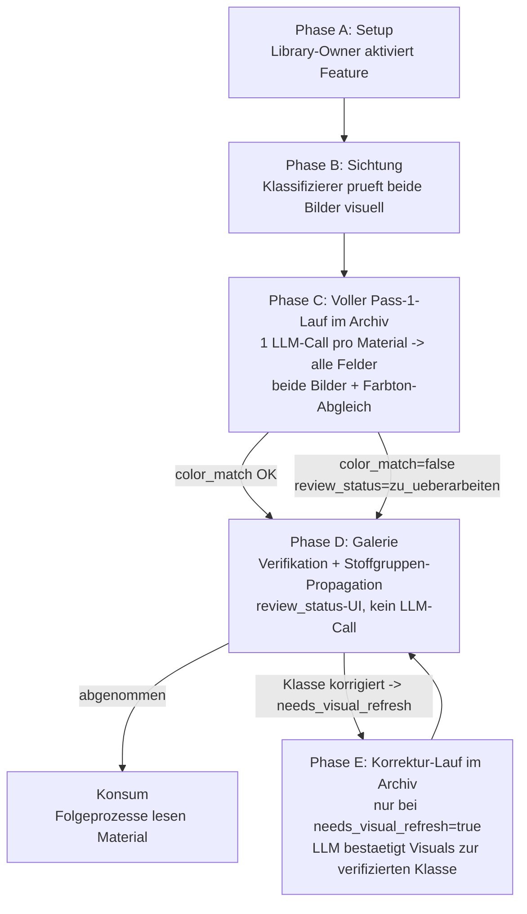

# DIVA-Texture-Liefersystem-Integration

## 1. Ausgangslage

Die DIVA-Texturanalyse-Pipeline ([template-samples/Diva-Texture-Analysis.md](../../template-samples/Diva-Texture-Analysis.md))
arbeitet aktuell ausschliesslich auf Bilddaten — typisch ein einzelnes
`_basecolor.jpg`. Das Bild allein liefert oft zu wenig Information fuer eine
qualifizierte Analyse: flache Oberflaechen, kaum sichtbare Struktur, keine
Farbtiefe. Konfidenz niedrig, Ergebnis traegt nicht.

Parallel existiert pro Lieferanten-Verzeichnis (`S:\DIVA3DARCHIV\<ILN>\textures\_tex\`)
eine Sidecar-Datei `api2_GetJsonOptionValues.json` mit den Stammdaten aus dem
Liefersystem (Materialname, Stoffgruppe, RGB, Material-Klasse) **und einer
URL zu einem hochwertigeren Preview-Bild**. Diese Datei wird heute nicht
ausgewertet.

Zusaetzlich hat Lea ein neues Datenmodell vorgestellt
([Material Digital Twin](../../docs/diva-texture-analysen/material-digital-twin.md)),
das deutlich strukturierter ist als die aktuellen Frontmatter-Felder.

## 2. Zielbild als End-to-End-User-Journey

### 2.1 Personas

- **Library-Owner** (Peter / Operator): aktiviert das Feature pro Library,
  setzt Schwellwerte, steuert grobe Konfiguration.
- **Klassifizierer** (Lea / Fachhandel-Domain-Expert): geht durch die
  Texturen, prueft LLM-Vorschlaege, korrigiert oder uebernimmt.
- **Konsument** (Endsystem / Rendering / Story-Generator): liest die
  klassifizierten Materialdaten und nutzt sie fuer Folgeprozesse.

### 2.2 End-to-End-Workflow

**Phase A — Setup (einmalig pro Library, Library-Owner)**

1. Library-Settings oeffnen → Abschnitt "Transformation"
2. Toggle `DIVA-Liefersystem-Daten auswerten` aktivieren
3. Schwellwert `Auto-Uebernahme ab Konfidenz` einstellen (default 0.9)

→ ab jetzt erscheint im Archiv-File-Preview ein zusaetzlicher Tab `DIVA-Info`,
sobald eine Sidecar-Datei im Texturverzeichnis liegt UND ein Match fuer die
Textur existiert.

**Phase B — Daten-Sichtung (pro Textur, Klassifizierer)**

> **Hinweis 2026-05-28 (Update 2):** Die fruehere Bildwahl wurde durch ein
> "immer beide Bilder ans LLM"-Modell ersetzt (Lea-Regel #11). Der DIVA-Info-
> Tab ist jetzt eine reine Sichtungs- und Vergleichs-Ansicht. Die in Stufe 1
> implementierte Persistenz `analysisSourceImage` bleibt vorerst als Anzeige-
> Praeferenz erhalten (welches Bild im Vorschau-Slot prominent angezeigt
> wird), wird aber von der Pipeline ignoriert.

1. Archiv oeffnen, Filter `_basecolor` aktiv → Galerie zeigt nur die
   relevanten Texturen.
2. Textur anklicken → File-Preview rechts oeffnet sich.
3. Tab `DIVA-Info` waehlen → zwei Bilder werden nebeneinander angezeigt:
   - Links: das `_basecolor.jpg` vom Filesystem (oft 4K, in voller
     Aufloesung).
   - Rechts: das Preview-Bild aus dem Liefersystem (URL aus
     `OptionvalueEntry.Image`).
4. Klassifizierer prueft visuell die Plausibilitaet (Schaerfe, Farbe, ob
   Liefersystem-Bild ueberhaupt zur Textur passt). Bei offensichtlicher
   Diskrepanz (z.B. komplett anderes Material) kann er das Material direkt
   in der Galerie auf `zu_ueberarbeiten` setzen — siehe Phase D.
5. Optional: Anzeige-Praeferenz toggeln (welches Bild gross dargestellt
   wird) — keine Auswirkung auf den LLM-Lauf.

→ keine Bildwahl mehr, keine Pflicht-Aktion. Pass 1 verarbeitet immer
beide Bilder.

**Phase C — Voller Pass-1-Lauf im Archiv (1 LLM-Call pro Material)**

Hinweis 2026-05-28 (User-Entscheid): Pass 1 fragt ALLE Material-Felder
in einem einzigen LLM-Call ab — Klasse, Typ, visuelle Properties, Farbe,
Hints. Begruendung: das LLM konditioniert visuelle Properties intern
ohnehin auf seine eigene Klassen-Bestimmung; ein gesplitteter Pass spart
keine Inferenz-Qualitaet, kostet aber einen Extra-Call im Happy Path.

Hinweis 2026-05-28 (Update 2): Pass 1 sendet IMMER beide Bilder ans LLM
(Basecolor-Ausschnitt + Supplier-Preview, falls vorhanden) und prueft
zusaetzlich den Farbtonabgleich (`color_match_supplier`). Der Basecolor
wird zur Laufzeit auf einen LLM-tauglichen Ausschnitt heruntergerechnet.

1. Klassifizierer oeffnet das Material im Archiv (Shadow-Twin-View).
2. Startet die Transformation mit Template `Diva-Texture-Analysis` ueber
   den ueblichen Pipeline-Trigger (`/api/external/jobs/.../start`).
3. Pipeline-Job liest:
   - Original-Basecolor (oft 4K) → `basecolor-crop.ts` rechnet ZUR LAUFZEIT
     einen Center-Crop (~360x360 px) und ermittelt die echte cm-Groesse
     ueber DPI aus dem Datei-Header (sharp / `extractImageMetadata`).
     Fallback bei fehlender DPI: 300 DPI mit Warning im FileLogger.
   - Supplier-Preview-URL aus Sidecar (Stufe 1-Matcher) → serverseitig
     herunterladen. Wenn nicht erreichbar (Edge-Case #1): Lauf laeuft mit
     nur einem Bild + `color_match_supplier=null`.
   - Sidecar-Daten als LIEFERSYSTEM-Block.
4. LLM-Call (multi-image input):
   - Bild 1: Basecolor-Crop mit Caption `basecolor_crop_cm: "3.0x3.0"`.
   - Bild 2: Supplier-Preview (falls vorhanden).
   - LIEFERSYSTEM-Block + CONTEXT-Block.
5. LLM-Antwort liefert in EINEM Lauf: `material_class`, `material_type`,
   `confidence_class`, `confidence_type`, `needs_human_review`,
   `dominant_color_hex`, `color_family`, `color_description`,
   `surface_finish`, `surface_relief`, `pattern_scale`, `directionality`,
   `perceived_softness`, `color_variation`, `confidence_visual`,
   `color_match_supplier`, `color_match_notes`,
   `ai_prompt_positive/_negative`, `ai_realism_notes`.
6. Pipeline setzt `last_pass: 1` + `pass1_status`, mergt EXIF, schreibt
   das Ergebnis ueber `ShadowTwinService.upsertMarkdown` ins Artefakt
   (MongoDB + Filesystem) und ingestet es ins vector-repo.
7. Pipeline setzt `review_status`:
   - `color_match_supplier === false` → `zu_ueberarbeiten`.
   - sonst → `ki_geprueft`.
   - Override-Schutz: manuell auf `abgenommen` oder `zu_ueberarbeiten`
     gesetzte Stati werden NICHT vom Pass-1-Lauf ueberschrieben.

→ jedes Material bekommt EINEN vollstaendigen LLM-Lauf mit beiden
Bildern. Farbabweichungen werden automatisch erkannt und als
`zu_ueberarbeiten` markiert.

**Phase D — Verifikation + Stoffgruppen-Propagation in der Galerie**

Die Galerie ist eine reine Verifikations-/Korrektur-UI. Sie macht
**KEINE LLM-Calls**. Alle Aenderungen werden als Frontmatter-Patch ins
Shadow-Twin-Artefakt zurueckgeschrieben — damit ein spaeterer
Korrektur-Lauf (Phase E) sie als Kontext sieht.

1. Galerie gruppiert Texturen nach `group_name` (aus Sidecar via
   Phase C ins Frontmatter gepatcht)
2. DivaTextureCard zeigt Badges: material_class / material_type +
   Konfidenz + locked-/rejected-Indikator + Refresh-Marker
3. Pro Stoffgruppe ein Button `Gruppe klassifizieren` → Dialog:
   - Vorschlag liest das vorhandene Pass-1-Ergebnis eines
     Repraesentativen (Praeferenz: Mitglied mit
     `analysisSourceImage='supplier-preview'`)
   - Buttons: `Korrigieren` (Klasse/Typ inline editieren, Schreibvorgang
     ans Artefakt + setzt `needs_visual_refresh=true`) /
     `Verwerfen` (`classification_rejected=true` auf die Gruppe) /
     `Uebernehmen fuer N Mitglieder` (Frontmatter-Patch der 5 Klassen-
     Felder auf alle nicht gelockten/nicht verworfenen Mitglieder)
4. Beim Bulk-Apply pro Mitglied: wenn die `material_class` sich aendert,
   wird `needs_visual_refresh=true` ins Mitglieder-Artefakt gepatcht —
   visuelle Properties der alten (falschen) Klasse koennten unstimmig
   sein, brauchen einen Korrektur-Lauf
5. **Bulk-Auto-Apply-Modus**: Library-Owner triggert "Alle Gruppen mit
   Konfidenz >= Schwellwert automatisch uebernehmen"
6. **Override-Schutz**: Mitglieder mit `classification_locked=true` oder
   `classification_rejected=true` werden NICHT ueberschrieben
   (Edge-Case #6 + #17)

→ Ergebnis: alle nicht-gelockten Mitglieder der Gruppe tragen die
verifizierte Klasse + Typ + Konfidenz. Mitglieder, deren Klasse durch
die Propagation geaendert wurde, sind als `needs_visual_refresh`
markiert.

**Phase E — Korrektur-Lauf im Archiv (optional, on demand)**

Der zweite LLM-Lauf ist KEIN Default-Schritt mehr, sondern ein gezielter
Korrektur-Mechanismus fuer Materialien, deren `material_class` oder
`material_type` nach Pass 1 vom Klassifizierer geaendert wurde
(`needs_visual_refresh=true`). Begruendung: wenn die Klasse im Pass-1-Lauf
falsch war, sind die visuellen Properties der falschen Klasse zugeordnet
und brauchen eine konsistente Neuanalyse.

1. Voraussetzung: Material hat `needs_visual_refresh=true` (manuell
   korrigiert ODER ueber Gruppen-Propagation auf andere Klasse umgesetzt)
2. Klassifizierer triggert im Archiv "Korrektur-Lauf starten"
3. Pipeline-Job laeuft IDENTISCH zu Pass 1, aber mit zusaetzlichem
   CONTEXT-Block:
   - `user_confirmed_material_class: <wert>`
   - `user_confirmed_material_type: <wert>`
4. LLM bestimmt die visuellen Properties + Hints **konsistent zur
   user-bestaetigten Klasse** neu — die Klasse selbst wird vom LLM nicht
   nochmal hinterfragt
5. Pipeline setzt `last_pass: 2` + `pass2_status`, raeumt
   `needs_visual_refresh` ab

→ Material hat jetzt eine klasseninkonsistente, vom User verifizierte
Klassifikation und dazu passende visuelle Properties.

**Phase E — Wiederverwendung (Konsument)**

Material-Markdown enthaelt jetzt:
- `lieferSystemSnapshot` (Stammdaten 1:1)
- `materialClass`, `materialType`, `visualProperties` (klassifiziert)
- `aiGenerationHints` (Prompt-Bausteine)
- `analysisRuns` (Historie: was wann mit welcher Konfidenz)
- `analysisSourceImage` (welches Bild war Quelle)
- `groupClassificationId` (welche Gruppen-Klassifikation hat Class+Type
  geliefert)

→ Galerie-Filter funktionieren auf den neuen Feldern. Folgeprozesse
(Rendering, Stories) koennen die Daten lesen.

### 2.3 Ablauf-Diagramm

## 3. Aufbau in Stufen

| Stufe | Inhalt | Branch | Abhaengig von |
|-------|--------|--------|---------------|
| 0 | Setup (Plan + Quell-Docs + AGENT-BRIEF) | `feature/diva-texture-welle-setup` | — |
| 1 | Anzeige (Setting + Sidecar-Loader + Tab mit Bildwahl) | `feature/diva-texture-info-tab` | 0 |
| 2 | Template-Refactor (flach) | `feature/diva-texture-template-digital-twin` | — |
| 2b | Template-Erweiterung: review_status + color_match | `feature/diva-texture-template-review-status` | 2 |
| 3 | Voller Pass-1-Lauf (beide Bilder + Color-Match + DPI-Crop) | `feature/diva-texture-pipeline-first-pass` | 1, 2, 2b |
| 4 | Gruppen-Klassifikation + Review-Status-UI in Galerie | `feature/diva-texture-group-classification` | 3 |
| 5 | Korrektur-Lauf (visuelle Properties) | `feature/diva-texture-pipeline-correction-run` | 4 |
| 6 | Persistenz Liefersystem-Snapshot + Lauf-Historie | `feature/diva-texture-persist-supplier-snapshot` | 3 (kann parallel zu 4/5) |
| 7 | Migration alter Analysen (optional) | `chore/diva-texture-migration` | 5 |

## 4. Lea-Regeln (verbindlich)

Aus [docs/diva-texture-analysen/besprechung-lea-materialien.md](../../docs/diva-texture-analysen/besprechung-lea-materialien.md),
angepasst durch User-Entscheid 2026-05-28:

1. **Ein Voll-Pass + optionaler Korrektur-Lauf** (frueher: Zwei Paesse).
   Das LLM bestimmt in einem Lauf Klasse, Typ UND visuelle Properties; der
   Korrektur-Lauf (Stufe 5) laeuft NUR auf Materialien, deren Klasse nach
   Pass 1 vom Klassifizierer geaendert wurde (`needs_visual_refresh=true`).
   Begruendung: das LLM konditioniert visuelle Properties intern ohnehin
   auf seine eigene Klassen-Bestimmung; ein splittender Pass spart keine
   Inferenz-Qualitaet, kostet aber im Happy Path einen Extra-Call.
2. **Liefersystem-Treffer = hohe Konfidenz fuer Class+Type** — kein LLM darf
   das ueberschreiben.
3. **"Nichts erfinden"** — wenn Information weder im Bild noch im
   Liefersystem steht, dann darf sie nicht im Output stehen.
4. **Konfidenz pro Feld + Quelle dokumentieren** — Felder die aus dem
   Liefersystem stammen, werden als solche markiert.
5. **Liefersystem-Snapshot am Material persistieren** — sonst kann der 2.
   Pass spaeter nicht mehr darauf zugreifen (Beispiel: "Eiche geoelt" steht
   nur in den Stammdaten, nicht im Bild).
6. ~~**Quellbild-Wahl ist manuell**~~ → **abgeloest 2026-05-28 (Update 2) durch
   Lea-Regel #11**: Pass 1 sendet IMMER beide Bilder. Das in Stufe 1 gebaute
   Toggle bleibt nur als Anzeige-Praeferenz erhalten.
7. **Verifikation pro Stoffgruppe statt pro Muster** — spart Klick-Aufwand
   bei groesseren Lieferungen. Hinweis 2026-05-28: spart keine LLM-Calls
   mehr (jedes Material laeuft eigenstaendig in Phase C), sondern macht
   nur die Sichtung + Klassen-Bestaetigung effizienter.
8. **Template = flaches Preprocess, NICHT das Digital-Twin-Modell** — das
   Frontmatter ist flach + Obsidian-kompatibel (snake_case, eine Ebene, keine
   Dot-Notation, keine verschachtelten Objekte). Es liefert nur die KI-Kern-
   felder + den diva-Liefer-Block. Leas verschachteltes Material-Digital-Twin
   ist ein SPAETERES MongoDB-Objekt, das downstream aus den flachen Feldern +
   Cache-/Bitmap-Daten zusammengesetzt wird. Diese Trennung darf in keiner
   Folge-Stufe wieder aufweichen (siehe AGENTS.md "Frontmatter-Format").
9. **aiGenerationHints = letzter Pass** — ai_prompt_positive/ai_prompt_negative/
   ai_realism_notes werden in jedem Lauf neu erzeugt. Auf welchen Pass sie sich
   beziehen, haelt das Pipeline-Feld `last_pass` fest. Konfidenzen werden in
   einem Voll-Pass alle gemeinsam vom LLM bestimmt (confidence_class /
   confidence_type / confidence_visual); im Korrektur-Lauf (Stufe 5) wird
   confidence_visual erneuert, confidence_class/_type bleiben durch die
   user-bestaetigten Werte fixiert. Pass-Status: pass1_status nach Phase C,
   pass2_status nach Korrektur-Lauf.

10. **Galerie macht keine LLM-Calls** (User-Entscheid 2026-05-28). Jeder
    LLM-Aufruf laeuft ueber die `/api/external/jobs`-Pipeline (Archiv-Trigger).
    Korrekturen in der Galerie schreiben Frontmatter-Patches direkt ins
    Shadow-Twin-Artefakt, damit ein spaeterer Korrektur-Lauf sie als
    CONTEXT sieht. Architektur-Regel: KEIN paralleler LLM-Pfad ausserhalb
    der Jobs-Pipeline.

11. **Pass 1 sendet beide Bilder** (User-Entscheid 2026-05-28, Update 2).
    Der Pipeline-Lauf bekommt sowohl den Basecolor-Ausschnitt (zur Laufzeit
    aus dem Original gerechnet) als auch — falls verfuegbar — das
    Liefersystem-Preview-Bild als zweiten Image-Input. Zusatzfrage ans
    LLM: passt der Farbton der beiden Bilder zusammen
    (`color_match_supplier`)? Bei `false` wird `review_status` automatisch
    auf `zu_ueberarbeiten` gesetzt, das LLM liefert eine Pflicht-Begruendung
    in `color_match_notes`. Damit erkennen wir Bugs, bei denen Preview und
    Basecolor unterschiedliche Materialien oder Farbvarianten zeigen.

12. **Review-Status-Lifecycle** (User-Entscheid 2026-05-28, Update 2).
    Jedes Material hat ein Statusfeld `review_status` mit den Werten
    `nicht_geprueft` (initial) → `ki_geprueft` (Pass 1 ohne Farb-
    Mismatch) → `zu_ueberarbeiten` (Farb-Mismatch oder Manual-Marker)
    → `abgenommen` (User-Bestaetigung). Override-Schutz: `abgenommen`
    und manuell gesetztes `zu_ueberarbeiten` werden vom Pass-1-Lauf
    NICHT ueberschrieben. Der Status ist materialweit, nicht
    gruppenweit — die Gruppen-Propagation aus Stufe 4 aendert
    `review_status` nicht.

13. **Basecolor zur Laufzeit zuschneiden** (User-Entscheid 2026-05-28,
    Update 2). Basecolor-Texturen sind oft 4K oder groesser — fuers LLM
    ist das verschwenderisch und in der Detail-Sicht zu grob. Vor jedem
    LLM-Call rechnet `basecolor-crop.ts` ZUR LAUFZEIT einen Center-Crop
    (Ziel: ~360x360 px) und berechnet die echte cm-Groesse des Ausschnitts
    ueber DPI aus dem Datei-Header (sharp). Der cm-Wert wird als
    `basecolor_crop_cm` in den CONTEXT-Block geschrieben, damit das LLM
    die physikalische Skala kennt. KEINE Persistenz des Crops — gibt es
    eh keinen Ort dafuer, und der Crop ist deterministisch reproduzierbar.

### Quellen-Map (Lea-Regel #4 maschinenlesbar)

Die Herkunft jedes Feldes ist in `src/lib/diva-texture/material-field-sources.ts`
kodiert (Leas Farb-Legende): `divadata` (Liefersystem) · `ai_pass1` (Klasse/Typ)
· `ai_pass2` (Farbe + visuelle Properties) · `ai_last_pass` (Hints) · `path`
(deterministisch aus Pfad) · `pipeline` (Status). `llmFieldsForPass(1|2)` liefert
die je Pass anzufragenden LLM-Felder; Folge-Stufen filtern darueber statt die
Feldlisten zu duplizieren. Leas gruene (umgesetzt) / rote (offen) Markierungen
sind Status, keine Quelle, und stehen daher nicht in der Map.

## 5. Mapping Sidecar → Material-Digital-Twin

Aus dem Sample [api2_GetJsonOptionValues_sample.json](../../docs/diva-texture-analysen/api2_GetJsonOptionValues_sample.json):

Ziel sind die FLACHEN Preprocess-Keys (snake_case), nicht das nested Modell.

| Sidecar-Feld | Preprocess-Feld (flach) | Bemerkung |
|--------------|-------------------------|-----------|
| `Name` | `title` | direkt |
| `GroupName` | (Slug fuer Gruppierung) | als ID-Slug normalisieren ("Feincord" → `feincord`) |
| `RGB` | `dominant_color_hex` | "#" voranstellen |
| `Material` (z.B. "STOFF") | `material_class` | Mapping-Tabelle DE→EN (material-class-mapping.ts) |
| `VCodex` / `PFTFile` / `TextureName` | `textur_code` / Matching-Key | heuristisch, mehrere Strategien |
| `Image` | UI-Vergleichsbild + 2. LLM-Image-Input | als HTTP-URL geladen + serverseitig in Pass 1 zusaetzlich heruntergeladen |
| `IsTexture` | Filter: nur "True" beruecksichtigen | sonst matcht z.B. "Stuetzfuss" |
| Pfad enthaelt `DivaStandardMaterials` | `availability_scope = "basic"` + `retailer_iln = ""` | — |
| Pfad enthaelt 13-stellige ILN | `availability_scope = "basic"` + `retailer_iln = <ILN>` | — |

### Update 2 (2026-05-28): Pass-1-LLM-Felder + Pipeline-Felder

Diese Felder kommen aus dem 2-Bild-Vergleich bzw. dem Review-Lifecycle und
sind NICHT aus dem Sidecar ableitbar:

| Frontmatter-Feld | Quelle | Bemerkung |
|------------------|--------|-----------|
| `color_match_supplier` | `ai_pass1` | `true` / `false` / `null`. `null` wenn keine Supplier-Preview verfuegbar war. |
| `color_match_notes` | `ai_pass1` | Pflicht-Begruendung wenn `color_match_supplier=false` (1 Satz). Sonst leer. |
| `review_status` | `pipeline` + `manual` | `nicht_geprueft` (initial) \| `ki_geprueft` (Pass 1 OK) \| `zu_ueberarbeiten` (Mismatch oder Manual) \| `abgenommen` (User-Bestaetigung). |

Laufzeit-Werte (NICHT persistiert, nur als CONTEXT ans LLM):

| Wert | Berechnet aus | Verwendung |
|------|---------------|------------|
| Basecolor-Crop (Pixel-Buffer) | Original-Basecolor via sharp | 1. Image-Input fuer Pass 1 |
| `basecolor_crop_cm` | `crop_px / dpi * 2.54` | CONTEXT-Caption fuer das LLM ("ungefaehre Realgroesse des Ausschnitts") |
| `dpi_used` | EXIF/sharp oder Fallback 300 | Wird im `analysisRuns`-Eintrag (Stufe 6) festgehalten |

### DE→EN-Material-Mapping (vorlaeufig, Stufe 3 finalisieren)

| Sidecar `Material` | Digital-Twin `materialClass` |
|--------------------|------------------------------|
| `STOFF` | `fabric` |
| `LEDER` | `leather` |
| `KUNSTLEDER` | `leather` (+ `materialType: faux_leather`) |
| `HOLZ` | `wood` |
| `STEIN` / `MARMOR` / `GRANIT` | `stone` |
| `METALL` | `metal` |
| `GLAS` | `glass` |
| `KUNSTSTOFF` / `LACK` | `plastic` |
| unbekannt | `null` + Warning, LLM darf bestimmen |

## 6. Edge-Cases (was schiefgehen kann)

| # | Szenario | Auswirkung | Behandlung |
|---|----------|------------|------------|
| 1 | Sidecar-Image-URL nicht erreichbar (Auth, Internet, alter Link) | Preview-Bild laedt nicht im Tab | Fallback-Icon, Hinweis "Liefersystem-Preview nicht verfuegbar", Basecolor bleibt nutzbar |
| 2 | Kein Match in Sidecar fuer eine Textur | Tab leer / nicht sichtbar | Tab erscheint nicht; im Footer-Log/Debug-Panel sichtbar warum kein Match (welche Strategien probiert wurden) |
| 3 | `IsTexture: "False"`-Eintrag matcht heuristisch eine Bilddatei | Falsche Stammdaten | Matcher filtert `IsTexture !== "True"` vor dem Match-Versuch |
| 4 | `Material`-Wert nicht im DE→EN-Mapping | `materialClass = null` | LLM darf in Pass 1 bestimmen, Confidence wird automatisch reduziert |
| 5 | Mehrere Sidecar-Eintraege matchen die gleiche Datei | Ambiguitaet | Logging aller Treffer; ersten nehmen + Warning im Tab "X Mehrfachtreffer, erster gewaehlt" + UI zum manuellen Wechseln |
| 6 | Stoffgruppe enthaelt Ausreisser (1 Lederteil in Stoff-Gruppe) | Gruppen-Klassifikation falsch fuer Ausreisser | Single-Material-Override: Klassifizierer setzt Material individuell, Gruppen-Update ueberschreibt nicht (Flag `classificationLocked: true` im Frontmatter) |
| 7 | Material gehoert (sollte) zu mehreren Gruppen | Aus Sidecar nur `GroupName` (singular) | Stufe 4 nutzt singular `GroupName`; spaeter ggf. `groupIds`-Erweiterung wenn API es liefert |
| 8 | User aendert nach Klassifikation die Bildwahl | Alte Klassifikation eventuell ueberholt | Marker im Material: `analysisSourceImageChangedAt > lastAnalysisRun.timestamp` → UI zeigt "Quellbild geaendert, Re-Analyse empfohlen" |
| 9 | Sidecar-Datei wird aktualisiert (neue Stammdaten) | Snapshot im Material veraltet | Sidecar-Hash im Snapshot mitspeichern; bei Mismatch UI-Hinweis "Stammdaten geaendert seit Klassifikation" |
| 10 | Mehrere Libraries teilen das gleiche Liefersystem | Caching-Frage | Sidecar wird pro Library-Storage-Lookup geladen, nicht global gecacht (KISS) |
| 11 | Bild im Liefersystem unterscheidet sich substanziell vom Filesystem-Bild (anderer Crop, andere Lieferung) | Klassifikation auf falschem Bild | Bildwahl ist explizit, Klassifizierer sieht beide nebeneinander; persistierter `analysisSourceImage`-Wert macht es nachvollziehbar |
| 12 | LLM liefert `needsHumanReview: true` | Material darf nicht ohne Review uebernommen werden | UI markiert mit roter Badge, Auto-Apply uebergeht das Material |
| 13 | Gruppen-Klassifikation laeuft auf einem Material, das selbst noch keine Quellbild-Wahl hat | Default `basecolor` verwendet | OK, Verhalten dokumentiert; UI zeigt im Gruppen-Dialog welches Bild fuer welches Mitglied benutzt wurde |
| 14 | Sidecar-Datei selbst fehlt im Verzeichnis | Tab erscheint nicht, kein Lookup | Status quo bleibt, keine Pipeline-Aenderung; UI-Hinweis im Library-Settings "Keine Sidecar-Datei im Library-Root gefunden" |
| 15 | API-Antwort gross (mehrere MB JSON) | Performance / Bandwidth | API-Route gibt nur den gematchten Eintrag zurueck, nicht das ganze JSON; Sidecar wird serverseitig geparst |
| 16 | User loescht ein Material nach Gruppen-Klassifikation | Stale `groupClassificationId`-Referenz | Klassifikations-Eintrag bleibt eigenstaendig, kein Cascading-Delete; Statistik kann zeigen "N Mitglieder verwaisen" |
| 17 | Klassifizierer setzt explizit "verwerfen" auf einen Vorschlag | Material soll NICHT klassifiziert sein | Flag `classificationRejected: true` im Frontmatter; Gruppen-Klassifikation faellt zurueck auf das naechste Mitglied als Repraesentanten |
| 18 | Renaming der Textur-Datei | Bestehende Klassifikation verloren (basiert auf filePath) | Klassifikation muss an stabiler ID haengen, nicht am Pfad — vermutlich Material-Slug |
| 19 | Basecolor-Bitmap ohne DPI (sharp.metadata().density = null) | cm-Berechnung unmoeglich | Fallback-Annahme 300 DPI, Warning im FileLogger + Eintrag `dpi_used: 300` mit Flag `dpi_fallback: true` im analysisRuns-Eintrag. cm-Wert wird mit Hinweis "geschaetzt" in der CONTEXT-Caption uebergeben. |
| 20 | Basecolor-Bitmap kleiner als Crop-Ziel (z.B. nur 256x256 px) | Crop unmoeglich oder unnoetig | basecolor-crop.ts gibt das Voll-Bild zurueck + setzt `basecolor_crop_cm` aus den vollen Pixel-Massen. |
| 21 | Supplier-Preview-URL nicht erreichbar beim Pass-1-Lauf | Pass 1 hat nur 1 Bild | Lauf laeuft mit nur dem Basecolor-Crop, `color_match_supplier` wird deterministisch auf `null` gesetzt (LLM-Antwort wird ignoriert), `review_status` -> `ki_geprueft` (kein Mismatch erkennbar). Warning im FileLogger. |
| 22 | LLM antwortet mit `color_match_supplier=true`, aber color_match_notes ist gefuellt | Inkonsistente Antwort | Pipeline ignoriert notes wenn supplier=true (keine Begruendung noetig). |
| 23 | Manuell auf `abgenommen` gesetztes Material laeuft erneut durch Pass 1 | Status wuerde ueberschrieben | Override-Schutz: Pass-1-Postprocessor liest `review_status` vor dem Setzen — `abgenommen` und manuell gesetztes `zu_ueberarbeiten` bleiben. |
| 24 | Sehr grosser Basecolor (z.B. 8K, >100 MB) | sharp-Roundtrip langsam, Speicher-Spitze | sharp arbeitet streaming auf Header + Region; Crop ist O(crop_size) nicht O(source_size). Logging der Laufzeit pro Bild. |

## 7. Stolperfallen (Architektur + Implementierungs-Fallstricke)

| # | Stolperfalle | Gegenmassnahme |
|---|--------------|----------------|
| 1 | **LLM "korrigiert" die Liefersystem-Klassifikation eigenmaechtig** | System-Prompt expliziter: "Wenn LIEFERSYSTEM.materialClass gesetzt ist, MUSST du diese uebernehmen. Du darfst nur den materialType verfeinern." + Code-side-Validation, dass das LLM-Ergebnis kompatibel zur Sidecar ist |
| 2 | **Konfidenz wird inflationaer hoch ausgegeben** (LLMs neigen dazu) | Confidence-Kalibrierung: Sidecar-Treffer = automatisch 0.95 (deterministisch gesetzt, nicht vom LLM), LLM-only-Klassifikation = LLM-Wert kappen bei 0.8 max |
| 3 | **Race-Condition bei Bulk-Auto-Apply**: User triggert Apply, parallel laeuft Re-Analyse | Optimistic Locking via `version`-Feld im Frontmatter; UI zeigt "X Materialien wurden waehrend Apply geaendert, neu laden" |
| 4 | **`groupClassificationId` wird vergessen zu aktualisieren** bei Group-Re-Classification | Group-Classification ist eigenstaendiges Dokument (z.B. in MongoDB-Collection oder eigenes Markdown), Material referenziert nur die ID — Re-Classification erzeugt neue ID, Material-Update triggert sich daraus |
| 5 | **Storage-Abstraktion-Verletzung**: UI laedt das Liefersystem-Preview-Bild direkt vom Liefersystem-URL (umgeht den StorageProvider) | OK fuer Preview-Anzeige, weil Liefersystem ein eigenes System ist; aber: NICHT als Quellbild fuer LLM-Call ohne explizite Speicherung im Library-Storage. Pipeline laedt das Preview-Bild ggf. serverseitig herunter, bevor es ans LLM geht. |
| 6 | **Sidecar-Parsing ist sprachabhaengig** (`Material: "STOFF"` ist deutsch) | DE→EN-Mapping als reine Code-Tabelle (siehe Section 5); Tests fuer alle bekannten Werte |
| 7 | **Setting analyzeDivaTextureInfo gilt fuer ganze Library**, aber nicht jede Datei darin ist eine DIVA-Textur | OK: Tab erscheint nur bei Sidecar-Hit. Andere Dateien sehen den Tab nicht — kein Schaden. |
| 8 | **Frontmatter-Bloat**: 10+ neue Felder pro Material | Akzeptiert; Materialien sind kleine Markdown-Dateien, nicht performance-kritisch |
| 9 | **Pipeline-Job vs. UI-On-Demand**: Wo laeuft der Klassifikations-Call? | UI-On-Demand via API-Route mit Anthropic-SDK, kein Hintergrund-Job — der Klassifizierer wartet aktiv vor dem Dialog. Bei Bulk-Apply: Pipeline-Job, parallelisiert |
| 10 | **Schema-Evolution**: Material-Digital-Twin aendert sich noch | Schema-Version im Frontmatter (`schemaVersion: "1"`); Migration in Stufe 7 |
| 11 | ~~`docs/DIVA Textur Analysen/`-Pfad enthaelt Leerzeichen + Sonderzeichen~~ | **Geloest 2026-05-26**: umbenannt zu `docs/diva-texture-analysen/`, Dateien zu kebab-case |
| 12 | **CONTEXT-Block + LIEFERSYSTEM-Block widersprechen sich** (z.B. Dateiname-Hinweis vs. Sidecar-Name) | LIEFERSYSTEM hat Vorrang; System-Prompt explizit machen |
| 13 | **LLM kennt die Realgroesse des Crops nicht** | Pattern-Scale-Schaetzung "fine/small/medium/large" wird ohne cm-Referenz Murks | Crop-cm-Groesse als Pflicht-Caption ans LLM ("Der Ausschnitt zeigt ca. 3.0 x 3.0 cm Realgroesse."). System-Prompt referenziert das explizit. |
| 14 | **2 Bilder = 2x Kosten?** | Anthropic-Image-Tokens fuer beide Bilder | OK akzeptiert (User-Entscheid Update 2). Basecolor-Crop ist kleiner als Voll-4K, was Kosten EHER spart. Supplier-Preview ist typisch < 1 MB. Bei messbarer Eskalation: Crop-Groesse senken (z.B. 240x240). |
| 15 | **review_status-Lifecycle verwirrt User** | User unklar wann manuelles Eingreifen noetig | UI in Stufe 4 zeigt: graues Badge = nicht_geprueft (vor Pass 1), blaues Badge = ki_geprueft, oranges Badge mit Hover-Tooltip + color_match_notes = zu_ueberarbeiten, gruenes Badge = abgenommen. Klar getrennte Aktionen pro Status. |
| 16 | **Pipeline-Postprocessor ueberschreibt manuell gesetzten review_status** | User-Korrekturen gehen verloren | Override-Schutz im first-pass.ts: nur `nicht_geprueft` und `ki_geprueft` werden vom Lauf ueberschrieben; `abgenommen` und `zu_ueberarbeiten` bleiben. Unit-Test fuer alle 4 Eingangs-Stati. |

## 8. Branch-Naming

Konvention: `feature/diva-texture-*` fuer Code-Features dieser Welle,
`chore/diva-texture-*` fuer Migrationen / Aufraeumarbeiten. Abweichung von
`cursor/refactor-welle-*` ist bewusst, weil dies kein Refactor ist sondern
ein Feature-Build.

| Stufe | Branch |
|-------|--------|
| 0 (Setup) | `feature/diva-texture-welle-setup` |
| 1 | `feature/diva-texture-info-tab` |
| 2 | `feature/diva-texture-template-digital-twin` |
| 2b | `feature/diva-texture-template-review-status` |
| 3 | `feature/diva-texture-pipeline-first-pass` |
| 4 | `feature/diva-texture-group-classification` |
| 5 | `feature/diva-texture-pipeline-correction-run` (frueher `-second-pass`) |
| 6 | `feature/diva-texture-persist-supplier-snapshot` |
| 7 | `chore/diva-texture-migration` (optional) |

## 9. Akzeptanzkriterien fuer die ganze Welle

- Vollstaendiges Material nach Digital-Twin-Modell wird fuer 5 manuell
  ausgewaehlte Test-Texturen (Candy Classics + weitere) erzeugt
- Liefersystem-Snapshot ist am Material persistiert und im UI einsehbar
- Bildwahl (Basecolor vs. Preview) ist persistiert und nachvollziehbar
- Gruppen-Klassifikation: ein Lauf pro Gruppe genuegt, Mitglieder uebernehmen
- Lauf-Historie zeigt was wann mit welcher Konfidenz erzeugt wurde
- Override-Mechanismus funktioniert (Einzel-Material schlaegt Gruppe)
- Pipeline laeuft idempotent (Re-Analyse aendert nichts wenn Inputs gleich)
- `pnpm lint` + `pnpm test` + `bash scripts/welle-pre-merge-check.sh` gruen

## 10. Aenderungs-Log

- 2026-05-26 — Plan angelegt
- 2026-05-26 — Plan grundlegend ueberarbeitet nach User-Feedback:
  - Stufe 4 von "LLM-Quality-Assessment" auf "Stoffgruppen-Klassifikation"
    umgestellt
  - Stufe 1 um manuelle Bildwahl + Preview-Bild-Anzeige erweitert
  - Stufe 3 enger gefasst (nur Class+Type+Confidence)
  - Zielbild als 5-Phasen-User-Journey ausgearbeitet
  - Edge-Cases-Tabelle (18 Eintraege) + Stolperfallen-Tabelle (12 Eintraege)
    hinzugefuegt
  - DE→EN-Material-Mapping als Tabelle in Section 5
- 2026-05-26 — Setup-PR-Vorbereitung:
  - Aktueller Branch `feature/library-diva-supplier-tab` umbenannt zu
    `feature/diva-texture-welle-setup` (= Stufe 0)
  - Stufe 1 erhaelt eigenen Branch `feature/diva-texture-info-tab`
  - Quell-Docs eingecheckt unter `docs/diva-texture-analysen/` (kebab-case)
  - Cloud-Workflow: pro Stufe ein Cloud-Agent, beginnend mit Stufe 1 nach
    Setup-Merge
  - AGENT-BRIEF unter `docs/refactor/diva-texture-liefersystem/AGENT-BRIEF.md`
- 2026-05-28 — Pass-Modell neu ausgerichtet (User-Entscheid):
  - **Stufe 3** fragt jetzt ALLE Material-Felder in EINEM LLM-Call ab
    (Klasse, Typ, Konfidenzen, visuelle Properties, Farbe, Hints) — kein
    Split auf Class-only-Pass mehr. Begruendung: das LLM konditioniert
    Visuals intern ohnehin auf seine Klassen-Bestimmung; ein gesplitteter
    Pass spart keine Qualitaet, kostet aber einen Extra-Call.
  - **Stufe 4** macht KEINE LLM-Calls mehr aus der Galerie. Sie liest die
    bereits vorhandene Pass-1-Klassifikation eines Repraesentativen aus
    MongoDB und propagiert nur die 5 Klassen-Felder (material_class,
    material_type, confidence_class, confidence_type, needs_human_review)
    als Frontmatter-Patch ans Mitglieder-Artefakt. Wenn die Klasse eines
    Mitglieds dabei geaendert wird, setzt der Apply `needs_visual_refresh=true`.
  - **Stufe 5** wird vom Default-zweiten-Pass zum **Korrektur-Lauf** — nur
    aufrufbar fuer Materialien mit `needs_visual_refresh=true`. Laeuft
    identisch zu Pass 1, aber mit `user_confirmed_material_class/_type`
    im CONTEXT, damit das LLM die visuellen Properties konsistent zur
    verifizierten Klasse neu bestimmt. Branch `feature/diva-texture-pipeline-correction-run`.
  - Neue Lea-Regel #10: Galerie macht keine LLM-Calls; jeder LLM-Aufruf
    laeuft ueber die Jobs-Pipeline. Korrekturen werden ins Artefakt
    zurueckgeschrieben, damit Folgelaeufe sie sehen.
  - Lea-Regel #1 + #7 sind entsprechend aktualisiert.
- 2026-05-27 — Stufe 2 neu ausgerichtet (User-Entscheid):
  - Template ist FLACHES Preprocess-Frontmatter (snake_case, Obsidian-kompatibel),
    NICHT das verschachtelte Digital-Twin-Modell — Trennung als Lea-Regel #8
    festgehalten + projektweite Regel in AGENTS.md "Frontmatter-Format"
  - Nested-Schema-/Dot-Notation-Aenderungen am template-parser /
    template-service-mongodb zurueckgenommen (flacher Schema-Generator bleibt)
  - aiGenerationHints = letzter Pass (Pipeline-Feld `last_pass`), Konfidenz +
    Status pro Pass (Lea-Regel #9)
  - ceramic/glass/plastic ohne material_type; color.rgb + materialSpecific-
    Properties NICHT im Template (downstream MongoDB-Objekt)
  - Quellen-Map `material-field-sources.ts` als maschinenlesbare Fassung von
    Leas Farb-Legende (Lea-Regel #4) + `llmFieldsForPass()`
- 2026-05-28 — Update 2: Beide Bilder + Color-Match + Review-Status
  (User-Entscheid). Beobachtung: in der Realitaet weichen Basecolor und
  Supplier-Preview manchmal stark im Farbton ab (= Bug im Liefersystem
  oder bei der Texturierung). Daraus folgen drei zusammenhaengende
  Aenderungen:
  - **Neue Lea-Regel #11 — "Pass 1 sendet beide Bilder"**: Der Pipeline-
    Lauf bekommt Basecolor-Ausschnitt UND Supplier-Preview als 2 Image-
    Inputs. Bildwahl entfaellt (Lea-Regel #6 wird abgeloest). Pass 1
    liefert zusaetzlich `color_match_supplier` (boolean) + `color_match_notes`
    (Pflicht-Begruendung wenn Mismatch).
  - **Neue Lea-Regel #12 — "Review-Status-Lifecycle"**: Materialien
    haben ein Statusfeld `review_status` mit `nicht_geprueft | ki_geprueft
    | zu_ueberarbeiten | abgenommen`. Pass-1-Postprocessor setzt
    `zu_ueberarbeiten` bei Farb-Mismatch, sonst `ki_geprueft`. Override-
    Schutz: manuelle Stati werden nicht ueberschrieben.
  - **Neue Lea-Regel #13 — "Basecolor zur Laufzeit zuschneiden"**: Neuer
    Helper `src/lib/diva-texture/basecolor-crop.ts` rechnet vor jedem
    LLM-Call aus dem Original-Basecolor einen LLM-tauglichen Center-Crop
    (~360x360 px). cm-Groesse des Ausschnitts wird ueber DPI aus dem
    Datei-Header (sharp / `extractImageMetadata`) berechnet und als
    CONTEXT-Caption ans LLM gegeben. KEINE Persistenz des Crops —
    deterministisch reproduzierbar.
  - **Neue Stufe 2b** `feature/diva-texture-template-review-status`:
    erweitert das in Stufe 2 umgesetzte flache Template um die 3 neuen
    Felder (`review_status`, `color_match_supplier`, `color_match_notes`)
    + Quellen-Map. Kleine PR, kein Pipeline-Code.
  - **Stufe 3 erweitert**: zweites Image-Input, basecolor-crop-Helper,
    LLM-Schema-Erweiterung, Postprocessor-Override-Schutz, neue Lauf-
    Metadaten (basecolor_crop_cm, dpi_used).
  - **Stufe 4 erweitert**: Status-Badges in Galerie-Card, Status-Filter
    in Toolbar, Manual-Aktionen "Abnehmen" / "Zu ueberarbeiten markieren"
    / "Status zuruecksetzen".
  - Edge-Cases #19–24 + Stolperfallen #13–16 ergaenzt.
