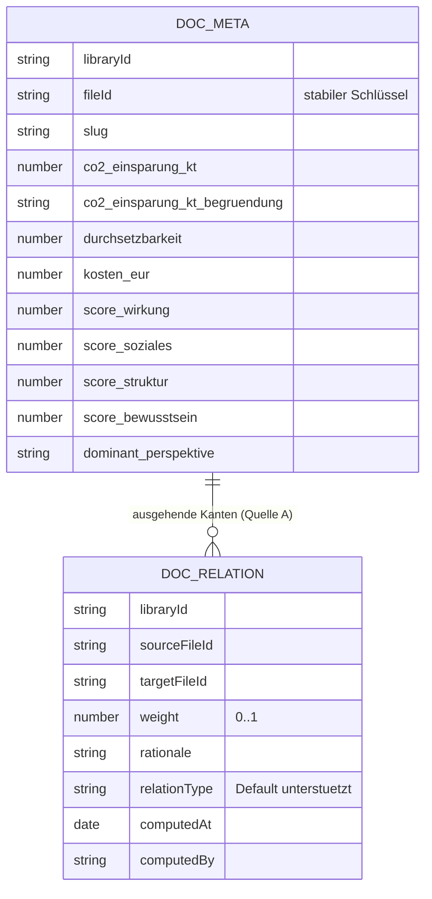
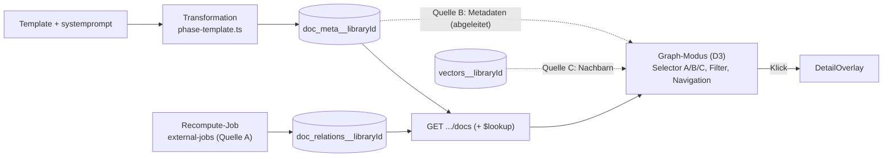

# Plan: Maßnahmen-Bewertung und Beziehungs-Graph

Zielbild (verbindlich, vor jeder Welle lesen):
[`docs/architecture/massnahmen-bewertung-und-graph-zielbild.md`](docs/architecture/massnahmen-bewertung-und-graph-zielbild.md).
Vorbild-Komponenten im Schwester-Repo `bcoop-notion2wiki`:
`src/components/ProjectVisualizer.tsx` (Kraftgraph) + `src/components/CirclePackingVisualizer.tsx` (Bubble).

## Designentscheidungen (mit User geklärt)

- **Generisch, nicht klima-spezifisch**: Klima-Felder sind nur die Konfiguration
  dieser einen Library; alles läuft über `config.chat.gallery.graph`.
- **Bewertung über das Template**, jede Zahl **mit Südtirol-Begründung**.
- **KI-first**; menschliches Übersteuern erst später (nicht in diesem Plan).
- **Mehrere Kantenquellen** (umschaltbar): A berechnete Beziehungen, B gemeinsame
  Metadaten (Obsidian), C Embedding-Ähnlichkeit. „Supports" ist nur eine Ansicht.
- **Graph = dritter ViewMode** (`grid | table | graph`) neben Inhalt + Story-Mode,
  **öffentlich** sichtbar, dient der **Navigation** (Klick → Detailansicht über
  dem Graphen), **Filter wirken** auf den Graphen.
- **Speicher nur für berechnete Kanten**: `doc_relations__<libraryId>`,
  Schlüssel `fileId`; B/C abgeleitet (kein Speicher, kein LLM).
- **Neuberechnung** aus der Galerie als eigener `external-jobs`-Task; pro Maßnahme
  oder ganze Library; nur Owner/Co-Creator.

## Wellen-Überblick

| Welle | Ziel | Kantenquelle | hängt ab von | Modell | Brutto-Diff (Schätzung) |
|---|---|---|---|---|---|
| **1** | Bewertungsfelder + Begründungen + Facetten/Sort + Anzeige | — | — | sonnet/medium | ~1.500–2.500z |
| **2** | Graph-Config + Graph-Modus-Gerüst + Quelle B (Metadaten) | B | 1 | opus/medium | ~4.000–5.000z |
| **3** | Quelle C (Embedding-Ähnlichkeit) | C | 2 | sonnet/medium | ~1.500–2.500z |
| **4** | Quelle A (berechnete Beziehungen) + Recompute-Job | A | 2 | opus/medium | ~4.000–5.500z |
| **5** | Zusatzsichten (Bubble, Quadrant) + Politur *(optional)* | — | 4 | sonnet/medium | ~2.000–3.000z |

Welle 3 und 4 hängen beide nur an Welle 2 und sind in der Reihenfolge tauschbar.
Wird Welle 2 oder 4 > 5.000z, in eine kleine Vorbereitungs-PR (Config-Feld bzw.
Backend) und eine Render-PR splitten (siehe `refactor-batch-strategy.mdc`).

## Welle 1 — Bewertungsmodell (Baustein A)

**Ziel:** Jede Maßnahme bekommt über das Template Zahlen **+ Begründung**;
Galerie kann nach Rating sortieren und filtern; Detail/Karte zeigen die Werte.

- **Neue Felder** (flach, snake_case) im Template
  [`template-samples/klimamassnahme-detail1-de.md`](template-samples/klimamassnahme-detail1-de.md):
  siehe Zielbild §4.1. Generative Felder im `systemprompt`/`Antwortschema`;
  Begründungen verlangen explizit Südtirol-Bezug.
- **Geändert:** [`src/lib/repositories/vector-repo.ts`](src/lib/repositories/vector-repo.ts)
  (`findDocs`: `$addFields rating` + Sort-Key + Index), ggf.
  [`src/lib/chat/dynamic-facets.ts`](src/lib/chat/dynamic-facets.ts) (number/integer-range),
  [`src/components/library/climate-action-detail.tsx`](src/components/library/climate-action-detail.tsx),
  [`src/components/library/gallery/document-card/climate-action-card.tsx`](src/components/library/gallery/document-card/climate-action-card.tsx).
- **Neu:** Rating-Util (`src/lib/gallery/rating.ts`) + Test.
- **Verifikation/Smoke:** 1 Maßnahme neu transformieren → Felder + Begründungen
  im Detail sichtbar; Galerie „nach Rating sortieren"; „Kosten unbekannt" sauber.
- **Diff:** ~1.500–2.500z. **Modell:** sonnet/medium (klares Muster; nur das
  Rating-in-Aggregation braucht Sorgfalt → bei Stolpern eskalieren).

## Welle 2 — Graph-Modus-Gerüst + Quelle B (Metadaten/Obsidian)

**Ziel:** Spielbarer Graph **ohne** LLM/Speicher: Knoten = gefilterte Dokumente,
Kanten aus gemeinsamen Metadaten; Navigation per Klick.

- **Config-Feld** `config.chat.gallery.graph` (Zielbild §8) nach der Checkliste
  [`.cursor/rules/library-config-field.mdc`](.cursor/rules/library-config-field.mdc):
  [`src/types/library.ts`](src/types/library.ts),
  [`src/lib/services/library-service.ts`](src/lib/services/library-service.ts) (toClientLibraries),
  [`src/components/settings/library/hooks/use-library-form.ts`](src/components/settings/library/hooks/use-library-form.ts) (Schema + Defaults + **alle** Reset-Stellen),
  [`src/components/settings/library/library-form.tsx`](src/components/settings/library/library-form.tsx) (minimale Sektion).
- **Viz:** `d3@7` in `package.json`; bcoop `ProjectVisualizer` → generische
  `src/components/library/gallery/graph/doc-graph.tsx` + Subkomponenten (jede <200z):
  `doc-graph-legend.tsx`, `doc-graph-tooltip.tsx`, `use-graph-simulation.ts`.
- **ViewMode:** `'graph'` in
  [`src/components/library/gallery/gallery-sticky-header.tsx`](src/components/library/gallery/gallery-sticky-header.tsx)
  + Mount in [`src/components/library/gallery/gallery-root.tsx`](src/components/library/gallery/gallery-root.tsx).
- **Quelle B:** `src/hooks/gallery/use-shared-meta-edges.ts` (Tag-Hub + Projektion)
  + `edge-source-selector.tsx`. Knoten-Encodings aus Config.
- **Navigation:** Klick → bestehende
  [`detail-overlay.tsx`](src/components/library/gallery/detail-overlay.tsx) über dem Graphen.
- **Diff:** ~4.000–5.000z (nah am Limit; ggf. Config-Feld als Vorbereitungs-PR).
  **Modell:** opus/medium (Cross-File, neue Komponenten-Architektur, D3-Port).

## Welle 3 — Quelle C (Embedding-Ähnlichkeit)

**Ziel:** „Semantische Nachbarn"-Graph aus den vorhandenen Vektoren.

- **Neu:** `src/app/api/chat/[libraryId]/doc-neighbors/route.ts` — Top-K Nachbarn
  via [`vector-repo.ts`](src/lib/repositories/vector-repo.ts), scoped `libraryId`
  + aktive Filter, Self-Exclusion. `src/hooks/gallery/use-similarity-edges.ts`.
- **Geändert:** Edge-Source-Selector → Option `'similarity'`.
- **Diff:** ~1.500–2.500z. **Modell:** sonnet/medium (klarer Contract; Scoping +
  Self-Exclusion sauber halten).

## Welle 4 — Quelle A (berechnete Beziehungen) + Recompute-Job

**Ziel:** Kuratierte, gewichtete „Supports"-Kanten, aus der Galerie neu berechenbar.

- **Repo:** `src/lib/repositories/doc-relations-repo.ts` (Per-Library
  `doc_relations__<libraryId>`, Schema/Indizes/Replace-Semantik aus Zielbild §5.4),
  Pattern wie [`archive-item-properties-repo.ts`](src/lib/repositories/archive-item-properties-repo.ts).
- **Job:** Phase `src/lib/external-jobs/phase-doc-relations.ts` (katalogweiter
  LLM-Pass, slug→fileId-Validierung) + Typ-Erweiterung
  [`src/types/external-job.ts`](src/types/external-job.ts) /
  [`src/lib/external-jobs-repository.ts`](src/lib/external-jobs-repository.ts). ADR 0001.
- **API:** `POST /api/library/[libraryId]/doc-relations/recompute` (Owner/Co-Creator)
  + `GET /api/library/[libraryId]/doc-relations`; Staleness-Hash.
- **Render:** `'relations'`-Quelle (gerichtet, Pfeilspitzen, Gewicht=Liniendicke,
  Top-N), Trigger-Button + [`job-monitor-panel.tsx`](src/components/shared/job-monitor-panel.tsx).
- **Diff:** ~4.000–5.500z (ggf. Backend-PR + Render-PR splitten).
  **Modell:** opus/medium (LLM-Pipeline + Validierung; Job-/Prompt-Design-Commit
  ggf. high).

## Welle 5 — Zusatzsichten + Politur (optional)

- Bubble/Circle-Packing (bcoop `CirclePackingVisualizer` portieren) +
  Quadranten-Streudiagramm (2×2 aus der Präsentation).
- Performance (Canvas-Fallback), Settings-UI-Feinschliff, a11y, Legende/Tooltip.
- **Diff:** ~2.000–3.000z. **Modell:** sonnet/medium (Pattern-Replikation).

## Datenmodell



- Quelle B/C erzeugen **keine** persistierten Kanten — sie werden zur Laufzeit
  aus `DocCardMeta`-Facetten (B) bzw. Vektoren (C) abgeleitet.

## Architektur-Map



## Konformität zu Workspace-Rules

- **Flaches Frontmatter** ([AGENTS.md](AGENTS.md)): nur Skalare; das verschachtelte
  Graph-Modell lebt in `doc_relations__<libraryId>` (downstream).
- **Domänen-Trennung** ([ADR 0001](docs/adr/0001-event-job-vs-external-jobs.md)):
  Recompute = `external-jobs`, keine Vermischung mit `event-job`.
- **Keine Silent Fallbacks** ([no-silent-fallbacks.mdc](.cursor/rules/no-silent-fallbacks.mdc)):
  fehlende Zahlen, `kosten=0`, unbekannte Kanten-Referenzen → explizit.
- **Storage-Abstraktion** ([storage-abstraction.mdc](.cursor/rules/storage-abstraction.mdc)):
  Viz liest aus `GET .../docs` + Relations-Collection, nie aus dem Storage.
- **Dateien < 200 Zeilen**; D3-Komponenten entsprechend splitten.
- **1 PR pro Welle** ([refactor-batch-strategy.mdc](.cursor/rules/refactor-batch-strategy.mdc));
  Diff-Limits 1.000z/Commit (hart), 5.000z/PR (weich), 15 Commits/PR (weich).

## Test-/Lint-Strategie

- **Im Agent:** `pnpm test --run <pfade>` + `pnpm lint` vor Push. Bei
  Pipeline-/Job-Änderungen (Welle 4) zusätzlich `pnpm test:integration:api`.
- **Kein `pnpm build` im Agent** — User lokal vor Merge:
  `bash scripts/welle-pre-merge-check.sh`.
- Neue Repos/Utils mit Vitest decken (Rating-Util, doc-relations-repo,
  shared-meta-edges, Validierung im Job).

## Hand-off für Welle 1 (Start in neuer Cloud-Session)

### Lokale Verifikation (DURCH USER, vor Merge)

```bash
bash scripts/welle-pre-merge-check.sh
```

### Nächste Welle: 1 — Bewertungsmodell

- **Branch (geplant):** `feature/massnahmen-graph-welle-1-bewertung`
- **Empfohlenes Modell:** claude-sonnet, thinking-medium (klares Muster;
  Template-Felder + Facetten/Sort + Anzeige; einziger Sorgfaltspunkt: Rating in
  der `findDocs`-Aggregation).
- **Empfohlener Agent-Typ:** NEUER Agent (kein Resume).
- **Brief:** Zielbild + dieser Plan, Sektion „Welle 1".
- **Erwarteter Brutto-Diff:** ~1.500–2.500z.

### Konkreter Start-Prompt für den nächsten Agent

```
Lies VOR dem Start (in dieser Reihenfolge):
1. AGENTS.md
2. .cursor/rules/cloud-agent-cost-strategy.mdc
3. .cursor/rules/refactor-batch-strategy.mdc
4. .cursor/rules/no-silent-fallbacks.mdc
5. .cursor/rules/contracts-story-pipeline.mdc (Template/Transformation)
6. .cursor/rules/welle-3-iii-galerie-chat-contracts.mdc (Facetten/Docs)
7. docs/architecture/massnahmen-bewertung-und-graph-zielbild.md (Zielbild §4)
8. .cursor/plans/massnahmen-bewertung-und-graph_b4e9f1a7.plan.md (Sektion "Welle 1")

Aufgabe (Welle 1): Klimamaßnahmen-Template um LLM-Bewertungsfelder MIT
Begründung erweitern (co2_einsparung_kt, durchsetzbarkeit, kosten_eur, vier
score_* (0..1), dominant_perspektive, je *_begruendung mit Südtirol-Bezug,
bewertung_modell/-stand) und Rating (= co2*durchsetzbarkeit/max(kosten,eps),
Perzentil 0..100, "Kosten unbekannt" explizit). Numerische Facetten + Rating-
Sortierung in der Galerie; Werte + Begründungen in climate-action-detail.tsx
und -card.tsx read-only anzeigen.

Branch: feature/massnahmen-graph-welle-1-bewertung
Strategie: 1 PR, kohärente Commits, max 1.000z/Commit.
Vor Push: pnpm test + pnpm lint. pnpm build NICHT im Agent — User macht
`bash scripts/welle-pre-merge-check.sh` lokal vor Merge.
PR als Draft mit Smoke-Test-Plan (max 10 Klicks). Antworte auf Deutsch.
Am Ende: Hand-off-Block für Welle 2 liefern.
```

### Geschätzte Kosten Welle 1

- Mit Empfehlungen (Sonnet + neuer Agent + lokal bauen): **ca. 5–8 USD**.
- Status quo (Opus + Cloud-Build + Resume): ca. 20–35 USD. Spar-Faktor ~4x.
