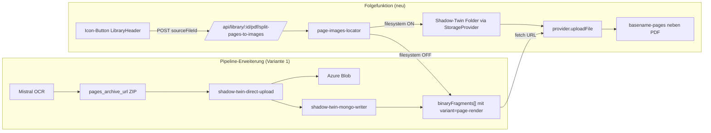

# PDF-Seiten als Bilder im Arbeitsverzeichnis ablegen (Variante 1)

## Ziel
PDF-Seiten-Renderings (`page_001.png`, ...) sind **dauerhaft** im Shadow-Twin abrufbar - sowohl im Filesystem-Modus als auch im Mongo-only-Modus. Auf dieser Basis kopiert eine schlanke Folgefunktion die Page-Bilder in ein Geschwister-Arbeitsverzeichnis neben dem PDF.

## Warum Variante 1
- Aktueller Stand (verifiziert anhand `template-samples/diva sample content/artefacte.json`):
  - Mongo-only-Library: **260 binaryFragments**, alle `img-N.jpeg` (= OCR-erkannte eingebettete Grafiken). **Null** Page-Renderings persistiert.
  - Filesystem-Library: Page-Renderings liegen als `page_NNN.png` im Shadow-Twin-Ordner (siehe `ImageExtractionService.saveZipArchive`).
- Aktuelle Pipeline laedt Page-Renderings aus dem `pages_archive`-ZIP zwar nach Azure hoch, persistiert sie aber **nur dann in `binaryFragments`, wenn sie im Markdown referenziert sind** ([shadow-twin-mongo-writer.ts:272-305](src/lib/shadow-twin/shadow-twin-mongo-writer.ts)). Mistral schreibt im Markdown nur `img-N.jpeg`, also gehen die Page-Renderings im Mongo-only-Modus verloren.
- Variante 1 schliesst diese Luecke pipeline-seitig: ab jetzt werden Page-Renderings IMMER als Shadow-Twin-Artefakte gefuehrt. Damit funktioniert die Folgefunktion sauber unabhaengig vom Storage-Modus.

## Designentscheidungen
- Trigger: Icon-Button in [src/components/library/library-header.tsx](src/components/library/library-header.tsx), aktiv nur wenn die selektierte Datei ein PDF ist.
- Naming-Convention fuer Page-Renderings im Shadow-Twin: `page_001.png`, `page_002.png`, ... (wie bisher in `ImageExtractionService.saveZipArchive`). Das ist ein einheitlicher Lookup-Key fuer Filesystem und Mongo. Hier wird **bewusst nichts angereichert**, damit das Naming deterministisch bleibt.
- Mongo-Markierung der Fragmente: `kind: 'image'`, neuer `variant: 'page-render'`. Optional `pageNumber: number` als zusaetzliches Feld.
- Working-Verzeichnis-Name: `{toSafeFolderName(baseName)}-pages` (Helper aus [src/lib/markdown/markdown-page-splitter.ts](src/lib/markdown/markdown-page-splitter.ts)). Wenn Ordner schon existiert: wiederverwenden, gleichnamige Dateien werden uebersprungen.
- **Naming-Convention fuer Page-Renderings im Working-Folder**: `page_NNN__<sprechender-suffix>.png` (Doppel-Underscore als Trenner). Suffix kommt aus der Heuristik (siehe Abschnitt "Filename-Heuristik"). Wenn kein Suffix ableitbar: nur `page_NNN.png`.
- Fehlende Page-Bilder (z.B. PDF wurde mit alter Pipeline transkribiert) -> 422-Antwort `code: 'no_page_images'` mit klarer Fehlermeldung "Bitte zuerst Phase 1 Extraktion erneut laufen lassen".

## Datenfluss



## Schema-Aenderung

[src/lib/shadow-twin/store/shadow-twin-store.ts](src/lib/shadow-twin/store/shadow-twin-store.ts):

```ts
// Vorher
export type BinaryFragmentVariant = 'original' | 'thumbnail' | 'preview'

// Nachher
export type BinaryFragmentVariant = 'original' | 'thumbnail' | 'preview' | 'page-render'

export interface BinaryFragment {
  // ...
  /** Optional: Seitennummer (1-basiert) bei variant='page-render'. */
  pageNumber?: number
}
```

`UploadBinaryFragmentOptions.variant` in [src/lib/shadow-twin/store/shadow-twin-service.ts:98](src/lib/shadow-twin/store/shadow-twin-service.ts) muss ebenfalls erweitert werden.

## Pipeline-Aenderung

### shadow-twin-direct-upload.ts (Mongo-only-Pfad)
- Bestehender Loop ueber `zipArchives` bleibt.
- ZUSATZ: jeder ZIP-Eintrag, dessen Dateiname dem Pattern `^(page|image)[_-](\d+)\.(png|jpe?g)$` entspricht, wird **zusaetzlich** im neuen `imageMetadata`-Feld als `variant: 'page-render'` und `pageNumber: N` markiert.
- Bestehende Markdown-Pfad-Ersetzung (Pattern 1/2/3) bleibt unveraendert - das ist orthogonal.

### shadow-twin-mongo-writer.ts
- Aktueller Code (Zeile 263-305) erstellt `binaryFragments` nur aus `imageUrls` (= im Markdown referenziert).
- NEU: nach diesem Block iterieren wir zusaetzlich ueber `directUploadMetadata` und fuegen jedes Eintrag mit `variant === 'page-render'` als `binaryFragment` hinzu, sofern noch nicht enthalten.
- `name` wird auf `page_NNN.png` normalisiert (NICHT der Mistral-Original-Name `image_N.png`).

### shadow-twin-migration-writer.ts (Filesystem-zu-Mongo-Migration)
- Bestehende Logik scant Dateien im Shadow-Twin-Ordner und schreibt sie als `binaryFragments`.
- Anpassung: Dateien mit Regex `^page[_-](\d+)\.(png|jpe?g)$` bekommen `variant='page-render'` und `pageNumber=N`.

## Filename-Heuristik (nur Working-Folder)

Datei: [src/lib/pdf/page-filename-heuristic.ts](src/lib/pdf/page-filename-heuristic.ts) (< 100 Zeilen).

```ts
export function deriveSpeakingPageFilename(args: {
  pageNumber: number
  pageMarkdown: string  // Inhalt zwischen "--- Seite N ---" und naechstem Marker
  imageExtension: 'png' | 'jpeg' | 'jpg'
  maxSuffixLength?: number  // Default 40
}): string
```

Algorithmus:

1. Vom `pageMarkdown` die erste Markdown-Headline (`#`, `##`, `###`) suchen. Headline-Text extrahieren (ohne `#`).
2. Falls keine Headline: erste **nicht-triviale** Textzeile suchen (Zeile mit ≥ 3 Wortgruppen, kein reines Pipe/Tabellen-Zeichen, keine reine Zahl, keine Bildreferenz).
3. Falls auch das nicht klappt: leerer Suffix → Dateiname ist nur `page_NNN.<ext>`.
4. Suffix sanitizen: `toSafeFolderName(suffix)` → ASCII-only, Leerzeichen zu `_`, max. `maxSuffixLength` Zeichen, am Wort-Ende abschneiden (kein "split-mid-word").
5. Dateiname zusammenbauen: `page_${nnn}__${safeSuffix}.${ext}` bzw. `page_${nnn}.${ext}` falls Suffix leer.

Beispiele aus deinem Sample:
- Seite 1, Markdown beginnt mit `GADERFORM` (kein `#`-Header) → erste Zeile, sanitized → `page_001__GADERFORM.png` (sehr kurz, da nur ein Wort).
- Seite 2, Markdown enthaelt `## Inhaltsverzeichnis` → `page_002__Inhaltsverzeichnis.png`.
- Seite 3, leer (z.B. Foto-Seite ohne Text) → `page_003.png`.

## Locator-Logik

```ts
async function locatePageImages(args: {
  provider: StorageProvider
  libraryId: string
  userEmail: string
  pdfItem: StorageItem
  targetLanguage: string
}): Promise<PageImage[]> // PageImage = { pageNumber, fileName, mimeType, blob }
```

1. Shadow-Twin-Ordner-ID via vorhandener `analyzeShadowTwinWithService` resolven.
2. **Wenn Filesystem-Eintrag existiert**: `provider.listItemsById(folderId)` -> Regex `^page[_-](\d+)\.(png|jpe?g)$` -> `provider.downloadFile(...)` pro Treffer.
3. **Sonst (Mongo-only)**: `ShadowTwinService.getBinaryFragments(libraryId, sourceId)` -> filter `variant === 'page-render'` -> `fetch(fragment.url)` pro Treffer.
4. Sortieren nach `pageNumber`.
5. 0 Treffer -> `throw new MissingPageImagesError('no_page_images')`.

## Route-Verhalten

[src/app/api/library/[libraryId]/pdf/split-pages-to-images/route.ts](src/app/api/library/[libraryId]/pdf/split-pages-to-images/route.ts):

- Method: `POST`
- Body: `{ sourceFileId: string, outputFolderName?: string }`
- Antworten:
  - 401 wenn nicht eingeloggt
  - 400 wenn `sourceFileId` fehlt oder Datei kein PDF ist
  - 404 wenn `sourceFileId` nicht existiert
  - 422 mit `code: 'no_page_images'` wenn Locator nichts findet
  - 200 mit `{ ok, folderId, folderName, copied, totalPages }` im Erfolgsfall
- Implementierung folgt dem Muster in [src/app/api/library/[libraryId]/markdown/split-pages/route.ts](src/app/api/library/[libraryId]/markdown/split-pages/route.ts).
- VOR dem Upload pro Page: transcript-Markdown laden, `splitMarkdownByPageMarkers` (existiert) anwenden, pro Seite `deriveSpeakingPageFilename` aufrufen, mit dem Resultat `provider.uploadFile(folderId, new File([blob], speakingName, ...))`.

## UI-Verhalten (LibraryHeader)

- Button (Icon `Images` aus lucide-react), platziert im `ml-auto`-Container.
- Sichtbar nur, wenn `selectedFile.metadata.mimeType === 'application/pdf'` oder Endung `.pdf`.
- Titel/aria-label: "PDF-Seiten als Bilder ablegen".
- Click:
  1. POST an die neue Route.
  2. Toast bei Erfolg ("`X` Seitenbilder in `<folder>` gespeichert"), bei 422 spezifischer Hinweis "Bitte zuerst Phase 1 Extraktion erneut laufen lassen".
  3. `refreshItems(parentId)` aus `useStorage()`-Context.

## Was NICHT veraendert wird
- `phase-stepper.tsx`, `pipeline-sheet.tsx`, `pdf-phase-settings.tsx`, `secretary-service-form.tsx`, `transform-service.ts`, `secretary-request.ts`, Mistral-OCR-Pfad selbst.
- `processAllImageSources` und `ImageExtractionService` bleiben funktional unveraendert (im Filesystem-ON-Pfad). Nur die Mongo-Persistierung wird erweitert.

## Risiken / Annahmen
- Bestehende PDFs ohne page-render-Fragmente -> klare 422-Antwort, User muss neu transkribieren.
- Schema-Erweiterung `variant: 'page-render'`: nicht breaking, da `variant` optional und bestehende `'original'/'thumbnail'/'preview'` weiter funktionieren. TypeScript-Compiler findet alle relevanten Stellen.
- `pageNumber` als optionales Feld: keine Migration noetig, nur additiv.
- Sehr grosse PDFs (> 100 Seiten) verursachen viele kleine Uploads. Falls das ein Problem wird: spaeterer Optimierungsschritt, **nicht** in dieser PR.

## Verifikation (vom User durchzufuehren)
1. PDF neu transkribieren in Library mit Filesystem AUS -> in Mongo erscheinen `binaryFragments` mit `variant='page-render'`, ein Eintrag pro Seite.
2. Button klicken -> Geschwister-Ordner `xxx-pages` erscheint, enthaelt `page_001.png` ... `page_NNN.png`.
3. PDF in Library mit Filesystem AN -> Page-Bilder liegen wie bisher im Shadow-Twin-Ordner, Button kopiert sie ins Arbeitsverzeichnis.
4. Alte PDFs (vor Schema-Change, ohne page-render-Fragmente) -> Toast "Bitte zuerst Phase 1 Extraktion erneut laufen lassen".
5. Nicht-PDF auswaehlen -> Button ist nicht sichtbar.
