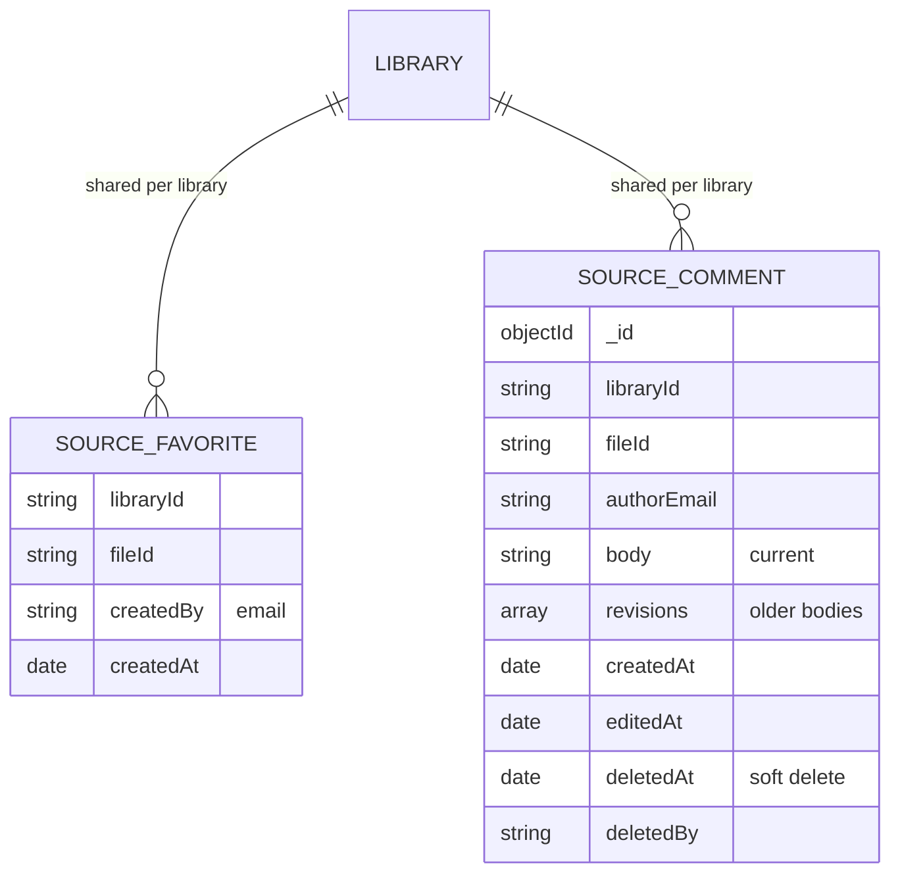
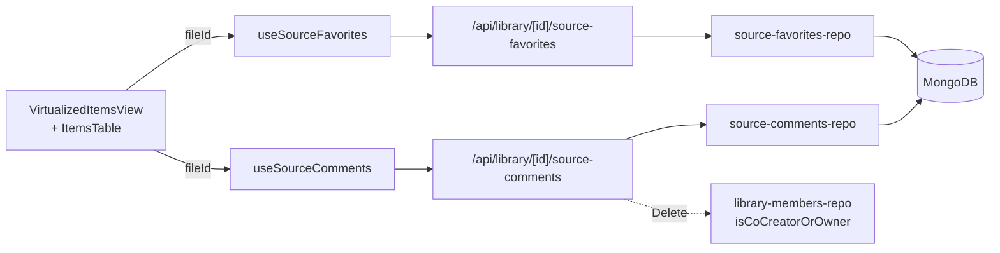

# Plan: Quell-Favoriten und Kommentare in der Explorer-Tabelle

## Designentscheidungen (geklaert mit User)

Drei Rollen relevant (abgeleitet aus Clerk-Session + `accessRole` von `GET /api/libraries`):

- **Owner / Co-Creator** (Mitglied der Library; serverseitig via `isCoCreatorOrOwner`)
- **Gast** (`signed-in`, aber kein Mitglied; z.B. fremder Besucher der Public-Explore-Seite mit Account)
- **Anonym** (nicht eingeloggt)

Berechtigungen pro Feature:

- **Favoriten** (geteilt, library-weit, mit Audit `createdBy`+`createdAt`):
  - Sehen / Toggeln / Filtern: **nur Owner + Co-Creators**.
  - Gast/Anonym: Star-Icon und Filter-Toggle werden gar nicht gerendert; Server liefert 403.
- **Kommentare** (Feedback-an-Owner-Logik):
  - **Schreiben**: jeder eingeloggte User (Gast + Owner + Co-Creator).
  - **Lesen**:
    - Owner + Co-Creator sehen **alle** Kommentare zur Quelle (inkl. Gast-Kommentare als Feedback).
    - Gast sieht **nur seine eigenen** Kommentare zur Quelle (`authorEmail === requester`).
    - Anonym: 401 / kein Kommentar-Icon.
  - **Editieren**: nur Author seines eigenen Kommentars.
  - **Loeschen**: Author seines eigenen, Owner + Co-Creator zusaetzlich beliebige (Moderation).
  - Bulk-Counter folgt der Lese-Sicht: Gast zaehlt nur eigene, Owner/Co-Creator zaehlt alle.
- **UI**: expandierbare Zeile mit Chevron + Counter; aufgeklapptes Panel als zweite TableRow unter der Quelle. Gast sieht Hinweis "Nur Owner und Co-Kreatoren sehen alle Kommentare; deine Kommentare sind nur fuer dich und das Team sichtbar."
- **History**: echte Versionierung - alte Body-Versionen in `revisions[]` archiviert, im UI aufklappbar.

## Datenmodell (MongoDB)

Stabiler Quellen-Schluessel: `fileId` (Top-Level in der Vector-Meta-Doc, storage-agnostisch laut [`contracts-story-pipeline.mdc`](.cursor/rules/contracts-story-pipeline.mdc) §4).

- `source_favorites`: Unique-Index `(libraryId, fileId)`; ein Eintrag = favorisiert.
- `source_comments`: Indices `(libraryId, fileId, createdAt)` und zusaetzlich `(libraryId, authorEmail, createdAt)` fuer den Gast-Lese-Pfad ("nur eigene"); `revisions: [{ body, editedAt, editorEmail }]`; Soft-Delete via `deletedAt`/`deletedBy`, geloeschter Kommentar bleibt mit Hinweis sichtbar.

## Architektur-Map

## Neue Dateien

### Typen

- `src/types/source-favorite.ts` - `SourceFavorite`, `SourceFavoriteListResponse`.
- `src/types/source-comment.ts` - `SourceComment`, `SourceCommentRevision`, `SourceCommentInput`.

### Repositories (Pattern wie [`library-members-repo.ts`](src/lib/repositories/library-members-repo.ts))

- `src/lib/repositories/source-favorites-repo.ts`
  - `listFavoriteFileIds(libraryId)` - Set fuer Filter + Counter.
  - `toggleFavorite(libraryId, fileId, userEmail) -> { added: boolean }`.
  - Index-Setup analog `library_members`.
- `src/lib/repositories/source-comments-repo.ts`
  - `listCommentsByFileId(libraryId, fileId, opts: { onlyAuthorEmail?: string })` - chronologisch inkl. Revisionen; mit `onlyAuthorEmail` greift der Gast-Pfad ("nur eigene").
  - `getCommentCountsForLibrary(libraryId, fileIds[], opts: { onlyAuthorEmail?: string }) -> Map<fileId, count>` (zaehlt nur nicht-soft-deleted; mit `onlyAuthorEmail` rolelhaengig).
  - `createComment(libraryId, fileId, authorEmail, body)`.
  - `updateComment(commentId, authorEmail, body)` - alte Version in `revisions` pushen, `editedAt` setzen.
  - `softDeleteComment(commentId, requesterEmail, isModerator)` - 403 bei Fremd-Kommentar ohne Moderator-Rechte.

### API-Routes (alle mit Clerk `auth()` + `currentUser()`-E-Mail; 401 ohne Session)

- `src/app/api/library/[libraryId]/source-favorites/route.ts`
  - **Beide Methoden setzen zusaetzlich `isCoCreatorOrOwner` voraus -> 403 fuer Gaeste.**
  - `GET` -> `{ favorites: string[] }` (fileId-Liste).
  - `POST` -> Body `{ fileId }`, Toggle, Response `{ added: boolean }`.
- `src/app/api/library/[libraryId]/source-comments/route.ts`
  - Server ermittelt Rolle einmal (`isMember = isCoCreatorOrOwner(libraryId, email)`) und reicht sie an Repo durch.
  - `GET ?fileId=...` -> Thread; Member sehen alle, Gaeste nur eigene (`onlyAuthorEmail = email`).
  - `GET ?fileIds=a,b,c` -> Bulk-Counts (`Record<fileId, number>`); Counts beim Gast nur eigene.
  - `POST` -> `{ fileId, body }` neuer Kommentar (jeder eingeloggte User; auch Gaeste).
- `src/app/api/library/[libraryId]/source-comments/[commentId]/route.ts`
  - `PATCH` -> `{ body }` editieren (nur Author; Server prueft).
  - `DELETE` -> soft-delete; Server prueft Author-or-Moderator (`isCoCreatorOrOwner`).

Diese Routen muessen **nicht** in der Public-Matcher-Liste in [`src/middleware.ts`](src/middleware.ts) eintragen werden - sie laufen unter dem geschuetzten `/api/library/...`-Default.

### Hooks (Client)

- `src/hooks/gallery/use-library-role.ts`
  - Liefert `{ role: 'owner' | 'co-creator' | 'reader' | 'guest' | 'anonymous', isMember, isSignedIn }` aus `librariesAtom` + Clerk.
  - `isMember = role === 'owner' || role === 'co-creator'` - zentraler UI-Gate fuer Favoriten-Spalte/Filter und fuer den "alle Kommentare sehen"-Pfad.
- `src/hooks/gallery/use-source-favorites.ts`
  - Liefert `{ favoriteIds: Set<string>, isFavorite(fileId), toggle(fileId), isReady }`.
  - Lazy beim Mount per `libraryId`; Optimistic Update; **nur aktiv wenn `isMember === true`** (sonst no-op + leeres Set).
- `src/hooks/gallery/use-source-comments.ts`
  - Single-Thread-Variante: `(libraryId, fileId) -> { comments, add, edit, remove, isLoading }` fuer das Panel.
  - Server filtert je nach Rolle - der Hook braucht nichts zu wissen.
- `src/hooks/gallery/use-source-comment-counts.ts`
  - Bulk-Variante: `(libraryId, visibleFileIds) -> Record<fileId, number>` fuer Tabellen-Render (debounced bei Scroll).
  - Counter zeigt automatisch die rolelhaengige Sichtbarkeit (Server entscheidet).

### UI-Komponenten

- `src/components/library/gallery/source-favorite-toggle.tsx`
  - Star-Icon (`lucide-react`) als Button; gated `isMember` (sonst nicht gerendert); `e.stopPropagation()` damit der Row-Click nicht navigiert.
- `src/components/library/gallery/source-comments-panel.tsx`
  - Render-Komponente fuers expandierte Panel: Liste mit Avatar/E-Mail, Body, "(bearbeitet)"-Marker, Akkordeon mit `revisions[]`, Edit-/Delete-Buttons je nach Rolle, Eingabefeld unten.
  - Wenn `role === 'guest'`: Hinweis-Banner oben "Nur Owner und Co-Kreatoren sehen alle Kommentare. Deine Beitraege sind nur fuer dich und das Team sichtbar." Liste enthaelt nur eigene Kommentare; Eingabefeld bleibt aktiv.
  - Wenn `role === 'anonymous'`: kein Render (Spalte ohnehin ausgeblendet).
  - Soft-deleted: graue Zeile "Kommentar geloescht von X am ...".

## Geaenderte Dateien

### Tabellenansichten

- [`src/components/library/gallery/virtualized-items-view.tsx`](src/components/library/gallery/virtualized-items-view.tsx) (Hauptansicht)
  - Neue Spalten **vorne**:
    1. Chevron-Toggle (oeffnet Comments-Panel als zweite TableRow), nur wenn `isSignedIn` (also Member oder Gast).
    2. Star-Toggle (Favorit), **nur wenn `isMember`**.
  - Lokaler State `expandedRows: Set<string>` (Key = `doc.fileId`).
  - Bei expandiert: zusaetzliche `<TableRow>` mit `colSpan` (analog dem bestehenden Source-Path-Row ab Zeile 430) rendert `<SourceCommentsPanel libraryId fileId />`.
  - Kommentar-Counter im Chevron-Button per `useSourceCommentCounts(libraryId, sichtbareFileIds)`. Beim Gast zeigt der Counter nur seine eigenen.
- [`src/components/library/gallery/items-table.tsx`](src/components/library/gallery/items-table.tsx)
  - Gleiche zwei Spalten + Expand-Row, kleinere Variante (Items-Table hat fixe Spaltenstruktur).

### Filter "Nur Favoriten"

- [`src/components/library/gallery/gallery-root.tsx`](src/components/library/gallery/gallery-root.tsx)
  - Lokaler URL-State per `nuqs`/`useSearchParams`: `?favorites=1` (konform §5 [`welle-3-iii-galerie-chat-contracts.mdc`](.cursor/rules/welle-3-iii-galerie-chat-contracts.mdc)).
  - Vor Uebergabe an `VirtualizedItemsView` filtern: `docs.filter(d => favoriteIds.has(d.fileId))` wenn Toggle aktiv.
  - URL-Param `?favorites=1` wird ignoriert/entfernt, wenn `!isMember` (Gast hat keine Favoriten-Sicht).
- [`src/components/library/filter-context-bar.tsx`](src/components/library/filter-context-bar.tsx)
  - Neuer Toggle-Chip "Nur Favoriten" links neben den Facetten, **nur wenn `isMember`**.

### Berechtigungslogik

- Server: `isCoCreatorOrOwner(libraryId, requesterEmail)` aus [`library-members-repo.ts`](src/lib/repositories/library-members-repo.ts) wird in **drei** Pfaden gebraucht:
  1. Favoriten GET/POST -> 403 wenn nicht Member.
  2. Kommentare GET -> falls nicht Member, Repo-Aufruf mit `onlyAuthorEmail = email`.
  3. Kommentare DELETE -> Author-or-Member-Check.
- Client: zentraler `useLibraryRole(libraryId)`-Hook (siehe oben), liest `accessRole` aus `librariesAtom`, faellt auf `'guest'` zurueck wenn signed-in aber Library nicht im Atom, auf `'anonymous'` wenn nicht signed-in.

### i18n

- `src/lib/i18n/locales/de.ts` + `en.ts`: Neue Keys
  - `gallery.favorites.toggleAdd|Remove|FilterOnly|EmptyHint`
  - `gallery.comments.add|edit|delete|deletedBy|edited|revisionsTitle|empty|placeholder|onlySignedIn|guestVisibilityHint`

## Berechtigungsmatrix (Server-seitig durchsetzen)

| Aktion                  | Anonym | Gast (signed-in) | Owner / Co-Creator |
|-------------------------|--------|------------------|--------------------|
| Favoriten lesen         | 401    | 403              | 200                |
| Favoriten toggeln       | 401    | 403              | 200                |
| Favoriten-Filter in UI  | nein   | nein             | ja                 |
| Kommentare lesen        | 401    | nur eigene       | alle               |
| Kommentar-Counter       | nein   | nur eigene zaehlt| alle zaehlen       |
| Kommentar erstellen     | 401    | 200              | 200                |
| Kommentar editieren     | 401    | nur eigene       | nur eigene         |
| Kommentar loeschen      | 401    | nur eigene       | jeden (Moderation) |
| Revisions-History sehen | 401    | nur fuer eigene  | alle               |

## Konformitaet zu Workspace-Rules

- [`storage-abstraction.mdc`](.cursor/rules/storage-abstraction.mdc): Persistenz nutzt nur `fileId` (kein Provider-Pfad, kein `library.type`-Branch).
- [`no-silent-fallbacks.mdc`](.cursor/rules/no-silent-fallbacks.mdc): Repos werfen bei fehlenden Pflicht-Feldern; API-Routen liefern explizite 401/403/404; UI rendert Toast bei Fehler statt stiller Fallbacks.
- [`welle-3-iii-galerie-chat-contracts.mdc`](.cursor/rules/welle-3-iii-galerie-chat-contracts.mdc) §1, §3: UI-Komponenten reden nur ueber `/api/...`, kein Direktimport von Repos in Client-Code; URL-Parameter `?favorites=1` konform §5; jede Datei < 200 Zeilen ([`AGENTS.md`](AGENTS.md)).
- ADR-Konformitaet: keine Vermischung mit `external-jobs`/`event-job` ([`docs/adr/0001-event-job-vs-external-jobs.md`](docs/adr/0001-event-job-vs-external-jobs.md)).

## Test-/Lint-Strategie

- Neue Repo-Funktionen mit Vitest decken (Mongo-Mock-Pattern wie bestehende `*-repo.test.ts` falls vorhanden, sonst Integration via lokaler Mongo). Insbesondere `listCommentsByFileId(..., { onlyAuthorEmail })` und `getCommentCountsForLibrary(..., { onlyAuthorEmail })`.
- API-Routen-Smoketests pro Rolle (anonym / gast / member):
  - Favoriten GET/POST: 401 / 403 / 200.
  - Kommentare GET ?fileId: 401 / nur-eigene / alle.
  - Kommentare GET ?fileIds Bulk-Counts: gleiche Rolle-Differenzierung.
  - Kommentar PATCH: nur Author kann editieren (Member kann nicht fremde editieren).
  - Kommentar DELETE: Author OR Member darf loeschen.
- Lokal: `bash scripts/welle-pre-merge-check.sh` vor Merge.