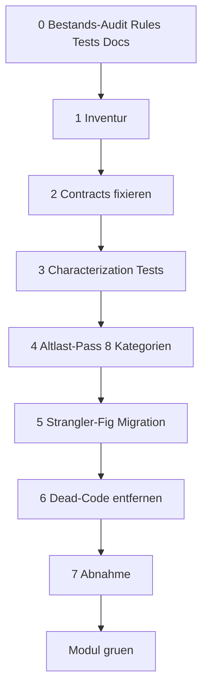

# Refactoring-Strategie gegen Strategie-Drift

## 1. Ist-Zustand (Fakten aus dem Repo)

- 30+ Module unter [src/lib/](src/lib/), 8 Top-Dateien zwischen 1.854 und 3.947 Zeilen, ~90 Vitest-Unit-Tests in [tests/unit/](tests/unit/).
- 13 `.cursor/rules/*.mdc` und [.cursorrules](.cursorrules) bereits formuliert, aber im Code nicht durchgängig durchgesetzt.
- Konkrete Drift-Symptome bereits gefunden:
  - Silent Fallback in [src/lib/external-jobs-repository.ts](src/lib/external-jobs-repository.ts) Zeile 320 (`} catch { return undefined }`)
  - UI kennt Storage in [src/components/library/file-preview.tsx](src/components/library/file-preview.tsx) Zeile 1129 (`primaryStore === 'filesystem'`)
  - **Zwei getrennte Job-Domaenen** (siehe ADR `docs/adr/0001-event-job-vs-external-jobs.md`): `event-job` fuer Session-/Event-Monitor-Welt (eigene UI in `src/app/event-monitor/`), `external-jobs` fuer Secretary-/Pipeline-/Chat-Welt. Beide werden separat refaktoriert (kein Strangler-Fig zwischen ihnen).
  - 27 React-Hooks in einer 3.947-Zeilen-Datei [src/components/creation-wizard/creation-wizard.tsx](src/components/creation-wizard/creation-wizard.tsx) inklusive `Window`-Hack
- Pilot: `external-jobs` (Contracts in [.cursor/rules/contracts-story-pipeline.mdc](.cursor/rules/contracts-story-pipeline.mdc) + [.cursor/rules/external-jobs-integration-tests.mdc](.cursor/rules/external-jobs-integration-tests.mdc) bereits da, Integrationstests in [src/lib/integration-tests/](src/lib/integration-tests/)).

## 2. Methodik: Refactor-Playbook (8 Schritte je Modul)

Jedes Modul wird in dieser Reihenfolge bearbeitet. Tests **vor** Refactor.
Schritt 0 ist neu: er sichert, dass Bestands-Artefakte (Rules, Tests, Docs) vor dem Refactor bewertet werden — sonst entstehen neue Drift-Quellen durch alte, unkontrollierte Artefakte.



### Schritt 0 - Bestands-Audit (Rules, Tests, Docs)
**Vor** Inventur und Refactor: alle Bestands-Artefakte zum Modul auflisten und bewerten. Verhindert, dass alte Regeln/Tests/Docs nach dem Refactor weiter falsche Information liefern (z.B. Tests, die geloeschten Code pruefen → false green).

Output unter `docs/refactor/<modul>/00-audit.md` mit drei Tabellen:

**A. Cursor Rules**
| Rule-Datei | Bezug zum Modul | Status | Aktion |
|---|---|---|---|
| `.cursor/rules/<name>.mdc` | direkt / indirekt / global | aktuell / veraltet / widerspruechlich | keep / update / merge / delete |

**B. Tests**
| Test-Datei | Testet welchen Code | Code existiert? | Vertrag korrekt? | Aktion |
|---|---|---|---|---|
| `tests/unit/<pfad>.test.ts` | Funktion/Modul | ja / nein / umbenannt | ja / nein / unklar | keep / migrate / delete |

**C. Docs**
| Doc-Datei | Beschreibt was | Status | Aktion |
|---|---|---|---|
| `docs/<name>.md` | Konzept / Architektur / Analyse | aktuell / veraltet / widerspruechlich | keep / update / archive / delete |

Audit-Findings werden in den nachfolgenden Schritten **direkt umgesetzt**:
- Status `delete` → Schritt 6 (Dead-Code)
- Status `update` → Schritt 2 (Contracts) bzw. Schritt 3 (Tests)
- Status `merge` → Schritt 5 (Strangler-Fig)

### Schritt 1 - Inventur (Code)
Skript [scripts/module-health.mjs](scripts/module-health.mjs) (neu) erzeugt pro Modul Tabelle: Datei, Zeilen, Test ja/nein, `any`-Anzahl, `'use client'` ja/nein, leere Catches.
Output unter `docs/refactor/<modul>/01-inventory.md`.

### Schritt 2 - Contracts fixieren
Pro Modul `.cursor/rules/<modul>-contracts.mdc` mit harten Invarianten (Vorbild: bestehende [.cursor/rules/contracts-story-pipeline.mdc](.cursor/rules/contracts-story-pipeline.mdc)).
Format: §1 Determinismus, §2 Fehler-Semantik, §3 erlaubte/verbotene Abhängigkeiten, §4 Skip-/Default-Semantik.
**Audit-Findings beachten**: Rules mit Status `update`/`merge` aus Schritt 0 werden hier aktualisiert; Rules mit Status `delete` werden in Schritt 6 entfernt (nicht hier).

### Schritt 3 - Characterization Tests (Sicherheitsnetz vor Refactor)
Vitest-Tests, die das **aktuelle** Verhalten festschreiben (auch wenn buggy). Nach Michael Feathers, "Working Effectively with Legacy Code".
Mindestens 1 Happy-Path + 1 Fehler-Pfad pro öffentlich exportierter Funktion.
Tests landen unter `tests/unit/<modul>/`.

**Audit-Findings beachten**:
- Tests mit Status `migrate` aus Schritt 0 werden hier aktualisiert (z.B. neuer Importpfad nach Modul-Split)
- Tests mit Status `delete` werden in Schritt 6 entfernt (nicht hier, sonst Sicherheitsnetz weg)
- Tests mit Status `keep` bleiben unangetastet — sie sind Teil des Sicherheitsnetzes

### Schritt 4 - Altlast-Pass (8 Kategorien als Checkliste)
Jede Datei wird gegen diese 8 Punkte geprüft, Funde direkt gefixt:

- (1) **Fehlende Tests** - in Schritt 3 abgedeckt
- (2) **Silent Fallbacks** (`catch {}`, `?? []`) - durch `throw` oder bewusstes Default mit Begründung + Logging via [src/lib/logging/](src/lib/logging/) ersetzen
- (3) **UI/Storage-Branches** - in Service-Layer verschieben (siehe [.cursor/rules/storage-abstraction.mdc](.cursor/rules/storage-abstraction.mdc))
- (4) **`any`-Drift** - `unknown` + Type-Guard (siehe [.cursorrules](.cursorrules) §4)
- (5) **Duplikate** - eine Implementierung wird kanonisch, andere via Strangler-Fig in Schritt 5 ablösen
- (6) **Toter Code** - in Schritt 6
- (7) **Datei > 200 Zeilen** - in Sub-Module aufsplitten (z.B. `phase-template/` Ordner mit `index.ts`, `extract-meta.ts`, `transform.ts`, `validate.ts`)
- (8) **Unnötiges `'use client'`** - Direktive entfernen, Server-Komponente

### Schritt 5 - Strangler-Fig Migration
Bei Duplikaten oder grundlegender Umstellung **nicht** in-place ersetzen, sondern parallel:
- Neue saubere Implementierung unter `src/lib/<modul>/v2/` oder klar versioniertem Namen
- Alte Implementierung `@deprecated` markieren + Warnung im Log bei Aufruf
- Aufrufer schrittweise umstellen, beobachtbar via Deprecation-Logs
- Nach 1-2 Wochen ohne Warnungen: alte löschen (Schritt 6)

### Schritt 6 - Dead-Code entfernen
Tool: `knip` (npm) - findet ungenutzte Exporte, Files, Dependencies. Einmalig konfigurieren in `knip.json`.
Optional: `ts-prune` für ungenutzte Exporte.
Findings prüfen, dann löschen. Commit pro Datei für saubere History.

**Audit-Findings beachten** (Cleanup von Bestands-Artefakten):
- Tests mit Status `delete` aus Schritt 0 hier entfernen (z.B. Tests fuer entfernten Code)
- Rules mit Status `delete` aus `.cursor/rules/` entfernen
- Docs mit Status `delete` oder `archive` aus `docs/` entfernen oder nach `docs/archive/` verschieben

### Schritt 7 - Abnahme
Modul gilt erst dann als "grün", wenn alle Punkte erfüllt:
- `pnpm test` (Vitest) grün, neue Tests in `tests/unit/<modul>/`
- `pnpm lint` ohne neue Warnings
- Falls Pipeline-Modul: `pnpm test:integration:api` mit relevanten Testcases grün
- Modul-spezifische Contract-Rule existiert
- Alle Top-Dateien < 200 Zeilen (oder dokumentierte Ausnahme)
- `pnpm health` zeigt 0 für `any`/silent-fallback/large-file-Counts

## 3. Tooling-Setup (einmalig, vor dem Pilot)

- **`knip`** als dev-dependency + `knip.json` mit Entry-Points (`src/app/**/page.tsx`, `src/app/api/**/route.ts`, `electron/main.js`)
- **ESLint verschärfen** in [.eslintrc.json](.eslintrc.json):
  - `@typescript-eslint/no-explicit-any: 'error'`
  - `@typescript-eslint/no-unused-vars: 'error'`
  - `no-empty: ['error', { allowEmptyCatch: false }]`
- **Skript [scripts/module-health.mjs](scripts/module-health.mjs)** (~80 Zeilen) - liest Module aus [src/lib/](src/lib/), gibt pro Modul: Dateien, max-Zeilen, Test-Coverage-Quote, `any`-Count, `catch {}`-Count, `'use client'`-Count
- **Neuer npm-Script `health`** in [package.json](package.json): `"health": "node scripts/module-health.mjs"`
- **Playbook als Doku**: `docs/refactor/playbook.md` mit den 7 Schritten + Templates für Inventur und Contract-Rule

## 4. Pilot: Modul `external-jobs`

### Inventur (vorab erkennbar)
- 35 Quelldateien in [src/lib/external-jobs/](src/lib/external-jobs/), nur 7 davon haben einen Test
- Hauptdatei: [src/lib/external-jobs/phase-template.ts](src/lib/external-jobs/phase-template.ts) (2.040 Zeilen) - kein direkter Test
- Repo: [src/lib/external-jobs-repository.ts](src/lib/external-jobs-repository.ts) (28 KB) - Silent Fallback in Zeile 320
- Worker: [src/lib/external-jobs-worker.ts](src/lib/external-jobs-worker.ts), Watchdog: [src/lib/external-jobs-watchdog.ts](src/lib/external-jobs-watchdog.ts)
- Routen: [src/app/api/external/jobs/](src/app/api/external/jobs/)
- **Nicht** im Pilot-Scope: `event-job-*` (separate Domaene, eigenes Modul nach dem Pilot — siehe ADR `docs/adr/0001-event-job-vs-external-jobs.md`)

### Pilot-Schritte konkret
0. **Bestands-Audit** als `docs/refactor/external-jobs/00-audit.md`:
   - **Rules**: `.cursor/rules/external-jobs-integration-tests.mdc`, `.cursor/rules/contracts-story-pipeline.mdc` (beide direkt), plus globale Rules (`no-silent-fallbacks.mdc`, `storage-abstraction.mdc`)
   - **Tests**: alle 7 Files unter `tests/unit/external-jobs/` plus `tests/unit/jobs-worker-pool.test.ts` (falls external-jobs-bezogen). `tests/unit/events/` gehoert zur event-job-Domaene und wird im **eigenen** event-job-Modul auditiert (NICHT hier mit pruefen)
   - **Docs**: `docs/analyse-worker-start-route-hang.md` und alle anderen `docs/*.md`, die `external-jobs` erwaehnen. Docs, die `event-job` beschreiben, gehoeren zur event-job-Domaene
   - Pro Eintrag: Status (aktuell / veraltet / widerspruechlich) + Aktion (keep / update / merge / delete)
1. **Inventur** als `docs/refactor/external-jobs/01-inventory.md`
2. **Contracts**: bestehende [.cursor/rules/external-jobs-integration-tests.mdc](.cursor/rules/external-jobs-integration-tests.mdc) um harte Invarianten erweitern (sofern noch nötig); Audit-Status `update`/`merge` umsetzen
3. **Characterization Tests** für `phase-template.ts` plus Audit-Status `migrate` umsetzen:
   - `tests/unit/external-jobs/phase-template-happy-path.test.ts`
   - `tests/unit/external-jobs/phase-template-skip-paths.test.ts`
   - `tests/unit/external-jobs/phase-template-empty-input.test.ts`
4. **Altlast-Pass**:
   - Silent Fallback in [src/lib/external-jobs-repository.ts](src/lib/external-jobs-repository.ts) Zeile 320 fixen (Logging + bewusstes Default mit Kommentar oder `throw`)
   - `phase-template.ts` aufsplitten in `src/lib/external-jobs/phase-template/` (`index.ts`, `extract-meta.ts`, `transform.ts`, `validate.ts`, `save.ts`)
5. **Strangler-Fig** entfaellt fuer den Pilot — Architektur-Entscheidung in `docs/adr/0001-event-job-vs-external-jobs.md` legt fest: zwei getrennte Domaenen. Falls beim Audit (Schritt 0) interne Strangler-Faelle WITHIN external-jobs auftauchen (z.B. zwei Wege fuer dieselbe Funktion), hier auflisten und migrieren
6. **knip** ueber `external-jobs/` (NUR external-jobs, nicht event-job) laufen lassen, ungenutzten Code entfernen
7. **Abnahme** mit allen Integration-Test-Cases aus [src/lib/integration-tests/test-cases.ts](src/lib/integration-tests/test-cases.ts)

## 5. Modul-Reihenfolge nach dem Pilot

Priorisierung **bottom-up von der Datenquelle Richtung UX**: zuerst Backend-Layer haerten (Storage, Persistenz, Pipeline), dann Verarbeitungsschicht (Secretary, Templates, Chat), dann UI-Welle gestaffelt vom Einfachen zum Komplexen. `event-job` zuletzt, weil eigene Domaene mit niedriger Prioritaet (siehe ADR 0001).

### Welle 0 - Pilot
1. `external-jobs` - orchestriert Secretary/Pipeline/Chat (Pilot-Modul, lehrt Methodik)

### Welle 1 - Backend / Datenquelle
2. `storage` - Backend-Abstraktion (Filesystem, Nextcloud, Azure); die eigentliche Datenquelle
3. `shadow-twin` - Persistenz-Layer fuer Pipeline-Artefakte (nutzt `storage`)
4. `ingestion` - Dokumente in System holen, Text/Embeddings erzeugen (nutzt `storage` und `shadow-twin`)

### Welle 2 - Verarbeitung
5. `secretary` - externer Service-Wrapper (PDF/Audio/Video-Analyse)
6. `templates` - Output-Templates fuer Pipeline-Ergebnisse
7. `chat` - RAG-Konsum (Embeddings → LLM-Antwort)

### Welle 3 - UX (vom Einfachen zum Komplexen)

#### Welle 3a - Archiv-Ansicht generell
8. Library-Listen, Detail-Header, Sidebar-Navigation, Filter/Search (kleine, klar abgegrenzte Komponenten — gute Uebung fuer die UX-Welle)

#### Welle 3b - `file-preview.tsx` als eigene Mehr-Phasen-Welle
[src/components/library/file-preview.tsx](src/components/library/file-preview.tsx) (3.506 Zeilen) hat einen Switch ueber 8 View-Typen plus Extension-Map plus Reducer. Eigenstaendige Welle mit 4 Cloud-Agents:

- **9a Inventur + Audit**: pro View-Typ (audio, image, video, markdown, pdf, office, presentation, website) Stats erheben (Zeilen, States, Hook-Anzahl, Storage-Branches), bestehende Tests/Docs/Rules auditieren. Output: `docs/refactor/file-preview/00-audit.md` + `01-inventory.md`. Bezug zur bestehenden Regel [.cursor/rules/detail-view-type-checklist.mdc](.cursor/rules/detail-view-type-checklist.mdc)
- **9b Modul-Split**: `src/components/library/file-preview/` Verzeichnis mit `index.tsx` (orchestriert) + `views/audio.tsx` + `views/image.tsx` + `views/video.tsx` + `views/markdown.tsx` + `views/pdf.tsx` + `views/office.tsx` + `views/presentation.tsx` + `views/website.tsx` + `lib/extension-map.ts` + `state/preview-reducer.ts`
- **9c Characterization Tests**: pro Sub-View mindestens 1 Render-Test (mit Test-Daten aus Storage-Mock); plus 1 Test fuer Extension-Map und 1 Reducer-Test
- **9d Altlast-Pass**: u.a. Storage-Branch in Zeile 1129 entfernen (`primaryStore === 'filesystem'`) → Storage-Entscheidung gehoert in Welle 1 `storage`-Modul, nicht in eine View-Komponente

#### Welle 3c - Kleinere UI-Komponenten
10. `library-form.tsx`, weitere Dialoge/Forms — opportunistisch nach gleichem Schema, aber kuerzer (eine Welle pro Komponente, 1-2 Cloud-Agents)

#### Welle 3d - `creation-wizard.tsx` als grosse Mehr-Phasen-Welle
11. [src/components/creation-wizard/creation-wizard.tsx](src/components/creation-wizard/creation-wizard.tsx) (3.947 Zeilen) **als letztes**, weil komplexester Kandidat (27 React-Hooks, Window-Hack `__collectSourceStepBeforeLeave`); profitiert von allen vorherigen Wellen (saubere Backend-Contracts → sauberer Wizard-Flow). Gleiche 4-Phasen-Struktur wie Welle 3b: Inventur+Audit, Modul-Split (vermutlich pro Wizard-Step ein Modul), Characterization Tests, Altlast-Pass (Window-Hack eliminieren)

### Welle 4 - Niedrige Prioritaet
12. `event-job` + `event-monitor` UI - eigene Domaene (Sessions, Event-Monitor); per ADR 0001 separat. Niedrige Prio, weil isoliert und nicht im Hauptfluss
13. Restliche `src/lib`-Module - opportunistisch im Vorbeigehen

## 6. Was der Plan NICHT macht

- Keine Tool-Migration (kein Wechsel weg von Next.js, Vitest, Mongo)
- Keine Architektur-Neuerfindung. Strangler-Fig statt Big-Bang
- Keine Massen-Refactor-PRs. Pro Modul eine Serie kleiner PRs

## 7. Definition of Done für die Initiative

- Jedes Modul in [src/lib/](src/lib/) hat eigene Contract-Rule und mindestens 1 Test je oeffentlicher Funktion
- `pnpm health` zeigt fuer jedes Modul: 0 `any`, 0 leere Catches, 0 Dateien > 200 Zeilen (ausser dokumentiert)
- `event-job` und `external-jobs` jeweils sauber, beide nach denselben Standards (siehe ADR `docs/adr/0001-event-job-vs-external-jobs.md`)
- ESLint verbietet `any` und leere Catches - neue Drift wird beim PR aufgehalten

## 8. Cloud-Ausführung (Cursor Cloud Agents)

Die Pilot-Schritte werden **schrittweise als getrennte Cloud Agents** ausgeführt — jeder mit eigenem Branch und eigener PR. Vorteile: kleine reviewbare PRs, parallele CI, klare Verantwortung.

### 8.1 Cloud-Agent-Wellen (sequentiell, nicht parallel)

```mermaid
flowchart LR
  pf[Pre-Flight + ADR] --> a1[Agent 1 Tooling] --> r1[PR review merge]
  r1 --> a2[Agent 2 Audit + Inventur] --> r2[PR review merge]
  r2 --> a3[Agent 3 Pilot-Tests + Contracts] --> r3[PR review merge]
  r3 --> a4[Agent 4 Pilot-Altlast] --> r4[PR review merge]
  r4 --> a5[Agent 5 Dead-Code] --> r5[PR review merge]
  r5 --> done[Pilot abgenommen]
```



Sequentiell, weil jeder Schritt auf dem vorigen aufbaut: Tooling vor Audit (fuer `pnpm health`), Audit vor Tests (Audit zeigt, welche Tests `keep`/`migrate`/`delete` sind), Tests vor Altlast (Sicherheitsnetz), Altlast vor Dead-Code (Code stabil, kein Risiko durch Loeschungen).
**Strangler-Fig entfaellt** im Pilot — siehe ADR `docs/adr/0001-event-job-vs-external-jobs.md` (event-job und external-jobs sind getrennte Domaenen).

### 8.2 Pre-Flight-Checkliste (einmalig vor Agent 1)

- [x] `AGENTS.md` im Repo-Root existiert
- [x] Plan-File [.cursor/plans/refactor-strategie-drift-eliminieren_06fd8014.plan.md](.cursor/plans/refactor-strategie-drift-eliminieren_06fd8014.plan.md) liegt im Workspace
- [x] ADR [docs/adr/0001-event-job-vs-external-jobs.md](docs/adr/0001-event-job-vs-external-jobs.md) angelegt (Entscheidung: zwei getrennte Domaenen)
- [ ] Plan-File, AGENTS.md und ADR committen + pushen (manueller Schritt durch User)
- [ ] Cursor Cloud-Dashboard (`cursor.com/dashboard/cloud-agents`) → Tab "Secrets": MongoDB-URI, Azure-Credentials, Clerk-Keys, OpenAI/Mistral-API-Keys hinterlegt
- [ ] Optional: `.cursor/environment.json` mit Setup-Commands (`pnpm install`, evtl. Mongo-Test-Container) — sonst Snapshot via `cursor.com/onboard`
- [ ] Spend-Limit gesetzt
- [ ] Existierende Branches geprüft, keine Konflikte mit `refactor/cloud-*`

### 8.3 AGENTS.md (bereits angelegt)

Datei: [AGENTS.md](AGENTS.md) — siehe dort. Enthält Setup, Test-/Lint-Commands, Repo-Konventionen, Branching-Regeln und Stop-Bedingungen.

### 8.4 Cloud-Agent-Prompt-Vorlagen

Folgende Prompts kopiert man direkt ins Cloud-Eingabefeld (Cursor Desktop "Cloud"-Mode, Agents Window oder `cursor.com/agents`).

#### Prompt für Agent 1 — Tooling-Setup

```
Lies zuerst die Datei .cursor/plans/refactor-strategie-drift-eliminieren_06fd8014.plan.md
und die Datei AGENTS.md im Repo-Root.

Aufgabe: Todo "cloud-agent-1-tooling" aus dem Plan abarbeiten.

Konkret:
1. Branch refactor/cloud-tooling-setup von master erstellen (Default-Branch dieses Repos ist master, nicht main)
2. knip als devDependency installieren, knip.json anlegen mit Entry-Points:
   src/app/**/page.tsx, src/app/api/**/route.ts, electron/main.js
3. .eslintrc.json verschaerfen:
   - @typescript-eslint/no-explicit-any: error
   - @typescript-eslint/no-unused-vars: error
   - no-empty: ['error', { allowEmptyCatch: false }]
4. scripts/module-health.mjs schreiben (~80 Zeilen). Pro Modul in src/lib/
   ausgeben: Anzahl Dateien, max-Zeilen, Test-Coverage-Quote (gegen tests/unit/<modul>/),
   any-Count, leere-catch-Count, 'use client'-Count. Ausgabe als Markdown-Tabelle.
5. package.json: Script "health": "node scripts/module-health.mjs"
6. docs/refactor/playbook.md anlegen mit den 7-Schritten-Methodik
   (kopiere aus Plan-Sektion 2)
7. WICHTIG: ESLint-Errors aus Schritt 3 NICHT in dieser PR fixen. Nur Regel scharf
   schalten, dann eine Folge-PR pro betroffenem Modul. Falls die jetzige Codebasis
   sofort tausende Errors wirft, statt 'error' zunaechst 'warn' setzen und in PR-
   Beschreibung dokumentieren.
8. Tests: pnpm test (muss gruen bleiben), pnpm lint (existierende Warnings dokumentieren)
9. Pro Schritt einzelner Commit mit Prefix "[plan 06fd8014] tooling: ..."
10. Am Ende PR oeffnen mit Titel "Refactor: Tooling-Setup (knip, ESLint, module-health)"
    und Body: Was wurde gemacht, welche Tests laufen, naechste Schritte.

Stop-Bedingungen wie in AGENTS.md.
Antworte und kommentiere auf Deutsch.
```

#### Prompt für Agent 2 — Bestands-Audit + Inventur (external-jobs)

```
Lies zuerst die Datei .cursor/plans/refactor-strategie-drift-eliminieren_06fd8014.plan.md
und die Datei AGENTS.md im Repo-Root.

Aufgabe: Todo "cloud-agent-2-audit" aus dem Plan abarbeiten.

WICHTIG: Lies zuerst auch docs/adr/0001-event-job-vs-external-jobs.md.
Daraus folgt: event-job ist eine SEPARATE Domaene und wird HIER NICHT auditiert.
Nur external-jobs ist im Audit-Scope.

Diese PR enthaelt NUR Markdown-Files unter docs/refactor/external-jobs/.
Keine Code-Aenderung, keine Test-Aenderung, keine Rule-Aenderung in dieser PR.

Konkret:
1. Branch refactor/cloud-pilot-audit von master erstellen
2. Verzeichnis docs/refactor/external-jobs/ anlegen
3. Datei docs/refactor/external-jobs/00-audit.md schreiben mit drei Tabellen:

   A. Cursor Rules - alle .cursor/rules/*.mdc, die external-jobs betreffen
      (NICHT event-job, das ist separate Domaene per ADR 0001).
      Mindestens pruefen: external-jobs-integration-tests.mdc,
      contracts-story-pipeline.mdc, no-silent-fallbacks.mdc, storage-abstraction.mdc.
      Pro Eintrag: Bezug (direkt/indirekt/global), Status
      (aktuell/veraltet/widerspruechlich), Aktion (keep/update/merge/delete) mit
      kurzer Begruendung in einer Zeile.

   B. Tests - alle Tests in tests/unit/external-jobs/ und
      tests/unit/jobs-worker-pool.test.ts (falls external-jobs-bezogen).
      tests/unit/events/ NICHT pruefen — gehoert zur event-job-Domaene.
      Pro Test: testet welchen Code (Funktion + Datei), Code existiert noch
      ja/nein/umbenannt, Vertrag korrekt ja/nein/unklar, Aktion
      (keep/migrate/delete) mit Begruendung in einer Zeile.

   C. Docs - alle docs/*.md, die external-jobs erwaehnen
      (NICHT docs ueber event-job, separate Domaene).
      Mindestens pruefen: docs/analyse-worker-start-route-hang.md.
      Pro Eintrag: Beschreibt was, Status (aktuell/veraltet/widerspruechlich),
      Aktion (keep/update/archive/delete) mit Begruendung in einer Zeile.

4. Datei docs/refactor/external-jobs/01-inventory.md schreiben:
   - Falls "pnpm health" aus Agent 1 verfuegbar: Output filtern auf
     external-jobs-Module und einbetten
   - Sonst: manuelle Tabelle mit Datei, Zeilen, hat Test ja/nein, any-Anzahl,
     leere Catches, 'use client' ja/nein fuer alle Files unter src/lib/external-jobs/
     plus src/lib/external-jobs-*.ts und src/app/api/external/jobs/

5. Datei docs/refactor/external-jobs/README.md schreiben mit kurzer Erklaerung,
   was in diesem Verzeichnis liegt und in welcher Reihenfolge die Files gelesen werden.

6. Pro Datei einzelner Commit mit Prefix "[plan 06fd8014] audit: ..."
7. PR oeffnen mit Titel "Refactor: Bestands-Audit + Inventur fuer external-jobs"
   und Body: Welche Findings sind kritisch, welche Aktionen werden in den
   naechsten Agent-Schritten umgesetzt.

WICHTIG: keine Code-Aenderungen, keine Test-Aenderungen. Nur Analyse-Markdown.
Die Audit-Findings werden von Agent 3-5 umgesetzt.

Stop-Bedingungen wie in AGENTS.md.
Antworte und kommentiere auf Deutsch.
```

#### Prompts für Agent 3-5
Analog aufgebaut, jeweils mit eigenem Branch, eigener Todo-ID, eigener PR. Vorlage wird vor jedem Start aus diesem Plan abgeleitet — Details zu jedem Schritt stehen in Sektion 4 ("Pilot-Schritte konkret") und in den entsprechenden Todos.
**Pflicht für Agent 3-5**: zuerst `docs/refactor/external-jobs/00-audit.md` lesen und Aktionen mit eigenem Schritt abgleichen (siehe `AGENTS.md` Abschnitt "Bestands-Audit beachten").

### 8.5 Lokale Verifikations-Schritte zwischen den Agents

Nach jedem gemergten Agent-PR:
- `git pull origin master` lokal (Default-Branch: master)
- `pnpm install` (falls Dependencies geändert)
- `pnpm test` lokal grün?
- `pnpm health` (sobald verfügbar) — schaut wie das Modul jetzt aussieht
- Bei Auffälligkeiten: Issue oder Folge-Prompt für nächsten Agent vorbereiten

### 8.6 Cloud vs. lokal — was wo gemacht wird

**Cloud-Agents geeignet** (analytisch, mechanisch, gut testbar):
- Tooling-Setup, Audit-Markdown, Inventur, Characterization Tests, Modul-Splits, Dead-Code-Cleanup
- UI-Refactors `file-preview.tsx` und `creation-wizard.tsx` (Welle 3b/3d): **Modul-Split + Tests in der Cloud** — aber visuelle Abnahme zwingend lokal mit `pnpm dev`. PR erst mergen, nachdem User die UI im Browser geprueft hat.

**Nur lokal** (nicht in die Cloud):
- Schritte, die Live-Daten/Echte Mongo-Aufrufe brauchen (ausser mit dedizierten Test-Credentials in Secrets)
- Initiale `AGENTS.md`-Erstellung — wird lokal gemacht, weil sie selbst die Spielregeln fuer Cloud Agents ist
- ADR-Entscheidungen (`docs/adr/`) — Architektur ist Menschen-Aufgabe, keine LLM-Aufgabe
