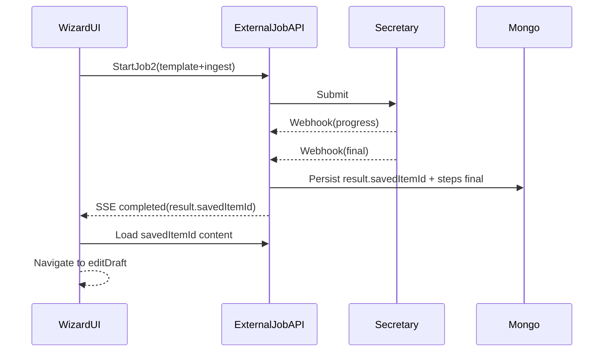

# Zentraler Job-Contract: savedItemId + Integrationstests

## Zielzustand (Contract)

- **Invariant**: Wenn ein External Job `status === 'completed'` ist, dann **muss** `result.savedItemId` im Job-Dokument persistiert sein.
- **Zusatz-Invariant**: Ein Job darf nicht `completed` sein, solange ein Step noch `pending` ist (z.B. `ingest_rag`). Wenn Ingest nicht laufen soll, muss der Step explizit als `completed` mit `details.skipped=true` markiert werden.

## Warum das aktuell passieren kann

- `setJobCompleted()` in [`src/lib/external-jobs/complete.ts`](src/lib/external-jobs/complete.ts) setzt `status=completed`, auch wenn `result.savedItemId` **undefined** ist → in Mongo wird das Feld dann nicht gespeichert (du siehst `result: {}`).
- Außerdem ist bei dir `ingest_rag` noch `pending`, obwohl der Job `completed` ist → Contract wird verletzt.

## Fix-Strategie (zentral, nicht UI)

- **A) Completion-Gate einziehen**
- In [`src/lib/external-jobs/complete.ts`](src/lib/external-jobs/complete.ts) vor `setStatus('completed')`:
    - Prüfen, ob der Job laut Parametern/Policies ein „Result-Item“ haben muss (bei dir: template=true → **ja**).
    - Wenn `savedItemId` fehlt: **Job auf `failed` setzen** (mit klarer Fehlermeldung `missing_saved_item_id`).
    - Prüfen, ob `ingest_rag` noch `pending` ist:
    - Wenn Ingest policy/phase = ignore/disabled → Step als skipped/completed markieren.
    - Wenn Ingest erwartet ist → Job nicht completed setzen, sondern Step sauber ausführen/abschließen oder failen.
- **B) Orchestrator sicherstellen, dass savedItemId überhaupt gesetzt wird**
- In `[src/app/api/external/jobs/[jobId]/route.ts](src/app/api/external/jobs/[jobId]/route.ts)` und ggf. `[src/app/api/external/jobs/[jobId]/start/route.ts](src/app/api/external/jobs/[jobId]/start/route.ts)`:
    - Sicherstellen, dass bei Template-Phase immer ein `templateResult.savedItemId` existiert, sonst Fehler.
    - Den Job nicht „finalisieren“, bevor ingest-Logik konsistent ist.

## Test-Strategie (mit echtem Secretary) – Nutzung der Integration-Tests Seite

Die Seite `http://localhost:3000/integration-tests` macht dafür **sehr viel Sinn**, weil sie bereits:

- Jobs intern erstellt (`/api/external/jobs/internal/create`)
- Phasen/Policies setzt
- über `/start` gegen den realen Secretary/Transformer läuft
- Ergebnisse via Mongo+Storage validiert

### Anpassungen an den Tests

- **Neue Validator-Regeln** in [`src/lib/integration-tests/validators.ts`](src/lib/integration-tests/validators.ts):
- `completed ⇒ result.savedItemId vorhanden`.
- `completed ⇒ kein step.status === 'pending'`.
- Optional: wenn `phases.ingest=true` und `policies.ingest!='ignore'` ⇒ `ingest_rag` muss `completed` sein.
- **Neue/angepasste Testfälle** in [`src/lib/integration-tests/test-cases.ts`](src/lib/integration-tests/test-cases.ts):
- **HITL-Job1 (extract-only)**: `extract=do`, `metadata=ignore`, `ingest=ignore` ⇒ `savedItemId` muss existieren (Transcript).
- **HITL-Job2 (template+ingest, extract skip)**: `extract=ignore`, `metadata=do`, `ingest=do` + Shadow-Twin vorhanden ⇒ `savedItemId` muss existieren (Transformation) und ingest muss sauber abgeschlossen/geskippt sein.
- **Template-only**: ingest=ignore ⇒ ingest step muss skipped/completed sein.
- **Orchestrator** [`src/lib/integration-tests/orchestrator.ts`](src/lib/integration-tests/orchestrator.ts):
- Testfälle so konfigurieren, dass sie den „shadow_twin_exists“ Pfad reproduzierbar triggern (das kann er heute schon via `prepareShadowTwinForTestCase`).

### Anzahl Szenarien

- Ja: **wenige, aber harte** Szenarien sind besser (3–5 Kernfälle wie oben), statt sehr viele Varianten. Damit bleibt Debugging schnell und der Contract wird trotzdem abgesichert.

## Mini-Flow (Sollzustand)

