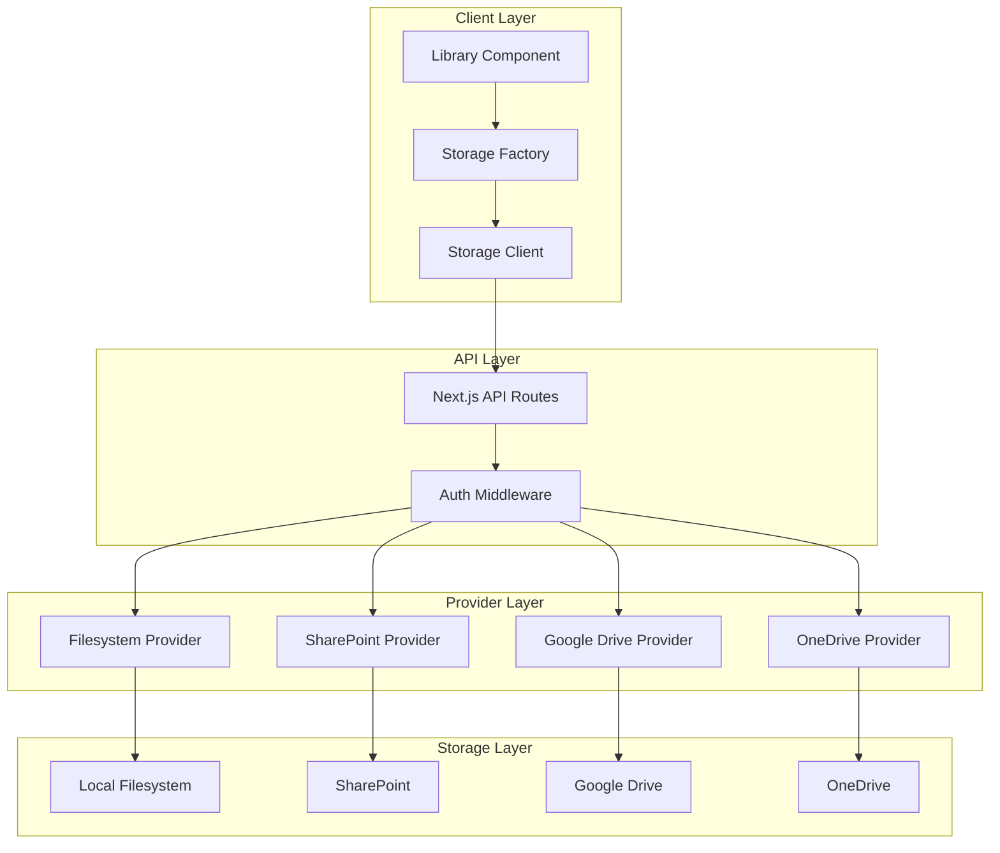
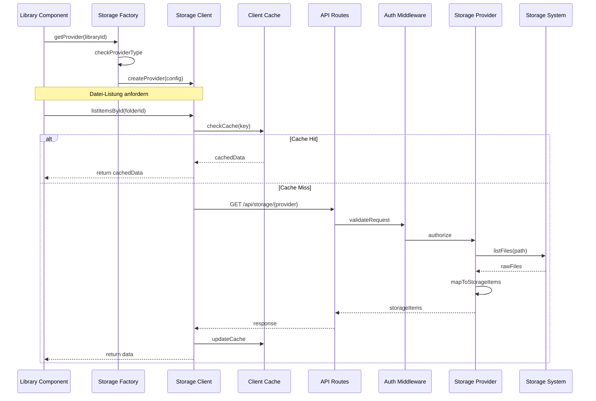
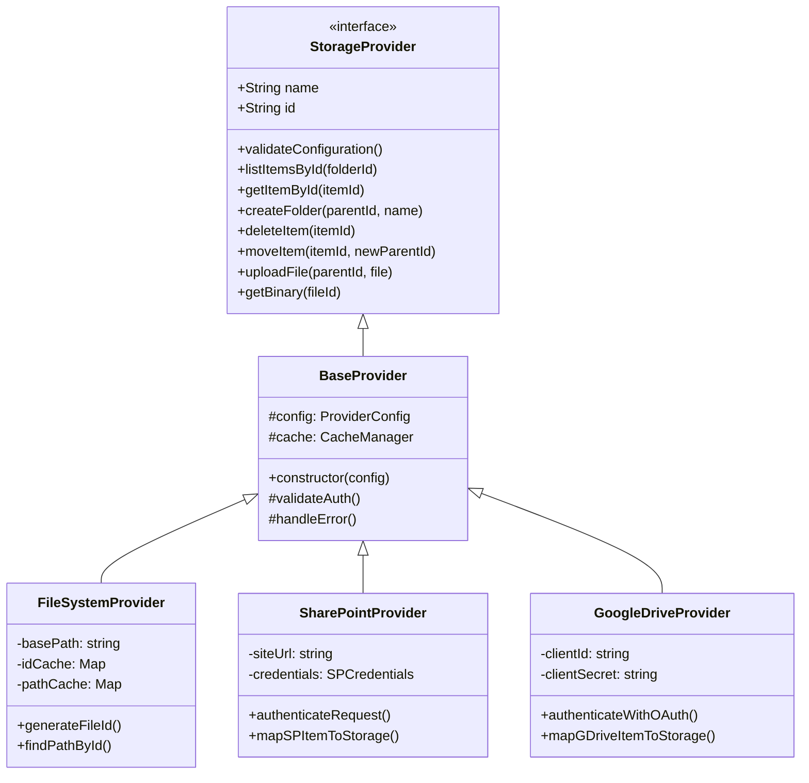

# Storage Provider System

## Architektur-Übersicht

Das Storage Provider System ist eine modulare Architektur zur Abstraktion verschiedener Dateispeicher-Backends. Es ermöglicht die einheitliche Handhabung von Dateien und Ordnern über verschiedene Speichersysteme hinweg.

### System-Architektur



### Detaillierter Datenfluss für Dateioperationen



### Provider-Integration-Architektur



## Provider-Integration

### Implementierungsebenen

1. **UI-Ebene** (`/src/components/library/`)
   - Benutzerinteraktion
   - State Management
   - Event Handling
   - Provider-Auswahl

2. **Factory-Ebene** (`/src/lib/storage/storage-factory.ts`)
   - Provider-Instanziierung
   - Konfigurationsmanagement
   - Provider-Typ-Erkennung
   - Instanz-Caching

3. **Client-Ebene** (`/src/lib/storage/filesystem-client.ts`)
   - HTTP-Kommunikation
   - Request/Response-Handling
   - Client-seitiges Caching
   - Fehlerbehandlung

4. **API-Ebene** (`/app/api/storage/[provider]/route.ts`)
   - Request-Routing
   - Authentifizierung
   - Validierung
   - Error-Handling

5. **Provider-Ebene** (`/src/lib/storage/providers/`)
   - Backend-Integration
   - Datei-Operationen
   - Format-Mapping
   - Caching

### Integration neuer Provider

```typescript
// 1. Provider-Interface implementieren
class NewStorageProvider extends BaseProvider implements StorageProvider {
  constructor(config: ProviderConfig) {
    super(config);
  }

  async listItemsById(folderId: string): Promise<StorageItem[]> {
    // Provider-spezifische Implementierung
  }
  
  // Weitere Interface-Methoden implementieren
}

// 2. Factory erweitern
class StorageFactory {
  async getProvider(libraryId: string): Promise<StorageProvider> {
    const library = this.findLibrary(libraryId);
    
    switch (library.type) {
      case 'local':
        return new FileSystemProvider(library.config);
      case 'sharepoint':
        return new SharePointProvider(library.config);
      case 'gdrive':
        return new GoogleDriveProvider(library.config);
      // Neuen Provider hinzufügen
      case 'newtype':
        return new NewStorageProvider(library.config);
    }
  }
}

// 3. API Route erstellen
// /app/api/storage/[provider]/route.ts
export async function GET(
  req: Request,
  { params }: { params: { provider: string } }
) {
  const provider = await getProviderInstance(params.provider);
  // Request verarbeiten
}
```

### Provider-spezifische Anforderungen

#### Filesystem
- Lokaler Dateizugriff
- Pfad-Mapping
- Berechtigungsprüfung
- ID-Generierung

#### SharePoint
- OAuth Authentication
- Graph API Integration
- Site/Library Mapping
- Berechtigungsmodell

#### Google Drive
- OAuth 2.0 Flow
- API Quotas
- File Picking
- Sharing Settings

#### OneDrive
- Microsoft Authentication
- Graph API
- Delta Queries
- Sharing Links 