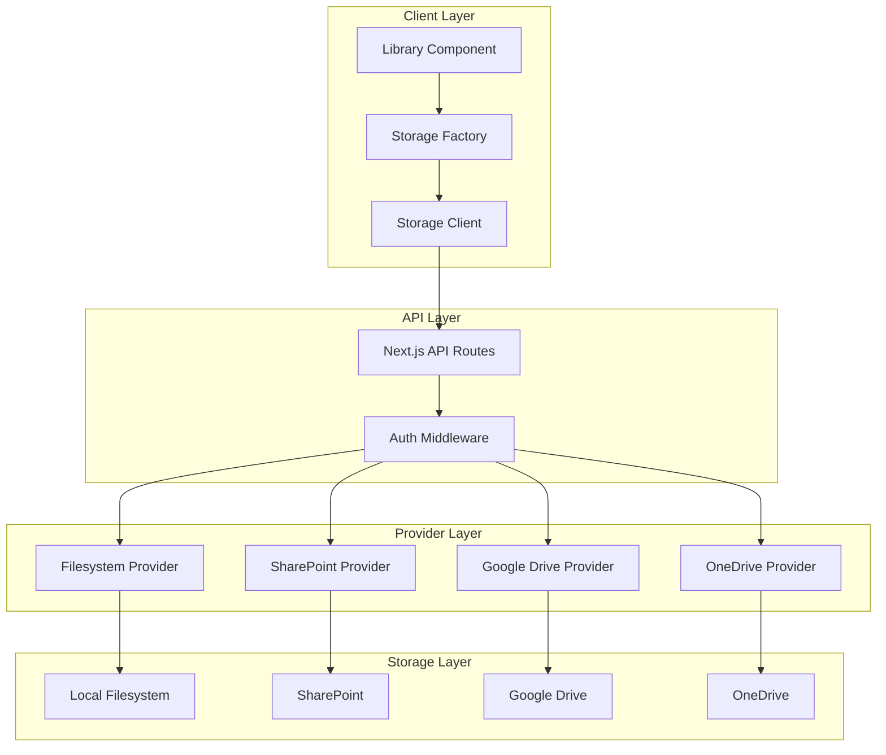
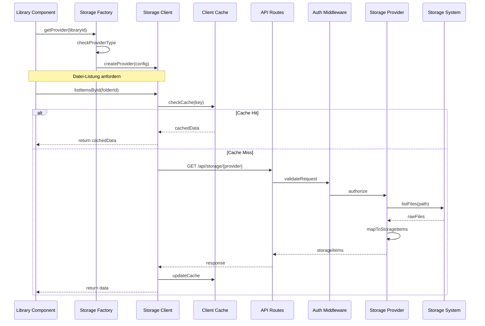
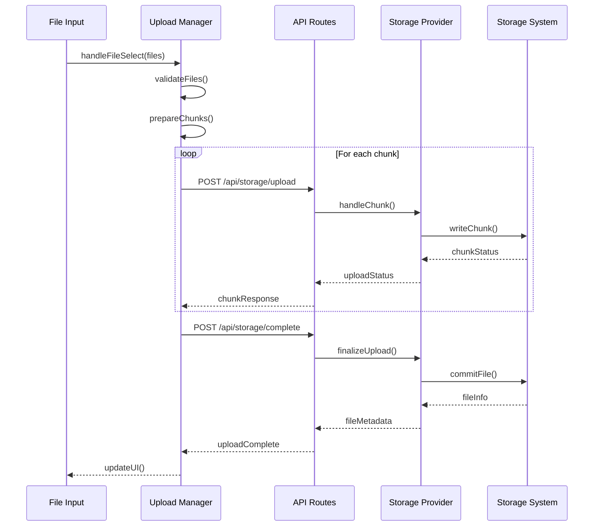
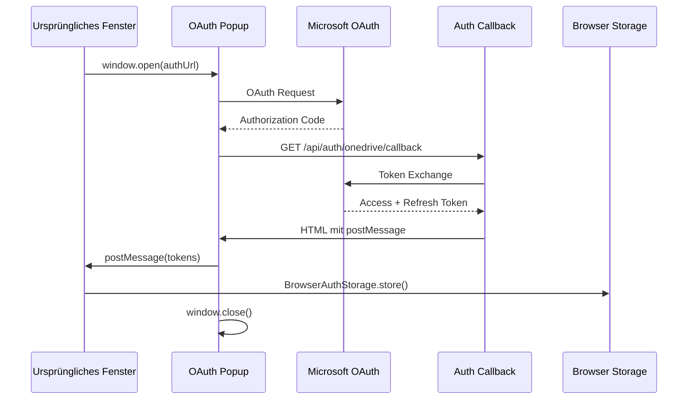
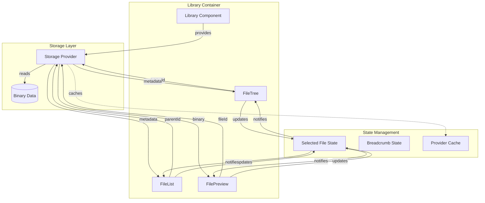

# Storage Provider System

Das Storage Provider System ist eine modulare Architektur zur Abstraktion verschiedener Dateispeicher-Backends. Es ermöglicht die einheitliche Handhabung von Dateien und Ordnern über verschiedene Speichersysteme hinweg.

## Core Features

- **Modulare Provider-Architektur**:
  - Einheitliches Interface für alle Storage-Provider
  - Erweiterbare Provider-Implementierungen
  - Plug-and-Play Integration neuer Provider
  - Automatische Provider-Erkennung

- **Intelligentes Caching**:
  - Mehrstufiges Caching-System
  - Client-seitiger Cache für Ordnerinhalte
  - Server-seitiger Cache für Binärdaten
  - Cache-Invalidierung bei Änderungen
  - Optimierte Pfadauflösung

- **Robuste Fehlerbehandlung**:
  - Typisierte Fehlerobjekte
  - Automatische Retry-Mechanismen
  - Graceful Degradation
  - Detaillierte Fehlerprotokolle
  - Benutzerfreundliche Fehlermeldungen

- **Performance-Optimierungen**:
  - Lazy Loading von Ordnerinhalten
  - Streaming von großen Dateien
  - Chunk-basierter Upload
  - Parallele Dateioperationen
  - Request-Batching

## Architektur-Übersicht

Das Storage Provider System ist in mehrere Schichten unterteilt, die jeweils spezifische Aufgaben übernehmen:

### System-Architektur



## Datenfluss und Interaktionen

### Datei-Operationen

Der Datenfluss für Dateioperationen folgt einem einheitlichen Muster:



### Datei-Upload Prozess



## Provider-Integration

### Implementierungsebenen

1. **UI-Ebene** (`/src/components/library/`)
   - **Komponenten**:
     - Library (Hauptcontainer)
     - FileTree (Ordnerstruktur)
     - FileList (Dateiliste)
     - FilePreview (Dateivorschau)
   - **Verantwortlichkeiten**:
     - Benutzerinteraktion
     - State Management
     - Event Handling
     - Provider-Auswahl

2. **Factory-Ebene** (`/src/lib/storage/storage-factory.ts`)
   - **Funktionen**:
     - Provider-Instanziierung
     - Konfigurationsmanagement
     - Provider-Typ-Erkennung
     - Instanz-Caching
   - **Features**:
     - Singleton-Pattern
     - Lazy Initialization
     - Configuration Validation
     - Error Handling

3. **Client-Ebene** (`/src/lib/storage/filesystem-client.ts`)
   - **Funktionen**:
     - HTTP-Kommunikation
     - Request/Response-Handling
     - Client-seitiges Caching
     - Fehlerbehandlung
   - **Features**:
     - Retry-Logik
     - Request Queuing
     - Batch Operations
     - Progress Tracking

4. **API-Ebene** (`/app/api/storage/[provider]/route.ts`)
   - **Endpunkte**:
     - GET /api/storage/[provider]
     - POST /api/storage/[provider]/upload
     - GET /api/storage/[provider]/download
     - DELETE /api/storage/[provider]
   - **Middleware**:
     - Authentication
     - Rate Limiting
     - Error Handling
     - Logging

5. **Provider-Ebene** (`/src/lib/storage/providers/`)
   - **Implementierungen**:
     - FileSystemProvider
     - SharePointProvider
     - GoogleDriveProvider
     - OneDriveProvider
   - **Funktionen**:
     - Backend-Integration
     - Datei-Operationen
     - Format-Mapping
     - Caching

### Integration neuer Provider

```typescript
// 1. Provider-Interface implementieren
interface StorageProvider {
  name: string;
  id: string;
  
  // Basis-Operationen
  listItemsById(folderId: string): Promise<StorageItem[]>;
  getItemById(itemId: string): Promise<StorageItem>;
  getBinary(fileId: string): Promise<BinaryResponse>;
  
  // Optionale Operationen
  createFolder?(parentId: string, name: string): Promise<StorageItem>;
  deleteItem?(itemId: string): Promise<void>;
  moveItem?(itemId: string, newParentId: string): Promise<StorageItem>;
  uploadFile?(parentId: string, file: File): Promise<StorageItem>;
}

// 2. Provider-Klasse implementieren
class NewStorageProvider extends BaseProvider implements StorageProvider {
  constructor(config: ProviderConfig) {
    super(config);
    this.validateConfig();
  }

  async listItemsById(folderId: string): Promise<StorageItem[]> {
    try {
      const items = await this.fetchItems(folderId);
      return this.mapToStorageItems(items);
    } catch (error) {
      this.handleError(error);
    }
  }
  
  // Weitere Interface-Methoden implementieren
}

// 3. Factory erweitern
class StorageFactory {
  private static instance: StorageFactory;
  private providers: Map<string, StorageProvider>;

  static getInstance(): StorageFactory {
    if (!StorageFactory.instance) {
      StorageFactory.instance = new StorageFactory();
    }
    return StorageFactory.instance;
  }

  async getProvider(libraryId: string): Promise<StorageProvider> {
    const library = this.findLibrary(libraryId);
    
    // Provider aus Cache oder neu erstellen
    if (this.providers.has(libraryId)) {
      return this.providers.get(libraryId)!;
    }
    
    const provider = await this.createProvider(library);
    this.providers.set(libraryId, provider);
    return provider;
  }

  private async createProvider(library: ClientLibrary): Promise<StorageProvider> {
    switch (library.type) {
      case 'local':
        return new FileSystemProvider(library.config);
      case 'sharepoint':
        return new SharePointProvider(library.config);
      case 'gdrive':
        return new GoogleDriveProvider(library.config);
      case 'newtype':
        return new NewStorageProvider(library.config);
      default:
        throw new Error(`Unknown provider type: ${library.type}`);
    }
  }
}

// 4. API Route implementieren
// /app/api/storage/[provider]/route.ts
export async function GET(
  req: Request,
  { params }: { params: { provider: string } }
) {
  try {
    // Request Parameter validieren
    const { searchParams } = new URL(req.url);
    const action = searchParams.get('action');
    const fileId = searchParams.get('fileId');

    // Provider instanziieren
    const provider = await getProviderInstance(params.provider);

    // Aktion ausführen
    switch (action) {
      case 'list':
        return await handleListItems(provider, fileId);
      case 'binary':
        return await handleBinaryDownload(provider, fileId);
      default:
        return new Response('Invalid action', { status: 400 });
    }
  } catch (error) {
    return handleApiError(error);
  }
}
```

### Provider-spezifische Implementierungen

#### Filesystem Provider
- **Features**:
  - Lokaler Dateizugriff
  - Pfad-Mapping
  - Berechtigungsprüfung
  - ID-Generierung
- **Besonderheiten**:
  - Direkte Dateisystem-Interaktion
  - Pfad-Normalisierung
  - Symlink-Handling
  - Datei-Watching

#### SharePoint Provider
- **Features**:
  - OAuth Authentication
  - Graph API Integration
  - Site/Library Mapping
  - Berechtigungsmodell
- **Besonderheiten**:
  - Token Management
  - Batch Operations
  - Delta Queries
  - Metadata Support

#### Google Drive Provider
- **Features**:
  - OAuth 2.0 Flow
  - API Quotas
  - File Picking
  - Sharing Settings
- **Besonderheiten**:
  - Refresh Token Handling
  - Rate Limiting
  - Revision History
  - Team Drive Support

#### OneDrive Provider
- **Features**:
  - Microsoft Authentication
  - Graph API
  - Delta Queries
  - Sharing Links
- **Besonderheiten**:
  - Personal/Business Account
  - Special Folders
  - WebDAV Support
  - Photo Management

## Authentifizierung und Token-Management

### Browser-only Authentifizierung

Das System implementiert eine **sichere, browser-basierte Authentifizierung** für OAuth-Provider (OneDrive, Google Drive) und WebDAV-Systeme. Die Authentifizierungsdaten werden **ausschließlich im Browser** gespeichert und nie serverseitig persistiert.

#### Authentifizierungsmodi

```typescript
type AuthMode = 'memory' | 'session-storage' | 'local-storage';

interface AuthModeConfig {
  memory: {
    description: 'Nur im Arbeitsspeicher',
    security: 'Höchste Sicherheit',
    persistence: 'Tab schließen = Abmelden'
  };
  'session-storage': {
    description: 'Browser-Session',
    security: 'Empfohlen',
    persistence: 'Browser schließen = Abmelden'
  };
  'local-storage': {
    description: 'Browser-Cache',
    security: 'Weniger sicher',
    persistence: 'Bleibt bis manuell gelöscht'
  };
}
```

#### Einheitlicher OAuth-Flow



#### Implementierung

**1. OAuth-URL-Generierung:**
```typescript
// AuthDialog.tsx
const handleOAuthAuth = async () => {
  // OneDriveProvider für korrekte OAuth-URL verwenden
  const provider = new OneDriveProvider(library);
  const authUrl = await provider.getAuthUrl();
  
  // State mit Library-ID und Auth-Modus
  const stateObj = { 
    libraryId: library.id,
    redirect: window.location.href, // Ursprünglicher Tab
    authMode: authMode
  };
  
  const urlWithState = new URL(authUrl);
  urlWithState.searchParams.set('state', JSON.stringify(stateObj));
  
  // Popup öffnen
  const authWindow = window.open(urlWithState.toString(), 'oauth_popup');
};
```

**2. Callback-Verarbeitung:**
```typescript
// /api/auth/onedrive/callback/route.ts
export async function GET(request: NextRequest) {
  const { code, state } = extractParams(request);
  const { libraryId, redirectUrl, authMode } = JSON.parse(state);
  
  // OneDriveServerProvider für Token-Exchange
  const provider = new OneDriveServerProvider(library, userEmail);
  const authResult = await provider.authenticate(code);
  
  if (authResult) {
    // Tokens direkt an ursprüngliches Fenster senden
    const html = `
      <script>
        if (window.opener) {
          window.opener.postMessage({
            type: 'OAUTH_SUCCESS',
            libraryId: '${libraryId}',
            redirectUrl: '${redirectUrl}',
            tokens: {
              accessToken: '${authResult.accessToken}',
              refreshToken: '${authResult.refreshToken}',
              expiresIn: ${authResult.expiresIn}
            }
          }, '*');
        }
        setTimeout(() => window.close(), 1000);
      </script>
    `;
    
    return new NextResponse(html, { headers: { 'Content-Type': 'text/html' } });
  }
}
```

**3. Token-Speicherung im Browser:**
```typescript
// AuthDialog.tsx - Message-Handler
const handleMessage = async (event: MessageEvent) => {
  if (event.data?.type === 'OAUTH_SUCCESS') {
    const { tokens, libraryId } = event.data;
    
    // Tokens im gewählten Browser-Modus speichern
    const tokensKey = `${library.type}_${libraryId}_tokens`;
    const tokenData = {
      accessToken: tokens.accessToken,
      refreshToken: tokens.refreshToken,
      expiresAt: (Math.floor(Date.now() / 1000) + tokens.expiresIn) * 1000,
      timestamp: Date.now()
    };
    
    BrowserAuthStorage.store(tokensKey, tokenData, authMode);
  }
};
```

#### BrowserAuthStorage Utility

```typescript
// /src/lib/auth/browser-auth-storage.ts
export class BrowserAuthStorage {
  static store(key: string, data: any, mode: AuthMode): void {
    switch (mode) {
      case 'memory':
        // In-Memory Storage (nur für aktuelle Session)
        this.memoryStorage.set(key, data);
        break;
      case 'session-storage':
        sessionStorage.setItem(key, JSON.stringify(data));
        break;
      case 'local-storage':
        localStorage.setItem(key, JSON.stringify(data));
        break;
    }
  }
  
  static load(key: string): { data: any | null; isValid: boolean } {
    // Prüfe alle Storage-Typen
    const memoryData = this.memoryStorage.get(key);
    if (memoryData) {
      return { data: memoryData, isValid: this.isValid(memoryData) };
    }
    
    const sessionData = sessionStorage.getItem(key);
    if (sessionData) {
      const data = JSON.parse(sessionData);
      return { data, isValid: this.isValid(data) };
    }
    
    const localData = localStorage.getItem(key);
    if (localData) {
      const data = JSON.parse(localData);
      return { data, isValid: this.isValid(data) };
    }
    
    return { data: null, isValid: false };
  }
  
  private static isValid(data: any): boolean {
    if (!data || !data.expiresAt) return false;
    return Date.now() < data.expiresAt;
  }
}
```

#### WebDAV-Authentifizierung

```typescript
// AuthDialog.tsx - WebDAV-Handler
const handleWebDAVAuth = async () => {
  // WebDAV-Verbindung testen
  const response = await fetch('/api/storage/webdav-direct', {
    method: 'POST',
    headers: { 'Content-Type': 'application/json' },
    body: JSON.stringify({
      url: authData.url,
      username: authData.username,
      password: authData.password
    })
  });
  
  if (response.ok) {
    // Credentials im gewählten Browser-Modus speichern
    const credentialsKey = `webdav_${library.id}_credentials`;
    const credentials = {
      url: authData.url,
      username: authData.username,
      password: authData.password,
      timestamp: Date.now()
    };
    
    BrowserAuthStorage.store(credentialsKey, credentials, authMode);
  }
};
```

#### Automatische Authentifizierung

```typescript
// use-storage-auth.ts
export const useStorageAuth = () => {
  const checkAuthentication = async (library: ClientLibrary): Promise<boolean> => {
    if (library.type === 'onedrive' || library.type === 'gdrive') {
      const tokensKey = `${library.type}_${library.id}_tokens`;
      const { isValid } = BrowserAuthStorage.load(tokensKey);
      return isValid;
    }
    
    if (library.type === 'webdav') {
      const credentialsKey = `webdav_${library.id}_credentials`;
      const { isValid } = BrowserAuthStorage.load(credentialsKey);
      return isValid;
    }
    
    return true; // Local storage benötigt keine Auth
  };
  
  const ensureAuthenticated = async (library: ClientLibrary): Promise<void> => {
    const isAuth = await checkAuthentication(library);
    if (!isAuth) {
      showAuthDialog(library);
    }
  };
  
  return { checkAuthentication, ensureAuthenticated };
};
```

### Vorteile der Browser-only Authentifizierung

1. **Sicherheit**: 
   - Keine serverseitige Speicherung sensibler Daten
   - Benutzer hat volle Kontrolle über Persistenz
   - Tokens berühren nie die Datenbank

2. **Flexibilität**:
   - Drei Persistenz-Modi zur Auswahl
   - Einheitliche Logik für alle Provider
   - Einfache Integration neuer Provider

3. **Benutzerfreundlichkeit**:
   - Automatische Authentifizierung bei Bedarf
   - Klare Sicherheitsoptionen
   - Transparente Token-Verwaltung

4. **Skalierbarkeit**:
   - Keine Datenbank-Abhängigkeit für Auth
   - Einfache Erweiterung um neue Provider
   - Konsistente API für alle Storage-Typen

#### Authentifizierungs-Logging

Das System implementiert umfassendes Logging für alle Authentifizierungsvorgänge:

```typescript
// Server-seitiges Auth-Logging
ServerLogger.auth('OneDriveServerProvider', 'Starte Authentifizierung', {
  libraryId: this.library.id,
  userEmail: this.userEmail,
  hasCode: !!code,
  codeLength: code?.length || 0,
  timestamp: new Date().toISOString()
});

// Client-seitiges Auth-Logging
SettingsLogger.info('AuthDialog', 'OAuth erfolgreich - Tokens direkt erhalten', {
  libraryId: event.data.libraryId,
  hasTokens: !!event.data.tokens
});
```

**Logging-Bereiche:**
- **Auth-Start**: Beginn der Authentifizierung
- **Config-Validation**: Überprüfung der Konfigurationsparameter
- **Token-Exchange**: Kommunikation mit OAuth-Providern
- **Token-Storage**: Speicherung im Browser
- **Auth-Success/Failure**: Erfolg oder Fehler der Authentifizierung

**Debugging-Tools:**
```typescript
// Browser-Entwicklertools
// localStorage/sessionStorage prüfen
localStorage.getItem('onedrive_libraryId_tokens');

// Network-Tab für OAuth-Flows
// Console für Client-Logs
// Server-Logs für Backend-Debugging
```

## Error Handling

### Fehlertypen

```typescript
// Basis-Fehlerklasse
class StorageError extends Error {
  constructor(
    message: string,
    public code: string,
    public statusCode: number,
    public details?: any
  ) {
    super(message);
    this.name = 'StorageError';
  }
}

// Spezifische Fehlertypen
class AuthenticationError extends StorageError {
  constructor(message: string, details?: any) {
    super(message, 'AUTH_ERROR', 401, details);
  }
}

class PermissionError extends StorageError {
  constructor(message: string, details?: any) {
    super(message, 'PERMISSION_ERROR', 403, details);
  }
}

class NotFoundError extends StorageError {
  constructor(message: string, details?: any) {
    super(message, 'NOT_FOUND', 404, details);
  }
}
```

### Fehlerbehandlung

```typescript
// Provider-Ebene
class BaseProvider {
  protected handleError(error: any): never {
    if (error instanceof StorageError) {
      throw error;
    }

    // Provider-spezifische Fehler mappen
    if (error.code === 'ItemNotFound') {
      throw new NotFoundError('Item not found', error);
    }

    throw new StorageError(
      'Unknown error occurred',
      'UNKNOWN_ERROR',
      500,
      error
    );
  }
}

// API-Ebene
function handleApiError(error: any): Response {
  if (error instanceof StorageError) {
    return new Response(
      JSON.stringify({
        error: error.code,
        message: error.message,
        details: error.details
      }),
      { status: error.statusCode }
    );
  }

  return new Response(
    JSON.stringify({
      error: 'INTERNAL_ERROR',
      message: 'An internal error occurred'
    }),
    { status: 500 }
  );
}
```

## Caching-Strategien

### Client-Cache

```typescript
class ClientCache {
  private cache: Map<string, CacheEntry>;
  private maxAge: number;

  constructor(maxAge = 5 * 60 * 1000) { // 5 Minuten
    this.cache = new Map();
    this.maxAge = maxAge;
  }

  get(key: string): any | null {
    const entry = this.cache.get(key);
    if (!entry) return null;

    if (Date.now() - entry.timestamp > this.maxAge) {
      this.cache.delete(key);
      return null;
    }

    return entry.data;
  }

  set(key: string, data: any): void {
    this.cache.set(key, {
      data,
      timestamp: Date.now()
    });
  }

  invalidate(pattern: RegExp): void {
    for (const key of this.cache.keys()) {
      if (pattern.test(key)) {
        this.cache.delete(key);
      }
    }
  }
}
```

### Server-Cache

```typescript
class ProviderCache {
  private static instance: ProviderCache;
  private cache: NodeCache;

  private constructor() {
    this.cache = new NodeCache({
      stdTTL: 300, // 5 Minuten
      checkperiod: 60
    });
  }

  static getInstance(): ProviderCache {
    if (!ProviderCache.instance) {
      ProviderCache.instance = new ProviderCache();
    }
    return ProviderCache.instance;
  }

  async getOrSet<T>(
    key: string,
    getter: () => Promise<T>
  ): Promise<T> {
    const cached = this.cache.get<T>(key);
    if (cached) return cached;

    const fresh = await getter();
    this.cache.set(key, fresh);
    return fresh;
  }
}
```

## Library Integration und Datenfluss

### Komponenten-Interaktion

Die Library-Komponenten kommunizieren über ein fileId-basiertes System, das effiziente Datenabrufe und -austausch ermöglicht:



### Datenfluss-Prinzipien

1. **FileId-Zentrierte Kommunikation**:
   - Alle Komponenten verwenden fileId als primären Identifikator
   - Metadaten werden über fileId abgerufen und gecached
   - Binärdaten werden nur bei Bedarf geladen
   - Effiziente Zustandsverwaltung durch eindeutige IDs

2. **Lazy Loading Strategie**:
   ```typescript
   // Beispiel für FilePreview-Komponente
   const FilePreview: React.FC<FilePreviewProps> = ({ 
     fileId,
     provider 
   }) => {
     const [content, setContent] = useState<string | null>(null);
     const [metadata, setMetadata] = useState<StorageItem | null>(null);
     
     // Lade nur Metadaten initial
     useEffect(() => {
       const loadMetadata = async () => {
         const item = await provider.getItemById(fileId);
         setMetadata(item);
       };
       loadMetadata();
     }, [fileId]);
     
     // Lade Binärdaten nur wenn nötig
     const loadContent = async () => {
       if (!content) {
         const { blob } = await provider.getBinary(fileId);
         const text = await blob.text();
         setContent(text);
       }
     };
     
     return (
       <div>
         {metadata && <MetadataDisplay item={metadata} />}
         {needsContent && (
           <ContentLoader 
             onLoad={loadContent}
             content={content}
           />
         )}
       </div>
     );
   };
   ```

3. **Metadaten-Caching**:
   ```typescript
   // Beispiel für Cache-Manager
   class MetadataCache {
     private static instance: MetadataCache;
     private cache = new Map<string, StorageItem>();
     
     static getInstance() {
       if (!this.instance) {
         this.instance = new MetadataCache();
       }
       return this.instance;
     }
     
     async getItem(
       fileId: string, 
       provider: StorageProvider
     ): Promise<StorageItem> {
       if (this.cache.has(fileId)) {
         return this.cache.get(fileId)!;
       }
       
       const item = await provider.getItemById(fileId);
       this.cache.set(fileId, item);
       return item;
     }
   }
   ```

### Komponenten-Spezifische Datenzugriffe

#### FileTree
```typescript
// Ordnerstruktur laden
const loadFolder = async (folderId: string) => {
  // Lade nur Metadaten der Ordnerinhalte
  const items = await provider.listItemsById(folderId);
  
  // Filtere und cache Ordner
  const folders = items.filter(item => item.type === 'folder');
  folders.forEach(folder => {
    MetadataCache.getInstance().setItem(folder.id, folder);
  });
  
  return folders;
};
```

#### FileList
```typescript
// Dateiliste eines Ordners laden
const loadFiles = async (parentId: string) => {
  // Lade Metadaten aller Items
  const items = await provider.listItemsById(parentId);
  
  // Filtere Dateien und cache Metadaten
  const files = items.filter(item => item.type === 'file');
  files.forEach(file => {
    MetadataCache.getInstance().setItem(file.id, file);
  });
  
  return files;
};
```

#### FilePreview
```typescript
// Dateiinhalt laden
const loadFileContent = async (fileId: string) => {
  // Prüfe ob Metadaten im Cache
  const metadata = await MetadataCache.getInstance()
    .getItem(fileId, provider);
    
  // Lade Binärdaten nur für Preview
  if (needsPreview(metadata.mimeType)) {
    const { blob } = await provider.getBinary(fileId);
    return processContent(blob, metadata);
  }
  
  return null;
};
```

### Zustandsmanagement

Die Library verwendet ein zentrales Zustandsmanagement für ausgewählte Dateien:

```typescript
// Selected File Hook
const useSelectedFile = () => {
  const [selected, setSelected] = useState<{
    item: StorageItem | null;
    breadcrumb: {
      items: StorageItem[];
      currentId: string;
    };
  }>({
    item: null,
    breadcrumb: {
      items: [],
      currentId: 'root'
    }
  });

  const selectFile = async (
    fileId: string,
    provider: StorageProvider
  ) => {
    // Lade Metadaten aus Cache oder Provider
    const item = await MetadataCache.getInstance()
      .getItem(fileId, provider);
      
    // Aktualisiere Breadcrumb-Pfad
    const path = await resolvePath(item.parentId, provider);
    
    setSelected({
      item,
      breadcrumb: {
        items: path,
        currentId: item.parentId
      }
    });
  };

  return {
    selected,
    selectFile
  };
};
```

### Performance-Optimierungen

1. **Metadaten-Prefetching**:
   - Lade Metadaten für sichtbare Items
   - Prefetch für wahrscheinlich benötigte Items
   - Aggressive Caching von Ordnerstrukturen

2. **Binärdaten-Management**:
   - Lazy Loading nur bei Bedarf
   - Streaming für große Dateien
   - Cleanup nicht benötigter Binärdaten
   - Progressive Loading für Medien

3. **Cache-Invalidierung**:
   ```typescript
   class CacheManager {
     // Invalidiere Cache basierend auf Änderungen
     invalidateRelated(fileId: string) {
       // Invalidiere Item selbst
       this.metadata.delete(fileId);
       
       // Invalidiere Parent Folder
       const parent = this.getParentId(fileId);
       if (parent) {
         this.folderContents.delete(parent);
       }
       
       // Invalidiere verwandte Items
       this.invalidatePattern(new RegExp(`^${fileId}`));
     }
   }
   ```

### Fehlerbehandlung

```typescript
// Fehlerbehandlung in Komponenten
const handleStorageError = (error: StorageError) => {
  switch (error.code) {
    case 'NOT_FOUND':
      // Zeige "Datei nicht gefunden" UI
      break;
    case 'PERMISSION_ERROR':
      // Zeige Berechtigungsfehler
      break;
    case 'NETWORK_ERROR':
      // Zeige Offline-Status
      break;
    default:
      // Allgemeiner Fehler
  }
};

// Komponenten-Wrapper
const withErrorBoundary = (WrappedComponent: React.ComponentType) => {
  return class extends React.Component {
    componentDidCatch(error: Error) {
      if (error instanceof StorageError) {
        handleStorageError(error);
      }
    }
    
    render() {
      return <WrappedComponent {...this.props} />;
    }
  };
};
``` 