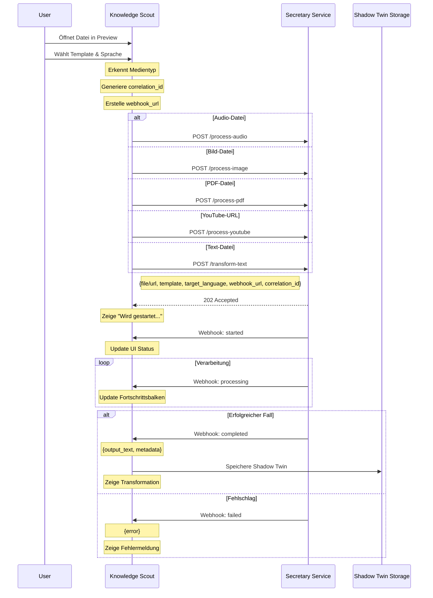

# Transformation Service Integration

## Übersicht
Die Knowledge Scout Anwendung wird um umfangreiche Transformationsfunktionen erweitert. Diese ermöglichen es, verschiedene Medientypen (Audio, Bild, PDF, YouTube, Text) zu transkribieren und basierend auf Templates weiterzuverarbeiten. Der Prozess läuft asynchron über einen Secretary Service mit Webhook-basierter Statusverfolgung.

## Unterstützte Transformationen

### 1. Audio-Transformation
- **API-Endpoint**: `/process-audio`
- **Unterstützte Formate**: MP3, WAV, M4A
- **Features**: 
  - Transkription
  - Template-basierte Zusammenfassung
  - Mehrsprachige Ausgabe

### 2. Bild-Transformation
- **API-Endpoint**: `/process-image`
- **Unterstützte Formate**: JPG, PNG, WEBP
- **Features**:
  - Texterkennung (OCR)
  - Template-basierte Strukturierung
  - Mehrsprachige Ausgabe

### 3. PDF-Transformation
- **API-Endpoint**: `/process-pdf`
- **Features**:
  - Texterkennung
  - Template-basierte Zusammenfassung
  - Mehrsprachige Ausgabe

### 4. YouTube-Transformation
- **API-Endpoint**: `/process-youtube`
- **Features**:
  - Video-Transkription
  - Template-basierte Zusammenfassung
  - Mehrsprachige Ausgabe

### 5. Text-Transformation
- **API-Endpoint**: `/transform-text`
- **Features**:
  - Template-basierte Verarbeitung
  - Mehrsprachige Ausgabe

## Event- und Datenfluss



## Architektur

### Komponenten
1. **Frontend (Knowledge Scout)**
   - Transkriptions-Button in der Datei-Preview
   - Status-Anzeige während der Verarbeitung
   - Shadow-Twin Speicherung der Transkription

2. **Backend (Secretary Service)**
   - Audio-Verarbeitungs-API
   - Asynchrone Verarbeitung
   - Webhook-basierte Status-Updates

### Prozessablauf
1. Benutzer klickt "Transkribieren" Button
2. Frontend sendet Audio-Datei + Webhook-URL an Service
3. Service startet Verarbeitung und sendet Status-Updates
4. Nach Fertigstellung wird Transkription als Shadow-Twin gespeichert

## Technische Implementierung

### API Schnittstelle
```typescript
// Gemeinsames Base Interface
interface BaseTransformRequest {
  target_language: string;
  template: string;
  webhook_url: string;
  correlation_id: string;
}

// Audio Transformation
interface ProcessAudioRequest extends BaseTransformRequest {
  file: File;  // Audio file
}

// Image Transformation
interface ProcessImageRequest extends BaseTransformRequest {
  file: File;  // Image file
}

// PDF Transformation
interface ProcessPDFRequest extends BaseTransformRequest {
  file: File;  // PDF file
}

// YouTube Transformation
interface ProcessYouTubeRequest extends BaseTransformRequest {
  url: string;  // YouTube URL
}

// Text Transformation
interface TransformTextRequest extends BaseTransformRequest {
  text: string;  // Raw text
}

// Gemeinsames Response Interface
interface WebhookPayload {
  status: 'started' | 'processing' | 'completed' | 'failed';
  correlation_id: string;
  progress?: number;
  result?: {
    output_text: string;
    detected_language?: string;
    duration?: number;
    process_id: string;
    metadata?: {
      source_type: 'audio' | 'image' | 'pdf' | 'youtube' | 'text';
      template_used: string;
      processing_steps?: string[];
    };
  };
  error?: string;
  timestamp: string;
}
```

### Frontend Integration
```typescript
// Transkriptions-Handler
const handleTransformation = async (
  file: File | string,
  type: 'audio' | 'image' | 'pdf' | 'youtube' | 'text',
  options: TransformationOptions
) => {
  const correlationId = generateUUID();
  const webhookUrl = `${WEBHOOK_BASE_URL}/transformation-status/${correlationId}`;
  
  const basePayload = {
    target_language: options.targetLanguage,
    template: options.template,
    webhook_url: webhookUrl,
    correlation_id: correlationId
  };
  
  try {
    let endpoint: string;
    let payload: any;
    
    switch (type) {
      case 'audio':
        endpoint = '/process-audio';
        payload = { ...basePayload, file };
        break;
      case 'image':
        endpoint = '/process-image';
        payload = { ...basePayload, file };
        break;
      case 'pdf':
        endpoint = '/process-pdf';
        payload = { ...basePayload, file };
        break;
      case 'youtube':
        endpoint = '/process-youtube';
        payload = { ...basePayload, url: file };
        break;
      case 'text':
        endpoint = '/transform-text';
        payload = { ...basePayload, text: file };
        break;
    }
    
    const formData = new FormData();
    Object.entries(payload).forEach(([key, value]) => {
      formData.append(key, value as string | Blob);
    });
    
    await fetch(`${API_BASE_URL}${endpoint}`, {
      method: 'POST',
      body: formData
    });
    
    setProcessingStatus('started');
    
  } catch (error) {
    console.error('Fehler beim Starten der Transformation:', error);
    setProcessingStatus('failed');
  }
};

// Webhook-Endpoint im Frontend
app.post('/transformation-status/:correlationId', async (req, res) => {
  const { status, result, error } = req.body as WebhookPayload;
  
  switch (status) {
    case 'completed':
      if (result) {
        await saveShadowTwin(
          getOriginalFileName(req.params.correlationId),
          result.output_text
        );
        updateUIStatus('success');
      }
      break;
      
    case 'failed':
      updateUIStatus('error', error);
      break;
      
    default:
      updateUIStatus(status);
  }
  
  res.sendStatus(200);
});
```

### Shadow-Twin Speicherung
```typescript
const saveShadowTwin = async (originalFileName: string, content: string) => {
  const shadowTwinPath = generateShadowTwinPath(originalFileName);
  
  try {
    await writeFile(shadowTwinPath, content);
    refreshFileView();
  } catch (error) {
    console.error('Fehler beim Speichern des Shadow-Twins:', error);
    throw error;
  }
};
```

## UI/UX Konzept

### Gemeinsame UI-Elemente
```typescript
interface TransformationOptions {
  template: string;
  targetLanguage: string;
}

interface TemplateOption {
  id: string;
  name: string;
  description: string;
  supportedTypes: ('audio' | 'image' | 'pdf' | 'youtube' | 'text')[];
}

const TransformationControls: React.FC<{
  fileType: string;
  onTransform: (options: TransformationOptions) => void;
}> = ({ fileType, onTransform }) => {
  const [template, setTemplate] = useState<string>('');
  const [targetLanguage, setTargetLanguage] = useState(getUserLanguage());
  
  return (
    <div className="transform-controls">
      <Select
        label="Template auswählen"
        value={template}
        onChange={setTemplate}
      >
        {templates
          .filter(t => t.supportedTypes.includes(fileType))
          .map(t => (
            <Option key={t.id} value={t.id}>
              {t.name} - {t.description}
            </Option>
          ))}
      </Select>
      
      <Select
        label="Zielsprache"
        value={targetLanguage}
        onChange={setTargetLanguage}
      >
        <Option value="de">Deutsch</Option>
        <Option value="en">Englisch</Option>
        {/* Weitere Sprachen */}
      </Select>
      
      <Button 
        onClick={() => onTransform({ template, targetLanguage })}
        disabled={!template}
      >
        Transformieren
      </Button>
    </div>
  );
};
```

### Status-Anzeigen
- **Warten auf Start**: Spinner mit "Transformation wird gestartet..."
- **Verarbeitung**: Fortschrittsbalken mit Prozentangabe
- **Abgeschlossen**: Erfolgsmeldung, automatischer Wechsel zur Transformation
- **Fehler**: Fehlermeldung mit Retry-Option

### Benutzerinteraktion
1. Benutzer öffnet Datei in der Preview
2. Wechselt zum "Transformation" Tab
3. Klickt auf "Transformieren" Button
4. Wählt Template und Zielsprache
5. Sieht Fortschritt in Echtzeit
5. Nach Abschluss wird Transformation automatisch angezeigt

## Fehlerbehandlung

### Client-seitig
- Netzwerkfehler beim Upload
- Timeout bei Webhook-Empfang
- Fehler beim Speichern des Shadow-Twins

### Server-seitig
- Ungültige Dateitypen
- Verarbeitungsfehler
- Webhook-Zustellungsfehler

## Sicherheitsaspekte
- Webhook-URLs mit zeitlich begrenzten Tokens
- Validierung der Correlation-IDs
- Überprüfung der Dateitypen
- Maximale Dateigrößenbeschränkung

## Monitoring & Logging
- Tracking aller Transformationen
- Webhook-Zustellungsstatistiken
- Fehlerrate und -kategorien
- Verarbeitungszeiten

## Erweiterungsmöglichkeiten
1. Unterstützung weiterer Sprachen
2. Batch-Verarbeitung mehrerer Dateien
3. Transformation-Qualitätsmetriken
4. Automatische Fehlerkorrektur 