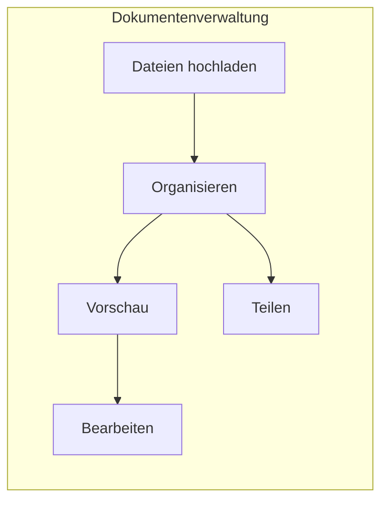
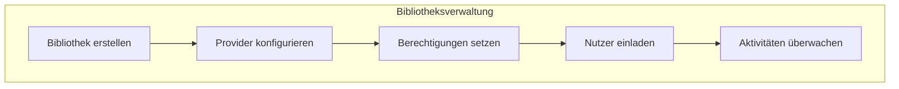
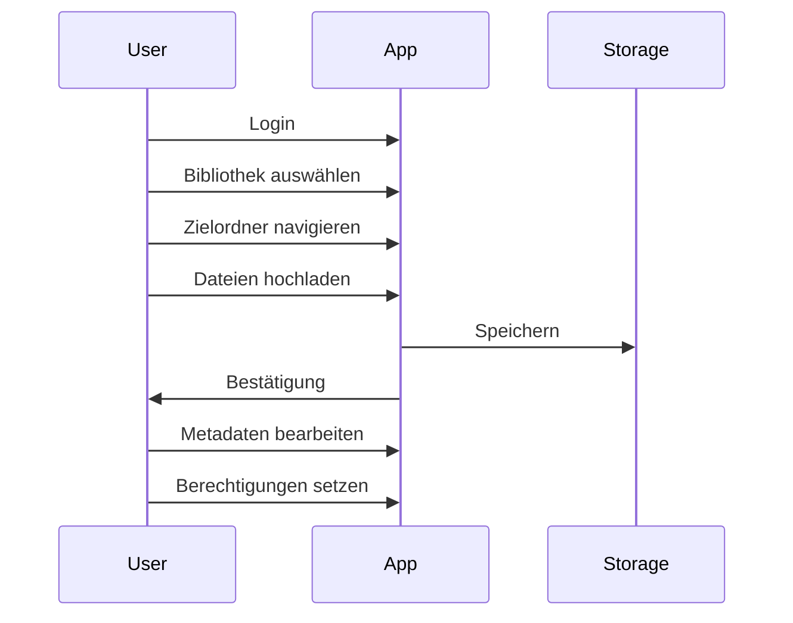
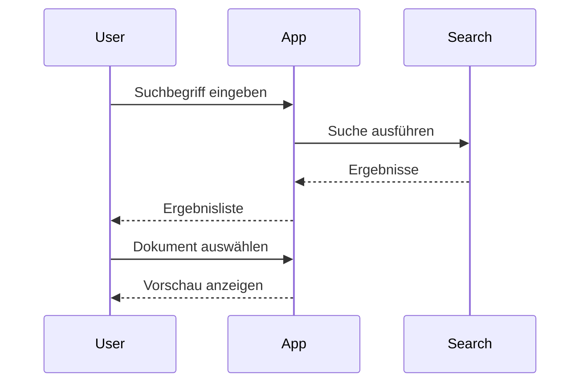
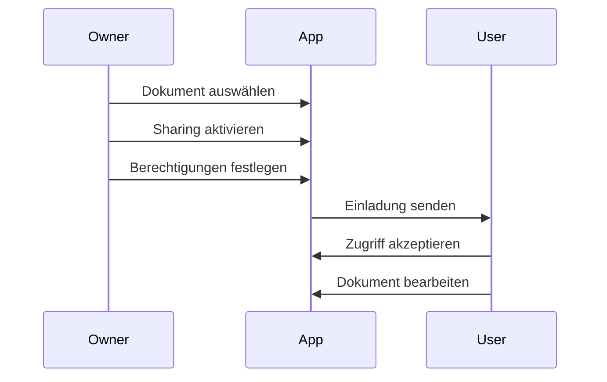
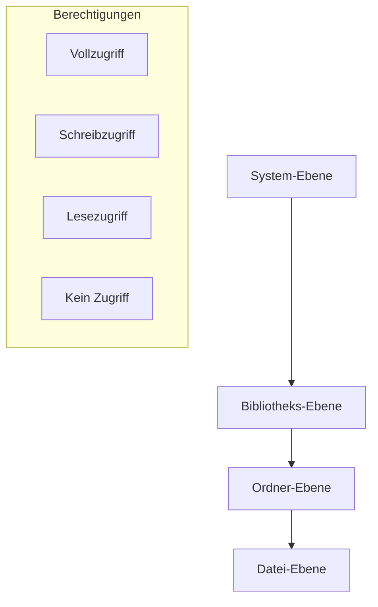

# Funktionen und Benutzergruppen

## Hauptfunktionen

### Dokumenten-Management

#### Datei-Operationen
- Hochladen von Dokumenten und Medien
- Erstellen von Ordnerstrukturen
- Verschieben und Umbenennen
- Löschen von Dateien und Ordnern
- Vorschau verschiedener Dateitypen
- Datei-Sharing und Berechtigungsverwaltung

#### Organisationsfunktionen
- Hierarchische Ordnerstruktur
- Datei-Kategorisierung
- Metadaten-Verwaltung
- Suchfunktion über Inhalte und Namen
- Sortierung und Filterung

### Bibliotheks-Management

- Verwaltung mehrerer Bibliotheken
- Integration verschiedener Storage-Provider
- Konfiguration von Zugriffsrechten
- Benutzer- und Gruppenverwaltung
- Aktivitätsprotokollierung

## Typische Workflows

### 1. Dokumenten-Upload und Organisation

### 2. Dokumenten-Suche und Zugriff

### 3. Kollaboration und Sharing

## Benutzergruppen und Rollen

### Administrator
- Vollzugriff auf alle Funktionen
- Bibliotheken erstellen und konfigurieren
- Benutzer und Gruppen verwalten
- System-Einstellungen anpassen
- Zugriffsprotokolle einsehen

### Bibliotheks-Manager
- Bibliothek-spezifische Verwaltung
- Ordnerstrukturen erstellen
- Berechtigungen verwalten
- Benutzer einladen
- Aktivitäten überwachen

### Standard-Benutzer
- Dokumente hochladen und verwalten
- Ordner erstellen und organisieren
- Eigene Dateien teilen
- Suchen und Zugreifen
- Metadaten bearbeiten

### Gast-Benutzer
- Lesezugriff auf freigegebene Inhalte
- Dokumenten-Vorschau
- Basis-Suchfunktion
- Keine Bearbeitungsrechte

## Berechtigungskonzept

### Zugriffsebenen

### Berechtigungstypen
- **Vollzugriff**: Alle Operationen erlaubt
- **Schreibzugriff**: Lesen, Hochladen, Bearbeiten
- **Lesezugriff**: Nur Ansicht und Download
- **Kein Zugriff**: Keine Operationen erlaubt

### Vererbung
- Berechtigungen werden hierarchisch vererbt
- Überschreibungen auf jeder Ebene möglich
- Explizite Berechtigungen haben Vorrang
- Automatische Propagierung von Änderungen 