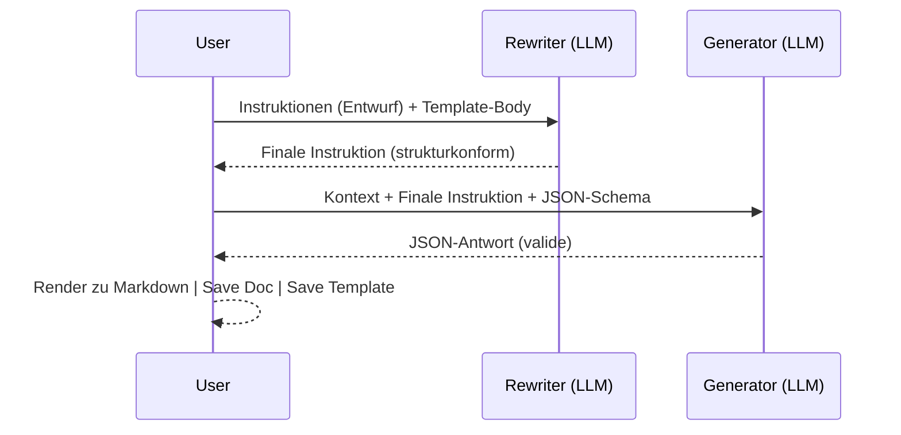
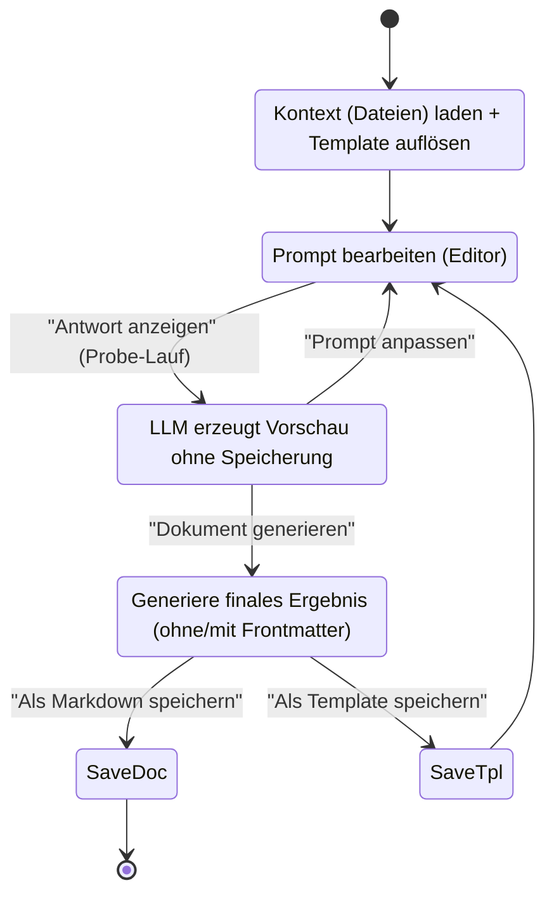

# Kombinierter Chat‑Dialog aus Template und ausgewählten Markdown‑Dateien

Ziel: Nutzer wählen mehrere `.md`‑Dateien (Shadow‑Twins/Textquellen) und starten statt der „Kombinierten Transformation“ einen interaktiven Chat‑Dialog. Das Chat‑Modul wird mit (a) kombiniertem Kontext der ausgewählten Dateien, (b) dem gewählten Template als System/Instruktions‑Prompt und (c) voreingestelltem Zielspeicher‑Namen initialisiert. Ergebnis kann später als Datei gespeichert werden.

## Ist‑Zustand (vereinfacht)

- Mehrfachauswahl → Button „Transformieren“ öffnet Dialog „Mehrere Dateien zu einem Dokument transformieren“.
- Dialog‑Elemente:
  - Template auswählen (Standard + /templates‑Dateien)
  - Zielsprache wählen
  - Dateiname für kombinierte Datei (wird mit `.md` gespeichert)
  - Primär‑Aktion: „Kombinierte Transformation starten (N Dateien)“
- Verarbeitung: Texte werden kombiniert → Secretary‑Template → Ergebnis speichern.

## Soll‑Erweiterung: Kombinierter Chat‑Dialog

- Neuer sekundärer Button im selben Dialog: „Kombinierten Dialog starten“.
- Verhalten:
  1) Lade Inhalte aller ausgewählten Markdown‑Dateien (als Klartext). Optional: maximaler Zeichensatz pro Datei; technisch konfigurierbar.
  2) Template auflösen:
     - Standard‑Templates: Name → bekannter System‑Prompt + Instruktions‑Body.
     - Benutzerdefiniertes Template (`/templates/<name>.md`): Frontmatter (optional) + Markdown‑Body. System‑Prompt aus Template‑Feld `systemPrompt`; Instruktions‑Body = Markdown‑Body (als Leitfragen/Struktur).
  3) Initialisiere Chat mit:
     - System: `systemPrompt` (Fallback: „Hilfreicher, faktenbasierter Assistent. Nutze ausschließlich den bereitgestellten Kontext.“)
     - Erste User‑Nachricht: „Kontext: <kombinierter Text> … Aufgabe: <Template‑Instruktionen> …“ plus Stilvorgaben (Antwortlänge).
  4) UI zeigt Chat (Fragen/Nachfragen). Nutzer iteriert.
  5) „Als Datei speichern…“ speichert den aktuellen Chat‑Ergebnisstand unter dem im Dialog definierten Dateinamen (`<customFileName>.md`) im Ordner der ersten Eingabedatei.

## Schematische Abläufe

```mermaid
flowchart TD
  A[Mehrere .md ausgewählt] --> B[Dialog geöffnet]
  B -->|Primär| T[Kombinierte Transformation]
  B -->|Neu: Sekundär| C[Kombinierten Chat starten]
  C --> D[Lade Inhalte aller Dateien]
  D --> E[Template ermitteln (System + Instruktionen)]
  E --> F[Chat initialisieren]
  F --> G{Nutzer fragt weiter}
  G -->|Ja| F
  G -->|Nein| H[Ergebnis speichern als <Dateiname>.md]
```

## UI‑Wireframe (verbale Skizze)

- Bestehender Dialog bleibt erhalten. Unterhalb der Primary‑Action eine Sekundär‑Action:
  - Primary Button: „Kombinierte Transformation starten“ (unverändert)
  - Secondary Button: „Kombinierten Dialog starten“
- Beim Klick auf „Kombinierten Dialog starten“: Modal/Drawer „Chat mit kombinierten Texten“
  - Kopf: Titel, gewählte Template‑Bezeichnung, Zielsprache, Hinweis auf Quelle(n)
  - Body: Kompakter Chat (wie `ChatPanel` – Variante „compact“), initiale Antwort bereits geladen (aus Startprompt)
  - Fuß: Aktionen
    - „Als Datei speichern…“ (verwendet vorbefüllten Dateinamen aus ursprünglichem Dialog)
    - „Schließen“

## Daten und Zustände

- Input aus Transformations‑Dialog:
  - `selectedFiles: Array<{ id, name, parentId }>` → Inhalte werden clientseitig via Provider gelesen.
  - `selectedTemplate: string`
  - `selectedLanguage: string`
  - `customFileName: string` (ohne `.md`)

- Chat‑Initialisierung:
  - `systemPrompt: string`
  - `instructions: string` (aus Template‑Body)
  - `contextText: string` (kombinierter Text, ggf. gekürzt)
  - `answerLength: 'kurz' | 'mittel' | 'ausführlich'` (aus Chat‑UI bedienbar)

## API/Integration (ohne Implementation, Spezifikation)

- POST `/api/chat/[libraryId]/adhoc` (geplant)
  - Body: `{ systemPrompt?: string, instructions: string, contextText: string, answerLength?: 'kurz'|'mittel'|'ausführlich' }`
  - Response: `{ status: 'ok', answer: string }`
  - Zweck: Einmaliger Chat‑Turn mit bereitgestelltem Kontext; kein Retrieval.
  - Sicherheit: wie bestehende Chat‑Routes (Auth oder `public`).

## Speicher‑Flow

1) Nutzer klickt „Als Datei speichern…“ im Chat‑Dialog.
2) Datei wird als `<customFileName>.md` im Ordner der ersten Eingabedatei gespeichert.
3) Frontmatter (optional): `source_files: [..]`, `template: <name>`, `language: <code>`, `created_via: combined-chat`.
4) Optional: Ingestion in RAG‑Index anstoßen (späterer Schritt).

## UX‑Leitplanken

- Große Texte: clientseitig hartes Limit je Datei und Gesamt‑Budget (z. B. 20k–60k Zeichen), mit truncation‑Hinweis im Dialog.
- Transparenz: Im Chat‑Header kurz anzeigen, wie viele Zeichen/Quellen in den Startprompt eingeflossen sind.
- Barrierefreiheit: Buttons beschriften, Tastatur‑Fokus, ARIA‑Labels.

## Risiken / offene Punkte

- Prompt‑Budget und Halluzinationen ohne Retrieval – mitigieren durch klare System‑Instruktionen und Truncation‑Hinweise.
- Template‑Parsing für benutzerdefinierte Templates (Frontmatter/Body‑Trennung) vereinheitlichen.
- Speicherung: Versionskonflikte beim Dateinamen (Suffix‑Strategie beibehalten).

## Akzeptanzkriterien

- Aus dem Transformations‑Dialog lässt sich ein Chat mit denselben Inputs starten.
- Startantwort erscheint automatisch, basierend auf kombiniertem Kontext und Template‑Instruktionen.
- „Als Datei speichern…“ legt eine `.md` im Zielordner an; Name entspricht Voreinstellung.
- Keine Änderung am bestehenden „Kombinierte Transformation starten“‑Flow.

## Einheitliche Template‑Logik (Final + Iteration)

Wir verwenden ein einziges, konsistentes Template‑Schema für beide Pfade:

- Template‑Body mit Platzhaltern: `{{variable|frage}}`
- Optionaler `systemPrompt` (streng, faktenbasiert, JSON‑Only‑Policy)
- Abgeleitetes JSON‑Schema: Keys = `variable`; Werte: string | number | boolean | array | object (optional via Suffix „?“ in künftiger Erweiterung)

### Dediziertes Iterations‑Template (Rewriter → Generator)

Zwei fest definierte Rollen, die immer gleich funktionieren:

1) Rewriter (Instruktions‑Normalisierung)
   - Input: aktueller Prompt‑Entwurf (Instruktionen) + Template‑Body (Variablen + Fragen)
   - Output: „finale Instruktion“ – geklärt, präzisiert, ohne die Struktur zu verändern (keine neuen/fehlenden Variablen, Reihenfolge gewahrt)
2) Generator (Antwort‑Erzeugung)
   - Input: Kontexttext (kombinierte `.md`) + „finale Instruktion“ + JSON‑Schema
   - Output: strikt valides JSON gemäß Schema



### Output‑Verträge

- Rewriter darf ausschließlich sprachlich präzisieren, nicht die Struktur ändern.
- Generator muss JSON liefern; bei Fehlern: Client‑Validierung + Auto‑Repair‑Versuch, sonst klare Fehlermeldung.
- Markdown wird deterministisch aus JSON + Template‑Body gerendert (kein Hall‑Effekt).


## Prompt‑Design‑Modus (Erweiterung)

Ziel: Nicht klassischer Chat‑Thread, sondern iteratives Prompt‑Engineering über konstanten Kontext (ausgewählte `.md`) mit zyklischer Verbesserung des Prompts, bis der Nutzer „passt, jetzt generieren/speichern“ auswählt. Optional: angepassten Prompt als Template sichern.

### Ablauf (High‑Level)



Erläuterung:
- Kontext (kombinierter Text) bleibt über den gesamten Modus konstant und wird nicht in die Historie „hineingemischt“; stattdessen wird bei jeder Vorschau der aktuelle Prompt mit dem konstanten Kontext verwendet.
- „Antwort anzeigen“ ist eine Vorschau‑Antwort; sie überschreibt nicht den Kontext und erzeugt kein Datei‑Artefakt.
- „Dokument generieren“ fixiert den aktuell sichtbaren Prompt und erzeugt das finale Dokument (danach Speichern).
- „Als Template speichern“ speichert den aktuellen Prompt‑Entwurf (System + Instruktionen) in `/templates/<name>.md`.

### UI‑Wireframe (verbale Skizze)

- Kopf: Template‑Name (bearbeitbar), Zielsprache, Quellen‑Hinweis, Zeichenbudget.
- Linke Spalte: Prompt‑Editor
  - Tabs: „Instruktionen“ (Markdown/Plain) und optional „System‑Prompt“ (advanced, einklappbar)
  - Buttons: „Antwort anzeigen“ (Preview), „Dokument generieren“ (final)
- Rechte Spalte: Ergebnis‑Pane
  - Bereich „Vorschau“ zeigt letzte Preview‑Antwort
  - Nach „Dokument generieren“ wird die finale Fassung angezeigt
  - Fuß mit Aktionen: „Als Datei speichern…“ (Dateiname aus Hauptdialog), „Als Template speichern…“ (Name eingeben)

### Datenmodell (Client‑State)

- `contextText: string` – kombinierter Inhalt, unverändert
- `promptDraft: { system?: string; instructions: string }` – editierbarer Entwurf
- `preview: { status: 'idle'|'loading'|'ready'|'error'; answer?: string; error?: string }`
- `finalDoc?: string` – erzeugtes Ergebnis nach „Dokument generieren“
- `save: { fileName: string; canSave: boolean }`

### API‑Skizze (kein Code)

- Preview‑Aufruf (ohne Retrieval):
  - POST `/api/chat/[libraryId]/adhoc` mit `{ systemPrompt?, instructions, contextText, answerLength }`
  - Antwort: `{ status: 'ok', answer }`
- Final generieren kann dieselbe Route nutzen; optional separater Endpunkt, wenn spätere Audit/Protokollierung nötig wird.
- Template speichern:
  - Schreibvorgang in `/templates/` via Storage‑Provider; Struktur kompatibel zu bestehender Template‑Verwaltung (`name`, `yamlFrontmatter?`, `markdownBody`, `systemPrompt`).

### Persistenzregeln

- Vorschau erzeugt kein Artefakt.
- „Als Datei speichern…“ legt `<customFileName>.md` im Zielordner an; Frontmatter ergänzt: `source_files`, `template`, `language`, `created_via: prompt-design`.
- „Als Template speichern…“:
  - Wenn Name existiert → Nachfrage „überschreiben?“
  - Sonst anlegen unter `/templates/<name>.md`.

### Akzeptanzkriterien (Prompt‑Design)

- Prompt‑Editor erlaubt iterative Anpassung ohne Verlust des Kontextes.
- Vorschau zeigt innerhalb von ≤5s eine Antwort (bei üblicher Länge); Fehler werden klar angezeigt.
- „Dokument generieren“ erzeugt eine finale Fassung, die sich ohne weitere LLM‑Calls speichern lässt.
- Speichern als Markdown verwendet den Dateinamen aus dem übergeordneten Dialog; Konflikte werden per Suffix gelöst.
- Speichern als Template legt eine nutzbare Datei im `/templates`‑Ordner an.


