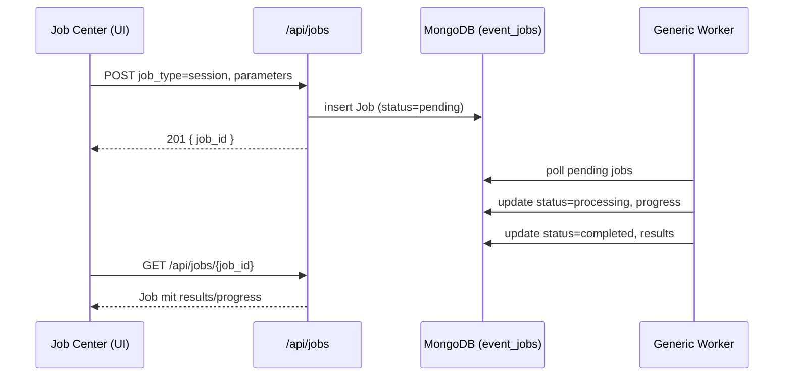

### Migration: Vom Event Manager zum generischen Job-/Batch-System

Ziel: Die bisher event-spezifische Session-/Job-Logik in eine generische, typ-basierte Job-Verarbeitung überführen (job_type ∈ {session, pdf, audio, video, …}), mit vereinheitlichter API, UI und Worker-Integration. Grundlage ist der generische Worker (siehe `docs/_instructions/generic-worker.md`) und das bestehende `EventJobRepository`. Dieser Plan baut auf der bereits beschlossenen generischen Dokumentverarbeitung und Batch-Fähigkeit auf [[memory:5008116]].

---

#### 1) Ausgangslage (Ist-Zustand)
- UI: `Session Manager` (`/session-manager`) importiert Sessions (Webseiten-Extraktion), speichert in `event_sessions` und erzeugt daraus Event-Jobs/Batches via `/api/sessions/generate-jobs`.
- Daten: Drei Sammlungen in MongoDB: `event_sessions`, `event_jobs`, `event_batches`.
- Verarbeitung: Event-spezifische Jobs (job_type = "event") werden vom Event-Monitor/Worker verarbeitet. Fortschritt via `EventJobRepository`.

Probleme: Doppeltes Modell (Sessions separat + Jobs), Event-Spezialisierung, kein generisches API für weitere Medien (PDF, Audio, …).

---

#### 2) Zielbild (Soll-Zustand)
- Einheitliche API für Jobs/Batches:
  - `POST /api/jobs` (Einzeljob, generisch)
  - `POST /api/jobs/batch` (Batch mit N Jobs, gemischt nach `job_type`)
  - `GET /api/jobs` (Filter: status, job_type, search, batch_id, created_at)
  - `GET /api/jobs/{job_id}`
  - `GET /api/batches` (Filter: status, isActive, archived, job_type?, search?)
  - `GET /api/batches/{batch_id}`
  - Batch-Aktionen: `POST /api/batches/{batch_id}/restart`, `/archive`, `/fail`, `/pending` (optional: mit Options-Payload)

- UI: Ein "Job Center" ersetzt den Event Manager:
  - Seite `/jobs`: Liste aller Jobs, Filter (Status, Typ, Suche), Fortschritt, Aktionen.
  - Seite `/batches`: Liste aller Batches mit Aggregaten und Filterung; Detailansicht mit Jobs.
  - Erstellen: Wizard/Modal „Neuer Job/Batch“ mit Typ-Auswahl (Session/PDF/Audio/…).
  - Session-Import integriert als „Job vom Typ session erzeugen“ (kein separater Session-Datensatz nötig).

- Worker: Generischer Registry-/Dispatch-Mechanismus (bereits in `generic-worker.md`) führt Handler pro `job_type` aus; Status-/Progress-Updates via `EventJobRepository`.

---

#### 3) Datenmodell und Indizes
- Jobs (`event_jobs`): Felder bestehen bereits; wichtig: Indexe auf `{ status, job_type, created_at }`, `{ batch_id }`, `{ event_name }` (falls genutzt).
- Batches (`event_batches`): Indexe auf `{ status, created_at }`, `{ isActive }`.
- Sessions: Übergangsphase; später entbehrlich. Referenzierbare Session-Felder wandern in `job.parameters`.

---

#### 4) API-Entwurf (App Router, Clerk-Auth, strikte Typen)
- Contracts verwenden `src/types/event-job.ts` (Job, Batch, Status, Responses) und folgen den App-Router-Regeln (Params awaiten, typisierte Bodies/Responses, korrekte HTTP-Codes, Fehlerlogging).
- Endpunkte (neu):
  - `src/app/api/jobs/route.ts` (GET/POST)
  - `src/app/api/jobs/[id]/route.ts` (GET/DELETE/PATCH für Statusänderung)
  - `src/app/api/jobs/batch/route.ts` (POST)
  - `src/app/api/batches/route.ts` (GET)
  - `src/app/api/batches/[id]/route.ts` (GET/DELETE)
  - `src/app/api/batches/[id]/{restart|archive|fail|pending}/route.ts` (POST)

Validierung: Zod-Schemas pro Endpoint; `job_type` required; `parameters` validiert je Typ (discriminated union), aber Storage bleibt generisch.

Sicherheit: Clerk-Auth an allen Mutations-Endpunkten; Responses maskieren Secrets; Logs nur serverseitig.

---

#### 5) UI-Entwurf (Next.js, Shadcn, RSC-first)
- Neue Routen:
  - `src/app/jobs/page.tsx`: Jobs-Tabelle mit Filtern (Status, Typ, Textsuche), Pagination, Mehrfachaktionen (Restart/Delete, optional Batch-Zuweisung).
  - `src/app/batches/page.tsx`: Batches mit Status-Badges, Progress, Actions; Klick → Batch-Detail.
  - `src/app/batches/[id]/page.tsx`: Batch-Detail inkl. Jobliste (Lazy-Pagination), Restart/Pending/Fail/Archive.
- Erstell-Flow:
  - "Neuer Job"-Dialog: Auswahl `job_type` → typ-spezifisches Parameterformular (Session: URL, Sprache; PDF: URL/Methoden/Flags …).
  - „Neuer Batch“: Liste von Jobs unterschiedlicher Typen zusammenstellen.
- Migration UI: `SessionImportModal` ruft künftig `POST /api/jobs` (job_type=session); optional Wizard bleibt identisch, nur Ziel-API tauschen.

Performance: Server Components für Listen, Suspense-Fallbacks, Client nur wo nötig (Filter-Controls). TanStack Query optional für Polling.

---

#### 6) Migrationsfahrplan (inkrementell, risikoarm)
Phase 0 – Parallelbetrieb vorbereiten
- Neue API-Endpunkte implementieren, ohne bestehendes `/api/sessions` zu ändern.
- Job Center (`/jobs`, `/batches`) als Preview-Seiten.

Phase 1 – Erzeugung umlenken
- `SessionImportModal`: Statt `/api/sessions` → direkt `POST /api/jobs (job_type=session)`.
- `/api/sessions/generate-jobs`: Intern auf `POST /api/jobs/batch` umstellen (Adapter), Response kompatibel halten.

Phase 2 – Sichtbarkeit drehen
- `Session Manager` nur noch lesend; prominent Link „Zum Job Center“.
- Neue Features (PDF, Audio) ausschließlich im Job Center.

Phase 3 – Ablösen und Aufräumen
- Sessions optional migrieren (Sessions → Jobs), oder `event_sessions` archivieren.
- Entfernen: `/api/sessions/generate-jobs` und Session-spezifische UI.

Rollback-Strategie: Adapter-Endpunkte lassen Rückbau auf alte Flows zu, bis Telemetrie stabil ist.

---

#### 7) Tests und Qualität
- Unit (Vitest):
  - Repositories (`EventJobRepository`): createJob, createBatch, updateJobStatus, updateBatchProgress.
  - API-Handler: Validierung, Fehlerpfade, Paginierung.
- E2E (Playwright):
  - „Neuer Job (session)“ → Worker-Simulation → Statuswechsel sichtbar.
  - „Neuer Batch (pdf+session)“ → Jobs gelistet, Batch-Aggregate korrekt.
- Monitoring/Logs: Konsistente `logs[]`-Einträge je Statuswechsel, UI-Ansicht für Logs im Job-Detail.

---

#### 8) Risiken & Gegenmaßnahmen
- Doppelquellen (Sessions vs. Jobs): Früh Job-First schreiben, Sessions nur lesend. Adapter minimiert Bruch.
- Index/Skalierung: Vorab Indizes anlegen, Cursor-Pagination, Limit/Skip.
- Fehlertypen: Einheitliche `JobError`-Codes je Handler; UI-Filterung nach Fehlerklassen.

---

#### 9) Offene Punkte
- Sollen Session-Datensätze langfristig entfernt oder als Audit erhalten bleiben?
- Archiv-Handling (ZIP/Assets) vereinheitlichen: Download-Routen generisch?
- Access Control: Feingranular pro Job/Batch oder nur user_id-basiert?

---

#### 10) Grobe Aufgabenliste (Umsetzung)
1. Endpunkte `/api/jobs`, `/api/jobs/batch`, `/api/batches` implementieren (Typen, Zod, Auth, Repos).
2. Indizes für `event_jobs`/`event_batches` setzen.
3. UI: `/jobs`, `/batches`, Batch-Detail, Job-Detail, „Neuer Job/Batch“-Dialoge.
4. `SessionImportModal` auf `POST /api/jobs` umstellen; `/api/sessions/generate-jobs` → Adapter.
5. Worker-Registry: Handler für `session`, `pdf` aktivieren; Logs/Progress konsistent.
6. Tests: Unit + E2E; Telemetrie-Dashboards.
7. Phase-2/3-Schalter setzen (Feature Flags), Sessions ablösen.

---

#### 11) Sequenz (Beispiel: Session-Job)

