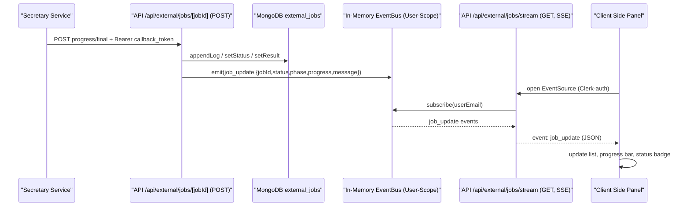

### Zielsetzung

Ein kompaktes, rechts einfliegendes Side‑Panel zeigt laufende und vergangene External‑Jobs (neueste zuerst) mit Live‑Fortschritt, Status‑Icon, kurzer Statusmeldung und Zugriff auf die letzten Webhook‑Logs. Live‑Updates erfolgen push‑basiert ohne Polling.

### Architekturüberblick

- Secretary sendet Progress/Finale an `POST /api/external/jobs/{jobId}` (Bearer `callback_token`).
- Server speichert Status und Logs in MongoDB (`external_jobs`) und emittiert ein `job_update` Event.
- Client öffnet einen SSE‑Stream `GET /api/external/jobs/stream` (Clerk‑Auth) und erhält `job_update` Events in Echtzeit.



### Server‑Schnittstellen

- `POST /api/external/jobs/{jobId}` (extern):
  - Body (JSON): Progress `{ phase, progress, message }`, Final `{ data.extracted_text, images_archive_data?, metadata? }`, Fehler `{ error }`.
  - Auth: `Authorization: Bearer <callback_token>`.
  - Wirkung: Status/Logs speichern, Event `job_update` emittieren.

- `GET /api/external/jobs` (intern, optional):
  - Query: `page`, `limit` (z. B. 1, 20), Sort: `updatedAt desc`.
  - Antwort: Seite von Jobs für Initial‑Render (SSR/RSC).

- `GET /api/external/jobs/{jobId}` (intern):
  - Antwort: `status`, `logs[]` (letzte N via `?limit`), `result`, `processId`.

- `GET /api/external/jobs/stream` (intern):
  - SSE‑Stream; Events vom Typ `job_update` (JSON). Auth via Clerk.

### Event‑Formate

- `job_update` (SSE/Push):
```json
{
  "type": "job_update",
  "jobId": "<uuid>",
  "status": "queued|running|completed|failed|pending-storage",
  "phase": "extract_text|images|finalizing|...",
  "progress": 0,
  "message": "Seite 3/12 verarbeitet",
  "updatedAt": "2025-08-22T13:04:25.000Z"
}
```

- `external_jobs.logs[]` (DB): `{ timestamp, phase?, progress?, message?, details? }`.

### UI‑Konzept (Shadcn/Radix/Tailwind)

- Container: `Sheet` (right) – Breite kompakt (sm: ~360–400px, md: ~420px).
- Header: Titel „Verarbeitung“, optional Filter/Chip für Status.
- Liste: neueste zuerst; jeder Eintrag als „Teaser“ (kompakt 56–72px):
  - Primärzeile: Job‑Titel (Dateiname oder generiert), Status‑Icon (queued=clock, running=spinner, completed=check, failed=triangle‑x).
  - Sekundärzeile: Progressbar (shadcn `Progress`) + kurze `message`/`phase` (ellipsiert).
  - Rechts: relativer Zeitstempel (`updatedAt`).
  - Aktiver Job: dezente Hervorhebung (Border/Ring).
- Detail/Logs (optional expand unter Item oder Panel‑Footer): letzte 20–50 Logs, Autoscroll.
- Pagination: „Neueste zuerst“ fix; Button „Ältere laden“ oder Pagination‑Leiste am Panel‑Ende.

### Datenfluss / Zustand

- Initial: RSC lädt Seite 1 via `GET /api/external/jobs` → schneller First Paint.
- Live: Client öffnet SSE; `job_update` patched Liste (prepend/patch by `jobId`).
- Detail/Logs: on‑demand via `GET /api/external/jobs/{jobId}?limit=50`.
- Globaler Zustand: Jotai (leichtgewichtig), nur für Panel‑Open/Close + ausgewählten Job.

### Performance & Zuverlässigkeit

- SSE: 1 Verbindung/Client, minimaler Overhead, stabile Push‑Updates.
- Liste begrenzen (20–50 Einträge); ältere via Paging.
- Optional Virtualisierung bei sehr vielen Jobs.
- Multi‑Instance (später): EventBus auf Redis Pub/Sub heben.

### Barrierefreiheit (a11y)

- Tastaturnavigation im `Sheet`, Fokusfallen korrekt.
- ARIA‑Labels für Status + Fortschritt (z. B. „Status: läuft, 42 %“).
- Farbkontrast und `aria-live` für dezente Live‑Updates.

### Sicherheit

- SSE/GET: Clerk‑Auth (kein Secret im Event‑Payload).
- Secretary‑Callback: Bearer `callback_token`; keine `correlation`/`jobId` im Body nötig.

### Nächste Schritte (Implementierung)

1) `GET /api/external/jobs` (paged, sort desc) implementieren.
2) `GET /api/external/jobs/stream` + In‑Memory EventBus (User‑Scope).
3) UI‑Panel: `Sheet` + kompakte Job‑Cards + Progressbar + Status‑Badge.
4) Logs‑Detail (expand/on‑demand) und Paging.
5) Tests: SSE‑Route, Repository‑Updates, UI‑Snapshot.


