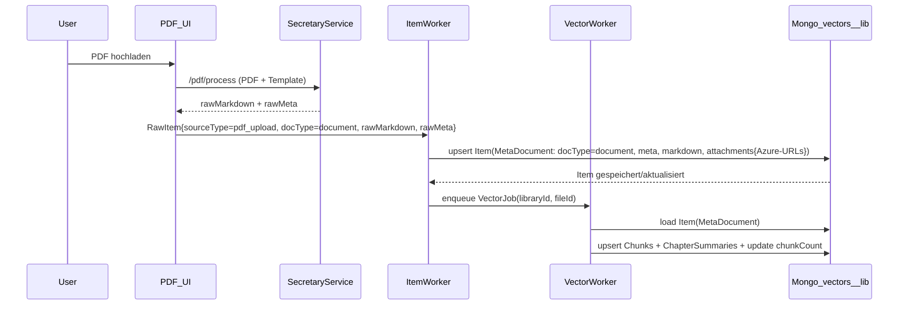
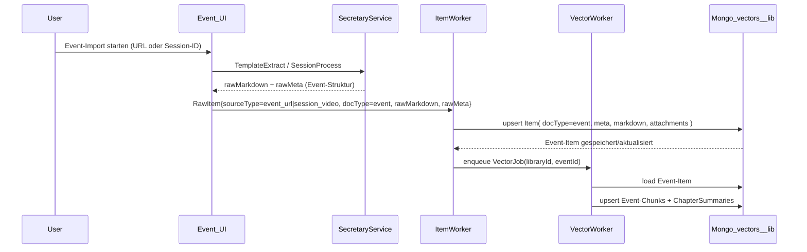

# Unified Ingestion Flow - Generisches Item-Modell & Worker-Schichten

## Übersicht

Dieses Dokument beschreibt das Zielmodell für einen vereinheitlichten Ingestion-Flow, der alle Item-Typen (PDF-Dokumente, Events, JobOffers, Testimonials) über dieselbe generische Pipeline verarbeitet. Kernidee: **RawItem → Item → Vektoren** als drei klare Schichten.

## Domainmodell

### RawItem (quelle-spezifisch, kurzlebig)

Ein `RawItem` repräsentiert rohe, noch nicht normalisierte Daten aus verschiedenen Quellen:

```typescript
interface RawItem {
  sourceType: 'pdf_upload' | 'event_url' | 'session_video' | 'testimonial_form' | 'job_scraper' | ...;
  docType: 'document' | 'event' | 'joboffer' | 'testimonial' | ...;
  libraryId: string;
  rawMarkdown?: string;      // Roh-Markdown vom Secretary Service
  rawText?: string;          // Alternativ: Plaintext (z.B. bei Testimonials)
  rawMeta: Record<string, unknown>;  // Quelle-spezifische Metadaten (URL, Speaker-Namen, etc.)
  parentId?: string;         // Optional: Referenz auf Parent-Item (z.B. Testimonial → Event)
}
```

**Wichtig**: `RawItem` ist ein **konzeptionelles Modell** – in der aktuellen Implementierung existiert es noch nicht explizit als TypeScript-Interface, sondern wird implizit durch die verschiedenen Producer-Flows erzeugt.

### Item (generisch, stabil)

Ein `Item` ist die kanonische, normalisierte Repräsentation eines Wissensobjekts in der Library. Es entspricht logisch dem bestehenden `MetaDocument` aus `src/lib/ingestion/meta-document-builder.ts`:

```typescript
interface Item {
  id: string;                // = fileId
  libraryId: string;
  user: string;              // User-Email
  fileName: string;
  docType: 'document' | 'event' | 'joboffer' | 'testimonial' | ...;
  parentId?: string;         // Für Hierarchien (z.B. testimonial.parentId = event.id)
  source: string;            // Herkunft (upload, scraped_url, spoken_text, ...)
  
  // Strukturierte Metadaten (Frontmatter)
  meta: Record<string, unknown>;  // = docMetaJson (ohne markdown)
  
  // Vollständiger Text-Body (mit Azure-URLs für Bilder)
  markdown: string;          // = docMetaJson.markdown
  
  // Binärartefakte (Bilder, Slides, Audio) – alle auf Azure Storage
  attachments?: Array<{
    kind: 'image' | 'audio' | 'pdf' | 'slide';
    url: string;             // Azure-URL
    role?: string;           // cover, page-image, slide-preview, ...
  }>;
  
  // Kapitel-Struktur (für Dokumente)
  chapters?: ChapterMetaEntry[];
  chaptersCount: number;
  chunkCount: number;
  
  // Facetten-Metadaten (denormalisiert für Filterung)
  year?: number;
  authors?: string[];
  tags?: string[];
  topics?: string[];
  // ... weitere library-spezifische Facetten
  
  upsertedAt: string;
  embedding?: number[];      // Optional: Dokument-Embedding für globale Suche
}
```

**Wichtig**: In Variante 1 wird `Item` **nicht als separate Collection** gespeichert, sondern als `MetaDocument` (`kind: 'meta'`) in der bestehenden `vectors__<libraryId>`-Collection. Die Shadow-Twin-Information (Meta + Markdown + Attachments) liegt damit vollständig in MongoDB, nicht mehr im Filesystem.

### Lebenszyklus: Event + Testimonials

**Events** sind normale Items (`docType='event'`), die einmal angelegt werden können (z.B. aus Website-Scraping oder Session-Video).

**Testimonials** sind eigene Items (`docType='testimonial'`) mit `parentId = event.id`, die **zeitversetzt** hinzugefügt werden:

- Ein Event wird initial importiert → `Item` mit `docType='event'` wird erstellt.
- Später fügen Teilnehmer Testimonials hinzu → neue `Item`s mit `docType='testimonial'`, `parentId=eventId`.
- Wenn das Event **neu inges­tiert** wird (z.B. bessere Template-Version, neue Slides), wird **nur** das Event-Item + dessen Vektoren aktualisiert – Testimonials bleiben unverändert.
- Im Chat/RAG werden Event + zugehörige Testimonials automatisch zusammen abgefragt über Filter: `docType in ['event','testimonial']` + `parentId = eventId`.

## Worker-Schichten

### Schicht 1: Producer (quelle-spezifisch)

**Verantwortung**: Erzeugt `RawItem` aus verschiedenen Quellen.

**Aktuelle Implementierung**:
- **PDF-Flow**: `src/app/api/chat/[libraryId]/ingest-markdown/route.ts` – lädt Markdown aus Storage, ruft `IngestionService.upsertMarkdown` auf.
- **Event-Flow (Session)**: `src/app/api/event-job/jobs/[jobId]/process-direct/route.ts` – ruft Secretary `/session/process`, erhält Markdown + Meta, speichert im Job.
- **Event-Flow (URL)**: `src/app/api/secretary/import-from-url/route.ts` – ruft Secretary Template-Extract, erhält strukturierte Daten.

**Zielbild**: Alle Producer-Flows sollten am Ende ein `RawItem` erzeugen (noch nicht implementiert, aber konzeptionell klar).

### Schicht 2: ItemWorker (generisch)

**Verantwortung**: Normalisiert `RawItem` → `Item` (MetaDoc) und speichert es in MongoDB.

**Aktuelle Implementierung**: Teile von `IngestionService.upsertMarkdown` (Zeilen 79-330):
- Frontmatter-Parsing
- Facetten-Validierung
- Bild-/Azure-Upload-Verarbeitung
- Aufbau von `docMetaJsonObj` + `DocMeta` + `MetaDocument`
- Speicherung via `upsertVectorMeta`

**Zielbild**: Ein generischer `ItemWorker`, der für **alle** `docType` dieselbe Pipeline nutzt:
1. Nimmt `RawItem` + `libraryId` + `docType`.
2. Wendet Library-/DocType-spezifische Templates/Konfiguration an (Secretary-Templates oder lokale Normalisierung).
3. Baut `meta` + `markdown` + `attachments` (Azure-URLs).
4. Schreibt/updated `Item` (`MetaDocument` in `vectors__<libraryId>`).

**Wichtig**: ItemWorker erzeugt/updated **nur** das Item, keine Vektoren.

### Schicht 3: VectorWorker (generisch)

**Verantwortung**: Erzeugt/updated Vektoren für ein bestehendes `Item`.

**Aktuelle Implementierung**: Teile von `IngestionService.upsertMarkdown` (Zeilen 398-515):
- RAG-Embedding via Secretary Service (`embedDocumentWithSecretary`)
- Aufbau von Chunk-Vektoren (`buildVectorDocuments`)
- Upsert von Chunks + ChapterSummaries (`upsertVectors`)
- Update von `chunkCount`, `chaptersCount` im MetaDoc

**Zielbild**: Ein generischer `VectorWorker`, der:
1. Input: `(libraryId, fileId)`.
2. Lädt `Item` aus MongoDB (kein Storage-Zugriff mehr).
3. Berechnet Embeddings via Secretary RAG API.
4. Schreibt/updated Vektoren (`kind: 'chunk'`, `kind: 'chapterSummary'`).
5. Idempotent: Löscht alte Chunks für `fileId` vor Upsert.

## Konkrete Flows im neuen Modell

### PDF-Flow



**Aktueller Stand**: PDF-Flow ruft direkt `upsertMarkdown` auf, das ItemWorker + VectorWorker in einem Schritt macht. Ziel: Trennung in zwei separate Schritte.

### Event-Flow (Initialer Import)



**Aktueller Stand**: Event-Flow speichert Markdown im Job, ruft später `upsertMarkdown` auf. Ziel: Klare Trennung zwischen Item-Erzeugung und Vector-Ingestion.

### Testimonial-Flow (zeitversetzt)

```mermaid
sequenceDiagram
  participant User as Participant
  participant UI as Testimonial_UI
  participant IW as ItemWorker
  participant VW as VectorWorker
  participant DB as Mongo_vectors__lib

  Participant->>UI: Testimonial-Form ausfüllen (zu Event X)
  UI->>IW: RawItem{
      sourceType=testimonial_form,
      docType=testimonial,
      parentId=eventId,
      rawMarkdown=(Fragen+Antworten),
      rawMeta={author, role, language, ...}
  }
  IW->>DB: upsert Item(
      id=new fileId,
      docType=testimonial,
      parentId=eventId,
      meta, markdown
  )
  DB-->>IW: Testimonial-Item gespeichert
  IW->>VW: enqueue VectorJob(libraryId, testimonialFileId)
  VW->>DB: load Testimonial-Item
  VW->>DB: upsert Testimonial-Chunks
```

**Wichtig**: Testimonials sind **eigene Items**, nicht Teil des Event-Items. Re-Ingestion des Events ändert Testimonials nicht.

## Mapping auf bestehenden Code

### Producer-Schicht

| Flow | Aktuelle Datei | Erzeugt heute | Sollte erzeugen |
|------|---------------|---------------|-----------------|
| PDF | `src/app/api/chat/[libraryId]/ingest-markdown/route.ts` | Markdown aus Storage → `upsertMarkdown` | `RawItem` → ItemWorker |
| Event (Session) | `src/app/api/event-job/jobs/[jobId]/process-direct/route.ts` | Secretary Response → Job → später `upsertMarkdown` | `RawItem` → ItemWorker |
| Event (URL) | `src/app/api/secretary/import-from-url/route.ts` | Secretary Template-Extract → strukturierte Daten | `RawItem` → ItemWorker |
| Testimonial | (noch nicht implementiert) | - | `RawItem` → ItemWorker |

### Detaillierte Flow-Analyse

#### PDF-Flow (aktuell)

**Datei**: `src/app/api/chat/[libraryId]/ingest-markdown/route.ts`

**Aktueller Ablauf**:
1. Request empfängt `fileId` + optional `docMeta`
2. Lädt Markdown-Datei aus Storage (`provider.getBinary(fileId)`)
3. Ruft direkt `IngestionService.upsertMarkdown` auf mit:
   - `markdown` (aus Storage)
   - `docMeta` (optional, wird in Frontmatter gemerged)
   - `provider` (für Bild-Upload)

**Implizites RawItem**:
- `sourceType`: `pdf_upload` (implizit, da Markdown aus Storage kommt)
- `docType`: Aus Frontmatter oder `docMeta`, Standard `document`
- `rawMarkdown`: Markdown aus Storage
- `rawMeta`: `docMeta` (optional)

**Zielbild**: 
- PDF-Flow sollte explizit ein `RawItem` erzeugen
- `RawItem` → ItemWorker (normalisiert + speichert Item)
- ItemWorker → VectorWorker (erzeugt Vektoren)

#### Event-Flow (Session, aktuell)

**Datei**: `src/app/api/event-job/jobs/[jobId]/process-direct/route.ts`

**Aktueller Ablauf**:
1. Request empfängt `jobId` + optional `libraryId`, `uploadToLibrary`, `videoTranscript`
2. Lädt Job aus Repository
3. Baut Session-Payload (`buildSessionPayload`) mit Video-Transcript
4. Ruft Secretary `/session/process` auf
5. Speichert Ergebnis im Job (`markdown_content`, `markdown_file`, `archive_data`)
6. Optional: Upload in Library (ZIP-Archiv entpacken, Dateien hochladen)
7. **WICHTIG**: Ruft **nicht** direkt `upsertMarkdown` auf – Ingestion passiert später (manuell oder über separaten Schritt)

**Implizites RawItem**:
- `sourceType`: `session_video` (implizit)
- `docType`: `event` (aus Job-Parametern oder Template)
- `rawMarkdown`: `output.markdown_content` vom Secretary
- `rawMeta`: Aus Job-Parametern (`event`, `session`, `track`, `speakers`, etc.)

**Zielbild**:
- Event-Flow sollte explizit ein `RawItem` erzeugen
- `RawItem` → ItemWorker (normalisiert + speichert Item)
- ItemWorker → VectorWorker (erzeugt Vektoren)
- **Keine** separate Upload-Phase mehr nötig – ItemWorker speichert direkt in Mongo

#### Event-Flow (URL, aktuell)

**Datei**: `src/app/api/secretary/import-from-url/route.ts`

**Aktueller Ablauf**:
1. Request empfängt `url` + optional `template`, `source_language`, `target_language`, `use_cache`, `container_selector`
2. Ruft Secretary `/transformer/template` auf (`callTemplateExtractFromUrl`)
3. Erhält strukturierte Daten vom Secretary (vermutlich Markdown + Meta)
4. Gibt Daten an Client zurück
5. **WICHTIG**: Ruft **nicht** direkt `upsertMarkdown` auf – Ingestion passiert später (im Frontend oder über separaten Schritt)

**Implizites RawItem**:
- `sourceType`: `event_url` (implizit)
- `docType`: `event` (aus Template oder Daten)
- `rawMarkdown`: Markdown vom Secretary
- `rawMeta`: Strukturierte Daten vom Secretary

**Zielbild**: 
- URL-Import-Flow sollte explizit ein `RawItem` erzeugen
- `RawItem` → ItemWorker (normalisiert + speichert Item)
- ItemWorker → VectorWorker (erzeugt Vektoren)
- **Keine** separate Client-seitige Ingestion mehr nötig – alles server-seitig über Worker

#### Testimonial-Flow (noch nicht implementiert)

**Zielbild**:
- Formular erzeugt `RawItem` mit:
  - `sourceType`: `testimonial_form`
  - `docType`: `testimonial`
  - `parentId`: `eventId` (aus Formular)
  - `rawMarkdown`: Fragen + Antworten als Markdown
  - `rawMeta`: `author`, `role`, `language`, etc.
- `RawItem` → ItemWorker → VectorWorker (wie alle anderen Flows)

### ItemWorker-Schicht

| Funktion | Aktuelle Datei | Macht heute | Sollte machen |
|----------|----------------|-------------|---------------|
| Item-Erzeugung | `IngestionService.upsertMarkdown` (Zeilen 79-330) | Frontmatter-Parsing, Bild-Upload, `docMetaJsonObj`-Aufbau, `MetaDocument`-Erstellung | `RawItem` → `Item` (MetaDoc), **ohne** Vektoren |
| Item-Speicherung | `upsertVectorMeta` in `src/lib/repositories/vector-repo.ts` | Speichert MetaDoc in `vectors__<libraryId>` | Unverändert |

### VectorWorker-Schicht

| Funktion | Aktuelle Datei | Macht heute | Sollte machen |
|----------|----------------|-------------|---------------|
| Vector-Ingestion | `IngestionService.upsertMarkdown` (Zeilen 398-515) | RAG-Embedding, Chunk-Aufbau, Vektor-Upsert | `Item` → Vektoren, **ohne** Item-Erzeugung |

## Analyse des aktuellen `upsertMarkdown`-Ablaufs

Die Funktion `IngestionService.upsertMarkdown` (`src/lib/chat/ingestion-service.ts`) macht aktuell **drei logische Blöcke** in einem:

1. **Frontmatter-Parsing + Bild-/Azure-Verarbeitung** (Zeilen 79-330):
   - Frontmatter aus Markdown extrahieren
   - Facetten validieren
   - Slide-Bilder auf Azure hochladen
   - Cover-Bilder + Markdown-Bilder verarbeiten
   - `docMetaJsonObj` aufbauen (inkl. `markdown`-Feld)

2. **Item-Schicht** (implizit in Zeilen 232-366):
   - `DocMeta` + `MetaDocument` aufbauen
   - `upsertVectorMeta` aufrufen (speichert Item)

3. **Vector-Schicht** (Zeilen 398-515):
   - RAG-Embedding via Secretary
   - Chunk-Vektoren aufbauen
   - `upsertVectors` aufrufen
   - `chunkCount` im MetaDoc updaten

**Ziel**: Diese drei Blöcke gedanklich (und später technisch) trennen, sodass:
- Block 1-2 = ItemWorker (normalisiert + speichert Item)
- Block 3 = VectorWorker (erzeugt Vektoren für bestehendes Item)

## Analyse des aktuellen `upsertMarkdown`-Ablaufs

Die Funktion `IngestionService.upsertMarkdown` (`src/lib/chat/ingestion-service.ts`) macht aktuell **drei logische Blöcke** in einem:

### Block 1: Frontmatter-Parsing + Bild-/Azure-Verarbeitung (Zeilen 79-330)

**Verantwortung**: Normalisiert rohe Eingabedaten und bereitet Item-Daten vor.

**Schritte**:
1. **Frontmatter-Parsing** (Zeilen 80-89):
   - Extrahiert `meta` und `body` aus Markdown
   - Merged mit optionalen `meta`-Overrides
   - Validiert Facetten (`validateAndSanitizeFrontmatter`)

2. **Kapitel-Struktur aufbauen** (Zeilen 106-157):
   - Liest `chapters` aus Frontmatter
   - Baut `chaptersForMongo` Array für MongoDB

3. **Bild-/Azure-Upload-Verarbeitung** (Zeilen 164-330):
   - **Slides**: `ImageProcessor.processSlideImages` → Azure-Upload, URLs in `metaEffective.slides`
   - **Cover-Bild**: `ImageProcessor.processCoverImage` → Azure-Upload, URL in `docMetaJsonObj.coverImageUrl`
   - **Markdown-Bilder**: `ImageProcessor.processMarkdownImages` → Azure-Upload, URLs im Markdown aktualisiert
   - **Finales Markdown**: Wird in `docMetaJsonObj.markdown` gesetzt (mit Azure-URLs)

**Output**: `docMetaJsonObj` mit vollständigem `markdown`-Feld und Azure-URLs für alle Bilder.

### Block 2: Item-Schicht (implizit in Zeilen 232-366, explizit in Zeilen 485-502)

**Verantwortung**: Baut `Item` (MetaDocument) und speichert es in MongoDB.

**Schritte**:
1. **DocMeta aufbauen** (Zeilen 335-366):
   - Extrahiert Facetten-Felder aus `docMetaJsonObj` (`year`, `authors`, `tags`, etc.)
   - Baut `DocMeta`-Objekt

2. **MetaDocument erstellen** (Zeilen 486-494):
   - `buildMetaDocument` erstellt `MetaDocument` aus `DocMeta` + `docMetaJsonObj`
   - Fügt optionales Dokument-Embedding hinzu

3. **Item speichern** (Zeilen 501-507):
   - `upsertVectorMeta` speichert MetaDocument in `vectors__<libraryId>` als `kind: 'meta'`

**Output**: Item (MetaDocument) ist in MongoDB gespeichert.

**Wichtig**: Dieser Block erzeugt/updated **nur** das Item, keine Vektoren.

### Block 3: Vector-Schicht (Zeilen 398-459)

**Verantwortung**: Erzeugt/updated Vektoren für das bestehende Item.

**Schritte**:
1. **RAG-Embedding** (Zeilen 408-433):
   - Baut Metadaten-Präfix für bessere Embedding-Qualität
   - Ruft `embedDocumentWithSecretary` auf → erhält Chunks mit Embeddings

2. **Vektor-Dokumente aufbauen** (Zeilen 436-437):
   - `extractFacetValues` extrahiert Facetten-Metadaten
   - `buildVectorDocuments` baut MongoDB-Vektor-Dokumente (`kind: 'chunk'`, `kind: 'chapterSummary'`)

3. **Vektoren speichern** (Zeilen 455-459):
   - `upsertVectors` speichert Chunks + ChapterSummaries in `vectors__<libraryId>`
   - Aktualisiert `chunkCount` in `chaptersForMongo`

4. **Dokument-Embedding** (Zeilen 461-483, optional):
   - Erstellt globales Dokument-Embedding für Dokumentensuche
   - Wird im MetaDocument gespeichert (Zeilen 497-498)

**Output**: Vektoren sind in MongoDB gespeichert, `chunkCount` im MetaDocument ist aktualisiert.

**Wichtig**: Dieser Block benötigt ein **bestehendes Item** (MetaDocument), erzeugt es nicht.

### Logische Trennung (Zielbild)

**ItemWorker** sollte Block 1 + Block 2 machen:
- Input: `RawItem` (rohe Markdown + Meta)
- Output: `Item` (MetaDocument) in MongoDB gespeichert

**VectorWorker** sollte Block 3 machen:
- Input: `(libraryId, fileId)` → lädt Item aus MongoDB
- Output: Vektoren in MongoDB gespeichert, `chunkCount` im Item aktualisiert

**Aktuell**: Beide Blöcke sind in `upsertMarkdown` kombiniert. Trennung ist **gedanklich** klar, aber noch nicht technisch getrennt.

## Nächste Schritte

1. **Item-Interface definieren**: ✅ `src/types/item.ts` mit Mapping von `MetaDocument` → `Item` (erledigt)
2. **ItemWorker konzipieren**: Klare Schnittstelle für `RawItem` → `Item` (Block 1 + Block 2)
3. **VectorWorker konzipieren**: Klare Schnittstelle für `(libraryId, fileId)` → Vektoren (Block 3)
4. **Producer-Flows analysieren**: Wo genau entsteht heute das, was wir `RawItem` nennen?
5. **Schrittweise Trennung**: `upsertMarkdown` in Hilfsfunktionen strukturieren, ohne sofort große Refactors

