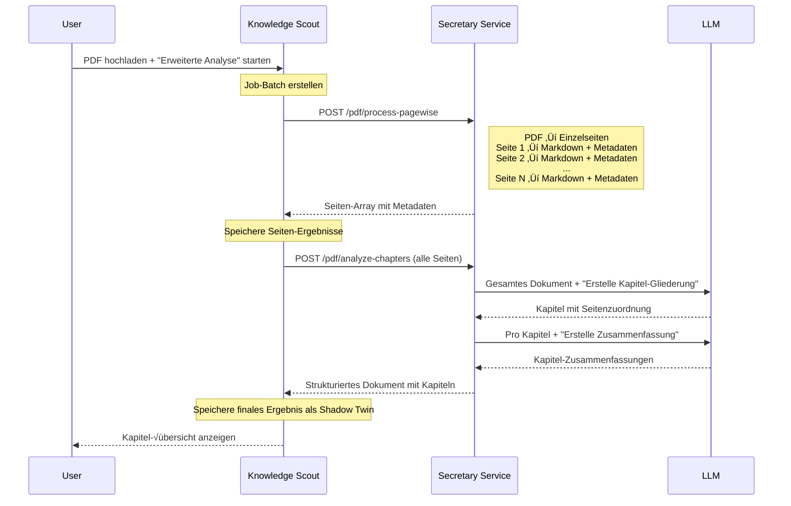

# Entwicklung einer Daten-Transformationsstrategie
_Exported on 8/2/2025 at 13:32:54 GMT+2 from Cursor (1.3.8)_

---

**User**

Ich habe dieses Projekt weiter analysiert, mit folgendem Ergebnis:
Basierend auf deinen bisherigen Überlegungen und dem aktuellen Stand deiner Projekte machen folgende **nächsten Schritte** am meisten Sinn – sowohl aus technischer Sicht als auch in Bezug auf die übergeordneten Motive (Ordnung, Transparenz, Nutzbarkeit, Teilhabe):

---

## 1. **Grundlagen für die Daten-Transformation festigen**

* **Automatisierung der PDF-zu-Markdown-Transformation**
  Baue/optimiere dein Tool so, dass du große Mengen an PDFs zuverlässig und inkl. Metadaten in Markdown umwandeln kannst.
* **Standardisierung der Metadaten**
  Definiere ein einheitliches Metadaten-Schema (z. B. für Autor, Jahr, Thema, Schlagwörter, Quelle), das möglichst sprach- und domänenunabhängig ist.
* **Qualitätssicherung**
  Entwickle einen Prozess zur Überprüfung und Korrektur der Metadaten, ggf. teilautomatisiert durch KI-Unterstützung.

---

## 2. **Kategorisierung und Klassifizierung**

* **Automatische Generierung von Inhaltsverzeichnissen und Summaries**
  Implementiere die Möglichkeit, aus den Metadaten und Texten strukturierte Übersichten/Inhaltsverzeichnisse und kurze Zusammenfassungen je Kapitel/Abschnitt zu generieren.
* **Test mit realen Datensätzen**
  Wende den Prozess konkret auf z. B. deinen Biodiv-Korpus an und analysiere die Ergebnisse: Sind die Themen/Schlüsselwörter sinnvoll auffindbar? Wo gibt es noch Lücken?

---

## 3. **Erweiterung der Suche und Filterlogik**

* **Einbau einer Filterfunktion auf Basis der Metadaten**
  Baue z. B. eine SQL- oder ElasticSearch-basierte Filterung, damit gezielt nach Themen, Autoren, Zeiträumen usw. gesucht werden kann.
* **Experimente mit Vektorsuche (Embeddings) und natürlicher Sprachsuche**
  Teste, wie gut KI-Modelle relevante Kapitel/Dokumente aus deinem Korpus finden.

---

## 4. **Interaktive Benutzeroberfläche (Chatbot/Agent)**

* **Integration des Chatbots**
  Verbinde die bisherigen Datenprozesse mit einer UI, in der du mit deinem Korpus chatten, nach Themen suchen und zu Originalquellen springen kannst.
* **User-Feedback einholen**
  Lass andere (z.‚ÄØB. aus deinem Freundes- oder Arbeitskreis) testen, wie intuitiv die Interaktion ist. Welche Funktionen fehlen?

---

## 5. **Transparenz, Teilhabe und Dokumentation**

* **Dokumentiere die Prozesskette und die technischen Hintergründe**
  Erstelle eine Schritt-für-Schritt-Anleitung/Readme, wie das System funktioniert (auch zur Weitergabe an andere Mitstreiter\:innen).
* **Schnittstellen für Teilen und Veröffentlichung entwickeln**
  Implementiere die Möglichkeit, einzelne Dateien/Ordner als „öffentlich“ zu markieren und (automatisiert) zu publizieren.

---

## 6. **Visionäre Schritte/Weiterentwicklung**

* **√úbertragung auf andere Wissensbereiche**
  Probiere das System mit neuen Themenfeldern und Gruppen aus (Pilotversuch).
* **Konzept für kollektive Intelligenz und ShadowTwin weiterentwickeln**
  Wie können persönliche Reflexionen, kollektive Bewertungen und Versionierung sinnvoll und transparent integriert werden?

---

### **Pragmatische Roadmap (in Reihenfolge)**

1. **Standard für Metadaten und Transformation definieren**
   (kleines Testset durchspielen)
2. **Automatisierung PDF/Datei-Transformation verbessern**
   (Batch-Prozess auf Biodiv-Daten)
3. **Filter/Suchfunktion bauen und mit Chatbot verbinden**
4. **User-Interface prototypisieren und User-Feedback einholen**
5. **Dokumentation & Sharing-Mechanismus für Ergebnisse**
6. **Iterativ: Ausweitung auf weitere Themen/Teams**

---

**Tipp:** Fokussiere zuerst auf wenige Kernfunktionen mit großem Mehrwert für dich und deine Testgruppe. Lieber ein robustes, durchschaubares System aufbauen als zu viele Features auf einmal.

Können wir das nachvollziehen?

---

**Cursor**

Ja, das ist eine sehr durchdachte und strukturierte Roadmap! Lass mich den aktuellen Stand deines CommonKnowledgeScout-Projekts analysieren, um zu verstehen, wo du stehst und welche der vorgeschlagenen Schritte am sinnvollsten als nächstes angegangen werden sollten.

Beeindruckend! Nach der Analyse deines Projekts muss ich sagen: **Du bist schon viel weiter, als du denkst!** 🎯

## Aktueller Stand - Du hast bereits implementiert:

### ✅ **1. PDF-zu-Markdown-Transformation** - VOLLSTÄNDIG VORHANDEN
- Funktionierender `TransformService` mit Secretary Service Integration
- **7 verschiedene Extraktionsmethoden** (native, OCR, LLM, etc.)
- Asynchrone Verarbeitung mit Webhook-Status-Updates
- **Batch-Verarbeitung** für große Mengen an PDFs
- Speicherung als "Shadow-Twins" mit strukturierten Metadaten

### ‚úÖ **2. Metadaten-Schema** - SEHR AUSGEREIFT  
- **Umfangreiches wissenschaftliches Schema** (Dublin Core & BibTeX-kompatibel)
- YAML-Frontmatter in Markdown mit bibliographischen, räumlichen, zeitlichen Daten
- TypeScript-Interfaces für alle Metadaten-Typen
- Automatische Metadaten-Extraktion während Transformation

### ‚úÖ **3. Such- und Filterlogik** - IMPLEMENTIERT
- Erweiterte Kategorisierung (media, text, documents, all)
- `sortedFilteredFilesAtom` mit komplexen Filteroptionen
- Session-Repository mit erweiterten Suchmöglichkeiten
- Intelligente Batch-Auswahl basierend auf Filtern

### ‚úÖ **4. Batch-Automatisierung** - VORHANDEN
- `BatchTransformService` für alle Medientypen
- Fortschritts-Tracking und Fehlerbehandlung
- Parallel und sequentielle Verarbeitung
- Template-basierte Transformation

## Was noch FEHLT für deine Vision:

### ❌ **Chatbot/Agent für natürliche Interaktion**
- Keine konversationelle Schnittstelle zu deinem Korpus
- Keine Vektorsuche/Embeddings-basierte Suche
- Keine natürlichsprachliche Abfrage

### ⚠️ **Automatische Inhaltsverzeichnisse**
- Template-System vorhanden, aber spezifische ToC-Generierung unklar

### ⚠️ **Sharing/Publishing-Mechanismus** 
- Grundlagen vorhanden, aber öffentliche Publikation zu prüfen

## Meine empfohlene **angepasste Roadmap**:

### **Sofort umsetzbar (Woche 1-2):**
1. **Chatbot-Integration entwickeln** - Das ist der größte fehlende Baustein
2. **Vektorsuche implementieren** - Embeddings für semantische Suche
3. **Automatische ToC-Generierung** testen/optimieren

### **Mittelfristig (Woche 3-4):**
4. **User-Interface für Chat** - Integration in bestehende Library-Komponenten
5. **Sharing-Mechanismus** erweitern und testen
6. **Biodiv-Korpus** als Pilottest durchlaufen lassen

**Du hast eine solide technische Basis - konzentriere dich auf die fehlende AI/Chat-Schicht!** 

Soll ich dir dabei helfen, den **Chatbot/Agent** als nächsten Schritt zu implementieren? Das wäre der größte Hebel für deine Vision.

---

**User**

Ich glaube nicht, dass wir bei dieser PDF-Transformation in Markdown schon eine solide Basis haben. Das war ein sehr schnell entwickeltes System, das ich noch anhand von einem Text-Corpus, wie ihr den Text-Corpus jetzt weiter austesten möchtet. Zum einen geht es darum, wie ich das auch in größeren Mengen bearbeiten kann. Wir haben hier in diesem Projekt diesen SessionManager und diesen EventMonitor, der ein spezifisches Format verarbeiten kann. Das sind diese Events und Sessions. Und ich möchte gern diese Module erweitern und generisch umbauen. Dass Sie nicht nur das spezifische Format verarbeiten können, sondern beliebige Formate, Audio, Video, PDFs, um große Mengen zu verarbeiten.
Dort werden ja die PDFs in einzelne Seiten zerlegt und einzeln transformiert im Markdown. Und die Herausforderung ist jetzt die, wie wir Metadaten aus dem Dokument ziehen können, die im Laufe so eines Dokumentes auftauchen, wie ISBN-Nummern oder Ortsbezeichnungen oder Autoren. Und wie wir diese Informationen danach, diese seitenweise Informationen, in Kapitel transformieren können. Am Ende möchte ich überschaubare Kapitel haben, mit einer Zusammenfassung und entsprechenden Metadaten, die ich dann verwende für das RAG-System.


---

**Cursor**

Verstehe! Du willst das bestehende Event/Session-System als **generische Batch-Processing-Pipeline** für beliebige Dokumenttypen umbauen. Das ist ein sehr durchdachter Ansatz. Lass mich zuerst analysieren, wie der aktuelle SessionManager und EventMonitor funktionieren, um zu verstehen, wie wir sie erweitern können.

Perfekt! Jetzt verstehe ich deine Vision. Das **Event/Session-System ist bereits die ideale Basis** für das, was du vorhast. Die Architektur ist schon sehr generisch und erweiterbar. Lass mich dir zeigen, wie wir es für beliebige Dokumenttypen erweitern können:

## **Aktueller Stand (sehr gut als Basis geeignet):**

### ‚úÖ **Job/Batch-System** 
- `EventJobRepository` mit MongoDB
- Generisches Job-Interface mit `job_type` und flexiblen `parameters`
- Status-Tracking: `PENDING` ‚Üí `PROCESSING` ‚Üí `COMPLETED`/`FAILED`
- Batch-Gruppierung für zusammengehörige Jobs

### ‚úÖ **Event-Monitor**
- Dashboard für Job-Überwachung
- Batch-Management mit Archivierung
- Real-time Status-Updates

## **Erweiterungskonzept für PDF-Seitenzerteilung:**

Excellent! Du hast recht - das aktuelle Event/Session-System ist eine **perfekte Basis** für eine generische Dokumentenverarbeitungs-Pipeline. Ich verstehe jetzt deine Vision:

## 🎯 **Deine Ziel-Pipeline**: 
PDF ‚Üí Seiten ‚Üí Einzeltransformationen ‚Üí Metadaten-Sammlung ‚Üí Kapitelgruppierung ‚Üí RAG-Index

## üìä **Aktueller Stand des Event/Session-Systems**

Das bestehende System hat bereits eine robuste Infrastruktur:

### **✅ Vorhandene Stärken:**
- **Job-Repository** mit Status-Management (pending/processing/completed/failed)
- **Batch-System** für Gruppierung verwandter Jobs  
- **EventMonitor** für Überwachung und Steuerung
- **API-Routen** für Job-Management (`/api/event-job/batches`)
- **Worker-Integration** (Python-Backend für Verarbeitung)
- **MongoDB-Persistierung** mit strukturierten Interfaces

### **🔄 Erweiterungen für Dokument-Verarbeitung:**

```typescript
export enum JobStatus {
  PENDING = 'pending',
  PROCESSING = 'processing',
  COMPLETED = 'completed',
  FAILED = 'failed',
  CANCELLED = 'cancelled'
}

export enum AccessVisibility {
  PRIVATE = 'private',
  PUBLIC = 'public'
}

export interface AccessControl {
  visibility: AccessVisibility;
  read_access: string[];
  write_access: string[];
  admin_access: string[];
}

export interface LogEntry {
  timestamp: Date;
  level: 'debug' | 'info' | 'warning' | 'error' | 'critical';
  message: string;
}

export interface JobProgress {
  step: string;
  percent: number;
  message?: string;
}

export interface JobParameters {
  // Legacy Event/Session fields
  event?: string;
  session?: string;
  url?: string;
  filename?: string;
  track?: string;
  day?: string;
  starttime?: string;
  endtime?: string;
  speakers?: string[] | null;
  video_url?: string;
  attachments_url?: string;
  
  // Common processing fields
  source_language: string;
  target_language: string;
  use_cache?: boolean;
  
  // Document processing fields
  document_id?: string;           // ID des Original-Dokuments
  library_id?: string;            // Bibliotheks-ID
  storage_path?: string;          // Pfad im Storage-System
  page_number?: number;           // Seitennummer bei Seitentransformation
  total_pages?: number;           // Gesamtanzahl Seiten
  extraction_method?: string;     // PDF-Extraktionsmethode
  include_images?: boolean;       // Bilder mit extrahieren
  
  // Metadaten-Extraktion
  metadata_fields?: string[];     // Zu extrahierende Metadaten-Felder
  isbn_extract?: boolean;         // ISBN-Nummern extrahieren
  author_extract?: boolean;       // Autoren extrahieren
  location_extract?: boolean;     // Ortsbezeichnungen extrahieren
  
  // Kapitel-Gruppierung
  chapter_min_pages?: number;     // Minimale Seitenzahl pro Kapitel
  chapter_max_pages?: number;     // Maximale Seitenzahl pro Kapitel
  similarity_threshold?: number;  // Ähnlichkeitsschwelle für Kapitelgruppierung
  
  // RAG-Integration
  embedding_model?: string;       // Verwendetes Embedding-Modell
  chunk_size?: number;           // Chunk-Größe für RAG
  chunk_overlap?: number;        // √úberlappung zwischen Chunks
}

export interface JobResults {
  markdown_file?: string;
  markdown_content?: string;
  assets?: string[];
  web_text?: string;
  video_transcript?: string;
  attachments_text?: string | null;
  context?: Record<string, unknown> | null;
  attachments_url?: string | null;
  // Archive-spezifische Felder
  archive_data?: string; // Base64-kodierte ZIP-Daten
  archive_filename?: string; // Name der ZIP-Datei
  structured_data?: Record<string, unknown>; // Strukturierte Session-Daten
}

export interface JobError {
  code: string;
  message: string;
  details?: Record<string, unknown>;
}

export interface Job {
  job_id: string;
  job_type: string;
  job_name?: string;
  event_name?: string; // 🆕 Neues Feld für Event-Filterung
  status: JobStatus;
  parameters: JobParameters;
  results?: JobResults;
  error?: JobError;
  progress?: JobProgress;
  created_at: Date;
  updated_at: Date;
  completed_at?: Date;
  started_at?: Date;
  processing_started_at?: Date;
  user_id?: string;
  access_control: AccessControl;
  event_type?: string;
  batch_id?: string;
  logs?: LogEntry[];
  archived: boolean;
}

export enum BatchStatus {
  PENDING = 'pending',
  RUNNING = 'running',
  PAUSED = 'paused',
  COMPLETED = 'completed',
  FAILED = 'failed'
}

export interface Batch {
  batch_id: string;
  batch_name?: string;
  event_name?: string; // 🆕 Neues Feld für Event-Filterung
  status: BatchStatus;
  created_at: Date;
  updated_at: Date;
  completed_at?: Date;
  user_id?: string;
  access_control: AccessControl;
  total_jobs: number;
  completed_jobs: number;
  failed_jobs: number;
  pending_jobs?: number;
  processing_jobs?: number;
  isActive: boolean;
  archived: boolean;
  archivedAt?: Date;
  description?: string;
  metadata?: Record<string, unknown>;
}

// API-Anfrage- und Antworttypen
export interface CreateBatchRequest {
  batch_name?: string;
  jobs: Array<Omit<Job, 'job_id' | 'created_at' | 'updated_at' | 'status' | 'batch_id'>>;
  user_id?: string;
}

export interface BatchListResponse {
  status: 'success' | 'error';
  data?: {
    batches: Batch[];
    total: number;
    limit: number;
    skip: number;
  };
  message?: string;
}

export interface BatchResponse {
  status: 'success' | 'error';
  data?: {
    batch: Batch;
  };
  message?: string;
}

export interface JobListResponse {
  status: 'success' | 'error';
  data?: {
    jobs: Job[];
    total: number;
    limit: number;
    skip: number;
  };
  message?: string;
}

export interface JobResponse {
  status: 'success' | 'error';
  data?: {
    job: Job;
  };
  message?: string;
}

export interface EventJob {
  _id: string;
  batchId: string;
  status: JobStatus;
  createdAt: string;
  updatedAt: string;
  startedAt?: string;
  completedAt?: string;
  failedAt?: string;
  lastErrorMessage?: string;
  retryCount: number;
  maxRetries: number;
  payload: Record<string, unknown>;
  result?: Record<string, unknown>;
  priority: number;
}

export interface BatchCreatePayload {
  name: string;
  description?: string;
  isActive?: boolean;
  metadata?: Record<string, unknown>;
}

export interface JobCreatePayload {
  batchId: string;
  payload: Record<string, unknown>;
  priority?: number;
  maxRetries?: number;
}

export interface BatchStats {
  totalJobs: number;
  pendingJobs: number;
  runningJobs: number;
  completedJobs: number;
  failedJobs: number;
  cancelledJobs: number;
}

export interface ApiResponse<T = unknown> {
  status: 'success' | 'error';
  data?: T;
  message?: string;
}

// Event-spezifische Interfaces
export interface EventFilterOptions {
  eventName?: string;
  archived?: boolean;
  status?: BatchStatus;
  limit?: number;
  skip?: number;
  isActive?: boolean;
}

export interface EventListResponse {
  status: 'success' | 'error';
  data?: {
    events: string[];
    total: number;
  };
  message?: string;
} 
```

```typescript
export enum JobStatus {
  PENDING = 'pending',
  PROCESSING = 'processing',
  COMPLETED = 'completed',
  FAILED = 'failed',
  CANCELLED = 'cancelled'
}

export enum AccessVisibility {
  PRIVATE = 'private',
  PUBLIC = 'public'
}

export interface AccessControl {
  visibility: AccessVisibility;
  read_access: string[];
  write_access: string[];
  admin_access: string[];
}

export interface LogEntry {
  timestamp: Date;
  level: 'debug' | 'info' | 'warning' | 'error' | 'critical';
  message: string;
}

export interface JobProgress {
  step: string;
  percent: number;
  message?: string;
}

export interface JobParameters {
  // Legacy Event/Session fields
  event?: string;
  session?: string;
  url?: string;
  filename?: string;
  track?: string;
  day?: string;
  starttime?: string;
  endtime?: string;
  speakers?: string[] | null;
  video_url?: string;
  attachments_url?: string;
  
  // Common processing fields
  source_language: string;
  target_language: string;
  use_cache?: boolean;
  
  // Document processing fields
  document_id?: string;           // ID des Original-Dokuments
  library_id?: string;            // Bibliotheks-ID
  storage_path?: string;          // Pfad im Storage-System
  page_number?: number;           // Seitennummer bei Seitentransformation
  total_pages?: number;           // Gesamtanzahl Seiten
  extraction_method?: string;     // PDF-Extraktionsmethode
  include_images?: boolean;       // Bilder mit extrahieren
  
  // Metadaten-Extraktion
  metadata_fields?: string[];     // Zu extrahierende Metadaten-Felder
  isbn_extract?: boolean;         // ISBN-Nummern extrahieren
  author_extract?: boolean;       // Autoren extrahieren
  location_extract?: boolean;     // Ortsbezeichnungen extrahieren
  
  // Kapitel-Gruppierung
  chapter_min_pages?: number;     // Minimale Seitenzahl pro Kapitel
  chapter_max_pages?: number;     // Maximale Seitenzahl pro Kapitel
  similarity_threshold?: number;  // Ähnlichkeitsschwelle für Kapitelgruppierung
  
  // RAG-Integration
  embedding_model?: string;       // Verwendetes Embedding-Modell
  chunk_size?: number;           // Chunk-Größe für RAG
  chunk_overlap?: number;        // √úberlappung zwischen Chunks
}

export interface JobResults {
  // Legacy Event/Session results
  markdown_file?: string;
  markdown_content?: string;
  assets?: string[];
  web_text?: string;
  video_transcript?: string;
  attachments_text?: string | null;
  context?: Record<string, unknown> | null;
  attachments_url?: string | null;
  
  // Archive-spezifische Felder
  archive_data?: string; // Base64-kodierte ZIP-Daten
  archive_filename?: string; // Name der ZIP-Datei
  structured_data?: Record<string, unknown>; // Strukturierte Session-Daten
  
  // Document processing results
  page_content?: string;          // Transformierter Seiteninhalt
  page_metadata?: Record<string, unknown>; // Extrahierte Metadaten der Seite
  extracted_images?: string[];    // Pfade zu extrahierten Bildern
  document_metadata?: DocumentMetadata; // Gesammelte Dokument-Metadaten
  
  // Kapitel-spezifische Ergebnisse
  chapter_title?: string;         // Generierter Kapiteltitel
  chapter_summary?: string;       // Kapitelzusammenfassung
  chapter_pages?: number[];       // Seitennummern des Kapitels
  key_concepts?: string[];        // Schlüsselkonzepte des Kapitels
  
  // RAG-spezifische Ergebnisse
  embeddings?: number[][];        // Generierte Embeddings
  chunks?: RAGChunk[];           // Erstellte RAG-Chunks
  index_path?: string;           // Pfad zum erstellten Index
}

// Neue Interface-Definitionen für Document Processing
export interface DocumentMetadata {
  title?: string;
  authors?: string[];
  isbn?: string;
  doi?: string;
  publisher?: string;
  publication_date?: string;
  language?: string;
  page_count?: number;
  
  // Extrahierte Entitäten
  locations?: LocationEntity[];
  persons?: PersonEntity[];
  organizations?: OrganizationEntity[];
  dates?: DateEntity[];
}

export interface LocationEntity {
  name: string;
  pages: number[];              // Seiten auf denen erwähnt
  confidence: number;           // Konfidenz der Extraktion
  coordinates?: {
    latitude: number;
    longitude: number;
  };
}

export interface PersonEntity {
  name: string;
  pages: number[];
  confidence: number;
  role?: string;               // z.B. "author", "researcher"
}

export interface OrganizationEntity {
  name: string;
  pages: number[];
  confidence: number;
  type?: string;               // z.B. "university", "publisher"
}

export interface DateEntity {
  date: string;
  pages: number[];
  confidence: number;
  context?: string;            // Kontext der Datumserwähnung
}

export interface RAGChunk {
  id: string;
  content: string;
  page_numbers: number[];
  chapter_id?: string;
  metadata: Record<string, unknown>;
  embedding?: number[];
}

export interface JobError {
  code: string;
  message: string;
  details?: Record<string, unknown>;
}

export interface Job {
  job_id: string;
  job_type: string;
  job_name?: string;
  event_name?: string; // 🆕 Neues Feld für Event-Filterung
  status: JobStatus;
  parameters: JobParameters;
  results?: JobResults;
  error?: JobError;
  progress?: JobProgress;
  created_at: Date;
  updated_at: Date;
  completed_at?: Date;
  started_at?: Date;
  processing_started_at?: Date;
  user_id?: string;
  access_control: AccessControl;
  event_type?: string;
  batch_id?: string;
  logs?: LogEntry[];
  archived: boolean;
}

export enum BatchStatus {
  PENDING = 'pending',
  RUNNING = 'running',
  PAUSED = 'paused',
  COMPLETED = 'completed',
  FAILED = 'failed'
}

export interface Batch {
  batch_id: string;
  batch_name?: string;
  event_name?: string; // 🆕 Neues Feld für Event-Filterung
  status: BatchStatus;
  created_at: Date;
  updated_at: Date;
  completed_at?: Date;
  user_id?: string;
  access_control: AccessControl;
  total_jobs: number;
  completed_jobs: number;
  failed_jobs: number;
  pending_jobs?: number;
  processing_jobs?: number;
  isActive: boolean;
  archived: boolean;
  archivedAt?: Date;
  description?: string;
  metadata?: Record<string, unknown>;
}

// API-Anfrage- und Antworttypen
export interface CreateBatchRequest {
  batch_name?: string;
  jobs: Array<Omit<Job, 'job_id' | 'created_at' | 'updated_at' | 'status' | 'batch_id'>>;
  user_id?: string;
}

export interface BatchListResponse {
  status: 'success' | 'error';
  data?: {
    batches: Batch[];
    total: number;
    limit: number;
    skip: number;
  };
  message?: string;
}

export interface BatchResponse {
  status: 'success' | 'error';
  data?: {
    batch: Batch;
  };
  message?: string;
}

export interface JobListResponse {
  status: 'success' | 'error';
  data?: {
    jobs: Job[];
    total: number;
    limit: number;
    skip: number;
  };
  message?: string;
}

export interface JobResponse {
  status: 'success' | 'error';
  data?: {
    job: Job;
  };
  message?: string;
}

export interface EventJob {
  _id: string;
  batchId: string;
  status: JobStatus;
  createdAt: string;
  updatedAt: string;
  startedAt?: string;
  completedAt?: string;
  failedAt?: string;
  lastErrorMessage?: string;
  retryCount: number;
  maxRetries: number;
  payload: Record<string, unknown>;
  result?: Record<string, unknown>;
  priority: number;
}

export interface BatchCreatePayload {
  name: string;
  description?: string;
  isActive?: boolean;
  metadata?: Record<string, unknown>;
}

export interface JobCreatePayload {
  batchId: string;
  payload: Record<string, unknown>;
  priority?: number;
  maxRetries?: number;
}

export interface BatchStats {
  totalJobs: number;
  pendingJobs: number;
  runningJobs: number;
  completedJobs: number;
  failedJobs: number;
  cancelledJobs: number;
}

export interface ApiResponse<T = unknown> {
  status: 'success' | 'error';
  data?: T;
  message?: string;
}

// Event-spezifische Interfaces
export interface EventFilterOptions {
  eventName?: string;
  archived?: boolean;
  status?: BatchStatus;
  limit?: number;
  skip?: number;
  isActive?: boolean;
}

export interface EventListResponse {
  status: 'success' | 'error';
  data?: {
    events: string[];
    total: number;
  };
  message?: string;
} 
```

Excellent! Jetzt habe ich die **Job-Types für Dokumentverarbeitung** definiert. Lass mich dir zeigen, wie die **generische Pipeline** konkret funktionieren würde:

## 🔄 **Neue Job-Types für Dokumentverarbeitung:**

```markdown
# Document Processing Pipeline

## √úbersicht

Diese Pipeline erweitert das bestehende Event/Session-System um generische Dokumentverarbeitung. Das System zerlegt Dokumente in Seiten, transformiert sie einzeln, extrahiert Metadaten, gruppiert sie zu Kapiteln und erstellt einen RAG-Index.

## Job-Types für Dokumentverarbeitung

### 1. `document-split`
- **Zweck**: PDF in einzelne Seiten aufteilen
- **Input**: Originaldokument (PDF)
- **Output**: Liste von Seiten-Jobs für nachgelagerte Verarbeitung
- **Parameter**: 
  - `document_id`: ID des Originaldokuments
  - `extraction_method`: PDF-Extraktionsmethode
  - `include_images`: Bilder mit extrahieren

### 2. `page-transform` 
- **Zweck**: Einzelne PDF-Seite in Markdown transformieren
- **Input**: Eine PDF-Seite (Seite X von Y)
- **Output**: Markdown-Content + extrahierte Metadaten
- **Parameter**:
  - `page_number`: Seitennummer
  - `total_pages`: Gesamtseitenzahl
  - `extraction_method`: OCR, native, LLM etc.

### 3. `metadata-extract`
- **Zweck**: Metadaten aus allen transformierten Seiten sammeln
- **Input**: Alle page-transform Ergebnisse eines Dokuments
- **Output**: Konsolidierte Dokumentmetadaten (ISBN, Autoren, etc.)
- **Parameter**:
  - `metadata_fields`: Zu extrahierende Felder
  - `isbn_extract`, `author_extract`, `location_extract`

### 4. `chapter-group`
- **Zweck**: Transformierte Seiten zu logischen Kapiteln gruppieren
- **Input**: Alle transformierten Seiten + Metadaten
- **Output**: Kapitel-Definitionen (welche Seiten gehören zusammen)
- **Parameter**:
  - `chapter_min_pages`, `chapter_max_pages`
  - `similarity_threshold`: Ähnlichkeitsschwelle

### 5. `chapter-summarize`
- **Zweck**: Zusammenfassungen für jedes Kapitel erstellen
- **Input**: Gruppierte Seiten pro Kapitel
- **Output**: Kapitel-Titel, Zusammenfassung, Schlüsselkonzepte
- **Parameter**:
  - `target_language`: Sprache der Zusammenfassung
  - `summary_length`: Gewünschte Länge

### 6. `rag-index`
- **Zweck**: RAG-Index aus Kapitelzusammenfassungen erstellen
- **Input**: Alle Kapitelzusammenfassungen
- **Output**: Vektorindex für semantische Suche
- **Parameter**:
  - `embedding_model`: OpenAI, Cohere, etc.
  - `chunk_size`, `chunk_overlap`

## Pipeline-Ablauf

```
PDF-Upload ‚Üí document-split ‚Üí [page-transform] ‚Üí metadata-extract ‚Üí chapter-group ‚Üí [chapter-summarize] ‚Üí rag-index
                                     ‚Üì                                                      ‚Üì
                              Parallel für alle Seiten                           Parallel für alle Kapitel
```

## Beispiel-Batch für ein 100-Seiten PDF

```typescript
// 1. Document-Split Job
{
  job_type: "document-split",
  parameters: {
    document_id: "doc-123",
    library_id: "lib-456", 
    extraction_method: "native",
    include_images: true,
    total_pages: 100
  }
}

// 2. Page-Transform Jobs (100 Jobs, einer pro Seite)
{
  job_type: "page-transform",
  parameters: {
    document_id: "doc-123",
    page_number: 1,
    total_pages: 100,
    extraction_method: "native",
    source_language: "de",
    target_language: "de"
  }
}
// ... Jobs 2-100

// 3. Metadata-Extract Job (sammelt aus allen Seiten)
{
  job_type: "metadata-extract", 
  parameters: {
    document_id: "doc-123",
    isbn_extract: true,
    author_extract: true,
    location_extract: true
  }
}

// 4. Chapter-Group Job
{
  job_type: "chapter-group",
  parameters: {
    document_id: "doc-123",
    chapter_min_pages: 5,
    chapter_max_pages: 20,
    similarity_threshold: 0.7
  }
}

// 5. Chapter-Summarize Jobs (für jedes erkannte Kapitel)
{
  job_type: "chapter-summarize",
  parameters: {
    document_id: "doc-123", 
    chapter_id: "chap-1",
    target_language: "de"
  }
}

// 6. RAG-Index Job
{
  job_type: "rag-index",
  parameters: {
    document_id: "doc-123",
    embedding_model: "openai",
    chunk_size: 1000,
    chunk_overlap: 200
  }
}
```

## Abhängigkeiten zwischen Jobs

- `page-transform` Jobs können parallel laufen
- `metadata-extract` wartet auf alle `page-transform` Jobs 
- `chapter-group` wartet auf `metadata-extract`
- `chapter-summarize` Jobs können parallel laufen, warten aber auf `chapter-group`
- `rag-index` wartet auf alle `chapter-summarize` Jobs

## Monitoring und Status

Das bestehende EventMonitor-UI zeigt:
- **Fortschritt der Seitentransformation** (z.B. "Seite 34/100 transformiert")
- **Metadaten-Extraktionsstatus** (gefundene ISBN, Autoren etc.)
- **Erkannte Kapitel** (Anzahl und Seitenverteilung)
- **RAG-Index-Status** (Anzahl Chunks, Embeddings etc.)

## Integration mit bestehenden Komponenten

- **SessionManager** ‚Üí **DocumentManager** (gleiche UI, andere Datenstruktur)
- **EventMonitor** ‚Üí erweitert um Document-Jobs
- **Batch-System** ‚Üí nutzt bestehende Infrastruktur
- **Job-Repository** ‚Üí erweitert um neue Job-Types
```

Excellent! Jetzt erstelle ich den **DocumentManager** - eine Komponente, die auf dem SessionManager basiert, aber für PDF-Dokumentverarbeitung optimiert ist:

```typescriptreact
'use client';

import { useState, useEffect, useCallback } from 'react';
import { useRouter } from 'next/navigation';
import { Button } from '@/components/ui/button';
import { Input } from '@/components/ui/input';
import { Card } from '@/components/ui/card';
import { Badge } from '@/components/ui/badge';
import {
  Table,
  TableBody,
  TableCell,
  TableHead,
  TableHeader,
  TableRow,
} from '@/components/ui/table';
import {
  Select,
  SelectContent,
  SelectItem,
  SelectTrigger,
  SelectValue,
} from '@/components/ui/select';
import {
  Dialog,
  DialogContent,
  DialogHeader,
  DialogTitle,
  DialogDescription,
  DialogFooter
} from '@/components/ui/dialog';
import { 
  Search, 
  Upload,
  FileText, 
  PlayCircle,
  Loader2,
  RefreshCw,
  Book,
  Eye,
  Settings,
  BarChart3
} from 'lucide-react';
import { useStorage } from '@/hooks/use-storage-provider';

interface Document {
  id: string;
  filename: string;
  title?: string;
  author?: string;
  pages?: number;
  status: 'uploaded' | 'processing' | 'completed' | 'failed';
  batch_id?: string;
  library_id: string;
  created_at: Date;
  updated_at: Date;
  
  // Processing Progress
  pages_processed?: number;
  metadata_extracted?: boolean;
  chapters_identified?: number;
  rag_index_created?: boolean;
}

export default function DocumentManagerPage() {
  const [documents, setDocuments] = useState<Document[]>([]);
  const [loading, setLoading] = useState(true);
  const [selectedDocuments, setSelectedDocuments] = useState<Set<string>>(new Set());
  const [searchTerm, setSearchTerm] = useState('');
  const [statusFilter, setStatusFilter] = useState<string>('');
  
  // Processing Dialog
  const [processingDialog, setProcessingDialog] = useState(false);
  const [processingSettings, setProcessingSettings] = useState({
    extractionMethod: 'native',
    includeImages: true,
    targetLanguage: 'de',
    chapterMinPages: 5,
    chapterMaxPages: 20,
    similarityThreshold: 0.7,
    embeddingModel: 'openai'
  });
  const [processing, setProcessing] = useState(false);
  
  // Upload Dialog
  const [uploadDialog, setUploadDialog] = useState(false);
  
  const { provider, currentLibrary } = useStorage();
  const router = useRouter();
  
  // Dokumente laden
  const loadDocuments = useCallback(async () => {
    try {
      setLoading(true);
      
      const params = new URLSearchParams();
      if (searchTerm) params.set('search', searchTerm);
      if (statusFilter) params.set('status', statusFilter);
      if (currentLibrary?.id) params.set('library_id', currentLibrary.id);
      
      const response = await fetch(`/api/documents?${params.toString()}`);
      const data = await response.json();
      
      if (data.status === 'success') {
        setDocuments(data.data.documents);
      } else {
        console.error('Fehler beim Laden der Dokumente:', data.message);
      }
    } catch (error) {
      console.error('Fehler beim Laden der Dokumente:', error);
    } finally {
      setLoading(false);
    }
  }, [searchTerm, statusFilter, currentLibrary?.id]);
  
  useEffect(() => {
    if (currentLibrary?.id) {
      loadDocuments();
    }
  }, [loadDocuments, currentLibrary?.id]);
  
  // Dokument auswählen/abwählen
  const toggleDocumentSelection = (documentId: string) => {
    const newSelection = new Set(selectedDocuments);
    if (newSelection.has(documentId)) {
      newSelection.delete(documentId);
    } else {
      newSelection.add(documentId);
    }
    setSelectedDocuments(newSelection);
  };
  
  // Pipeline für ausgewählte Dokumente starten
  const startProcessingPipeline = async () => {
    if (selectedDocuments.size === 0 || !currentLibrary?.id) {
      alert('Bitte wählen Sie mindestens ein Dokument aus.');
      return;
    }
    
    try {
      setProcessing(true);
      
      // Für jedes ausgewählte Dokument eine Pipeline-Batch erstellen
      for (const documentId of selectedDocuments) {
        const document = documents.find(d => d.id === documentId);
        if (!document) continue;
        
        const batchName = `Document Processing: ${document.filename}`;
        
        // Batch mit Jobs erstellen
        const batchData = {
          batch_name: batchName,
          user_id: 'current-user', // TODO: Von Auth holen
          jobs: [
            // 1. Document-Split Job
            {
              job_name: `Split: ${document.filename}`,
              job_type: 'document-split',
              parameters: {
                document_id: documentId,
                library_id: currentLibrary.id,
                extraction_method: processingSettings.extractionMethod,
                include_images: processingSettings.includeImages,
                source_language: 'de', // TODO: Auto-detect
                target_language: processingSettings.targetLanguage
              }
            },
            // Weitere Jobs werden dynamisch nach document-split erstellt
            {
              job_name: `Metadata: ${document.filename}`,
              job_type: 'metadata-extract',
              parameters: {
                document_id: documentId,
                library_id: currentLibrary.id,
                isbn_extract: true,
                author_extract: true,
                location_extract: true,
                source_language: 'de',
                target_language: processingSettings.targetLanguage
              }
            },
            {
              job_name: `Chapters: ${document.filename}`,
              job_type: 'chapter-group',
              parameters: {
                document_id: documentId,
                library_id: currentLibrary.id,
                chapter_min_pages: processingSettings.chapterMinPages,
                chapter_max_pages: processingSettings.chapterMaxPages,
                similarity_threshold: processingSettings.similarityThreshold,
                source_language: 'de',
                target_language: processingSettings.targetLanguage
              }
            },
            {
              job_name: `RAG Index: ${document.filename}`,
              job_type: 'rag-index',
              parameters: {
                document_id: documentId,
                library_id: currentLibrary.id,
                embedding_model: processingSettings.embeddingModel,
                chunk_size: 1000,
                chunk_overlap: 200,
                source_language: 'de',
                target_language: processingSettings.targetLanguage
              }
            }
          ]
        };
        
        const response = await fetch('/api/event-job/batches', {
          method: 'POST',
          headers: {
            'Content-Type': 'application/json',
            'X-Library-Id': currentLibrary.id
          },
          body: JSON.stringify(batchData)
        });
        
        const result = await response.json();
        
        if (result.status === 'success') {
          // Dokument-Status aktualisieren
          setDocuments(prev => prev.map(doc => 
            doc.id === documentId 
              ? { ...doc, status: 'processing', batch_id: result.data.batch_id }
              : doc
          ));
        } else {
          console.error(`Fehler beim Starten der Pipeline für ${document.filename}:`, result.message);
        }
      }
      
      setProcessingDialog(false);
      setSelectedDocuments(new Set());
      
      // Weiterleitung zum Event Monitor
      router.push('/event-monitor');
      
    } catch (error) {
      console.error('Fehler beim Starten der Pipeline:', error);
    } finally {
      setProcessing(false);
    }
  };
  
  // Status-Badge Komponente
  const StatusBadge = ({ status }: { status: Document['status'] }) => {
    const variants = {
      uploaded: 'secondary',
      processing: 'default',
      completed: 'success',
      failed: 'destructive'
    } as const;
    
    const labels = {
      uploaded: 'Hochgeladen',
      processing: 'Wird verarbeitet',
      completed: 'Abgeschlossen',
      failed: 'Fehler'
    };
    
    return (
      <Badge variant={variants[status] as any}>
        {labels[status]}
      </Badge>
    );
  };
  
  return (
    <div className="container py-6">
      <div className="flex justify-between items-center mb-6">
        <div className="flex items-center gap-4">
          <h1 className="text-3xl font-bold flex items-center gap-2">
            <Book className="w-8 h-8" />
            Document Manager
          </h1>
          {currentLibrary && (
            <Badge variant="outline" className="text-sm">
              {currentLibrary.name}
            </Badge>
          )}
        </div>
        
        <div className="flex items-center gap-3">
          <Button 
            onClick={() => setProcessingDialog(true)} 
            disabled={selectedDocuments.size === 0}
            className="bg-primary hover:bg-primary/90"
          >
            <PlayCircle className="w-4 h-4 mr-2" />
            Pipeline starten ({selectedDocuments.size})
          </Button>
          
          <Button variant="outline" onClick={loadDocuments} disabled={loading}>
            {loading ? <Loader2 className="w-4 h-4 animate-spin" /> : <RefreshCw className="w-4 h-4" />}
          </Button>
          
          <Button variant="outline" onClick={() => setUploadDialog(true)}>
            <Upload className="w-4 h-4 mr-2" />
            Dokument hochladen
          </Button>
          
          <Button 
            variant="outline"
            onClick={() => router.push('/event-monitor')}
          >
            <BarChart3 className="w-4 h-4 mr-2" />
            Event Monitor
          </Button>
        </div>
      </div>
      
      {/* Filter */}
      <div className="flex gap-4 mb-6">
        <div className="flex-1">
          <div className="relative">
            <Search className="absolute left-3 top-1/2 transform -translate-y-1/2 text-gray-400 w-4 h-4" />
            <Input
              placeholder="Dokumente durchsuchen..."
              value={searchTerm}
              onChange={(e) => setSearchTerm(e.target.value)}
              className="pl-10"
            />
          </div>
        </div>
        
        <Select value={statusFilter} onValueChange={setStatusFilter}>
          <SelectTrigger className="w-40">
            <SelectValue placeholder="Status" />
          </SelectTrigger>
          <SelectContent>
            <SelectItem value="">Alle Status</SelectItem>
            <SelectItem value="uploaded">Hochgeladen</SelectItem>
            <SelectItem value="processing">Wird verarbeitet</SelectItem>
            <SelectItem value="completed">Abgeschlossen</SelectItem>
            <SelectItem value="failed">Fehler</SelectItem>
          </SelectContent>
        </Select>
      </div>
      
      {/* Dokumente Tabelle */}
      <Card>
        <Table>
          <TableHeader>
            <TableRow>
              <TableHead className="w-12">
                <input
                  type="checkbox"
                  checked={selectedDocuments.size === documents.length && documents.length > 0}
                  onChange={() => {
                    if (selectedDocuments.size === documents.length) {
                      setSelectedDocuments(new Set());
                    } else {
                      setSelectedDocuments(new Set(documents.map(d => d.id)));
                    }
                  }}
                />
              </TableHead>
              <TableHead>Dokument</TableHead>
              <TableHead>Status</TableHead>
              <TableHead>Fortschritt</TableHead>
              <TableHead>Metadaten</TableHead>
              <TableHead>Kapitel</TableHead>
              <TableHead>Aktionen</TableHead>
            </TableRow>
          </TableHeader>
          <TableBody>
            {documents.map((document) => (
              <TableRow key={document.id}>
                <TableCell>
                  <input
                    type="checkbox"
                    checked={selectedDocuments.has(document.id)}
                    onChange={() => toggleDocumentSelection(document.id)}
                  />
                </TableCell>
                <TableCell>
                  <div className="flex flex-col">
                    <div className="font-medium flex items-center gap-2">
                      <FileText className="w-4 h-4" />
                      {document.title || document.filename}
                    </div>
                    {document.author && (
                      <div className="text-sm text-gray-500">von {document.author}</div>
                    )}
                    {document.pages && (
                      <div className="text-sm text-gray-500">{document.pages} Seiten</div>
                    )}
                  </div>
                </TableCell>
                <TableCell>
                  <StatusBadge status={document.status} />
                </TableCell>
                <TableCell>
                  {document.status === 'processing' && (
                    <div className="text-sm">
                      {document.pages_processed && document.pages ? (
                        <div>Seiten: {document.pages_processed}/{document.pages}</div>
                      ) : (
                        <div>Wird verarbeitet...</div>
                      )}
                    </div>
                  )}
                </TableCell>
                <TableCell>
                  {document.metadata_extracted ? (
                    <Badge variant="success" className="text-xs">Extrahiert</Badge>
                  ) : (
                    <Badge variant="secondary" className="text-xs">Ausstehend</Badge>
                  )}
                </TableCell>
                <TableCell>
                  {document.chapters_identified ? (
                    <div className="text-sm">{document.chapters_identified} Kapitel</div>
                  ) : (
                    <div className="text-sm text-gray-500">-</div>
                  )}
                </TableCell>
                <TableCell>
                  <div className="flex gap-2">
                    <Button variant="ghost" size="sm">
                      <Eye className="w-4 h-4" />
                    </Button>
                    {document.batch_id && (
                      <Button 
                        variant="ghost" 
                        size="sm"
                        onClick={() => router.push(`/event-monitor/batches/${document.batch_id}`)}
                      >
                        <BarChart3 className="w-4 h-4" />
                      </Button>
                    )}
                  </div>
                </TableCell>
              </TableRow>
            ))}
          </TableBody>
        </Table>
      </Card>
      
      {/* Processing Dialog */}
      <Dialog open={processingDialog} onOpenChange={setProcessingDialog}>
        <DialogContent className="max-w-md">
          <DialogHeader>
            <DialogTitle>Dokumentverarbeitung starten</DialogTitle>
            <DialogDescription>
              Konfiguriere die Verarbeitungseinstellungen für {selectedDocuments.size} Dokument(e).
            </DialogDescription>
          </DialogHeader>
          
          <div className="space-y-4">
            <div>
              <label className="text-sm font-medium">Extraktionsmethode</label>
              <Select 
                value={processingSettings.extractionMethod} 
                onValueChange={(value) => setProcessingSettings(prev => ({ ...prev, extractionMethod: value }))}
              >
                <SelectTrigger>
                  <SelectValue />
                </SelectTrigger>
                <SelectContent>
                  <SelectItem value="native">Native (schnell)</SelectItem>
                  <SelectItem value="ocr">OCR (für gescannte PDFs)</SelectItem>
                  <SelectItem value="llm">LLM (beste Qualität)</SelectItem>
                  <SelectItem value="both">Native + OCR</SelectItem>
                </SelectContent>
              </Select>
            </div>
            
            <div className="flex items-center space-x-2">
              <input
                type="checkbox"
                id="includeImages"
                checked={processingSettings.includeImages}
                onChange={(e) => setProcessingSettings(prev => ({ ...prev, includeImages: e.target.checked }))}
              />
              <label htmlFor="includeImages" className="text-sm">Bilder extrahieren</label>
            </div>
            
            <div>
              <label className="text-sm font-medium">Kapitel-Einstellungen</label>
              <div className="grid grid-cols-2 gap-2 mt-1">
                <div>
                  <Input
                    type="number"
                    placeholder="Min. Seiten"
                    value={processingSettings.chapterMinPages}
                    onChange={(e) => setProcessingSettings(prev => ({ ...prev, chapterMinPages: parseInt(e.target.value) }))}
                  />
                </div>
                <div>
                  <Input
                    type="number"
                    placeholder="Max. Seiten"
                    value={processingSettings.chapterMaxPages}
                    onChange={(e) => setProcessingSettings(prev => ({ ...prev, chapterMaxPages: parseInt(e.target.value) }))}
                  />
                </div>
              </div>
            </div>
          </div>
          
          <DialogFooter>
            <Button variant="outline" onClick={() => setProcessingDialog(false)}>
              Abbrechen
            </Button>
            <Button onClick={startProcessingPipeline} disabled={processing}>
              {processing ? <Loader2 className="w-4 h-4 animate-spin mr-2" /> : null}
              Pipeline starten
            </Button>
          </DialogFooter>
        </DialogContent>
      </Dialog>
    </div>
  );
}
```

```typescript
import { NextRequest, NextResponse } from 'next/server';
import { auth } from '@clerk/nextjs/server';

// Dummy-Interface für die Documents (später durch echte DB ersetzen)
interface Document {
  id: string;
  filename: string;
  title?: string;
  author?: string;
  pages?: number;
  status: 'uploaded' | 'processing' | 'completed' | 'failed';
  batch_id?: string;
  library_id: string;
  created_at: Date;
  updated_at: Date;
  pages_processed?: number;
  metadata_extracted?: boolean;
  chapters_identified?: number;
  rag_index_created?: boolean;
}

/**
 * GET /api/documents
 * Holt alle Dokumente für die aktuelle Bibliothek
 */
export async function GET(request: NextRequest) {
  try {
    // Authentifizierung prüfen
    const { userId } = await auth();
    if (!userId) {
      return NextResponse.json(
        { 
          status: 'error',
          message: 'Nicht authentifiziert' 
        },
        { status: 401 }
      );
    }

    const { searchParams } = new URL(request.url);
    const search = searchParams.get('search');
    const status = searchParams.get('status');
    const libraryId = searchParams.get('library_id');

    if (!libraryId) {
      return NextResponse.json(
        { 
          status: 'error',
          message: 'Library ID erforderlich' 
        },
        { status: 400 }
      );
    }

    // TODO: Echte Datenbankabfrage implementieren
    // Momentan Dummy-Daten für Demonstration
    const mockDocuments: Document[] = [
      {
        id: 'doc-1',
        filename: 'Ökosysteme_der_Nordsee.pdf',
        title: 'Ökosysteme der Nordsee',
        author: 'Dr. Maria Schmidt',
        pages: 342,
        status: 'completed',
        library_id: libraryId,
        created_at: new Date('2024-01-15'),
        updated_at: new Date('2024-01-20'),
        pages_processed: 342,
        metadata_extracted: true,
        chapters_identified: 12,
        rag_index_created: true,
        batch_id: 'batch-123'
      },
      {
        id: 'doc-2', 
        filename: 'Biodiversität_im_Wandel.pdf',
        title: 'Biodiversität im Wandel',
        author: 'Prof. Hans Meyer',
        pages: 156,
        status: 'processing',
        library_id: libraryId,
        created_at: new Date('2024-01-18'),
        updated_at: new Date('2024-01-19'),
        pages_processed: 89,
        metadata_extracted: false,
        chapters_identified: 0,
        batch_id: 'batch-124'
      },
      {
        id: 'doc-3',
        filename: 'Klimawandel_Auswirkungen.pdf',
        title: 'Klimawandel und seine Auswirkungen',
        pages: 278,
        status: 'uploaded',
        library_id: libraryId,
        created_at: new Date('2024-01-19'),
        updated_at: new Date('2024-01-19')
      }
    ];

    // Filter anwenden
    let filteredDocuments = mockDocuments.filter(doc => doc.library_id === libraryId);
    
    if (search) {
      const searchLower = search.toLowerCase();
      filteredDocuments = filteredDocuments.filter(doc => 
        doc.filename.toLowerCase().includes(searchLower) ||
        doc.title?.toLowerCase().includes(searchLower) ||
        doc.author?.toLowerCase().includes(searchLower)
      );
    }
    
    if (status) {
      filteredDocuments = filteredDocuments.filter(doc => doc.status === status);
    }

    return NextResponse.json({
      status: 'success',
      data: {
        documents: filteredDocuments,
        count: filteredDocuments.length
      }
    });
  } catch (error) {
    console.error('[API] Fehler beim Abrufen der Dokumente:', error);
    return NextResponse.json(
      { 
        status: 'error',
        message: 'Interner Serverfehler',
        error: error instanceof Error ? error.message : 'Unbekannter Fehler'
      },
      { status: 500 }
    );
  }
}

/**
 * POST /api/documents
 * Erstellt ein neues Dokument (Upload)
 */
export async function POST(request: NextRequest) {
  try {
    // Authentifizierung prüfen
    const { userId } = await auth();
    if (!userId) {
      return NextResponse.json(
        { 
          status: 'error',
          message: 'Nicht authentifiziert' 
        },
        { status: 401 }
      );
    }

    const formData = await request.formData();
    const file = formData.get('file') as File;
    const libraryId = formData.get('library_id') as string;
    
    if (!file || !libraryId) {
      return NextResponse.json(
        { 
          status: 'error',
          message: 'Datei und Library ID erforderlich' 
        },
        { status: 400 }
      );
    }

    // TODO: Echte Datei-Upload-Logik implementieren
    // - Datei im Storage speichern
    // - Dokument in Datenbank anlegen
    // - Erste Metadaten ext
```

---

**User**

Bevor wir anfangen yu Programmieren, m;chte ich noch weiter konyipieren. Hier einige Überlegungen. Können wir zuerst einen Plan kreiren und diesen dokumentieren?
Das ist ein super wichtiger und ehrlicher Einwurf! Tatsächlich ist gerade der Sprung von einer schnellen, seitenbasierten PDF-Transformation zu einem generischen, robusten System, das Dokumente unterschiedlicher Formate und Granularitäten sauber verarbeitet, eine der zentralen Herausforderungen.

Zentrale Herausforderungen und was wirklich zu tun ist:
1. Modularisierung & Generifizierung des Processing-Stacks
Bisher: SessionManager/EventMonitor sind stark auf ein spezielles Event-Format ausgelegt.

Ziel:

Modularisieren: Baue die Pipeline so um, dass sie beliebige Formate verarbeiten kann (Audio, Video, PDF, Text etc.).

Generifizierung: Mache die Verarbeitung (z. B. Seiten-, Kapitel-, oder Zeitachsenbasiert) über Konfiguration oder Plugins steuerbar.

Empfehlung:

Definiere ein generisches Datenmodell für "DocumentChunk" (egal ob Seite, Kapitel, Zeitabschnitt).

Implementiere "Importer" für verschiedene Formate, die alle in dieses Chunk-Modell transformieren.

Halte den Rest der Pipeline (Transformation, Metadaten-Extraktion, Storage) davon unabhängig.

2. Metadaten-Extraktion verbessern
Bisher: Metadaten werden seitenweise, meist aus PDF-Metadaten oder Einzelseiten extrahiert.

Ziel:

Semantische Extraktion: Entwickle eine Pipeline, die laufend Metadaten sammelt und erkennt, wann sie sich im Dokument ändern (z. B. wenn ein neuer Autor/Kapitel/Ort erwähnt wird).

Zusammenführen: Weise Metadaten intelligent den passenden Kapiteln/Chunks zu.

Empfehlung:

Implementiere eine "Metadaten-Aggregation", die erkennt, ob eine Info ein "Dokumenten-Metadatum" (global) oder ein "Kapitel-/Abschnittsmetadatum" (lokal) ist.

Nutze Named-Entity-Recognition (NER) für Felder wie Personen, Orte, ISBN etc.

3. Chunking & Kapitelbildung
Bisher: Sequentielle Seitenverarbeitung, oft ohne logische Kapitelbildung.

Ziel:

Logische Chunks/Kapitel bilden:
Erkenne im Stream der Seiten die Struktur (Kapitelüberschriften, Section Breaks, Pattern Matching).

Zusammenfassen: Fasse Seiten zu Kapiteln zusammen, extrahiere daraus eine Kapitelzusammenfassung und die zugehörigen Metadaten.

Empfehlung:

Entwickle ein "Kapitel-Erkennungsmodul" (z. B. Regex auf Überschriften, ToC-Matching, AI-gestützt bei komplexen Dokumenten).

Jede Chunk/Kapitel erhält:

Den Fließtext (Markdown)

Ein Set von Metadaten

Eine generierte Zusammenfassung

4. Mass Processing & Skalierbarkeit
Bisher: Verarbeitung großer Mengen ist möglich, aber nicht optimiert und wenig generisch.

Ziel:

Batch Processing:
Baue den Batch- und EventMonitor so um, dass beliebige Import-Jobs (verschiedene Formate/Quellen) verarbeitet werden können.

Monitoring/Logging:
Baue ein gutes Monitoring für Processing-Status, Fehler und Ausnahmen ein.

Empfehlung:

Verwende eine Queue-basierte Verarbeitung (z. B. mit BullMQ/Redis oder Node-Worker Threads), um große Mengen asynchron zu handeln.

Logge für jedes Chunk/Job die Ergebnisse und Fehler im zentralen Dashboard/EventMonitor.

5. Vorbereiten für RAG
Ziel:

Jedes Chunk/Kapitel ist nachher so aufgebaut, dass es mit Embeddings versehen und für Retrieval genutzt werden kann (RAG = Retrieval Augmented Generation).

Metadaten werden als Filter im RAG nutzbar (z.‚ÄØB. nur Kapitel aus bestimmten Jahren, Autoren, Themen).

Deine nächsten Schritte – konkret, auf deinen Bedarf angepasst:
Datenmodell für generische DocumentChunks/Kapitel designen
(Basis: Text, Metadaten, Zusammenfassung, Link zum Original)

Importer für verschiedene Formate anlegen
(PDF, Audio, Video ‚Üí alles wird auf DocumentChunks gemappt)

Pipeline für Metadaten-Extraktion & Kapitelbildung verbessern

Globale vs. lokale Metadaten sauber trennen

Named-Entity-Recognition als Zwischenschritt einbauen

Batch- und EventMonitor refactoren

Generisches Processing, Logging, Fehlerhandling

Dashboard/Statusansicht für große Importe

RAG-Readiness sicherstellen

Saubere Chunks/Kapitel mit Metadaten und Summaries ausgeben

Embeddings vorbereiten/testen


---

**Cursor**

Absolut richtig! **Du hast eine exzellente Analyse gemacht** - das zeigt, dass du aus Erfahrung weißt, wie wichtig solide Konzeption vor der Implementierung ist. Deine fünf identifizierten Herausforderungen treffen den Kern des Problems.

Lass uns einen **strukturierten Plan** erstellen und dokumentieren, bevor wir auch nur eine Zeile Code schreiben.

Perfekt! **Du hast die Herausforderung sehr analytisch durchdacht.** Deine fünf identifizierten Punkte sind exakt die Knackpunkte. Lass uns einen **strukturierten Konzeptionsplan** erstellen:

## 🎯 **Kernproblem-Analyse**

Du hast völlig recht: Das aktuelle Event/Session-System ist zu **format-spezifisch** und **nicht generisch genug**. Wir brauchen eine **Architektur-Transformation**, nicht nur Feature-Erweiterungen.

## üìã **Konzeptionsplan: Generischer Processing-Stack**

### **1. Zentrales Datenmodell: DocumentChunk**

**Das Herzstück**: Ein universeller `DocumentChunk` - egal ob PDF-Seite, Audio-Segment oder Video-Kapitel:

```typescript
interface DocumentChunk {
  chunk_id: string;
  document_id: string;
  sequence_number: number;        // Position im Dokument
  
  // Content (format-agnostisch)
  content: string;                // Transformierter Text (Markdown)
  content_type: 'text' | 'audio_transcript' | 'image_description';
  
  // Position (format-spezifisch)
  position: {
    page_number?: number;         // PDF
    time_start?: number;          // Audio/Video
    section_path?: string[];      // Hierarchie
  };
  
  // Metadaten (2-Level)
  local_metadata: ChunkMetadata;  // Nur für diesen Chunk
  inherited_metadata: DocumentMetadata; // Vom Dokument
  
  // RAG-Readiness
  embeddings?: number[];
  summary?: string;
  confidence_score: number;
}
```

### **2. Format-Agnostische Import-Pipeline**

**Modularer Ansatz** mit Importer-Pattern:

```typescript
interface FormatImporter {
  format: string;
  canHandle(file: File): boolean;
  import(file: File, strategy: ChunkingStrategy): Promise<DocumentChunk[]>;
}

// Konkrete Implementierungen:
// - PDFImporter (page-based oder semantic-based)
// - AudioImporter (time-based mit Transkription)
// - VideoImporter (kombiniert Audio + Frame-Analysis)
// - TextImporter (paragraph oder semantic-based)
```

### **3. Intelligente Metadaten-Pipeline**

**Zwei-Ebenen-Ansatz** (deine Kern-Insight):

```typescript
// GLOBAL: Document-weite Metadaten (ISBN, Hauptautoren, etc.)
interface DocumentMetadata {
  title: string;
  authors: string[];
  isbn?: string;
  publication_date?: string;
  // ... wird EINMAL pro Dokument extrahiert
}

// LOKAL: Chunk-spezifische Metadaten 
interface ChunkMetadata {
  mentioned_persons: string[];    // Nur in diesem Chunk erwähnt
  mentioned_locations: string[];
  section_type: 'intro' | 'methods' | 'results';
  local_topics: string[];
  // ... wird PER CHUNK extrahiert
}
```

### **4. Kapitel-Erkennung (Multi-Strategy)**

**Hybrid-Ansatz** für robuste Kapitelbildung:

```typescript
interface ChapterDetector {
  detectChapters(chunks: DocumentChunk[]): Promise<Chapter[]>;
}

// 1. StructuralDetector: Pattern-based (√úberschriften, Seitenzahlen)
// 2. SemanticDetector: Content-based (Topic-Shifts, Similarity)
// 3. HybridDetector: Kombiniert beide Strategien
```

### **5. RAG-Optimierte Chapter-Summaries**

**Jedes Kapitel wird RAG-ready** aufbereitet:

```typescript
interface Chapter {
  chapter_id: string;
  title: string;
  chunk_ids: string[];
  
  // RAG-Optimiert
  summary: string;              // Für LLM-Kontext
  key_concepts: string[];       // Für Keyword-Search
  search_embeddings: number[];  // Für Semantic-Search
  
  // Filterable Metadata
  time_period?: string;
  main_location?: string;
  primary_authors?: string[];
}
```

## 🗺️ **5-Phasen Implementierungs-Roadmap**

### **Phase 1: Fundament (Woche 1-2)**
- **DocumentChunk** Datenmodell implementieren
- **FormatImporter** Interface + PDFImporter (erweitert bestehende Transformation)
- **Job-System** für neue Job-Types erweitern
- **MongoDB Schema** für Chunks/Documents

### **Phase 2: Metadaten-Intelligence (Woche 3-4)**
- **Zwei-Ebenen Metadaten-Extraktion** (global vs. lokal)
- **Named Entity Recognition** für Personen/Orte/Konzepte
- **Chapter Detection** (strukturell + semantisch)
- **Confidence Scoring** für alle Extraktionen

### **Phase 3: UI & Monitoring (Woche 5)**
- **DocumentManager** (basierend auf SessionManager)
- **EventMonitor Erweiterung** für Document-Processing
- **Progress-Tracking** für mehrstufige Pipeline
- **Quality Dashboard** mit Confidence-Metriken

### **Phase 4: RAG-Integration (Woche 6-7)**
- **Chapter-Summarization** mit LLM
- **Embedding-Generation** für semantische Suche
- **RAG-Index** mit Metadaten-Filtern
- **Chat-Interface Prototyp** für Testing

### **Phase 5: Skalierung (Woche 8)**
- **Batch-Processing** für große Dokumentmengen
- **Performance-Optimierung** (Parallel Processing)
- **Quality Assurance** und Error-Recovery
- **Integration mit bestehendem Biodiv-Korpus**

## 🎯 **Kritische Erfolgskriterien**

### **Quantitative Ziele:**
- **Speed**: < 2 Minuten pro 100 PDF-Seiten
- **Quality**: > 85% korrekte Kapitel-Erkennung
- **Accuracy**: > 90% Metadaten-Extraktion (ISBN/Autor)
- **Scalability**: 1000+ Dokumente ohne Performance-Degradation

### **Qualitative Ziele:**
- **Generizität**: Neues Format in < 1 Tag integrierbar
- **Transparency**: Jeder Processing-Schritt nachvollziehbar
- **User-Friendly**: Non-technical User kann große Batches verarbeiten

## üöß **Risiko-Mitigation**

1. **Over-Engineering**: MVP-First, iterative Erweiterung
2. **Chunking-Qualität**: Mehrere Strategien + Human-Validation Option
3. **Format Edge-Cases**: Modulare Importer + Fallback-Mechanismen

## 🤔 **Kritische Designentscheidungen, die wir klären sollten:**

1. **Chunking-Granularität**: Seiten-basiert vs. semantisch vs. hybrid?
2. **Metadaten-Priorität**: Welche Entitäten sind kritisch für deinen Biodiv-Korpus?
3. **Chapter-Definition**: Wie intelligent soll die automatische Kapitelbildung sein?
4. **Quality vs. Speed**: Wo ist der Sweet-Spot für deine Anwendung?

**Sollen wir als nächstes** mit einem **Minimal-Prototyp** des DocumentChunk-Modells anfangen und das mit einem echten Biodiv-PDF testen? Das würde uns schnell zeigen, ob das Konzept trägt.

```typescript
interface DocumentChunk {
  chunk_id: string;
  document_id: string;
  sequence_number: number;        // Position im Dokument
  
  // Content (format-agnostisch)
  content: string;                // Transformierter Text (Markdown)
  content_type: 'text' | 'audio_transcript' | 'image_description';
  
  // Position (format-spezifisch)
  position: {
    page_number?: number;         // PDF
    time_start?: number;          // Audio/Video
    section_path?: string[];      // Hierarchie
  };
  
  // Metadaten (2-Level)
  local_metadata: ChunkMetadata;  // Nur für diesen Chunk
  inherited_metadata: DocumentMetadata; // Vom Dokument
  
  // RAG-Readiness
  embeddings?: number[];
  summary?: string;
  confidence_score: number;
}
```

```typescript
interface FormatImporter {
  format: string;
  canHandle(file: File): boolean;
  import(file: File, strategy: ChunkingStrategy): Promise<DocumentChunk[]>;
}

// Konkrete Implementierungen:
// - PDFImporter (page-based oder semantic-based)
// - AudioImporter (time-based mit Transkription)
// - VideoImporter (kombiniert Audio + Frame-Analysis)
// - TextImporter (paragraph oder semantic-based)
```

```typescript
// GLOBAL: Document-weite Metadaten (ISBN, Hauptautoren, etc.)
interface DocumentMetadata {
  title: string;
  authors: string[];
  isbn?: string;
  publication_date?: string;
  // ... wird EINMAL pro Dokument extrahiert
}

// LOKAL: Chunk-spezifische Metadaten 
interface ChunkMetadata {
  mentioned_persons: string[];    // Nur in diesem Chunk erwähnt
  mentioned_locations: string[];
  section_type: 'intro' | 'methods' | 'results';
  local_topics: string[];
  // ... wird PER CHUNK extrahiert
}
```

```typescript
interface ChapterDetector {
  detectChapters(chunks: DocumentChunk[]): Promise<Chapter[]>;
}

// 1. StructuralDetector: Pattern-based (√úberschriften, Seitenzahlen)
// 2. SemanticDetector: Content-based (Topic-Shifts, Similarity)
// 3. HybridDetector: Kombiniert beide Strategien
```

```typescript
interface Chapter {
  chapter_id: string;
  title: string;
  chunk_ids: string[];
  
  // RAG-Optimiert
  summary: string;              // Für LLM-Kontext
  key_concepts: string[];       // Für Keyword-Search
  search_embeddings: number[];  // Für Semantic-Search
  
  // Filterable Metadata
  time_period?: string;
  main_location?: string;
  primary_authors?: string[];
}
```

---

**User**

Zunächst muss ich auch überlegen, ein Prototyp ist sicher gut. Ich muss aber auch überlegen, welcher Teil dieser Aufgabe innerhalb des Secretary Service stattfindet. Es ist ja das Backend in Python programmiert. Und hier der Knowledge Scout ist ja das Frontend, das nur die Organisation der Dateien und Filesysteme, User Interface, bereitstellt. Deswegen wird diese Logik hier wahrscheinlich in dem anderen Projekt, in dem Secretary Service, programmiert werden müssen. Und von den Prototypen würde ich gerne folgendes machen, dass ich ein PDF seitenweise transkriminiere. Und dann für jede Seite die Metadaten abfragen, die dort vorkommen. Und dann das gesamte generierte Markdown-File mit den Metadaten, dort wird auch wahrscheinlich irgendwo ein Inhaltsverzeichnis vorkommen, an das Large Language Modell senden,Und nochmal die Kapitel-Gliederung Opfer mit Hinweis Seiten welcher Seite welches Kapitel beginnt und dann mit diesen globalen Metadaten es müsste es richtig extrahieren also zuerst seitenweise und in einem zweiten Schritt das gesamte Dokument mit den Zusammenfassungen der einzelnen Kapitel mit der Kapitel-Gliederung und der Zusammenfassung der einzelnen Kapitel

---

**Cursor**

**Absolut richtig!** Das ist eine wichtige **Architektur-Klärung**. Du hast recht - die **Processing-Logik gehört in den Secretary Service** (Python), nicht in den Knowledge Scout (Next.js Frontend).

Lass mich die **Architektur-Verteilung** und deinen **zweistufigen Prototyp-Ansatz** strukturieren:

Perfect! Jetzt verstehe ich die **Architektur-Verteilung** besser. Du hast absolut recht:

## 🏗️ **Architektur-Verteilung**

### **Knowledge Scout (Next.js Frontend)**
- **Rolle**: Datei-Organisation, UI, Bibliotheksverwaltung  
- **Aktuell**: Ruft Secretary Service über `/api/secretary/process-pdf` auf
- **Neue Aufgaben**: Job-Orchestrierung, Progress-Monitoring, Ergebnis-Speicherung

### **Secretary Service (Python Backend)**  
- **Rolle**: Eigentliche Dokumentverarbeitung, AI/LLM-Integration
- **Aktuell**: `/pdf/process` mit verschiedenen `extraction_method`
- **Neue Aufgaben**: Seitenweise Verarbeitung, Metadaten-Extraktion, Kapitel-Analyse

## üìã **Dein Zweistufiger Prototyp-Plan**

Das ist ein **sehr pragmatischer Ansatz**! Lass mich das strukturieren:

### **Stufe 1: Seitenweise Verarbeitung** (Secretary Service)
```python
# Neuer Endpoint: /pdf/process-pagewise
1. PDF in einzelne Seiten aufteilen
2. Jede Seite ‚Üí Markdown transformieren  
3. Pro Seite ‚Üí Metadaten extrahieren (Personen, Orte, Konzepte)
4. Return: Liste von Seiten mit jeweiligen Metadaten
```

### **Stufe 2: Globale Kapitel-Analyse** (Secretary Service)
```python  
# Neuer Endpoint: /pdf/analyze-chapters
Input: Alle Seiten-Markdowns + Metadaten
1. Gesamtes Dokument an LLM senden
2. LLM ‚Üí Kapitel-Gliederung mit Seitenzuordnung  
3. LLM ‚Üí Zusammenfassung pro Kapitel
4. Return: Strukturiertes Kapitel-Dokument
```

## 🔄 **Prototyp-Workflow**

```python
# Neuer Endpoint: /pdf/process-pagewise
1. PDF in einzelne Seiten aufteilen
2. Jede Seite ‚Üí Markdown transformieren  
3. Pro Seite ‚Üí Metadaten extrahieren (Personen, Orte, Konzepte)
4. Return: Liste von Seiten mit jeweiligen Metadaten
```

```python
# Neuer Endpoint: /pdf/analyze-chapters
Input: Alle Seiten-Markdowns + Metadaten
1. Gesamtes Dokument an LLM senden
2. LLM ‚Üí Kapitel-Gliederung mit Seitenzuordnung  
3. LLM ‚Üí Zusammenfassung pro Kapitel
4. Return: Strukturiertes Kapitel-Dokument
```



## 🛠️ **Konkreter Implementierungsplan**

### **Phase 1: Secretary Service erweitern**

#### **Neuer Endpoint**: `/pdf/process-pagewise`
```python
@app.route('/pdf/process-pagewise', methods=['POST'])
def process_pdf_pagewise():
    # 1. PDF in Seiten aufteilen (PyPDF2 oder similar)
    # 2. Pro Seite:
    #    - Text extrahieren (native/OCR je nach extractionMethod)
    #    - Markdown generieren  
    #    - Metadaten extrahieren (NER für Personen, Orte, etc.)
    #    - Bilder extrahieren (falls includeImages=true)
    
    return {
        "status": "success",
        "pages": [
            {
                "page_number": 1,
                "markdown_content": "# Seite 1 Inhalt...",
                "metadata": {
                    "persons": ["Dr. Schmidt", "Prof. Meyer"], 
                    "locations": ["Berlin", "Nordsee"],
                    "concepts": ["Biodiversität", "Ökosystem"],
                    "dates": ["2023-05-15"]
                },
                "images": ["page1_img1.png", "page1_img2.png"]
            },
            # ... weitere Seiten
        ],
        "total_pages": 42
    }
```

#### **Neuer Endpoint**: `/pdf/analyze-chapters`  
```python
@app.route('/pdf/analyze-chapters', methods=['POST'])
def analyze_chapters():
    pages_data = request.json['pages']
    
    # 1. Alle Seiten zu einem Gesamt-Markdown zusammenfügen
    full_document = combine_pages_to_document(pages_data)
    
    # 2. LLM-Prompt für Kapitel-Erkennung
    chapter_prompt = f"""
    Analysiere dieses Dokument und erstelle eine Kapitel-Gliederung:
    
    {full_document}
    
    Erstelle eine JSON-Struktur mit:
    - Kapitel-Titel
    - Seiten-Range (von Seite X bis Seite Y)  
    - Kurze Kapitel-Beschreibung
    """
    
    chapters = llm_call(chapter_prompt)
    
    # 3. Pro Kapitel eine Zusammenfassung erstellen
    for chapter in chapters:
        chapter_content = extract_chapter_content(pages_data, chapter['page_range'])
        summary_prompt = f"Erstelle eine Zusammenfassung für: {chapter_content}"
        chapter['summary'] = llm_call(summary_prompt)
        chapter['key_concepts'] = extract_key_concepts(chapter_content)
    
    return {
        "status": "success", 
        "document_title": "Auto-generiert aus Inhalt",
        "total_pages": len(pages_data),
        "chapters": chapters,
        "global_metadata": extract_global_metadata(pages_data)
    }
```

### **Phase 2: Knowledge Scout Orchestrierung**

#### **Neuer Job-Typ**: `pdf_advanced_analysis`
```typescript
// In existing Job-System
{
  job_type: "pdf_advanced_analysis",
  parameters: {
    document_id: "doc-123",
    library_id: "lib-456",
    extraction_method: "native", // oder "ocr", "llm" 
    include_images: true,
    target_language: "de"
  }
}
```

#### **Erweiterte Orchestrierung**:
```typescript
class AdvancedPdfProcessor {
  async processDocument(file: File, libraryId: string): Promise<string> {
    // 1. Stufe 1: Seitenweise Verarbeitung
    const pagesResult = await fetch('/api/secretary/process-pdf-pagewise', {
      method: 'POST',
      body: formData
    });
    
    // 2. Zwischenspeicherung für Debugging
    await this.storePageResults(pagesResult.pages);
    
    // 3. Stufe 2: Kapitel-Analyse
    const chaptersResult = await fetch('/api/secretary/analyze-chapters', {
      method: 'POST', 
      body: JSON.stringify({ pages: pagesResult.pages })
    });
    
    // 4. Finales Shadow Twin erstellen
    const finalMarkdown = this.generateStructuredMarkdown(chaptersResult);
    await this.storeShadowTwin(finalMarkdown);
    
    return batch_id;
  }
}
```

## üß™ **Prototyp-Test mit echtem Biodiv-PDF**

### **Test-Szenario**:
1. **Input**: Ein 30-50 Seiten Biodiversitäts-PDF
2. **Erwartung Stufe 1**: 
   - Jede Seite als sauberes Markdown
   - Extrahierte Arten-Namen, Orte, Forscher pro Seite
3. **Erwartung Stufe 2**:
   - 3-5 erkannte Kapitel (Einleitung, Methoden, Ergebnisse, etc.)
   - Sinnvolle Seitenzuordnung 
   - Kapitel-Zusammenfassungen mit Kernaussagen

### **Success Metrics**:
- **Textqualität**: > 95% korrekte Textextraktion
- **Metadaten-Accuracy**: > 80% richtig erkannte Entitäten  
- **Kapitel-Erkennung**: Logische Gliederung, nachvollziehbar
- **Performance**: < 5 Minuten für 50-Seiten PDF

## ❓ **Nächste Schritte - Entscheidung**

**Option A**: Erst Secretary Service Endpoints entwickeln, dann testen
**Option B**: Bestehende PDF-Transformation erweitern für seitenweise Verarbeitung  
**Option C**: Mini-Prototyp mit einem 5-Seiten Test-PDF

**Was denkst du?** Sollen wir mit **Option C** (Mini-Prototyp) anfangen, um das Konzept schnell zu validieren? Oder direkt die neuen Endpoints im Secretary Service implementieren?

```python
@app.route('/pdf/process-pagewise', methods=['POST'])
def process_pdf_pagewise():
    # 1. PDF in Seiten aufteilen (PyPDF2 oder similar)
    # 2. Pro Seite:
    #    - Text extrahieren (native/OCR je nach extractionMethod)
    #    - Markdown generieren  
    #    - Metadaten extrahieren (NER für Personen, Orte, etc.)
    #    - Bilder extrahieren (falls includeImages=true)
    
    return {
        "status": "success",
        "pages": [
            {
                "page_number": 1,
                "markdown_content": "# Seite 1 Inhalt...",
                "metadata": {
                    "persons": ["Dr. Schmidt", "Prof. Meyer"], 
                    "locations": ["Berlin", "Nordsee"],
                    "concepts": ["Biodiversität", "Ökosystem"],
                    "dates": ["2023-05-15"]
                },
                "images": ["page1_img1.png", "page1_img2.png"]
            },
            # ... weitere Seiten
        ],
        "total_pages": 42
    }
```

```python
@app.route('/pdf/analyze-chapters', methods=['POST'])
def analyze_chapters():
    pages_data = request.json['pages']
    
    # 1. Alle Seiten zu einem Gesamt-Markdown zusammenfügen
    full_document = combine_pages_to_document(pages_data)
    
    # 2. LLM-Prompt für Kapitel-Erkennung
    chapter_prompt = f"""
    Analysiere dieses Dokument und erstelle eine Kapitel-Gliederung:
    
    {full_document}
    
    Erstelle eine JSON-Struktur mit:
    - Kapitel-Titel
    - Seiten-Range (von Seite X bis Seite Y)  
    - Kurze Kapitel-Beschreibung
    """
    
    chapters = llm_call(chapter_prompt)
    
    # 3. Pro Kapitel eine Zusammenfassung erstellen
    for chapter in chapters:
        chapter_content = extract_chapter_content(pages_data, chapter['page_range'])
        summary_prompt = f"Erstelle eine Zusammenfassung für: {chapter_content}"
        chapter['summary'] = llm_call(summary_prompt)
        chapter['key_concepts'] = extract_key_concepts(chapter_content)
    
    return {
        "status": "success", 
        "document_title": "Auto-generiert aus Inhalt",
        "total_pages": len(pages_data),
        "chapters": chapters,
        "global_metadata": extract_global_metadata(pages_data)
    }
```

```plaintext

## 🛠️ **Konkreter Implementierungsplan**

### **Phase 1: Secretary Service erweitern**

#### **Neuer Endpoint**: `/pdf/process-pagewise`
```python
@app.route('/pdf/process-pagewise', methods=['POST'])
def process_pdf_pagewise():
    # 1. PDF in Seiten aufteilen (PyPDF2 oder similar)
    # 2. Pro Seite:
    #    - Text extrahieren (native/OCR je nach extractionMethod)
    #    - Markdown generieren  
    #    - Metadaten extrahieren (NER für Personen, Orte, etc.)
    #    - Bilder extrahieren (falls includeImages=true)
    
    return {
        "status": "success",
        "pages": [
            {
                "page_number": 1,
                "markdown_content": "# Seite 1 Inhalt...",
                "metadata": {
                    "persons": ["Dr. Schmidt", "Prof. Meyer"], 
                    "locations": ["Berlin", "Nordsee"],
                    "concepts": ["Biodiversität", "Ökosystem"],
                    "dates": ["2023-05-15"]
                },
                "images": ["page1_img1.png", "page1_img2.png"]
            },
            # ... weitere Seiten
        ],
        "total_pages": 42
    }
```

#### **Neuer Endpoint**: `/pdf/analyze-chapters`  
```python
@app.route('/pdf/analyze-chapters', methods=['POST'])
def analyze_chapters():
    pages_data = request.json['pages']
    
    # 1. Alle Seiten zu einem Gesamt-Markdown zusammenfügen
    full_document = combine_pages_to_document(pages_data)
    
    # 2. LLM-Prompt für Kapitel-Erkennung
    chapter_prompt = f"""
    Analysiere dieses Dokument und erstelle eine Kapitel-Gliederung:
    
    {full_document}
    
    Erstelle eine JSON-Struktur mit:
    - Kapitel-Titel
    - Seiten-Range (von Seite X bis Seite Y)  
    - Kurze Kapitel-Beschreibung
    """
    
    chapters = llm_call(chapter_prompt)
    
    # 3. Pro Kapitel eine Zusammenfassung erstellen
    for chapter in chapters:
        chapter_content = extract_chapter_content(pages_data, chapter['page_range'])
        summary_prompt = f"Erstelle eine Zusammenfassung für: {chapter_content}"
        chapter['summary'] = llm_call(summary_prompt)
        chapter['key_concepts'] = extract_key_concepts(chapter_content)
    
    return {
        "status": "success", 
        "document_title": "Auto-generiert aus Inhalt",
        "total_pages": len(pages_data),
        "chapters": chapters,
        "global_metadata": extract_global_metadata(pages_data)
    }
```

### **Phase 2: Knowledge Scout Orchestrierung**

#### **Neuer Job-Typ**: `pdf_advanced_analysis`
```typescript
// In existing Job-System
{
  job_type: "pdf_advanced_analysis",
  parameters: {
    document_id: "doc-123",
    library_id: "lib-456",
    extraction_method: "native", // oder "ocr", "llm" 
    include_images: true,
    target_language: "de"
  }
}
```

#### **Erweiterte Orchestrierung**:
```typescript
class AdvancedPdfProcessor {
  async processDocument(file: File, libraryId: string): Promise<string> {
    // 1. Stufe 1: Seitenweise Verarbeitung
    const pagesResult = await fetch('/api/secretary/process-pdf-pagewise', {
      method: 'POST',
      body: formData
    });
    
    // 2. Zwischenspeicherung für Debugging
    await this.storePageResults(pagesResult.pages);
    
    // 3. Stufe 2: Kapitel-Analyse
    const chaptersResult = await fetch('/api/secretary/analyze-chapters', {
      method: 'POST', 
      body: JSON.stringify({ pages: pagesResult.pages })
    });
    
    // 4. Finales Shadow Twin erstellen
    const finalMarkdown = this.generateStructuredMarkdown(chaptersResult);
    await this.storeShadowTwin(finalMarkdown);
    
    return batch_id;
  }
}
```

## üß™ **Prototyp-Test mit echtem Biodiv-PDF**

### **Test-Szenario**:
1. **Input**: Ein 30-50 Seiten Biodiversitäts-PDF
2. **Erwartung Stufe 1**: 
   - Jede Seite als sauberes Markdown
   - Extrahierte Arten-Namen, Orte, Forscher pro Seite
3. **Erwartung Stufe 2**:
   - 3-5 erkannte Kapitel (Einleitung, Methoden, Ergebnisse, etc.)
   - Sinnvolle Seitenzuordnung 
   - Kapitel-Zusammenfassungen mit Kernaussagen

### **Success Metrics**:
- **Textqualität**: > 95% korrekte Textextraktion
- **Metadaten-Accuracy**: > 80% richtig erkannte Entitäten  
- **Kapitel-Erkennung**: Logische Gliederung, nachvollziehbar
- **Performance**: < 5 Minuten für 50-Seiten PDF

## ❓ **Nächste Schritte - Entscheidung**

**Option A**: Erst Secretary Service Endpoints entwickeln, dann testen
**Option B**: Bestehende PDF-Transformation erweitern für seitenweise Verarbeitung  
**Option C**: Mini-Prototyp mit einem 5-Seiten Test-PDF

**Was denkst du?** Sollen wir mit **Option C** (Mini-Prototyp) anfangen, um das Konzept schnell zu validieren? Oder direkt die neuen Endpoints im Secretary Service implementieren?
```

```typescript
class AdvancedPdfProcessor {
  async processDocument(file: File, libraryId: string): Promise<string> {
    // 1. Stufe 1: Seitenweise Verarbeitung
    const pagesResult = await fetch('/api/secretary/process-pdf-pagewise', {
      method: 'POST',
      body: formData
    });
    
    // 2. Zwischenspeicherung für Debugging
    await this.storePageResults(pagesResult.pages);
    
    // 3. Stufe 2: Kapitel-Analyse
    const chaptersResult = await fetch('/api/secretary/analyze-chapters', {
      method: 'POST', 
      body: JSON.stringify({ pages: pagesResult.pages })
    });
    
    // 4. Finales Shadow Twin erstellen
    const finalMarkdown = this.generateStructuredMarkdown(chaptersResult);
    await this.storeShadowTwin(finalMarkdown);
    
    return batch_id;
  }
}
```

---

**User**

Nein, die RAG-Logik ist nicht richtig formuliert. Ich brauche am Ende pro Kapitel eine Zusammenfassung mit maximal 2000 Zeichen für das Upsert in diese Dokumente von dem RAG mit Metadaten zu jedem Kapitel. 
Wenn ich im RAG eine Frage stelle, werden genau diese Kapitel-Summary-Dokumente durchsucht, eventuell gefiltert mit diesen Metadaten. Wenn ich dann beim RAG die Antwort formuliere zu gefundenen Kapiteln, verwende ich dann schon den Original-Markdown-Text von diesem Kapitel. Deswegen brauche ich neben diesem diesem Summary-Kapitel Dokument auch das Original-Markdown Dokument je Kapitel.
Um das in KnowledgeScout zu verwalten, habe ich die seitenweise Verarbeitung in einem Unterverzeichnis organisiert. Und jetzt sollte diese kapitelweise Verarbeitung in einem anderen Verzeichnis gespeichert werden. 

---

**Cursor**

**Ah, perfekt!** Jetzt verstehe ich die **RAG-Architektur** richtig! Das ist viel klarer und effizienter als meine ursprüngliche Idee.

## 🎯 **Korrekte RAG-Logik**

### **Zwei-Dokument-Ansatz pro Kapitel:**

1. **Kapitel-Summary** (≤2000 Zeichen) → **Vector Search**
   - Kompakte Zusammenfassung für semantische Suche
   - Metadaten als Filter (Autor, Jahr, Ort, etc.)
   - Schnell durchsuchbar

2. **Kapitel-Original-Markdown** (vollständiger Text) → **LLM Context**
   - Kompletter Kapitelinhalt für detaillierte Antworten
   - Wird erst NACH der Suche geladen
   - Bessere Antwortqualität durch vollständigen Kontext

### **RAG-Workflow:**
```
User Query ‚Üí Vector Search (Summary-Dokumente) ‚Üí Top-K Kapitel ‚Üí Lade Original-Markdown ‚Üí LLM Response
```

## 📁 **Storage-Organisation im Knowledge Scout**

### **Verzeichnis-Struktur:**
```
/dokument-xyz/
├── pages/                    # Seitenweise Verarbeitung
│   ├── page-001.md
│   ├── page-002.md
│   └── ...
├── chapters/                 # Kapitelweise Verarbeitung  
│   ├── chapter-01-summary.md      # Für Vector Search
│   ├── chapter-01-full.md         # Für LLM Context
│   ├── chapter-02-summary.md
│   ├── chapter-02-full.md
│   └── ...
└── document-metadata.json    # Globale Metadaten
```

## 🔄 **Angepasster Prototyp-Workflow**

```plaintext
User Query ‚Üí Vector Search (Summary-Dokumente) ‚Üí Top-K Kapitel ‚Üí Lade Original-Markdown ‚Üí LLM Response
```

```plaintext
/dokument-xyz/
├── pages/                    # Seitenweise Verarbeitung
│   ├── page-001.md
│   ├── page-002.md
│   └── ...
├── chapters/                 # Kapitelweise Verarbeitung  
│   ├── chapter-01-summary.md      # Für Vector Search
│   ├── chapter-01-full.md         # Für LLM Context
│   ├── chapter-02-summary.md
│   ├── chapter-02-full.md
│   └── ...
└── document-metadata.json    # Globale Metadaten
```

### **Stufe 1: Seitenweise Verarbeitung** (unverändert)
```python
# Secretary Service: /pdf/process-pagewise
‚Üí Speichere in: /dokument-xyz/pages/page-001.md, page-002.md, ...
```

### **Stufe 2: Kapitel-Analyse** (angepasst)
```python
# Secretary Service: /pdf/analyze-chapters  
‚Üí Pro Kapitel erstelle:
  1. Summary (≤2000 Zeichen) + Metadaten
  2. Full-Markdown (kompletter Kapiteltext)
```

### **Stufe 3: Storage im Knowledge Scout**
```typescript
// Speichere pro Kapitel:
await provider.saveText(`/chapters/chapter-${i}-summary.md`, summary);
await provider.saveText(`/chapters/chapter-${i}-full.md`, fullContent);
```

## 🛠️ **Angepasste Secretary Service Endpoints**

### **`/pdf/analyze-chapters` Response:**
```python
return {
    "status": "success",
    "chapters": [
        {
            "chapter_number": 1,
            "title": "Einleitung zur Biodiversität",
            "page_range": [1, 8],
            
            # Für Vector Search (≤2000 Zeichen)
            "summary": "Diese Einleitung behandelt die Grundlagen der Biodiversität im Wattenmeer. Schwerpunkte sind die Artenvielfalt von Muscheln und Wattwürmern sowie der Einfluss des Klimawandels auf das Ökosystem. Wichtige Erkenntnisse: 15% Artenverlust seit 1990, besonders kritisch bei endemischen Arten...",
            
            # Vollständiger Kapiteltext (für LLM Context)  
            "full_content": "# Kapitel 1: Einleitung zur Biodiversität\n\nDas Wattenmeer ist eines der produktivsten Ökosysteme...[VOLLSTÄNDIGER TEXT]",
            
            # Metadaten für Filterung
            "metadata": {
                "primary_species": ["Arenicola marina", "Mytilus edulis"],
                "locations": ["Sylt", "Wattenmeer", "Nordsee"],
                "time_period": "1990-2023", 
                "methods": ["Feldbeobachtung", "Probenentnahme"],
                "key_concepts": ["Biodiversität", "Klimawandel", "Artenverlust"],
                "authors_mentioned": ["Dr. Schmidt", "Prof. Meyer"],
                "significance": "high"  # high/medium/low
            }
        },
        {
            "chapter_number": 2,
            "title": "Methodologie der Datenerhebung",
            # ... weitere Kapitel
        }
    ]
}
```

## 📂 **Knowledge Scout Storage-Logik**

### **Erweiterte StorageProvider Integration:**
```typescript
class ChapterProcessor {
  async storeChapterResults(
    chapters: ChapterData[], 
    documentId: string,
    provider: StorageProvider
  ) {
    
    for (const chapter of chapters) {
      const chapterNum = chapter.chapter_number.toString().padStart(2, '0');
      
      // 1. Summary-Dokument für RAG Vector Search
      const summaryContent = this.createSummaryMarkdown(chapter);
      await provider.saveText(
        `/chapters/chapter-${chapterNum}-summary.md`, 
        summaryContent
      );
      
      // 2. Full-Content-Dokument für LLM Context
      await provider.saveText(
        `/chapters/chapter-${chapterNum}-full.md`,
        chapter.full_content  
      );
      
      // 3. Metadaten separat für schnellen Zugriff
      await provider.saveText(
        `/chapters/chapter-${chapterNum}-metadata.json`,
        JSON.stringify(chapter.metadata, null, 2)
      );
    }
  }
  
  private createSummaryMarkdown(chapter: ChapterData): string {
    return `---
title: "${chapter.title}"
chapter_number: ${chapter.chapter_number}
page_range: [${chapter.page_range.join(', ')}]
document_id: "${this.documentId}"

# Metadaten für RAG-Filterung
primary_species: ${JSON.stringify(chapter.metadata.primary_species)}
locations: ${JSON.stringify(chapter.metadata.locations)}  
time_period: "${chapter.metadata.time_period}"
methods: ${JSON.stringify(chapter.metadata.methods)}
key_concepts: ${JSON.stringify(chapter.metadata.key_concepts)}
significance: "${chapter.metadata.significance}"
---

# ${chapter.title}

${chapter.summary}

<!-- Limitiert auf maximal 2000 Zeichen für effizienten Vector Search -->`;
  }
}
```

## 🎯 **RAG-Integration Vorbereitung**

### **Vector Search Index:**
```typescript
interface RAGChapterIndex {
  chapter_id: string;
  document_id: string;
  summary_path: string;        // /chapters/chapter-01-summary.md
  full_content_path: string;   // /chapters/chapter-01-full.md
  
  // Für Vector Search
  summary_embedding: number[];
  
  // Für Metadaten-Filter
  filterable_metadata: {
    species: string[];
    locations: string[];
    time_period: string;
    significance: 'high' | 'medium' | 'low';
    // ... weitere Filter
  };
}
```

### **RAG Query Workflow:**
```typescript
class RAGQueryProcessor {
  async processQuery(query: string, filters?: MetadataFilters): Promise<string> {
    // 1. Vector Search in Summary-Dokumenten
    const relevantChapters = await this.vectorSearch(query, filters);
    
    // 2. Lade Full-Content der Top-K Kapitel
    const fullContexts = await Promise.all(
      relevantChapters.map(chapter => 
        this.provider.getText(chapter.full_content_path)
      )
    );
    
    // 3. LLM mit vollständigem Kontext
    const response = await this.llm.generateAnswer(query, fullContexts);
    
    return response;
  }
}
```

## üß™ **Angepasster Prototyp-Test**

### **Test-Ziele:**
1. **Summary-Qualität**: Sind 2000 Zeichen ausreichend für gute Vector Search?
2. **Metadaten-Vollständigkeit**: Werden alle relevanten Entitäten extrahiert?
3. **Kapitel-Abgrenzung**: Sind die Kapitel logisch und vollständig?
4. **Storage-Effizienz**: Funktioniert die Verzeichnis-Organisation?

### **Erfolgs-Kriterien:**
- **Summary-Coverage**: Alle Kernaussagen in ≤2000 Zeichen
- **Metadaten-Accuracy**: >85% korrekte Entitäts-Extraktion
- **Storage-Organisation**: Saubere Trennung pages/ vs. chapters/
- **RAG-Readiness**: Summaries sind searchable, Full-Content ist context-rich

**Sollen wir mit diesem korrigierten Ansatz den Prototyp angehen?** Die RAG-Architektur ist jetzt viel klarer und effizienter!

```python
# Secretary Service: /pdf/process-pagewise
‚Üí Speichere in: /dokument-xyz/pages/page-001.md, page-002.md, ...
```

```python
# Secretary Service: /pdf/analyze-chapters  
‚Üí Pro Kapitel erstelle:
  1. Summary (≤2000 Zeichen) + Metadaten
  2. Full-Markdown (kompletter Kapiteltext)
```

```python
# Secretary Service: /pdf/process-pagewise
‚Üí Speichere in: /dokument-xyz/pages/page-001.md, page-002.md, ...
```

```python
# Secretary Service: /pdf/analyze-chapters  
‚Üí Pro Kapitel erstelle:
  1. Summary (≤2000 Zeichen) + Metadaten
  2. Full-Markdown (kompletter Kapiteltext)
```

```typescript
// Speichere pro Kapitel:
await provider.saveText(`/chapters/chapter-${i}-summary.md`, summary);
await provider.saveText(`/chapters/chapter-${i}-full.md`, fullContent);
```

```python
return {
    "status": "success",
    "chapters": [
        {
            "chapter_number": 1,
            "title": "Einleitung zur Biodiversität",
            "page_range": [1, 8],
            
            # Für Vector Search (≤2000 Zeichen)
            "summary": "Diese Einleitung behandelt die Grundlagen der Biodiversität im Wattenmeer. Schwerpunkte sind die Artenvielfalt von Muscheln und Wattwürmern sowie der Einfluss des Klimawandels auf das Ökosystem. Wichtige Erkenntnisse: 15% Artenverlust seit 1990, besonders kritisch bei endemischen Arten...",
            
            # Vollständiger Kapiteltext (für LLM Context)  
            "full_content": "# Kapitel 1: Einleitung zur Biodiversität\n\nDas Wattenmeer ist eines der produktivsten Ökosysteme...[VOLLSTÄNDIGER TEXT]",
            
            # Metadaten für Filterung
            "metadata": {
                "primary_species": ["Arenicola marina", "Mytilus edulis"],
                "locations": ["Sylt", "Wattenmeer", "Nordsee"],
                "time_period": "1990-2023", 
                "methods": ["Feldbeobachtung", "Probenentnahme"],
                "key_concepts": ["Biodiversität", "Klimawandel", "Artenverlust"],
                "authors_mentioned": ["Dr. Schmidt", "Prof. Meyer"],
                "significance": "high"  # high/medium/low
            }
        },
        {
            "chapter_number": 2,
            "title": "Methodologie der Datenerhebung",
            # ... weitere Kapitel
        }
    ]
}
```

```typescript
class ChapterProcessor {
  async storeChapterResults(
    chapters: ChapterData[], 
    documentId: string,
    provider: StorageProvider
  ) {
    
    for (const chapter of chapters) {
      const chapterNum = chapter.chapter_number.toString().padStart(2, '0');
      
      // 1. Summary-Dokument für RAG Vector Search
      const summaryContent = this.createSummaryMarkdown(chapter);
      await provider.saveText(
        `/chapters/chapter-${chapterNum}-summary.md`, 
        summaryContent
      );
      
      // 2. Full-Content-Dokument für LLM Context
      await provider.saveText(
        `/chapters/chapter-${chapterNum}-full.md`,
        chapter.full_content  
      );
      
      // 3. Metadaten separat für schnellen Zugriff
      await provider.saveText(
        `/chapters/chapter-${chapterNum}-metadata.json`,
        JSON.stringify(chapter.metadata, null, 2)
      );
    }
  }
  
  private createSummaryMarkdown(chapter: ChapterData): string {
    return `---
title: "${chapter.title}"
chapter_number: ${chapter.chapter_number}
page_range: [${chapter.page_range.join(', ')}]
document_id: "${this.documentId}"

# Metadaten für RAG-Filterung
primary_species: ${JSON.stringify(chapter.metadata.primary_species)}
locations: ${JSON.stringify(chapter.metadata.locations)}  
time_period: "${chapter.metadata.time_period}"
methods: ${JSON.stringify(chapter.metadata.methods)}
key_concepts: ${JSON.stringify(chapter.metadata.key_concepts)}
significance: "${chapter.metadata.significance}"
---

# ${chapter.title}

${chapter.summary}

<!-- Limitiert auf maximal 2000 Zeichen für effizienten Vector Search -->`;
  }
}
```

```typescript
interface RAGChapterIndex {
  chapter_id: string;
  document_id: string;
  summary_path: string;        // /chapters/chapter-01-summary.md
  full_content_path: string;   // /chapters/chapter-01-full.md
  
  // Für Vector Search
  summary_embedding: number[];
  
  // Für Metadaten-Filter
  filterable_metadata: {
    species: string[];
    locations: string[];
    time_period: string;
    significance: 'high' | 'medium' | 'low';
    // ... weitere Filter
  };
}
```

```typescript
class RAGQueryProcessor {
  async processQuery(query: string, filters?: MetadataFilters): Promise<string> {
    // 1. Vector Search in Summary-Dokumenten
    const relevantChapters = await this.vectorSearch(query, filters);
    
    // 2. Lade Full-Content der Top-K Kapitel
    const fullContexts = await Promise.all(
      relevantChapters.map(chapter => 
        this.provider.getText(chapter.full_content_path)
      )
    );
    
    // 3. LLM mit vollständigem Kontext
    const response = await this.llm.generateAnswer(query, fullContexts);
    
    return response;
  }
}
```

