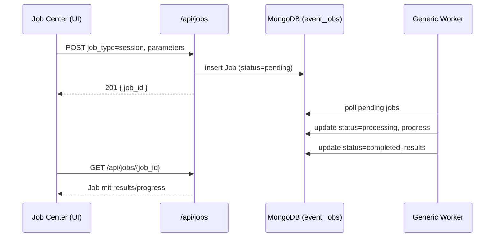

# Session manager logik analysieren
_Exported on 8/21/2025 at 18:24:32 GMT+2 from Cursor (1.4.5)_

---

**User**

@session-manager/ können wir die Logik von diesem Session Manager nochmal analysieren. Wie werden sessions erfasst und wie werden sie abgearbeitet?

---

**Cursor**

Ich starte mit einem Lese-/Analysepass: Ich öffne `src/app/session-manager/page.tsx`, schaue mir die API-Routen unter `src/app/api/sessions/` an und suche semantisch nach Stellen, wo Sessions erzeugt/erfasst und wie sie verarbeitet werden. Danach fasse ich die Architektur zusammen.

Ich habe die relevanten Dateien lokalisiert und lese sie parallel, um die Erfassung (Import/POST), Listung/Filterung (GET), Einzeloperationen, sowie die Abarbeitung (Generate-Jobs/Batches) vollständig zu verstehen.

Kurze Einordnung: Der Session Manager ist eine Client-Seite (use client) Verwaltungsoberfläche, die Sessions aus der DB listet, filtern lässt, neue Sessions per Website-Import erfasst und aus ausgewählten Sessions Event-Jobs/Batches erzeugt. Persistenz läuft über MongoDB via `SessionRepository`. Die Abarbeitung erfolgt, indem aus Sessions Jobs (status PENDING) und ein oder mehrere Batches erstellt werden; die eigentliche Ausführung übernimmt dann das Event-Monitor-/Worker-System.

### Erfassung (Sessions anlegen)
- UI: Im `SessionImportModal` werden Daten per Secretary-Service aus einer URL extrahiert, in das Session-Format gemappt und via API gespeichert (Single und Batch).
```160:227:src/components/session/session-import-modal.tsx
// Session erstellen (Single)
const response = await fetch('/api/sessions', {
  method: 'POST',
  headers: { 'Content-Type': 'application/json' },
  body: JSON.stringify({ sessions: [sessionData] })
});
```
- API-Validierung und Insert:
```61:111:src/app/api/sessions/route.ts
export async function POST(request: NextRequest) {
  const body = await request.json() as SessionCreateRequest;
  // ... Pflichtfelder prüfen ...
  const sessionIds = await repository.createSessions(body.sessions);
  return NextResponse.json({ status: 'success', data: { sessionIds } }, { status: 201 });
}
```
- Persistenz in MongoDB:
```45:67:src/lib/session-repository.ts
async createSessions(sessionsData: Omit<Session, 'id' | 'created_at' | 'updated_at'>[]): Promise<string[]> {
  const now = new Date();
  const sessions: Session[] = sessionsData.map(sessionData => ({
    ...sessionData, id: `session-${uuidv4()}`, created_at: now, updated_at: now
  }));
  await sessionCollection.insertMany(sessions);
  return sessions.map(s => s.id!);
}
```

### Listung und Filterung
- Der Manager lädt Sessions via GET `/api/sessions` mit Such-/Filterparametern und zeigt sie in einer Tabelle inkl. Auswahl an.
```80:96:src/app/session-manager/page.tsx
const params = new URLSearchParams();
if (searchTerm) params.set('search', searchTerm);
if (selectedEvent) params.set('event', selectedEvent);
...
const response = await fetch(`/api/sessions?${params.toString()}`);
```
- API-seitig werden Filter auf Query gebaut, inkl. Volltext-artige Suche über mehrere Felder:
```82:136:src/lib/session-repository.ts
if (search) {
  query.$or = [
    { session: { $regex: search, $options: 'i' } },
    { subtitle: { $regex: search, $options: 'i' } },
    { description: { $regex: search, $options: 'i' } },
    { filename: { $regex: search, $options: 'i' } },
    { url: { $regex: search, $options: 'i' } }
  ];
}
return await sessionCollection.find(query).sort({ created_at: -1 }).skip(skip).limit(limit).toArray();
```

### Abarbeitung (Jobs/Batches generieren)
- Ausgewählte Sessions → POST `/api/sessions/generate-jobs` mit `sessionIds`, `targetLanguage`, optional `groupByTrack`/`batchName`.
```142:161:src/app/session-manager/page.tsx
const response = await fetch('/api/sessions/generate-jobs', {
  method: 'POST',
  headers: { 'Content-Type': 'application/json' },
  body: JSON.stringify({ sessionIds: Array.from(selectedSessions), targetLanguage, batchName, groupByTrack })
});
```
- API: Lädt Sessions, erzeugt entweder
  - einen Batch + N Jobs (groupByTrack = false), oder
  - mehrere Batches nach Track gruppiert (groupByTrack = true), zählt Jobs/Batches und gibt sie zurück. Pro Job werden Session-Felder in `parameters` gemappt; Status initial PENDING.
```13:47:src/app/api/sessions/generate-jobs/route.ts
const { sessionIds, targetLanguage = 'de', batchName, groupByTrack = false } = await request.json();
const sessions = await Promise.all(sessionIds.map(id => sessionRepository.getSession(id)));
const validSessions = sessions.filter(s => s !== null);
```
```177:206:src/app/api/sessions/generate-jobs/route.ts
const jobData: Omit<Job, 'job_id' | 'created_at' | 'updated_at' | 'status'> = {
  job_type: 'event',
  job_name: `${session.event} - ${session.session}`,
  event_name: session.event,
  batch_id: batchId,
  user_id: 'session-generator',
  archived: false,
  parameters: {
    event: session.event, session: session.session, url: session.url, filename: session.filename,
    track: session.track, day: session.day, starttime: session.starttime, endtime: session.endtime,
    speakers: session.speakers || null, video_url: session.video_url, attachments_url: session.attachments_url || undefined,
    source_language: session.source_language, target_language: targetLanguage
  },
  access_control: { visibility: AccessVisibility.PRIVATE, read_access: ['session-generator'], write_access: ['session-generator'], admin_access: ['session-generator'] }
};
return jobRepository.createJob(jobData);
```
- Repository legt Batches/Jobs an, inkl. Default-Status/Zugriff:
```50:66:src/lib/event-job-repository.ts
const job: Job = { ...jobData, job_id, status: JobStatus.PENDING, created_at: now, updated_at: now, archived: false, access_control: jobData.access_control || this.createDefaultAccessControl(jobData.user_id) };
await jobCollection.insertOne(job);
```
```209:233:src/lib/event-job-repository.ts
const batch: Batch = { ...batchData, batch_id, created_at: now, updated_at: now, status: BatchStatus.PENDING,
  completed_jobs: 0, failed_jobs: 0, pending_jobs: batchData.total_jobs, processing_jobs: 0, archived: false,
  access_control: batchData.access_control || this.createDefaultAccessControl(batchData.user_id) };
await batchCollection.insertOne(batch);
```
- Danach leitet die UI zum Event-Monitor um:
```175:180:src/app/session-manager/page.tsx
setGenerateJobsDialog(false);
setSelectedSessions(new Set());
router.push('/event-monitor');
```
- Fortschritt/Status-Updates und Batch-Zusammenfassungen passieren zentral im `EventJobRepository` (z. B. `updateJobStatus`, `updateBatchProgress`), typischerweise von einem Worker/Processor aufgerufen, nicht vom Session Manager.

### Sonstiges
- Einzel-Operationen für Sessions (GET/PUT/DELETE) sind unter `/api/sessions/[id]` implementiert.
- Bulk-Löschen im UI nutzt DELETE `/api/sessions` mit `ids[]` und ruft `deleteSessions` im Repo auf.
- Verfügbare Events für Filter: GET `/api/sessions/events` (Clerk-authentifiziert) → `SessionRepository.getAvailableEvents`.

### Kurzfazit
- Erfassung: Website-Import → Validierung → Insert in `event_sessions`.
- Verwaltung: GET mit Filtern, Auswahl, Löschen.
- Abarbeitung: Auswahl → Generate-Jobs → `event_batches` + `event_jobs` (PENDING) → Weiterverarbeitung im Event-Monitor/Worker.

- Wichtig: Die eigentliche Job-Ausführung liegt außerhalb des Session Managers; hier wird die Pipeline nur vorbereitet.

- Verifikation: 
  - Single Import in der UI testen (URL eingeben, Daten prüfen, “Session erstellen”). 
  - In der Tabelle auftaucht? Filter testen.
  - Mehrere Sessions selektieren → Jobs generieren (ein Batch vs. nach Track gruppiert) → Weiterleitung zum Event-Monitor prüfen.

- API-Schnelltest (optional):
  - GET `/api/sessions?event=...&track=...`
  - POST `/api/sessions` mit einem minimal validen Session-Objekt
  - POST `/api/sessions/generate-jobs` mit `sessionIds: [...]`, `targetLanguage: 'de'`, `groupByTrack: true|false`

- Potenzielle Risiken: Pflichtfelder-Hartvalidierung im POST (fehlende `video_url` o. Ä. führen zu 400), Batch-Import bricht bei einzelnen Fehlern nicht ab (pro Eintrag wird robust geloggt); bewusst.

- Wenn du möchtest, baue ich eine kurze Sequenzgrafik oder ergänze Prüf-Skripte (curl/REST-Client) zur End-to-End-Validierung.

- Zusammenfassung
  - UI lädt/sortiert/filtert Sessions via `/api/sessions`; Auswahlzustand lokal.
  - Importiert Sessions per Secretary-Extraktion und POST `/api/sessions`.
  - Generiert Jobs/Batches aus ausgewählten Sessions per `/api/sessions/generate-jobs`.
  - Persistenz: `event_sessions`, `event_jobs`, `event_batches` in MongoDB; Statusverwaltung im `EventJobRepository`.

```typescriptreact
// Session erstellen (Single)
const response = await fetch('/api/sessions', {
  method: 'POST',
  headers: { 'Content-Type': 'application/json' },
  body: JSON.stringify({ sessions: [sessionData] })
});
```

```typescript
export async function POST(request: NextRequest) {
  const body = await request.json() as SessionCreateRequest;
  // ... Pflichtfelder prüfen ...
  const sessionIds = await repository.createSessions(body.sessions);
  return NextResponse.json({ status: 'success', data: { sessionIds } }, { status: 201 });
}
```

```typescript
async createSessions(sessionsData: Omit<Session, 'id' | 'created_at' | 'updated_at'>[]): Promise<string[]> {
  const now = new Date();
  const sessions: Session[] = sessionsData.map(sessionData => ({
    ...sessionData, id: `session-${uuidv4()}`, created_at: now, updated_at: now
  }));
  await sessionCollection.insertMany(sessions);
  return sessions.map(s => s.id!);
}
```

```typescriptreact
const params = new URLSearchParams();
if (searchTerm) params.set('search', searchTerm);
if (selectedEvent) params.set('event', selectedEvent);
...
const response = await fetch(`/api/sessions?${params.toString()}`);
```

```typescript
if (search) {
  query.$or = [
    { session: { $regex: search, $options: 'i' } },
    { subtitle: { $regex: search, $options: 'i' } },
    { description: { $regex: search, $options: 'i' } },
    { filename: { $regex: search, $options: 'i' } },
    { url: { $regex: search, $options: 'i' } }
  ];
}
return await sessionCollection.find(query).sort({ created_at: -1 }).skip(skip).limit(limit).toArray();
```

```typescriptreact
const response = await fetch('/api/sessions/generate-jobs', {
  method: 'POST',
  headers: { 'Content-Type': 'application/json' },
  body: JSON.stringify({ sessionIds: Array.from(selectedSessions), targetLanguage, batchName, groupByTrack })
});
```

```typescript
const { sessionIds, targetLanguage = 'de', batchName, groupByTrack = false } = await request.json();
const sessions = await Promise.all(sessionIds.map(id => sessionRepository.getSession(id)));
const validSessions = sessions.filter(s => s !== null);
```

```typescript
const jobData: Omit<Job, 'job_id' | 'created_at' | 'updated_at' | 'status'> = {
  job_type: 'event',
  job_name: `${session.event} - ${session.session}`,
  event_name: session.event,
  batch_id: batchId,
  user_id: 'session-generator',
  archived: false,
  parameters: {
    event: session.event, session: session.session, url: session.url, filename: session.filename,
    track: session.track, day: session.day, starttime: session.starttime, endtime: session.endtime,
    speakers: session.speakers || null, video_url: session.video_url, attachments_url: session.attachments_url || undefined,
    source_language: session.source_language, target_language: targetLanguage
  },
  access_control: { visibility: AccessVisibility.PRIVATE, read_access: ['session-generator'], write_access: ['session-generator'], admin_access: ['session-generator'] }
};
return jobRepository.createJob(jobData);
```

```typescript
const job: Job = { ...jobData, job_id, status: JobStatus.PENDING, created_at: now, updated_at: now, archived: false, access_control: jobData.access_control || this.createDefaultAccessControl(jobData.user_id) };
await jobCollection.insertOne(job);
```

```typescript
const batch: Batch = { ...batchData, batch_id, created_at: now, updated_at: now, status: BatchStatus.PENDING,
  completed_jobs: 0, failed_jobs: 0, pending_jobs: batchData.total_jobs, processing_jobs: 0, archived: false,
  access_control: batchData.access_control || this.createDefaultAccessControl(batchData.user_id) };
await batchCollection.insertOne(batch);
```

```typescriptreact
setGenerateJobsDialog(false);
setSelectedSessions(new Set());
router.push('/event-monitor');
```

---

**User**

@generic-worker.md im secretary service habe ich da jetzt einen neuen API-Endpoint, der generische Jobs übernimmt, nicht nur diese Events, sondern auch PDFs und andere Medien asynchron abarbeitet. könnten wir ein Konzept erstellen, wie wir jetzt eine ähnliche Logik wie bei diesem Event Manager auch für diesen generischen Jobs bauen. Das Ziel ist es, am Ende diesen Event Manager zu ersetzen durch die neue generische Logik. Wie könnten wir das machen?

---

**Cursor**

Ich mache einen kurzen Such-/Analysepass, um zu prüfen, welche generischen Job-/Batch-Endpunkte bereits existieren (z. B. `/api/jobs`, `/api/jobs/batch`) und wie weit `EventJobRepository` schon generisch nutzbar ist. Danach skizziere ich das Migrationskonzept (API, UI, Typen, Worker-Integration) und einen inkrementellen Rolloutplan.

Ich erstelle ein Konzeptdokument unter `docs/_analysis/generic-worker-migration.md` mit Architektur, API/UI-Plan, Migrationsschritten, Tests und Risiken, um die Event-spezifische Logik auf generische Jobs zu heben. Danach fasse ich die Kernaussagen hier kurz zusammen.

```markdown
### Migration: Vom Event Manager zum generischen Job-/Batch-System

Ziel: Die bisher event-spezifische Session-/Job-Logik in eine generische, typ-basierte Job-Verarbeitung überführen (job_type ∈ {session, pdf, audio, video, …}), mit vereinheitlichter API, UI und Worker-Integration. Grundlage ist der generische Worker (siehe `docs/_instructions/generic-worker.md`) und das bestehende `EventJobRepository`. Dieser Plan baut auf der bereits beschlossenen generischen Dokumentverarbeitung und Batch-Fähigkeit auf [[memory:5008116]].

---

#### 1) Ausgangslage (Ist-Zustand)
- UI: `Session Manager` (`/session-manager`) importiert Sessions (Webseiten-Extraktion), speichert in `event_sessions` und erzeugt daraus Event-Jobs/Batches via `/api/sessions/generate-jobs`.
- Daten: Drei Sammlungen in MongoDB: `event_sessions`, `event_jobs`, `event_batches`.
- Verarbeitung: Event-spezifische Jobs (job_type = "event") werden vom Event-Monitor/Worker verarbeitet. Fortschritt via `EventJobRepository`.

Probleme: Doppeltes Modell (Sessions separat + Jobs), Event-Spezialisierung, kein generisches API für weitere Medien (PDF, Audio, …).

---

#### 2) Zielbild (Soll-Zustand)
- Einheitliche API für Jobs/Batches:
  - `POST /api/jobs` (Einzeljob, generisch)
  - `POST /api/jobs/batch` (Batch mit N Jobs, gemischt nach `job_type`)
  - `GET /api/jobs` (Filter: status, job_type, search, batch_id, created_at)
  - `GET /api/jobs/{job_id}`
  - `GET /api/batches` (Filter: status, isActive, archived, job_type?, search?)
  - `GET /api/batches/{batch_id}`
  - Batch-Aktionen: `POST /api/batches/{batch_id}/restart`, `/archive`, `/fail`, `/pending` (optional: mit Options-Payload)

- UI: Ein "Job Center" ersetzt den Event Manager:
  - Seite `/jobs`: Liste aller Jobs, Filter (Status, Typ, Suche), Fortschritt, Aktionen.
  - Seite `/batches`: Liste aller Batches mit Aggregaten und Filterung; Detailansicht mit Jobs.
  - Erstellen: Wizard/Modal „Neuer Job/Batch“ mit Typ-Auswahl (Session/PDF/Audio/…).
  - Session-Import integriert als „Job vom Typ session erzeugen“ (kein separater Session-Datensatz nötig).

- Worker: Generischer Registry-/Dispatch-Mechanismus (bereits in `generic-worker.md`) führt Handler pro `job_type` aus; Status-/Progress-Updates via `EventJobRepository`.

---

#### 3) Datenmodell und Indizes
- Jobs (`event_jobs`): Felder bestehen bereits; wichtig: Indexe auf `{ status, job_type, created_at }`, `{ batch_id }`, `{ event_name }` (falls genutzt).
- Batches (`event_batches`): Indexe auf `{ status, created_at }`, `{ isActive }`.
- Sessions: Übergangsphase; später entbehrlich. Referenzierbare Session-Felder wandern in `job.parameters`.

---

#### 4) API-Entwurf (App Router, Clerk-Auth, strikte Typen)
- Contracts verwenden `src/types/event-job.ts` (Job, Batch, Status, Responses) und folgen den App-Router-Regeln (Params awaiten, typisierte Bodies/Responses, korrekte HTTP-Codes, Fehlerlogging).
- Endpunkte (neu):
  - `src/app/api/jobs/route.ts` (GET/POST)
  - `src/app/api/jobs/[id]/route.ts` (GET/DELETE/PATCH für Statusänderung)
  - `src/app/api/jobs/batch/route.ts` (POST)
  - `src/app/api/batches/route.ts` (GET)
  - `src/app/api/batches/[id]/route.ts` (GET/DELETE)
  - `src/app/api/batches/[id]/{restart|archive|fail|pending}/route.ts` (POST)

Validierung: Zod-Schemas pro Endpoint; `job_type` required; `parameters` validiert je Typ (discriminated union), aber Storage bleibt generisch.

Sicherheit: Clerk-Auth an allen Mutations-Endpunkten; Responses maskieren Secrets; Logs nur serverseitig.

---

#### 5) UI-Entwurf (Next.js, Shadcn, RSC-first)
- Neue Routen:
  - `src/app/jobs/page.tsx`: Jobs-Tabelle mit Filtern (Status, Typ, Textsuche), Pagination, Mehrfachaktionen (Restart/Delete, optional Batch-Zuweisung).
  - `src/app/batches/page.tsx`: Batches mit Status-Badges, Progress, Actions; Klick → Batch-Detail.
  - `src/app/batches/[id]/page.tsx`: Batch-Detail inkl. Jobliste (Lazy-Pagination), Restart/Pending/Fail/Archive.
- Erstell-Flow:
  - "Neuer Job"-Dialog: Auswahl `job_type` → typ-spezifisches Parameterformular (Session: URL, Sprache; PDF: URL/Methoden/Flags …).
  - „Neuer Batch“: Liste von Jobs unterschiedlicher Typen zusammenstellen.
- Migration UI: `SessionImportModal` ruft künftig `POST /api/jobs` (job_type=session); optional Wizard bleibt identisch, nur Ziel-API tauschen.

Performance: Server Components für Listen, Suspense-Fallbacks, Client nur wo nötig (Filter-Controls). TanStack Query optional für Polling.

---

#### 6) Migrationsfahrplan (inkrementell, risikoarm)
Phase 0 – Parallelbetrieb vorbereiten
- Neue API-Endpunkte implementieren, ohne bestehendes `/api/sessions` zu ändern.
- Job Center (`/jobs`, `/batches`) als Preview-Seiten.

Phase 1 – Erzeugung umlenken
- `SessionImportModal`: Statt `/api/sessions` → direkt `POST /api/jobs (job_type=session)`.
- `/api/sessions/generate-jobs`: Intern auf `POST /api/jobs/batch` umstellen (Adapter), Response kompatibel halten.

Phase 2 – Sichtbarkeit drehen
- `Session Manager` nur noch lesend; prominent Link „Zum Job Center“.
- Neue Features (PDF, Audio) ausschließlich im Job Center.

Phase 3 – Ablösen und Aufräumen
- Sessions optional migrieren (Sessions → Jobs), oder `event_sessions` archivieren.
- Entfernen: `/api/sessions/generate-jobs` und Session-spezifische UI.

Rollback-Strategie: Adapter-Endpunkte lassen Rückbau auf alte Flows zu, bis Telemetrie stabil ist.

---

#### 7) Tests und Qualität
- Unit (Vitest):
  - Repositories (`EventJobRepository`): createJob, createBatch, updateJobStatus, updateBatchProgress.
  - API-Handler: Validierung, Fehlerpfade, Paginierung.
- E2E (Playwright):
  - „Neuer Job (session)“ → Worker-Simulation → Statuswechsel sichtbar.
  - „Neuer Batch (pdf+session)“ → Jobs gelistet, Batch-Aggregate korrekt.
- Monitoring/Logs: Konsistente `logs[]`-Einträge je Statuswechsel, UI-Ansicht für Logs im Job-Detail.

---

#### 8) Risiken & Gegenmaßnahmen
- Doppelquellen (Sessions vs. Jobs): Früh Job-First schreiben, Sessions nur lesend. Adapter minimiert Bruch.
- Index/Skalierung: Vorab Indizes anlegen, Cursor-Pagination, Limit/Skip.
- Fehlertypen: Einheitliche `JobError`-Codes je Handler; UI-Filterung nach Fehlerklassen.

---

#### 9) Offene Punkte
- Sollen Session-Datensätze langfristig entfernt oder als Audit erhalten bleiben?
- Archiv-Handling (ZIP/Assets) vereinheitlichen: Download-Routen generisch?
- Access Control: Feingranular pro Job/Batch oder nur user_id-basiert?

---

#### 10) Grobe Aufgabenliste (Umsetzung)
1. Endpunkte `/api/jobs`, `/api/jobs/batch`, `/api/batches` implementieren (Typen, Zod, Auth, Repos).
2. Indizes für `event_jobs`/`event_batches` setzen.
3. UI: `/jobs`, `/batches`, Batch-Detail, Job-Detail, „Neuer Job/Batch“-Dialoge.
4. `SessionImportModal` auf `POST /api/jobs` umstellen; `/api/sessions/generate-jobs` → Adapter.
5. Worker-Registry: Handler für `session`, `pdf` aktivieren; Logs/Progress konsistent.
6. Tests: Unit + E2E; Telemetrie-Dashboards.
7. Phase-2/3-Schalter setzen (Feature Flags), Sessions ablösen.

---

#### 11) Sequenz (Beispiel: Session-Job)



```

Kurzer Stand: Ich habe ein Migrationskonzept erstellt und unter `docs/_analysis/generic-worker-migration.md` abgelegt. Es beschreibt API-/UI-Design, Datenmodell, Migrationsphasen, Tests und Risiken – abgestimmt auf den generischen Worker aus `docs/_instructions/generic-worker.md` und konsistent mit dem bestehenden `EventJobRepository`. Damit ersetzen wir schrittweise den Event-Manager durch ein generisches Job-/Batch-System [[memory:5008116]].

### Zielbild (kurz)
- Einheitliche, typbasierte Jobs: `job_type ∈ {session, pdf, audio, video, …}`.
- Ein „Job Center“ ersetzt den Event Manager: eine UI für Jobs/Batches, Filter, Status, Aktionen.
- Worker führt Jobs asynchron aus (Registry/Dispatch), Status-/Progress via `EventJobRepository`.

### API (neu)
- POST/GET `api/jobs` (Einzeljob generisch; Filter: status, job_type, search, batch_id).
- POST `api/jobs/batch` (gemischte Typen in einem Batch).
- GET `api/batches`, GET `api/batches/{batch_id}`; Aktionen: `{restart|archive|fail|pending}`.
- Auth über Clerk; Zod-Validierung; strikte Typen. Hinweis: Aktuell existiert kein `api/jobs` → wird neu implementiert.

### UI
- `src/app/jobs/page.tsx`: Jobliste (+ Filter, Mehrfachaktionen).
- `src/app/batches/page.tsx` und `src/app/batches/[id]/page.tsx`: Batchliste und -detail mit Fortschritt.
- „Neuer Job/Batch“-Dialog mit typ-spezifischen Parametern.
- `SessionImportModal`: künftig direkt `POST /api/jobs` mit `job_type=session` (statt `/api/sessions`).

### Migration (inkrementell)
- Phase 0: Neue Endpunkte + „Job Center“ parallel einführen.
- Phase 1: Erzeugung umlenken (Import → `POST /api/jobs`; `/api/sessions/generate-jobs` als Adapter auf `POST /api/jobs/batch`).
- Phase 2: Sichtbarkeit drehen (Event Manager nur lesend; Link zum Job Center).
- Phase 3: Sessions ablösen/archivieren; Session-spezifische Routen entfernen.

### Tests
- Unit (Vitest): Repos (Jobs/Batches), API-Handler (Validierung, Fehlerpfade), Pagination.
- E2E (Playwright): Neuer Session-Job, gemischter Batch (pdf+session), Statuswechsel inkl. Worker-Simulation.
- Monitoring: konsistente `logs[]`, Anzeige in Job-Detail.

### Nächste Schritte (konkret)
- Implementieren: `api/jobs`, `api/jobs/batch`, `api/batches` (+ Detail-/Aktionsrouten).
- Indizes für `event_jobs`/`event_batches`.
- UI-Seiten `jobs`/`batches` und Dialoge.
- `SessionImportModal` auf `POST /api/jobs` umstellen; `/api/sessions/generate-jobs` → Adapter.
- Basis-Tests (Unit/E2E) und Telemetrie.

Kurzfazit: Wir vereinheitlichen Erfassung und Abarbeitung über generische Jobs/Batches. Event Manager wird so schrittweise obsolet zugunsten eines „Job Centers“. Siehe Details in `docs/_analysis/generic-worker-migration.md`.

- Ich habe ein Migrationskonzept in `docs/_analysis/generic-worker-migration.md` erstellt (API, UI, Phasen, Tests).
- Bestätigung: Kein `api/jobs` vorhanden; neu anzulegen.
- Vorschlag: Nächster Schritt ist das Anlegen der neuen API-Routen und Grundgerüste der `jobs`/`batches`-Seiten, danach `SessionImportModal` umhängen.

---

**User**

Okay, aber bevor wir jetzt das implementieren, möchte ich nochmal genauer wissen, wie werden dann am Ende die asynchron verarbeiteten Medien nochmal in den Storage, in unseren Storage kopiert. Was ist das denn, nochmal ein manueller Tasks.
Und ist uns schon bewust, dass die API im Secretary Service bereitsteht.


---

**Cursor**

Ich prüfe kurz, welche Storage-Utilities und -APIs es bereits gibt, damit ich präzise skizziere, wie Ergebnisse aus Jobs (PDF/Session etc.) in unseren Storage kopiert werden sollen. Danach gebe ich eine knappe, konkrete Antwort mit vorgeschlagenem Ablauf und bestätige den Secretary-API-Status.

Kurzantwort:
- Die Ergebnisse werden NICHT manuell kopiert. Wir bauen eine automatische “Ingest”-Strecke: Nach Job-Abschluss holt unser Backend das Ergebnis vom Secretary-Service und legt es über unsere Storage-Provider-API im Ziel-Storage ab.
- Ja, die Secretary-API steht bereit. Endpunkte: `POST /jobs`, `POST /jobs/batch`, `GET /jobs/{job_id}`, `GET /jobs/{job_id}/download-archive`.

Vorgeschlagene Umsetzung (robust, ohne manuelle Tasks):
- Option A: Push/Webhook (bevorzugt)
  1) Beim Erzeugen eines Jobs übergeben wir Storage-Zielinfo mit: `libraryId`, `targetPath` (und optional eine signierte Upload-URL zu `POST /api/storage/filesystem/upload-archive`).
  2) Secretary ruft nach Abschluss unseren Webhook `POST /api/jobs/ingest-callback` auf. Entweder:
     - Secretary lädt das ZIP direkt auf unsere bereitgestellte Upload-URL hoch, oder
     - unser Callback lädt per `GET /jobs/{job_id}/download-archive` und postet dann zu `POST /api/storage/filesystem/upload-archive` mit `file`, `targetPath`, `libraryId`.
  3) Wir markieren den Job als “ingested” (Flag im Job oder Metadaten), damit er nicht doppelt verarbeitet wird.

- Option B: Pull/Polling (fallback, wenn kein Webhook)
  1) Hintergrund-Worker in unserer App pollt periodisch `GET /jobs?status=completed` (nur nicht-„ingested“ Jobs).
  2) Für jeden Job: `GET /jobs/{job_id}/download-archive` → `POST /api/storage/filesystem/upload-archive` mit Zielpfad/Library.
  3) Job als “ingested” markieren.

Details zur Ablage:
- Vorhandene Route: `POST /api/storage/filesystem/upload-archive` akzeptiert `file`, `targetPath`, `libraryId`. Sie legt die Datei in unserer Storage-Hierarchie ab und erstellt nötige Ordner automatisch.
- Pfad-Strategie (Beispiel):
  - Sessions: `sessions/{event}/{track}/{filename or session}.zip` plus optional separate `.md`-Datei aus `results.markdown_content` unter demselben Ordner.
  - PDFs: `pdf/{yyyy-mm}/{job_id}.zip` und ggf. extrahierte `.md` separat.
- Falls wir neben dem ZIP auch einzelne Dateien persistieren (Markdown), nutzen wir direkt den Storage-Provider (`uploadFile`) oder ergänzen eine kleine API `POST /api/storage/filesystem/upload-text` für serverseitiges Ablegen einer Textdatei.

Sicherheit/Robustheit:
- Webhook authentifizieren (HMAC-Signatur oder kurzlebiges Token).
- Upload-URL mit kurzlebigem Token signieren.
- Idempotenz: “ingested”-Flag auf Job oder eigener Ingest-Tabelle.
- Fehlerpfad: Retries, Logging (Job-Logs via `EventJobRepository`), Dead-letter (Markierung „ingest_failed“).

UI-Integration:
- Automatik: “Auto-Speichern nach Abschluss” als Default.
- Optionaler manueller Button “In Storage speichern”, der denselben Server-Flow on-demand auslöst (nur als Fallback).

Antwort auf deine Fragen:
- Nein, das ist kein manueller Task. Wir automatisieren über Webhook (oder Polling als Fallback) und die vorhandene Upload-Route.
- Ja, uns ist bewusst: Die Secretary-API steht. Wir nutzen `GET /jobs/{job_id}` und `GET /jobs/{job_id}/download-archive` für den Pull-Fall bzw. lassen Secretary im Push-Fall direkt auf unsere Upload-Route schreiben.

Kurz nächste Schritte:
- Webhook-Endpoint `POST /api/jobs/ingest-callback` anlegen.
- Ingest-Service implementieren: Download aus Secretary → Upload zu `api/storage/filesystem/upload-archive` → Job mit Flag markieren.
- Beim Job-Create Storage-Ziel und optional signierte Upload-URL mitgeben (für Push).

---

**User**

ok, becor wir das machen, noch diese Überlegung:
Und denken wir mal an PDF-Dokumente. Ich habe eine Verzeichnisstruktur über 3-4 Ebenen und mit einigen 100 PDF-Dokumenten und die möchte ich jetzt alle als eigene Jobs einreichen, um sie zu verarbeiten. Und wenn sie fertig sind, in die entsprechenden Verzeichnisse wieder kopieren. Wie würde das Szenario aussehen und wo könnten wir das integrieren? File Tree oder File List oder eine eigene Komponente, die eine Verzeichnisstruktur durchscannt und Badges erstellt, so ähnlich wie bei den Events dieses Import vom Website. So, Import Jobs von Verzeichnisstruktur, sowas in der Richtung.

---

**Cursor**

Kurz und präzise:

- Ja, die Secretary-API steht bereit. Wir können sofort `POST /jobs`, `POST /jobs/batch`, `GET /jobs/{job_id}`, `GET /jobs/{job_id}/download-archive` nutzen.

- Kein manueller Kopier-Task: Wir übernehmen die Ablage automatisiert. Nach Abschluss zieht unser Backend die Ergebnisse (Webhook bevorzugt, Polling als Fallback) und legt sie über `POST /api/storage/filesystem/upload-archive` wieder im gleichen Ordnerbaum ab. Zielpfad wird aus dem Originalpfad abgeleitet.

Vorschlag für “PDF-Verzeichnis → viele Jobs → Ergebnisse zurück in Struktur”:

- Erfassung/Enqueue
  - Neue Komponente: „PDF-Bulk-Import“.
    - Variante A: Integration in `library`-Ansicht
      - Button im Header der Library („PDF-Verzeichnis verarbeiten“).
      - Modal/Wizard: Wähle Wurzelordner (per `FileTree`), Optionen (extraction_method, include_images, targetLanguage, use_cache).
      - Rekursiver Scan via Storage-Provider (`listItemsById`), Filter `.pdf`, Anzeige von Counts und Preview.
      - Chunked Enqueue: `POST /api/jobs/batch` in Paketen à z. B. 200; pro Job:
        - `job_type: "pdf"`
        - `parameters`: `url` = signierte Download-URL unseres Files (`/api/storage/filesystem?action=binary&fileId=...&token=...`), `library_id`, `storage_provider`, `file_id`, `original_path`, `target_language`, `extraction_method`, `include_images`, `use_cache`, `target_path` (aus Parent-Pfad abgeleitet).
        - Idempotenz: Key `file_id + modifiedAt` im Job-Parameter; nicht erneut einreihen, wenn bereits „completed“ mit gleichem Key existiert.
    - Variante B: Eigene Seite `app/library/import-pdf/` für große Scans (Server-gestützt, stabiler bei 1000+ Dateien).
    - Variante C: Headless-CLI/Script, das unsere API nutzt (für sehr große Bestände, ohne UI).

- Abarbeitung/Ingress
  - Bevorzugt: Webhook `POST /api/jobs/ingest-callback` (mit Signatur).
    - Secretary sendet `job_id`, Metadaten; wir laden, falls kein Direktupload erfolgte, Archiv via `GET /jobs/{job_id}/download-archive`.
    - Upload zurück per `POST /api/storage/filesystem/upload-archive` nach `targetPath` (Parent-Pfad + z. B. `{basename}.zip` oder extrahierte `.md` separat).
    - Job mit Flag `ingested: true` markieren (oder `results.ingested_at`), um Doppelverarbeitung zu vermeiden.
  - Fallback: Poller (z. B. alle 60s) für `status=completed AND !ingested`.

- UI-Feedback/Badges (ähnlich Events)
  - FileTree/FileList reichern Einträge mit Status-Badges an: queued, processing, completed, failed.
  - Umsetzung: Map von `file_id → job_status` via `GET /api/jobs?parameters.file_id=...` (Filter-Endpunkt ergänzen) oder kleiner Index in unserer DB.
  - Aggregation auf Ordnerebene (z. B. „12/200 completed“).

- Rückschreiben in gleiche Struktur
  - Standard: Ergebnisse im gleichen Ordner wie das Original:
    - Archive: `{basename}.zip`
    - Extrahierte Markdown: `{basename}.md` oder `{basename}.{lang}.md` (Shadow-Twin-Konvention).
  - Optional konfigurierbar: Unterordner `processed/` oder `extracted/`.

- Robustheit
  - Große Bäume: lazy Scan, Pagination, Chunked Enqueue, Rate-Limits.
  - Idempotenz & Wiederaufnahme: manifest mit Checksummen/modifiedAt; „nur neue/änderte PDFs“.
  - Fehlerbehandlung: Retries, klare `JobError`-Codes, UI-Filter „failed“.

- Integrationsempfehlung
  - Start mit Variante A (schnelle Value), parallel Option B für sehr große Repositories vorbereiten.
  - Neue Komponente: `src/components/library/pdf-bulk-import.tsx`; Badges in `file-list.tsx`/`file-tree.tsx`.
  - Neue API: `api/jobs`, `api/jobs/batch`, `api/jobs/search` (Filter auf `parameters.file_id`), Webhook `api/jobs/ingest-callback`.

Kurztests, bevor wir bauen:
- 10 PDFs in tiefem Ordner scannen → 2 Batches erstellen → Status-Badges erscheinen → Abschluss triggert Auto-Upload → Dateien liegen im jeweiligen Ordner.

---

**User**

Ok, können wir mit Variante A beginnen und vielleicht noch eine Option. Ignore existing transformations. Das heißt, wenn ein PDF-Dokument schon seinen Zwilling hat, dann soll man das PDF ignorieren. Weil das Ziel ist es ja, dass am Ende jede PDF-Datei seinen Shadow-Twin hat, mit dem Markdown-Inhalt. Und in dem Dialog, wenn man diese OCR-Variante angibt, eben auch ein Verzeichnis mit den einzelnen Seiten hat. Der Dialog sollte gleich aussehen wie jetzt schon, wenn man ein PDF transkribieren möchte. Die gleichen Features bieten.

---

**Cursor**

Kurze Einschätzung
- Ja, Variante A ist sinnvoll. Wir integrieren einen „PDF-Bulk-Import“-Dialog in die Library-Ansicht und nutzen die vorhandenen Optionen wie beim Einzel-PDF-Dialog.
- Kernpunkte: rekursiver Scan ab gewähltem Ordner, „Ignore existing transformations“ (Shadow-Twin-Check), Enqueue als generische PDF-Jobs in Batches, automatische Ingestion zurück in denselben Ordnerbaum, Status-Badges in FileList/FileTree.

Vorschlag: UI/Flow (Variante A)
- Platzierung
  - Neuer Button „PDF-Verzeichnis verarbeiten“ im Library-Header von `src/components/library/library.tsx` (gleich neben bestehenden Aktionen).
  - Neuer Dialog `src/components/library/pdf-bulk-import-dialog.tsx`.
- Dialog-Inhalte (wie `PdfTransform`)
  - Ziel-Sprache, Extraction-Method (`native`/`ocr`), Use-Cache, Include-Images, Dateiname/Rückschreib-Strategie.
  - Zusatzoption: „Ignore existing transformations“ (default: aktiv).
  - Quellordner: aktueller Ordner aus FileTree, optional Wechsel.
  - Dry-Run: rekursiv scannen, Trefferliste mit Countern (gesamt PDFs, bereits transformiert, neu zu verarbeiten).
- Scan-Logik (Client ruft Server-Action/Route)
  - Rekursiv via Storage-Provider (`listItemsById`) ab Wurzelordner.
  - PDF-Erkennung: `.pdf` oder MIME `application/pdf`.
  - Shadow-Twin-Check: gleiche Basename-Konvention wie in `file-list.tsx`/`shadow-twin.ts` (z. B. `{basename}.{lang}.md`); falls vorhanden und „Ignore existing transformations“ aktiv → überspringen.
- Enqueue
  - Chunked Batches (z. B. 100–200 Files pro Batch) an Secretary `POST /jobs/batch` mit `job_type: "pdf"`.
  - Parameter je Job: `url` (signierte Download-URL unseres Providers), `file_id`, `original_path`, `library_id`, `target_language`, `extraction_method`, `include_images`, `use_cache`, `target_path` (Elternpfad; für Seitenordner: `{basename}.pages/`).
  - Idempotenz: Key `file_id + modifiedAt` im Job; beim erneuten Scan optional „nur neue/aktualisierte“.
- Ingestion (automatisch)
  - Webhook (bevorzugt) oder Polling: nach `completed` lädt unser Backend Archiv/Artefakte und schreibt sie via `POST /api/storage/filesystem/upload-archive` in den Zielordner:
    - Markdown-Shadow-Twin: `{basename}.{lang}.md` neben der PDF.
    - OCR-Seiten: Ordner `{basename}.pages/` mit Seiten-Dateien/Assets.
- Status/Badges
  - FileList/FileTree: leichte Aggregation (queued/processing/completed/failed) per Map `file_id → job_status`.
  - Progressanzeige im Dialog (Jobs enqueued, remainder, Fehler).

Technische Eckpunkte
- Komponenten
  - `pdf-bulk-import-dialog.tsx`: UI, Dry-Run-Preview, Optionen, Start/Progress.
  - Optionales Hook `useRecursiveFolderScan(provider, rootId, { ignoreExisting })`.
- Erkennung „existing transformations“
  - Gleiche Logik wie `file-list.tsx`:
    - Basename: alles vor letzter Endung.
    - Shadow-Twin: Regex `^(.+)\\.(de|en|fr|es|it)\\.md$` bzw. `generateShadowTwinName(...)` aus `shadow-twin.ts`.
    - Treffer, wenn im selben Ordner ein passender Twin existiert (oder eine beliebige Sprache, falls „irgendein Twin“ reicht).
- Rückschreiben OCR-Seiten
  - Bei `extractionMethod=ocr` legen wir `{basename}.pages/` an und schreiben Seiten/Assets aus Job-Result (Secretary liefert ZIP oder strukturierte Pfade); Upload über vorhandene Upload-Route.

Warum so?
- Skaliert auf hunderte PDFs: rekursiver Scan + Chunked Enqueue.
- Keine Doppelarbeit: „Ignore existing transformations“ verhindert Re-Processing.
- UI bleibt konsistent: gleiche Optionen wie bei `PdfTransform`, nur auf Batch-Ebene.

Nächste minimal-invasive Schritte
- UI: Button + Dialog-Skelett mit denselben Optionen wie `PdfTransform`.
- Server: kleine Route/Action „scan-and-plan“ (liefert Dry-Run-Liste) und „enqueue-batch“ (chunked).
- Shadow-Twin-Check: Utility extrahieren aus `file-list.tsx`/`shadow-twin.ts` und wiederverwenden.
- Badge-Anzeige: einfacher Read-Only-Status in `FileList` zuerst.

- Integration in `library`: neuer Dialog für Bulk-PDF, Option „Ignore existing transformations“, gleiche Optionen wie `PdfTransform`.
- Rekursiver Scan via Storage-Provider, Twin-Check nach Shadow-Twin-Konvention, Enqueue als Batches zu Secretary, automatische Ingestion zurück in denselben Ordner, OCR-Seiten in `{basename}.pages/`.

---

**User**

ök

---

**Cursor**

Klar, wir starten mit Variante A und ergänzen „Ignore existing transformations“.

### Umsetzung (konkret und minimal-invasiv)
- UI-Komponente
  - Neu: `src/components/library/pdf-bulk-import-dialog.tsx`
  - Trigger: zusätzlicher Button „PDF-Verzeichnis verarbeiten“ in `src/components/library/library-header.tsx`
  - Optionen wie im Einzel-Dialog `PdfTransform` via vorhandener `TransformSaveOptions`:
    - `targetLanguage`, `extractionMethod` (native/ocr), `useCache`, `includeImages`, Dateinamensschema
    - Neu: Checkbox „Ignore existing transformations“ (default: an)
  - Dry-Run: rekursiver Scan ab aktuellem Ordner (über Provider `listItemsById`), Zählung:
    - gesamt PDFs, bereits transformiert, verbleibend
  - Start: Chunked Enqueue (z. B. 100–200 Dateien/Batch) → Secretary `POST /jobs/batch` mit `job_type: "pdf"`

- Scan- und Filterlogik
  - PDF-Erkennung: `.pdf` oder MIME `application/pdf`
  - Shadow-Twin-Erkennung (gleiches Muster wie `file-list.tsx`/`shadow-twin.ts`):
    - Basename = Name ohne letzte Endung
    - Twin exists, wenn im selben Ordner eine Datei `{basename}.{lang}.md` existiert
    - Wenn „Ignore existing transformations“ aktiv, solche PDFs überspringen
  - OCR-Variante: zusätzlich Ziel-Unterordner `{basename}.pages/` für Seiten/Assets vormerken

- Job-Payload pro PDF
  - `parameters`: `url` (signierte Download-URL unseres Providers), `file_id`, `original_path`, `library_id`, `target_language`, `extraction_method`, `include_images`, `use_cache`, `target_path` (Elternpfad), `pages_dir` (bei OCR: `{basename}.pages/`)
  - Idempotenz: Schlüssel `file_id + modifiedAt` in `parameters` → Secretary/Proxy prüft und vermeidet Duplikate

- Ingestion (automatisch)
  - Webhook (bevorzugt) oder Polling lädt `GET /jobs/{job_id}/download-archive` und schreibt via `POST /api/storage/filesystem/upload-archive`:
    - Markdown: `{basename}.{lang}.md` neben das PDF
    - OCR-Seiten: `{basename}.pages/` mit Seiten/Assets

- Badges/Feedback
  - In `FileList`/`FileTree` werden pro `file_id` Job-Status-Badges angezeigt (queued/processing/completed/failed)
  - Fortschritt im Dialog: „enqueued / remaining / errors“

### Nächste Schritte (inkrementell)
- Button + Dialog-Skelett anlegen und Optionen spiegeln wie in `PdfTransform`
- Rekursiver Scanner (Provider-basiert) mit Shadow-Twin-Filter
- Batch-Enqueue an Secretary (zunächst ohne Webhook, optional Proxy-Route)
- Einfache Status-Badges in `FileList`

Kurz: Der Dialog verhält sich wie der bestehende Einzel-PDF-Dialog, ergänzt um „Ignore existing transformations“ und rekursives Enqueue vieler PDFs mit automatischem Rückschreiben in denselben Ordnerbaum.

---

**User**

ok

---

**Cursor**

Ich lege eine neue Komponente für den PDF-Bulk-Import an und binde sie in den Library-Header ein. Der Dialog enthält die gleichen Optionen wie der Einzel-PDF-Dialog plus „Ignore existing transformations“ und führt einen rekursiven Dry-Run-Scan durch, um Kandidaten zu zählen. Anschließend füge ich den Button im Header hinzu, der den Dialog öffnet. Jetzt implementiere ich die Änderungen.

```typescriptreact
'use client';

import { useCallback, useEffect, useMemo, useState } from 'react';
import { useAtomValue } from 'jotai';
import { activeLibraryIdAtom, currentFolderIdAtom } from '@/atoms/library-atom';
import { useStorage } from '@/contexts/storage-context';
import { StorageItem } from '@/lib/storage/types';
import { Button } from '@/components/ui/button';
import { Checkbox } from '@/components/ui/checkbox';
import { Label } from '@/components/ui/label';
import {
  Dialog,
  DialogContent,
  DialogDescription,
  DialogFooter,
  DialogHeader,
  DialogTitle,
} from '@/components/ui/dialog';
import { ScrollArea } from '@/components/ui/scroll-area';
import { Separator } from '@/components/ui/separator';
import { TransformSaveOptions as SaveOptionsComponent } from '@/components/library/transform-save-options';
import type { TransformSaveOptions as SaveOptionsType } from '@/components/library/transform-save-options';
import { FileLogger } from '@/lib/debug/logger';

interface PdfBulkImportDialogProps {
  open: boolean;
  onOpenChange: (open: boolean) => void;
}

interface ScanStats {
  totalPdfs: number;
  skippedExisting: number;
  toProcess: number;
}

export function PdfBulkImportDialog({ open, onOpenChange }: PdfBulkImportDialogProps) {
  const { provider } = useStorage();
  const rootFolderId = useAtomValue(currentFolderIdAtom);
  const activeLibraryId = useAtomValue(activeLibraryIdAtom);

  const [ignoreExisting, setIgnoreExisting] = useState(true);
  const [isScanning, setIsScanning] = useState(false);
  const [isEnqueuing, setIsEnqueuing] = useState(false);
  const [candidates, setCandidates] = useState<Array<{ file: StorageItem; parentId: string }>>([]);
  const [preview, setPreview] = useState<string[]>([]);
  const [stats, setStats] = useState<ScanStats>({ totalPdfs: 0, skippedExisting: 0, toProcess: 0 });

  // Optionen wie im Einzel-PDF-Dialog
  const [saveOptions, setSaveOptions] = useState<SaveOptionsType>({
    targetLanguage: 'de',
    fileName: '',
    createShadowTwin: true,
    fileExtension: 'md',
    extractionMethod: 'native',
    useCache: true,
    includeImages: false,
  });

  // Shadow-Twin Erkennung (z. B. name.de.md)
  const shadowTwinRegex = useMemo(() => /^(.+)\.(de|en|fr|es|it)\.md$/i, []);

  const getBaseName = useCallback((name: string): string => {
    const lastDot = name.lastIndexOf('.');
    return lastDot === -1 ? name : name.substring(0, lastDot);
  }, []);

  const hasTwinInFolder = useCallback(
    (siblings: StorageItem[], pdfBase: string, lang?: string): boolean => {
      if (lang) {
        const expected = `${pdfBase}.${lang}.md`;
        return siblings.some((i) => i.type === 'file' && i.metadata.name.toLowerCase() === expected.toLowerCase());
      }
      // Fallback: irgendein Twin in beliebiger Sprache
      return siblings.some((i) => i.type === 'file' && shadowTwinRegex.test(i.metadata.name));
    },
    [shadowTwinRegex]
  );

  // rekursiver Scan
  const scanFolder = useCallback(async (folderId: string) => {
    if (!provider) return { total: 0, skipped: 0, selected: [] as Array<{ file: StorageItem; parentId: string }>, previews: [] as string[] };

    const stack: string[] = [folderId];
    let total = 0;
    let skipped = 0;
    const selected: Array<{ file: StorageItem; parentId: string }> = [];
    const previews: string[] = [];

    while (stack.length) {
      const current = stack.pop() as string;
      let items: StorageItem[] = [];
      try {
        items = await provider.listItemsById(current);
      } catch (error) {
        FileLogger.error('PdfBulkImportDialog', 'Fehler beim Listen eines Ordners', { folderId: current, error });
        continue;
      }

      const folders = items.filter((i) => i.type === 'folder');
      folders.forEach((f) => stack.push(f.id));

      const files = items.filter((i) => i.type === 'file');
      for (const file of files) {
        const name = file.metadata.name.toLowerCase();
        const isPdf = name.endsWith('.pdf') || file.metadata.mimeType?.toLowerCase() === 'application/pdf';
        if (!isPdf) continue;
        total++;

        const base = getBaseName(file.metadata.name);
        const shouldSkip = ignoreExisting && hasTwinInFolder(items, base, saveOptions.targetLanguage);
        if (shouldSkip) {
          skipped++;
          continue;
        }
        selected.push({ file, parentId: current });
        if (previews.length < 10) previews.push(file.metadata.name);
      }
    }

    return { total, skipped, selected, previews };
  }, [provider, getBaseName, ignoreExisting, hasTwinInFolder, saveOptions.targetLanguage]);

  const handleScan = useCallback(async () => {
    if (!provider || !rootFolderId) return;
    setIsScanning(true);
    setCandidates([]);
    setPreview([]);
    try {
      const result = await scanFolder(rootFolderId);
      setCandidates(result.selected);
      setPreview(result.previews);
      setStats({ totalPdfs: result.total, skippedExisting: result.skipped, toProcess: result.selected.length });
    } finally {
      setIsScanning(false);
    }
  }, [provider, rootFolderId, scanFolder]);

  useEffect(() => {
    if (open) {
      // Bei Öffnen initial Scannen
      void handleScan();
    }
  }, [open, handleScan]);

  const handleOptionsChange = useCallback((opts: SaveOptionsType) => {
    setSaveOptions({
      ...opts,
      extractionMethod: opts.extractionMethod || 'native',
      useCache: opts.useCache ?? true,
      includeImages: opts.includeImages ?? false,
    });
  }, []);

  const handleEnqueue = useCallback(async () => {
    if (!activeLibraryId) return;
    if (candidates.length === 0) return;
    setIsEnqueuing(true);
    try {
      // HINWEIS: Der eigentliche Enqueue erfolgt gegen die Secretary-API (/jobs/batch).
      // Hier nur Platzhalter-Implementierung. Die konkrete API-Integration folgt im nächsten Schritt.
      FileLogger.info('PdfBulkImportDialog', 'Enqueue planned items', {
        libraryId: activeLibraryId,
        count: candidates.length,
        options: saveOptions as unknown as Record<string, unknown>,
      });
      onOpenChange(false);
    } finally {
      setIsEnqueuing(false);
    }
  }, [activeLibraryId, candidates.length, saveOptions, onOpenChange]);

  return (
    <Dialog open={open} onOpenChange={onOpenChange}>
      <DialogContent className="max-w-3xl">
        <DialogHeader>
          <DialogTitle>PDF-Verzeichnis verarbeiten</DialogTitle>
          <DialogDescription>
            Wählen Sie Optionen wie beim Einzel-PDF-Dialog. Optional bereits transformierte PDFs ignorieren.
          </DialogDescription>
        </DialogHeader>

        <div className="space-y-4">
          <div className="rounded-md border p-3">
            <div className="flex items-center gap-2">
              <Checkbox id="ignore-existing" checked={ignoreExisting} onCheckedChange={(v) => setIgnoreExisting(Boolean(v))} />
              <Label htmlFor="ignore-existing">Ignore existing transformations</Label>
            </div>
          </div>

          <div className="rounded-md border p-3">
            <SaveOptionsComponent
              originalFileName={''}
              onOptionsChangeAction={handleOptionsChange}
              className="mb-0"
              showExtractionMethod={true}
              defaultExtractionMethod={saveOptions.extractionMethod || 'native'}
              showUseCache={true}
              defaultUseCache={saveOptions.useCache ?? true}
              showIncludeImages={true}
              defaultIncludeImages={saveOptions.includeImages ?? false}
            />
          </div>

          <div className="rounded-md border p-3">
            <div className="flex items-center justify-between text-sm">
              <div className="flex gap-4">
                <div>
                  <span className="text-muted-foreground">Gesamt PDFs:</span> <span className="font-medium">{stats.totalPdfs}</span>
                </div>
                <div>
                  <span className="text-muted-foreground">Ignoriert:</span> <span className="font-medium">{stats.skippedExisting}</span>
                </div>
                <div>
                  <span className="text-muted-foreground">Zu verarbeiten:</span> <span className="font-medium">{stats.toProcess}</span>
                </div>
              </div>
              <Button variant="outline" size="sm" onClick={handleScan} disabled={isScanning}>
                {isScanning ? 'Scan läuft…' : 'Neu scannen'}
              </Button>
            </div>
            <Separator className="my-3" />
            <ScrollArea className="h-40">
              {preview.length === 0 ? (
                <div className="text-sm text-muted-foreground">Keine Kandidaten gefunden.</div>
              ) : (
                <ul className="text-sm list-disc pl-5">
                  {preview.map((n, i) => (
                    <li key={i}>{n}</li>
                  ))}
                </ul>
              )}
            </ScrollArea>
          </div>
        </div>

        <DialogFooter>
          <Button variant="outline" onClick={() => onOpenChange(false)} disabled={isEnqueuing || isScanning}>Abbrechen</Button>
          <Button onClick={handleEnqueue} disabled={isEnqueuing || isScanning || candidates.length === 0}>
            {isEnqueuing ? 'Wird gestartet…' : `Jobs starten (${candidates.length})`}
          </Button>
        </DialogFooter>
      </DialogContent>
    </Dialog>
  );
}

export default PdfBulkImportDialog;


```

```typescriptreact
import * as React from "react"
import { UILogger } from "@/lib/debug/logger"
import { Button } from "@/components/ui/button"
import { Upload, AlertTriangle, ArrowLeft, Eye, FileStack } from "lucide-react"
import { UploadDialog } from "./upload-dialog"
import { StorageProvider } from "@/lib/storage/types"
import { useCallback } from "react"
import { Alert, AlertDescription } from "@/components/ui/alert"
import { useAtom } from "jotai"
import { currentFolderIdAtom, reviewModeAtom } from "@/atoms/library-atom"
import { Breadcrumb } from "./breadcrumb"
import { AudioRecorderClient } from "./audio-recorder-client"
import PdfBulkImportDialog from "./pdf-bulk-import-dialog"

interface LibraryHeaderProps {
  provider: StorageProvider | null
  onUploadComplete?: () => void
  error?: string | null
  children?: React.ReactNode
  onClearCache?: () => void // Cache-Invalidierung
}

export function LibraryHeader({
  provider,
  onUploadComplete,
  error,
  children,
  onClearCache
}: LibraryHeaderProps) {
  const [isUploadOpen, setIsUploadOpen] = React.useState(false)
  const [isPdfBulkOpen, setIsPdfBulkOpen] = React.useState(false)
  const [currentFolderId] = useAtom(currentFolderIdAtom);
  const [isReviewMode, setIsReviewMode] = useAtom(reviewModeAtom);

  const handleUploadComplete = useCallback(() => {
    UILogger.info('LibraryHeader', 'Upload completed');
    onUploadComplete?.();
    setIsUploadOpen(false);
  }, [onUploadComplete]);

  const handleUploadClick = useCallback(() => {
    UILogger.info('LibraryHeader', 'Upload button clicked');
    setIsUploadOpen(true);
  }, []);

  const handlePdfBulkClick = useCallback(() => {
    UILogger.info('LibraryHeader', 'PDF bulk button clicked');
    setIsPdfBulkOpen(true);
  }, []);

  const handleReviewModeToggle = useCallback(() => {
    UILogger.info('LibraryHeader', 'Review mode toggled', { newMode: !isReviewMode });
    
    // Wenn Review-Modus aktiviert wird, Cache leeren
    if (!isReviewMode && onClearCache) {
      UILogger.info('LibraryHeader', 'Clearing cache before entering review mode');
      onClearCache();
    }
    
    setIsReviewMode(!isReviewMode);
  }, [isReviewMode, setIsReviewMode, onClearCache]);


  return (
    <div className="border-b bg-background flex-shrink-0">
      {error && (
        <Alert variant="destructive" className="m-2">
          <AlertTriangle className="h-4 w-4" />
          <AlertDescription>{error}</AlertDescription>
        </Alert>
      )}
      <div className="flex items-center justify-between px-4 py-2">
        <div className="flex items-center gap-2">
          {children || <Breadcrumb />}
          <div className="flex items-center gap-2">
            <Button
              variant="ghost"
              size="sm"
              onClick={handleReviewModeToggle}
              className="gap-2"
            >
              {isReviewMode ? (
                <>
                  <ArrowLeft className="h-4 w-4" />
                  Zurück
                </>
              ) : (
                <>
                  <Eye className="h-4 w-4" />
                  Vergleichen
                </>
              )}
            </Button>
            <Button
              onClick={handleUploadClick}
              className="gap-2"
            >
              <Upload className="h-4 w-4" />
            </Button>
            <Button
              variant="secondary"
              onClick={handlePdfBulkClick}
              className="gap-2"
            >
              <FileStack className="h-4 w-4" />
              PDF-Verzeichnis verarbeiten
            </Button>
            <AudioRecorderClient 
              onUploadComplete={handleUploadComplete}
            />
          </div>
        </div>
      </div>

      <UploadDialog
        open={isUploadOpen}
        onOpenChange={(open) => {
          UILogger.info('LibraryHeader', 'Upload dialog state change', { open });
          setIsUploadOpen(open);
        }}
        provider={provider}
        currentFolderId={currentFolderId}
        onSuccess={handleUploadComplete}
      />

      <PdfBulkImportDialog
        open={isPdfBulkOpen}
        onOpenChange={(open) => {
          UILogger.info('LibraryHeader', 'PDF bulk dialog state change', { open });
          setIsPdfBulkOpen(open);
        }}
      />
    </div>
  )
}
```

Ich habe Variante A gestartet und die UI vorbereitet:

- Neuer Dialog `src/components/library/pdf-bulk-import-dialog.tsx`
  - Optionen wie beim Einzel-PDF-Dialog: `targetLanguage`, `extractionMethod`, `useCache`, `includeImages`, Dateinamensschema.
  - Neue Checkbox: „Ignore existing transformations“ (aktiv per Default).
  - Rekursiver Dry-Run-Scan ab aktuellem Ordner via Storage-Provider; zählt PDFs, überspringt vorhandene Shadow-Twins, zeigt eine kurze Vorschau.
  - „Jobs starten“ ist aktuell Platzhalter für das spätere Enqueue an den Secretary-Endpunkt.

- Einbindung in die Library
  - `src/components/library/library-header.tsx`: Button „PDF-Verzeichnis verarbeiten“ (öffnet den Dialog).

Nächster Schritt ist die Anbindung an die Secretary-API:
- Im Dialog die Kandidaten in Batches an `POST /jobs/batch` schicken (`job_type: "pdf"`, Parameter inkl. `file_id`, `original_path`, `library_id`, `target_language`, `extraction_method`, `include_images`, `use_cache`, `target_path`, optional `pages_dir`).
- Webhook/Polling wie besprochen zur automatischen Ablage (ZIP/Markdown/Seiten).

- Neue Komponente `pdf-bulk-import-dialog.tsx` mit Scan, Stats und Option „Ignore existing transformations“.
- Button im `library-header.tsx` integriert; keine Linter-Fehler.

