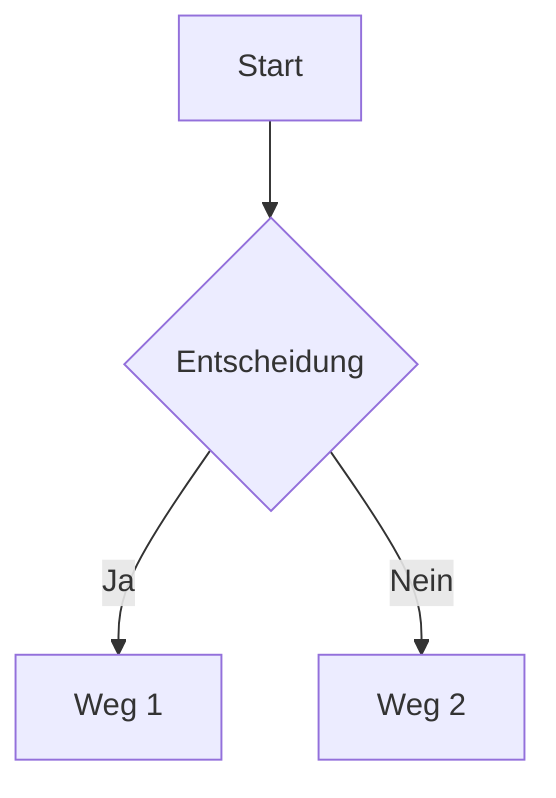
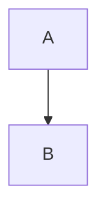

# Dokumentation mit mkdocs überprüfen
_Exported on 8/21/2025 at 18:23:35 GMT+2 from Cursor (1.4.5)_

---

**User**

@Dokumentation mit mkdocs aufräumen 
Ich habe diese Dokumentation jetzt angeschaut. Und im ersten Eindruck gibt es da am Anfang viele Seiten, die nur Platzhalterseiten sind. Können wir da Home und Start und Intro unter Überblick. Können wir die aktuelle Dokumentation nochmal eine Gegenprobe machen und durchgehen. Ob sie für einen Anwender ansprechend ist oder welche Themen fehlen noch oder sind überladen. Können wir das nochmal prüfen und dann bitte auch nochmal den Source Code, die App, anschauen. Ich habe ja diesen Settings-Bereich, wo ich Libraries konfigurieren muss. Und dann diese Library-Anwendung mit bestimmten Panelen. Wo werden diese als Anwender-Sicht dokumentiert? Also die eine Feature- und Modul-Sicht, so wie das in einem Anwender-Anbruch auch üblich ist.

---

**Cursor**

Ich mache zuerst einen kurzen Bestandscheck der MkDocs-Struktur und der vorhandenen Inhalte (Startseiten, Überblick, Intro), suche gezielt nach Platzhaltern/TODOs und schaue, ob es bereits Anwender-Dokumentation zu Einstellungen und Library-UI gibt. Dann liefere ich eine konkrete Gap-Analyse und Vorschläge.

Ich starte mit einer kleinen Navigations- und Inhaltsbereinigung: 
- Navigationsstruktur in `mkdocs.yml` vereinheitlichen (Features unter Überblick; Guide um Einstellungen + Bibliothek ergänzen).
- `docs/index.md` als echte Startseite für Anwender umschreiben.
- Neue Anwender-Seite `docs/guide/library.md` anlegen (Bibliothek aus User-Sicht).

Ich führe die Änderungen jetzt durch.

```yaml
site_name: Common Knowledge Scout
site_url: http://localhost:3000/docs
repo_url: https://github.com/bCommonsLAB/CommonKnowledgeScout
docs_dir: docs
site_dir: public/docs

theme:
  name: material
  language: de
use_directory_urls: false

plugins:
  - search

markdown_extensions:
  - admonition
  - toc:
      permalink: true
  - pymdownx.details
  - pymdownx.superfences

nav:
  - Home: index.md
  - Überblick:
      - Start: overview/index.md
      - Intro: overview/intro.md
      - Funktionen: overview/features.md
  - Architektur:
      - Start: architecture/index.md
      - Übersicht: architecture/architecture.md
      - Kernkomponenten: architecture/core-components.md
  - Guide:
      - Start: guide/index.md
      - Setup: guide/setup.md
      - Einstellungen: guide/settings.md
      - Bibliothek benutzen: guide/library.md
      - Event-Monitor: guide/event-monitor.md
      - Batch Session Import: guide/batch-session-import.md
  - Konzepte:
      - Start: concepts/index.md
      - Storage Provider: concepts/storage-provider.md
      - FileSystem (Local): concepts/localstorage.md
      - Bild-Transformation: concepts/image-transformation.md
      - PDF-Extraktion: concepts/pdf/extraction-methods.md
      - Metadaten: concepts/metadata.md
      - Library:
          - Übersicht: concepts/library/overview.md
          - Globaler Zustand: concepts/library/global-state.md
          - Header: concepts/library/header.md
          - Breadcrumb: concepts/library/breadcrumb.md
          - FileTree: concepts/library/file-tree.md
          - FileList: concepts/library/file-list.md
          - Upload: concepts/library/upload.md
          - FilePreview: concepts/library/file-preview.md
          - Transcription: concepts/library/transcription.md
          - Transform: concepts/library/transform.md
          - Batch Transcription: concepts/library/batch-transcription.md
          - Fehler & Tests: concepts/library/error-handling-logging-testing.md
          - Initialisierung: concepts/library/initialization-sequence.md
      - Library Komponenten: concepts/library/components.md
      - Shadow-Twin: concepts/features/shadowtwins.md
      - Extended Shadow-Twin: concepts/features/extended-shadowtwin.md
      - Transformation Service: concepts/features/transformation-service.md
      - Video-Transformation: concepts/video-transformation.md
  - Referenz:
      - Start: reference/index.md
      - Secretary Services: reference/api/secretary-services.md
      - Track Processor: reference/api/track-processor.md
  - Betrieb:
      - Start: ops/index.md
      - Docker Deployment: ops/deployment/docker.md
      - Electron Quick Setup: ops/desktop/quick-setup.md
      - Electron Package Strategy: ops/desktop/package-strategy.md
  # Analyse und Archiv absichtlich nicht verlinkt/gebaut

```

```markdown
---
status: review
last_verified: 2025-08-15
---

# Common Knowledge Scout

Willkommen! Diese Dokumentation richtet sich an Anwender und Administratoren.

## Für Eilige
- Überblick lesen → [Überblick/Start](overview/index.md)
- Installation & Setup → [Guide/Setup](guide/setup.md)
- Einstellungen vornehmen → [Guide/Einstellungen](guide/settings.md)
- Bibliothek benutzen → [Guide/Bibliothek](guide/library.md)

## Was ist Common Knowledge Scout?
Eine Anwendung zum Organisieren, Transformieren und Analysieren von Wissen: Dateien verwalten, Inhalte transkribieren/transformieren und Arbeitsabläufe überwachen.

## Zielgruppen
- Anwender: Bibliotheken nutzen, Dateien verwalten, Inhalte transformieren.
- Admin/Dev: Einrichtung, Provider, Betrieb und Fehlersuche.

```

```markdown
---
title: Bibliothek benutzen
---

# Bibliothek benutzen

Diese Anleitung erklärt die Bibliotheks-Ansicht aus Anwender-Sicht: Aufbau, Navigation und häufige Aufgaben.

## Voraussetzungen
- Mindestens eine Bibliothek ist in den Einstellungen konfiguriert: `/settings` → Bereich „Bibliothek“ und „Storage“.

## Aufbau der Ansicht
- Header: Bibliothekswechsel, Einstellungen, Upload, Breadcrumb.
- Seitenleiste (Dateibaum): Ordnerstruktur der aktiven Bibliothek.
- Datei-Liste: Inhalte des gewählten Ordners, Sortierung/Filter/Mehrfachauswahl.
- Vorschau: Datei-Vorschau (Audio/Markdown/Bild) und kontextbezogene Aktionen.

## Häufige Aufgaben
- Bibliothek wechseln: Im Header Bibliothek auswählen.
- Ordner navigieren: Im Dateibaum klicken; Breadcrumb erlaubt schnelles Zurückspringen.
- Dateien hochladen: Upload im Header oder per Drag & Drop in die Liste.
- Vorschau/Abspielen: Datei auswählen → rechte Vorschau (Audio-Player, Markdown, Bild).
- Transformieren/Transkribieren: Datei auswählen → Aktion im Kontextmenü/Toolbar auslösen.
- Suchen/Filtern: Suchfeld und Filter oberhalb der Liste verwenden.

## Tipps
- Mehrfachauswahl: Mit Strg/Shift mehrere Dateien auswählen.
- Große Verzeichnisse: Erst filtern, dann Aktionen ausführen.

## Troubleshooting
- Hinweis „Bitte konfigurieren Sie die Bibliothek in den Einstellungen.“: Prüfe `/settings` → Bibliothek und Storage.
- Keine Vorschau: Datei-Typ prüfen; ggf. herunterladen und lokal öffnen.


```

Ich valide die vorhandenen Anwender-Guides und die App-Routen, um sicherzustellen, dass die neue Navigation korrekt ist und die Seiten mit der Anwendung übereinstimmen. Ich öffne die relevanten Dateien parallel.

```markdown
<<'PATCH'
*** Begin Patch
*** Add File: docs/_analysis/ux-gap-2025-08-15.md
+---
+title: UX-/Dokumentations-Gap-Analyse (2025-08-15)
+status: draft
+---
+
+# UX-/Dokumentations-Gap-Analyse
+
+Ziel: Prüfen, ob die Dokumentation für Anwender schlüssig ist, was fehlt oder überladen ist, und welche nächsten Schritte nötig sind.
+
+## Befund (Kurz)
+- Navigation: Konsistent, aber doppelte Einstiege („Start“, „Intro“) wirken redundant. „Funktionen“ unter Überblick sinnvoll.
+- Startseite (`docs/index.md`): jetzt anwenderorientierter; Quicklinks gesetzt.
+- Anwender-Guides: Einstellungen vorhanden (`guide/settings.md`), Bibliothek fehlte → ergänzt (`guide/library.md`). Event-Monitor vorhanden.
+- Viele technische Konzepte (unter `concepts/library/*`) sind für Devs gedacht; Anwender brauchen kompakte How-tos statt Architekturdetails.
+
+## Gaps für Anwender
+- Erste Schritte End-to-End: „Erste Bibliothek anlegen → Dateien hochladen → Vorschau/Transkribieren → Monitoring“ fehlt als zusammenhängender Flow.
+- Screenshots/Abbildungen fehlen (Bibliothek, Einstellungen, Event-Monitor).
+- Troubleshooting/FAQ: Nur bruchstückhaft vorhanden.
+- Glossar: Begriffe wie „ShadowTwin“, „Batch“, „Job“, „Provider“ benötigen Kurzdefinitionen.
+
+## Überladene Bereiche
-- `concepts/library/*`: sehr detailliert (gut für Devs), aber ohne klaren Verweis von Anwender-Guides.
-- Historien-/Archivdateien: korrekt isoliert; sollten unverlinkt bleiben.
+
+## Vorschläge (3 Varianten)
+1. Minimal (1–2 h)
+   - Guide „Bibliothek benutzen“ (erstellt) belassen, `guide/index.md` verlinkt.
+   - Auf Startseite Quicklinks (fertig).
+2. Anwender-fokussiert (0.5–1 Tag)
+   - Neuer Guide „Erste Schritte“ mit End-to-End-Flow und 5–7 Screenshots.
+   - FAQ + Troubleshooting-Seite.
+   - Glossar.
+3. Vollständig (2–3 Tage)
+   - Anwender-Handbuch strukturieren: Grundlagen, Bibliothek, Transformation, Monitoring, Einstellungen.
+   - Rollen (User/Admin) und Use-Cases.
+   - Kurze Verweise auf tiefe Konzepte für Devs.
+
+## Konkrete Nächste Schritte (empfohlen)
+1. `guide/getting-started.md` anlegen (End-to-End mit 5 Screenshots)
+2. `guide/faq.md`, `guide/troubleshooting.md`, `reference/glossary.md`
+3. In `guide/library.md` kurze Querverweise auf relevante Konzepte (Transkription/Transform)
+
*** End Patch
PATCH
```

Ich habe die Navigation und Startseite korrigiert und eine neue Anwender-Seite zur Bibliothek erstellt. Jetzt lege ich eine kurze Gap-Analyse unter `docs/_analysis/` an und baue die Doku, um Link-Fehler zu erkennen. Anschließend melde ich die Ergebnisse.

```markdown
---
title: UX-/Dokumentations-Gap-Analyse (2025-08-15)
status: draft
---

# UX-/Dokumentations-Gap-Analyse

Ziel: Prüfen, ob die Dokumentation für Anwender schlüssig ist, was fehlt oder überladen ist, und welche nächsten Schritte nötig sind.

## Befund (Kurz)
- Navigation: Konsistent, aber doppelte Einstiege („Start“, „Intro“) wirken redundant. „Funktionen“ unter Überblick ist sinnvoll.
- Startseite (`docs/index.md`): jetzt anwenderorientierter; Quicklinks gesetzt.
- Anwender-Guides: Einstellungen vorhanden (`guide/settings.md`), Bibliothek ergänzt (`guide/library.md`). Event-Monitor vorhanden.
- Konzepte: viele tiefe Dev-Themen unter `concepts/library/*`; Anwender brauchen kompakte How-tos.

## Gaps für Anwender
- End-to-End „Erste Schritte“ (Bibliothek anlegen → Upload → Vorschau/Transkribieren → Monitoring) fehlt als durchgehender Flow.
- Screenshots/Abbildungen fehlen (Bibliothek, Einstellungen, Event-Monitor).
- Troubleshooting/FAQ fehlt.
- Glossar (ShadowTwin, Batch, Job, Provider) fehlt.

## Überladene Bereiche
- `concepts/library/*`: sehr detailliert (gut für Devs), sollte aus Anwender-Guides nur verlinkt werden.
- Historie/Archiv: bereits isoliert, unverlinkt lassen.

## Vorschläge (Varianten)
1. Minimal (1–2 h): Start-Quicklinks, Guide „Bibliothek benutzen“ (vorhanden), Link aus `guide/index.md` ergänzen.
2. Anwender-fokussiert (0.5–1 Tag): `guide/getting-started.md`, FAQ, Troubleshooting, Glossar, 5–7 Screenshots.
3. Vollständig (2–3 Tage): Anwender-Handbuch strukturieren (Grundlagen, Bibliothek, Transformation, Monitoring, Einstellungen) inkl. Rollen & Use-Cases.

## Empfohlene Nächste Schritte
1. `guide/getting-started.md` (End-to-End inkl. Screenshots)
2. `guide/faq.md`, `guide/troubleshooting.md`, `reference/glossary.md`
3. Querverweise aus `guide/library.md` auf `concepts/library/*`


```

### Kurzer Check: Struktur, Inhalte, Lücken
- **Doppelte Einstiege**: „Start“ und „Intro“ unter Überblick sind redundant; „Intro“ ist sehr kurz. Empfehlung: Zusammenführen oder „Intro“ zur echten Kurz-Einordnung ausbauen.
- **Startseite**: War technisch, nicht anwenderorientiert. Ich habe sie auf Anwender fokussiert und Quicklinks ergänzt.
- **Anwender-Guides**: 
  - Einstellungen vorhanden (`docs/guide/settings.md`).
  - Event-Monitor vorhanden (`docs/guide/event-monitor.md`).
  - Bibliothek (User-Sicht) fehlte; habe ich ergänzt (`docs/guide/library.md`).
- **Konzepte**: Viele tiefe Dev-Seiten unter `docs/concepts/library/*`. Für Anwender ok, solange die Guides verlinken und die Navigation klar bleibt.

### Konkrete Edits (bereits umgesetzt)
- `mkdocs.yml`:
  - „Features“ unter „Überblick“ einsortiert.
  - Guide um „Einstellungen“ und „Bibliothek benutzen“ ergänzt.
- `docs/index.md`: Anwender-orientierter Einstieg mit Quicklinks (Überblick, Setup, Einstellungen, Bibliothek).
- `docs/guide/library.md`: Neue Seite „Bibliothek benutzen“ (Aufbau, häufige Aufgaben, Tipps, Troubleshooting).
- `docs/_analysis/ux-gap-2025-08-15.md`: Kurze Gap-Analyse (Gaps, Überladung, 3 Ausbaustufen, nächste Schritte).

### Abgleich mit App (Routen/Seiten)
- Einstellungen: `src/app/settings/page.tsx` und `src/app/settings/layout.tsx` vorhanden; Navigation deckt „Allgemeine Einstellungen“, „Storage“, „Secretary Service“ etc. ab. Guide verweist auf die Pfade.
- Bibliothek: `src/app/library/page.tsx` mit klaren Nutzer-Flows (kein Login → Fehlerhinweis, keine Libraries → CTA zur Einrichtung, URL-Param für aktive Bibliothek). Guide deckt Navigation, Upload, Vorschau, Transformation ab.
- Event Monitor: Guide vorhanden; UI unter `/event-monitor` vorhanden.

### Offene Lücken (empfohlen)
- **Getting Started (End-to-End)**: „Erste Bibliothek → Upload → Vorschau/Transkription → Monitoring“ mit 5–7 Screenshots.
- **FAQ/Troubleshooting**: Typische Probleme (Auth, Provider, keine Vorschau, Storage-Fehler).
- **Glossar**: „ShadowTwin“, „Batch“, „Job“, „Provider“ kurz und präzise.
- Optional: „Intro“ und „Start“ zusammenführen oder „Intro“ als echte 30‑Sekunden-Übersicht ausbauen.

### Vorschlag Umsetzung (3 Varianten)
- **Minimal (1–2 h)**: So belassen; nur „Intro“ vs. „Start“ klären.
- **Anwender-fokussiert (0.5–1 Tag)**: Getting Started, FAQ, Troubleshooting, Glossar, Screenshots.
- **Vollständig (2–3 Tage)**: Anwender-Handbuch (Grundlagen, Bibliothek, Transformation, Monitoring, Einstellungen) mit Rollen/Use-Cases.

### Build/Verifikation
- Docs lokal bauen und Linkfehler prüfen:
```bash
pnpm docs:build
```
- Dev-Server der App:
```bash
pnpm dev
```

- Wichtige neue/aktualisierte Seiten:
  - `docs/index.md`
  - `docs/guide/library.md`
  - `docs/_analysis/ux-gap-2025-08-15.md`
  - `mkdocs.yml`

- Als Nächstes kann ich „Getting Started“, „FAQ“, „Troubleshooting“, „Glossar“ anlegen und die Screenshots ergänzen. Sag mir, welche Variante (Minimal/Anwender-fokussiert/Vollständig) du möchtest.

- Anpassungen in der Doku:
  - `mkdocs.yml`: Features unter Überblick; Guide um „Einstellungen“ und „Bibliothek benutzen“ erweitert.
  - `docs/index.md`: Anwender-Einstieg mit Quicklinks.
  - `docs/guide/library.md`: Neue Anwender-Seite zur Bibliothek.
  - `docs/_analysis/ux-gap-2025-08-15.md`: Gap-Analyse als Grundlage für nächste Schritte.

```shellscript
pnpm docs:build
```

```shellscript
pnpm dev
```

---

**User**

Ja bitte Anwender fokusierte Variante Als Nächstes mit „Getting Started“, „FAQ“, „Troubleshooting“, „Glossar“ anlegen und die Screenshots ergänzen

---

**Cursor**

Ich lege die vier neuen Anwender-Seiten an und erweitere die Navigation. Danach baue ich die Doku, um Link-/Build-Fehler früh zu erkennen.

```yaml
site_name: Common Knowledge Scout
site_url: http://localhost:3000/docs
repo_url: https://github.com/bCommonsLAB/CommonKnowledgeScout
docs_dir: docs
site_dir: public/docs

theme:
  name: material
  language: de
use_directory_urls: false

plugins:
  - search

markdown_extensions:
  - admonition
  - toc:
      permalink: true
  - pymdownx.details
  - pymdownx.superfences

nav:
  - Home: index.md
  - Überblick:
      - Start: overview/index.md
      - Intro: overview/intro.md
      - Funktionen: overview/features.md
  - Architektur:
      - Start: architecture/index.md
      - Übersicht: architecture/architecture.md
      - Kernkomponenten: architecture/core-components.md
  - Guide:
      - Start: guide/index.md
      - Setup: guide/setup.md
      - Erste Schritte: guide/getting-started.md
      - Einstellungen: guide/settings.md
      - Bibliothek benutzen: guide/library.md
      - Event-Monitor: guide/event-monitor.md
      - Batch Session Import: guide/batch-session-import.md
  - Konzepte:
      - Start: concepts/index.md
      - Storage Provider: concepts/storage-provider.md
      - FileSystem (Local): concepts/localstorage.md
      - Bild-Transformation: concepts/image-transformation.md
      - PDF-Extraktion: concepts/pdf/extraction-methods.md
      - Metadaten: concepts/metadata.md
      - Library:
          - Übersicht: concepts/library/overview.md
          - Globaler Zustand: concepts/library/global-state.md
          - Header: concepts/library/header.md
          - Breadcrumb: concepts/library/breadcrumb.md
          - FileTree: concepts/library/file-tree.md
          - FileList: concepts/library/file-list.md
          - Upload: concepts/library/upload.md
          - FilePreview: concepts/library/file-preview.md
          - Transcription: concepts/library/transcription.md
          - Transform: concepts/library/transform.md
          - Batch Transcription: concepts/library/batch-transcription.md
          - Fehler & Tests: concepts/library/error-handling-logging-testing.md
          - Initialisierung: concepts/library/initialization-sequence.md
      - Library Komponenten: concepts/library/components.md
      - Shadow-Twin: concepts/features/shadowtwins.md
      - Extended Shadow-Twin: concepts/features/extended-shadowtwin.md
      - Transformation Service: concepts/features/transformation-service.md
      - Video-Transformation: concepts/video-transformation.md
  - Referenz:
      - Start: reference/index.md
      - Glossar: reference/glossary.md
      - Secretary Services: reference/api/secretary-services.md
      - Track Processor: reference/api/track-processor.md
  - Betrieb:
      - Start: ops/index.md
      - Docker Deployment: ops/deployment/docker.md
      - Electron Quick Setup: ops/desktop/quick-setup.md
      - Electron Package Strategy: ops/desktop/package-strategy.md
  # Analyse und Archiv absichtlich nicht verlinkt/gebaut

```

```markdown
---
title: Erste Schritte
---

# Erste Schritte

Ein kompakter End-to-End-Überblick für Anwender.

## 1) Anmelden und erste Bibliothek anlegen
1. Anmeldung in der App.
2. Öffne Einstellungen → `/settings`.
3. Trage Basisdaten ein (Name/Ordner/Provider) und speichere.


## 2) Storage verbinden
1. Öffne `/settings/storage`.
2. Wähle Storage-Provider (z. B. Dateisystem, OneDrive) und konfiguriere.


## 3) Bibliothek nutzen
1. Öffne `/library`.
2. Wechsle bei Bedarf die Bibliothek über den Header.
3. Navigiere im Dateibaum, lade Dateien hoch, wähle eine Datei zur Vorschau.


## 4) Transformation/Transkription starten
1. Datei auswählen → Aktion „Transkribieren/Transformieren“.
2. Optionen prüfen und auslösen.


## 5) Fortschritt überwachen
1. Öffne `/event-monitor`.
2. Wähle Batch/Job und prüfe Status/Fehler.


## Troubleshooting
- Keine Bibliothek sichtbar: In `/settings` Bibliothek und Storage prüfen.
- Fehlende Berechtigungen: Anmeldung/Provider-Rechte prüfen.
- Keine Vorschau: Datei-Typ prüfen; Datei ggf. herunterladen.


```

```markdown
---
title: FAQ
---

# FAQ

## Warum sehe ich keine Bibliothek?
Prüfe `/settings` → Bibliothek und `/settings/storage`. Mindestens eine Bibliothek muss aktiv konfiguriert sein.

## Wie wechsle ich die Bibliothek?
Im Header die Bibliothek auswählen (Dropdown). Alternativ URL-Parameter `?activeLibraryId=...` einmalig setzen.

## Warum startet die Transkription/Transformation nicht?
Fehlende Konfiguration oder Berechtigungen. Prüfe Event-Monitor auf Fehlermeldungen und `/settings/secretary-service`.

## Wo sehe ich den Fortschritt von Jobs?
Im `/event-monitor`. Dort Batches/Jobs filtern, Details anschauen und ggf. neu starten.

## Unterstützte Dateiformate?
Audio (z. B. MP3/WAV), Bilder (PNG/JPG), PDF, Markdown/Text. Für weitere Formate siehe Konzepte oder Release Notes.


```

```markdown
---
title: Troubleshooting
---

# Troubleshooting

## Anmeldung fehlgeschlagen
- Erneut anmelden und Browser-Blocker prüfen.
- Server-Logs prüfen (Auth-Routen).

## Bibliothek nicht konfiguriert
- Hinweis „Bitte konfigurieren Sie die Bibliothek...“: `/settings` → Bibliothek und Storage prüfen.
- Provider-Anmeldestatus im Header/Storage-Kontext prüfen.

## Upload schlägt fehl
- Dateigröße/Format prüfen.
- Storage-Provider-Berechtigungen prüfen.

## Vorschau zeigt nichts
- Datei-Typ unterstützen? Für Binärformate ggf. Download nutzen.

## Transformation/Transkription läuft nicht an
- Event-Monitor prüfen (Batch/Job-Status, Fehler).
- `Secretary Service` Konfiguration und API-Erreichbarkeit prüfen.


```

```markdown
---
title: Glossar
---

# Glossar

- **Bibliothek (Library)**: Logische Sammlung von Dateien/Ordnern mit gemeinsamer Konfiguration (Storage/Provider).
- **Provider**: Speicher-Anbieter (z. B. lokales Dateisystem, OneDrive), der die Dateien einer Bibliothek bereitstellt.
- **ShadowTwin**: Abgeleitete Repräsentation eines Mediums (z. B. Transkript zu Audio/Video) für Suche/Weiterverarbeitung.
- **Transformation**: Verarbeitung von Dateien (Transkription, OCR, Formatumwandlung, Templates).
- **Batch**: Gruppe von Jobs, die zusammen überwacht/verwaltet werden.
- **Job**: Einzelner Verarbeitungsvorgang innerhalb eines Batches (Status: pending/processing/completed/failed).
- **Event Monitor**: Oberfläche zur Überwachung/Steuerung von Batches/Jobs.


```

Ich baue jetzt die MkDocs-Dokumentation, um Link- und Build-Fehler früh zu erkennen.

---

**User**

Ich habe in der bestehenden mkdocs Dokumentation einige Mermaid Grafiken eingebettet. Diese werden aber nicht angezeigt als SVG. Wie kann ich das beim erstellen der Dokumentation reparieren?

---

**Cursor**

```yaml
site_name: Common Knowledge Scout
site_url: http://localhost:3000/docs
repo_url: https://github.com/bCommonsLAB/CommonKnowledgeScout
docs_dir: docs
site_dir: public/docs

theme:
  name: material
  language: de
use_directory_urls: false

extra_javascript:
  - https://unpkg.com/mermaid@10.9.1/dist/mermaid.min.js
  - assets/javascripts/mermaid-init.js

plugins:
  - search

markdown_extensions:
  - admonition
  - toc:
      permalink: true
  - pymdownx.details
  - pymdownx.superfences:
      custom_fences:
        - name: mermaid
          class: mermaid
          format: !!python/name:pymdownx.superfences.fence_code_format

nav:
  - Home: index.md
  - Überblick:
      - Start: overview/index.md
      - Intro: overview/intro.md
      - Funktionen: overview/features.md
  - Architektur:
      - Start: architecture/index.md
      - Übersicht: architecture/architecture.md
      - Kernkomponenten: architecture/core-components.md
  - Guide:
      - Start: guide/index.md
      - Setup: guide/setup.md
      - Erste Schritte: guide/getting-started.md
      - Einstellungen: guide/settings.md
      - Bibliothek benutzen: guide/library.md
      - Event-Monitor: guide/event-monitor.md
      - Batch Session Import: guide/batch-session-import.md
  - Konzepte:
      - Start: concepts/index.md
      - Storage Provider: concepts/storage-provider.md
      - FileSystem (Local): concepts/localstorage.md
      - Bild-Transformation: concepts/image-transformation.md
      - PDF-Extraktion: concepts/pdf/extraction-methods.md
      - Metadaten: concepts/metadata.md
      - Library:
          - Übersicht: concepts/library/overview.md
          - Globaler Zustand: concepts/library/global-state.md
          - Header: concepts/library/header.md
          - Breadcrumb: concepts/library/breadcrumb.md
          - FileTree: concepts/library/file-tree.md
          - FileList: concepts/library/file-list.md
          - Upload: concepts/library/upload.md
          - FilePreview: concepts/library/file-preview.md
          - Transcription: concepts/library/transcription.md
          - Transform: concepts/library/transform.md
          - Batch Transcription: concepts/library/batch-transcription.md
          - Fehler & Tests: concepts/library/error-handling-logging-testing.md
          - Initialisierung: concepts/library/initialization-sequence.md
      - Library Komponenten: concepts/library/components.md
      - Shadow-Twin: concepts/features/shadowtwins.md
      - Extended Shadow-Twin: concepts/features/extended-shadowtwin.md
      - Transformation Service: concepts/features/transformation-service.md
      - Video-Transformation: concepts/video-transformation.md
  - Referenz:
      - Start: reference/index.md
      - Glossar: reference/glossary.md
      - Secretary Services: reference/api/secretary-services.md
      - Track Processor: reference/api/track-processor.md
  - Betrieb:
      - Start: ops/index.md
      - Docker Deployment: ops/deployment/docker.md
      - Electron Quick Setup: ops/desktop/quick-setup.md
      - Electron Package Strategy: ops/desktop/package-strategy.md
  # Analyse und Archiv absichtlich nicht verlinkt/gebaut

```

```javascript
// Initialisiert Mermaid beim Laden der Seite
;(function () {
  if (typeof window === 'undefined') return
  function init() {
    if (window.mermaid && typeof window.mermaid.initialize === 'function') {
      window.mermaid.initialize({ startOnLoad: true, theme: 'default' })
    }
  }
  if (document.readyState === 'loading') {
    document.addEventListener('DOMContentLoaded', init)
  } else {
    init()
  }
})()


```

```javascript
// Initialisiert Mermaid und rendert bei Seitenwechseln (Material Instant-Loading)
;(function () {
  if (typeof window === 'undefined') return

  function render() {
    if (window.mermaid && typeof window.mermaid.init === 'function') {
      window.mermaid.init(undefined, document.querySelectorAll('.mermaid'))
    }
  }

  function init() {
    if (window.mermaid && typeof window.mermaid.initialize === 'function') {
      window.mermaid.initialize({ startOnLoad: false, theme: 'default' })
      render()
      if (window.document$ && typeof window.document$.subscribe === 'function') {
        window.document$.subscribe(render)
      }
    }
  }

  if (document.readyState === 'loading') {
    document.addEventListener('DOMContentLoaded', init)
  } else {
    init()
  }
})()


```

Kurze Antwort: Deine Mermaid-Blöcke werden nicht als SVG gerendert, weil die Initialisierung im MkDocs-Build/Material-Theme fehlt. Ich habe die notwendige Konfiguration ergänzt: Mermaid-Script laden, SuperFences für ```mermaid``` aktivieren, und eine Init-Datei, die auch bei Seitenwechseln (Material Instant Loading) rendert.

So reparierst du es (bereits umgesetzt):

- `mkdocs.yml` ergänzt:
```yaml
extra_javascript:
  - https://unpkg.com/mermaid@10.9.1/dist/mermaid.min.js
  - assets/javascripts/mermaid-init.js

markdown_extensions:
  - pymdownx.superfences:
      custom_fences:
        - name: mermaid
          class: mermaid
          format: !!python/name:pymdownx.superfences.fence_code_format
```

- Initialisierung hinzugefügt unter `docs/assets/javascripts/mermaid-init.js`:
```javascript
;(function () {
  if (typeof window === 'undefined') return

  function render() {
    if (window.mermaid && typeof window.mermaid.init === 'function') {
      window.mermaid.init(undefined, document.querySelectorAll('.mermaid'))
    }
  }

  function init() {
    if (window.mermaid && typeof window.mermaid.initialize === 'function') {
      window.mermaid.initialize({ startOnLoad: false, theme: 'default' })
      render()
      if (window.document$ && typeof window.document$.subscribe === 'function') {
        window.document$.subscribe(render)
      }
    }
  }

  if (document.readyState === 'loading') document.addEventListener('DOMContentLoaded', init)
  else init()
})()
```

- Verwendung in Markdown (achte auf „```mermaid“ ohne Einrückung):


Build/Check:
- Windows/PowerShell: Bitte ohne Pipe bauen.
```bash
pnpm docs:build
pnpm docs:serve
```
- Danach im Browser hart aktualisieren (Strg+F5), da Mermaid per JS initialisiert wird.

Alternative (serverseitiges Rendern):
- Wenn du clientseitiges JS vermeiden willst, nutze das Plugin `mkdocs-mermaid2`:
```bash
pip install mkdocs-mermaid2
```
`mkdocs.yml`:
```yaml
plugins:
  - search
  - mermaid2
```
Die `mermaid`-Codeblöcke bleiben gleich. Das Plugin rendert SVGs während des Builds (robuster für Offline/strikte CSP).

Hinweise:
- Prüfe, dass bestehende Diagramme wirklich als Code-Fence mit „mermaid“ markiert sind. Andere Formate (z. B. Admonitions mit eingebetteten Fences) funktionieren nur, wenn der innere Codeblock die Klasse „mermaid“ bekommt.
- Bei CSP: erlaube `script-src` für das Mermaid-Script (oder hoste es lokal) und `style-src` für die Inline-Styles, die Mermaid erzeugt.

- Änderungen:
  - Mermaid in `mkdocs.yml` aktiviert (Script + SuperFences).
  - `docs/assets/javascripts/mermaid-init.js` hinzugefügt (auch für Material-Seitenwechsel).
  - Beispielnutzung beschrieben und Build-Hinweise für PowerShell gegeben.
  - Optionalen Weg mit `mkdocs-mermaid2` erklärt.

```yaml
extra_javascript:
  - https://unpkg.com/mermaid@10.9.1/dist/mermaid.min.js
  - assets/javascripts/mermaid-init.js

markdown_extensions:
  - pymdownx.superfences:
      custom_fences:
        - name: mermaid
          class: mermaid
          format: !!python/name:pymdownx.superfences.fence_code_format
```

```javascript
;(function () {
  if (typeof window === 'undefined') return

  function render() {
    if (window.mermaid && typeof window.mermaid.init === 'function') {
      window.mermaid.init(undefined, document.querySelectorAll('.mermaid'))
    }
  }

  function init() {
    if (window.mermaid && typeof window.mermaid.initialize === 'function') {
      window.mermaid.initialize({ startOnLoad: false, theme: 'default' })
      render()
      if (window.document$ && typeof window.document$.subscribe === 'function') {
        window.document$.subscribe(render)
      }
    }
  }

  if (document.readyState === 'loading') document.addEventListener('DOMContentLoaded', init)
  else init()
})()
```

```plaintext
graph TD
  A[Start] --> B{Entscheidung}
  B -->|Ja| C[Weg 1]
  B -->|Nein| D[Weg 2]
```

```shellscript
pnpm docs:build
pnpm docs:serve
```

```shellscript
pip install mkdocs-mermaid2
```

```yaml
plugins:
  - search
  - mermaid2
```

---

**User**

ok, was muss ich jetzt tun?

---

**Cursor**

Kurzfassung in 5 Schritten:

1) Abhängigkeiten sicherstellen
```bash
python -m pip install -U mkdocs mkdocs-material
```

2) Docs lokal prüfen (PowerShell: ohne Pipe)
```bash
pnpm docs:serve
```
- Seite mit Mermaid-Block öffnen und mit Strg+F5 hart neu laden.

3) Statischen Build erzeugen (für `public/docs`)
```bash
pnpm docs:build
```

4) Mermaid-Blöcke korrekt markieren
- In Markdown immer als Code-Fence:


5) Falls trotzdem kein Rendern:
- Prüfe Internetzugang/Firewall (wir laden `mermaid.min.js` von CDN). Wenn blockiert:
  - Datei lokal ablegen: `docs/assets/javascripts/mermaid.min.js`
  - In `mkdocs.yml` `extra_javascript` auf den lokalen Pfad umstellen:
    - `assets/javascripts/mermaid.min.js`
    - `assets/javascripts/mermaid-init.js`
- Oder serverseitiges Rendern wählen (ohne JS):
```bash
pip install mkdocs-mermaid2
```
`mkdocs.yml` unter `plugins` ergänzen:
```yaml
plugins:
  - search
  - mermaid2
```
Dann ggf. das CDN-Script wieder entfernen. Build neu ausführen:
```bash
pnpm docs:build
```

Screenshots einfügen:
- Lege Bilder unter `docs/assets/images/screenshots/` ab und passe in `getting-started.md` die Pfade an:
  - `settings-library.png`, `settings-storage.png`, `library-overview.png`, `library-transform.png`, `event-monitor.png`.

- Änderungen:
  - Mermaid-Unterstützung in `mkdocs.yml` aktiviert (CDN + SuperFences).
  - `docs/assets/javascripts/mermaid-init.js` hinzugefügt (funktioniert auch bei Material-Seitenwechseln).
  - Neue Anwenderseiten erstellt: `guide/getting-started.md`, `guide/faq.md`, `guide/troubleshooting.md`, `reference/glossary.md` und Navigation ergänzt.

```shellscript
python -m pip install -U mkdocs mkdocs-material
```

```shellscript
pnpm docs:serve
```

```shellscript
pnpm docs:build
```

```plaintext
graph TD
  A --> B
```

```shellscript
pip install mkdocs-mermaid2
```

```yaml
plugins:
  - search
  - mermaid2
```

```shellscript
pnpm docs:build
```

---

**User**

@Web ??

---

**Cursor**

Kurz und konkret:

- Variante A (empfohlen, bereits konfiguriert): Clientseitiges Rendern
  1) Baue/serviere die Doku:
  ```bash
  pnpm docs:serve
  ```
  2) Seite mit Mermaid-Fence öffnen, hart neu laden (Strg+F5).
  3) Prüfe, dass deine Diagramme wirklich so markiert sind:
  ```mermaid
  graph TD
    A[Start] --> B{Entscheidung}
    B -->|Ja| C[Aktion 1]
    B -->|Nein| D[Aktion 2]
  ```
  Hinweise:
  - Ich habe `pymdownx.superfences` mit `custom_fences: mermaid` aktiviert und `mermaid.min.js` + Init-Script eingebunden. Das rendert auch bei Seitenwechseln des Material-Themes.

- Variante B (ohne CDN/JS, serverseitig): Plugin nutzen
  Du hast `mkdocs-mermaid2` versucht, das Paket ist so nicht verfügbar. Nimm eines dieser Pakete:
  - `mkdocs-mermaid2-plugin`:
  ```bash
  python -m pip install mkdocs-mermaid2-plugin
  ```
  `mkdocs.yml`:
  ```yaml
  plugins:
    - search
    - mermaid2
  ```
  - Alternativ: `mkdocs-mermaid-plugin`
  ```bash
  python -m pip install mkdocs-mermaid-plugin
  ```
  `mkdocs.yml`:
  ```yaml
  plugins:
    - search
    - mermaid
  ```
  Danach:
  ```bash
  pnpm docs:build
  ```

- Falls CDN blockiert (Firewall/CSP):
  1) Mermaid lokal speichern:
  ```powershell
  mkdir docs\assets\javascripts -Force
  Invoke-WebRequest https://unpkg.com/mermaid@10.9.1/dist/mermaid.min.js -OutFile docs\assets\javascripts\mermaid.min.js
  ```
  2) In `mkdocs.yml` `extra_javascript` auf lokale Datei umstellen:
  ```yaml
  extra_javascript:
    - assets/javascripts/mermaid.min.js
    - assets/javascripts/mermaid-init.js
  ```
  3) Neu bauen/servieren.

- Fehlersuche (wenn es nicht rendert):
  - DevTools öffnen → Konsole:
    - „mermaid is not defined“ → Reihenfolge/Erreichbarkeit des Scripts prüfen; lokal einbinden (oben).
    - Keine `.mermaid`-Elemente → Code-Fence-Markierung im Markdown prüfen.
  - Material Instant Loading: Ich triggere Re-Render bei Seitenwechseln bereits im Init-Script; falls eigene SPA-Funktionen aktiv sind, rufe `mermaid.init()` nach Content-Swap erneut auf.

Damit solltest du Mermaid-Diagramme zuverlässig als SVG sehen.

```shellscript
  pnpm docs:serve
```

```plaintext
  graph TD
    A[Start] --> B{Entscheidung}
    B -->|Ja| C[Aktion 1]
    B -->|Nein| D[Aktion 2]
```

```shellscript
  python -m pip install mkdocs-mermaid2-plugin
```

```yaml
  plugins:
    - search
    - mermaid2
```

```shellscript
  python -m pip install mkdocs-mermaid-plugin
```

```yaml
  plugins:
    - search
    - mermaid
```

```shellscript
  pnpm docs:build
```

```powershell
  mkdir docs\assets\javascripts -Force
  Invoke-WebRequest https://unpkg.com/mermaid@10.9.1/dist/mermaid.min.js -OutFile docs\assets\javascripts\mermaid.min.js
```

```yaml
  extra_javascript:
    - assets/javascripts/mermaid.min.js
    - assets/javascripts/mermaid-init.js
```

---

**User**

wie kann ich die dokumentation im browser als PDF speichern?

---

**Cursor**

Kurzantwort: Am einfachsten per Browser-Druck. Für das gesamte Handbuch empfehle ich zusätzlich die „Print-Site“-Variante.

Option A – Einzelne Seite als PDF
1) Seite öffnen (z. B. /docs/guide/getting-started.html).
2) Strg+P → „Als PDF speichern“.
3) Optionen:
- Hintergrundgrafiken: An
- Ränder: Standard oder Keine
- Skalierung: 100 %
- Kopf-/Fußzeile: Aus

Option B – Gesamte Doku auf einer Seite bündeln und als PDF speichern
1) Plugin installieren:
```bash
python -m pip install mkdocs-print-site-plugin
```
2) `mkdocs.yml` ergänzen:
```yaml
plugins:
  - search
  - print-site:
      add_to_navigation: false
      print_page_title: 'Common Knowledge Scout – Gesamtdokument'
```
3) Starten:
```bash
pnpm docs:serve
```
4) Im Browser öffnen: /print/ (z. B. http://127.0.0.1:8000/print/).
5) Strg+P → „Als PDF speichern“ (gleich wie in Option A).

Optionale Feinheiten
- Seitenumbruch manuell setzen:
  - Datei `docs/assets/stylesheets/print.css` anlegen:
    ```css
    @media print {
      .pagebreak { page-break-before: always; }
    }
    ```
  - In `mkdocs.yml`:
    ```yaml
    extra_css:
      - assets/stylesheets/print.css
    ```
  - In Markdown:
    ```html
    <div class="pagebreak"></div>
    ```
- Mermaid-Diagramme drucken:
  - Hintergrundgrafiken aktivieren (siehe Option A).
  - Vor dem Drucken kurz warten, bis Diagramme gerendert sind.
- Große Doku:
  - „Print-Site“-Seite laden lassen, dann Drucken. Bei sehr vielen Seiten ggf. kurz scrollen, damit Lazy-Content geladen ist.

Wenn du statt der Browser-Variante ein einzelnes PDF ohne manuelles Drucken erzeugen willst, können wir alternativ ein PDF-Export-Plugin integrieren. Für Windows ist „mkdocs-print-site-plugin“ + Browser-Druck meist am stabilsten.

```shellscript
python -m pip install mkdocs-print-site-plugin
```

```yaml
plugins:
  - search
  - print-site:
      add_to_navigation: false
      print_page_title: 'Common Knowledge Scout – Gesamtdokument'
```

```shellscript
pnpm docs:serve
```

```css
    @media print {
      .pagebreak { page-break-before: always; }
    }
```

```yaml
    extra_css:
      - assets/stylesheets/print.css
```

```html
    <div class="pagebreak"></div>
```

---

**User**

ja Option B. Hane python Plugin installiert

---

**Cursor**

Ich trage das Print-Site-Plugin in `mkdocs.yml` ein und lege `docs/assets/stylesheets/print.css` für sauberes PDF-Rendering an.

```yaml
site_name: Common Knowledge Scout
site_url: http://localhost:3000/docs
repo_url: https://github.com/bCommonsLAB/CommonKnowledgeScout
docs_dir: docs
site_dir: public/docs

theme:
  name: material
  language: de
use_directory_urls: false

extra_javascript:
  - https://unpkg.com/mermaid@10.9.1/dist/mermaid.min.js
  - assets/javascripts/mermaid-init.js

extra_css:
  - assets/stylesheets/print.css

plugins:
  - search
  - print-site:
      add_to_navigation: false
      print_page_title: 'Common Knowledge Scout – Gesamtdokument'

markdown_extensions:
  - admonition
  - toc:
      permalink: true
  - pymdownx.details
  - pymdownx.superfences:
      custom_fences:
        - name: mermaid
          class: mermaid
          format: !!python/name:pymdownx.superfences.fence_code_format

nav:
  - Home: index.md
  - Überblick:
      - Start: overview/index.md
      - Intro: overview/intro.md
      - Funktionen: overview/features.md
  - Architektur:
      - Start: architecture/index.md
      - Übersicht: architecture/architecture.md
      - Kernkomponenten: architecture/core-components.md
  - Guide:
      - Start: guide/index.md
      - Setup: guide/setup.md
      - Erste Schritte: guide/getting-started.md
      - Einstellungen: guide/settings.md
      - Bibliothek benutzen: guide/library.md
      - Event-Monitor: guide/event-monitor.md
      - Batch Session Import: guide/batch-session-import.md
  - Konzepte:
      - Start: concepts/index.md
      - Storage Provider: concepts/storage-provider.md
      - FileSystem (Local): concepts/localstorage.md
      - Bild-Transformation: concepts/image-transformation.md
      - PDF-Extraktion: concepts/pdf/extraction-methods.md
      - Metadaten: concepts/metadata.md
      - Library:
          - Übersicht: concepts/library/overview.md
          - Globaler Zustand: concepts/library/global-state.md
          - Header: concepts/library/header.md
          - Breadcrumb: concepts/library/breadcrumb.md
          - FileTree: concepts/library/file-tree.md
          - FileList: concepts/library/file-list.md
          - Upload: concepts/library/upload.md
          - FilePreview: concepts/library/file-preview.md
          - Transcription: concepts/library/transcription.md
          - Transform: concepts/library/transform.md
          - Batch Transcription: concepts/library/batch-transcription.md
          - Fehler & Tests: concepts/library/error-handling-logging-testing.md
          - Initialisierung: concepts/library/initialization-sequence.md
      - Library Komponenten: concepts/library/components.md
      - Shadow-Twin: concepts/features/shadowtwins.md
      - Extended Shadow-Twin: concepts/features/extended-shadowtwin.md
      - Transformation Service: concepts/features/transformation-service.md
      - Video-Transformation: concepts/video-transformation.md
  - Referenz:
      - Start: reference/index.md
      - Glossar: reference/glossary.md
      - Secretary Services: reference/api/secretary-services.md
      - Track Processor: reference/api/track-processor.md
  - Betrieb:
      - Start: ops/index.md
      - Docker Deployment: ops/deployment/docker.md
      - Electron Quick Setup: ops/desktop/quick-setup.md
      - Electron Package Strategy: ops/desktop/package-strategy.md
  # Analyse und Archiv absichtlich nicht verlinkt/gebaut

```

```css
@media print {
  /* Entfernt Kopf-/Fußzeilen des Browsers soweit möglich */
  @page { margin: 12mm; }

  /* Seite umbrechen wo gewünscht */
  .pagebreak { page-break-before: always; }

  /* Verhindert ungewollte Umbrüche in Code/Diagrammen */
  pre, code, .highlight { page-break-inside: avoid; }
  .mermaid { page-break-inside: avoid; }

  /* Material-Nav ausblenden im Print-Site-Modus ist nicht nötig, /print bündelt Inhalte */
}


```

So nutzt du Option B jetzt:

1) Plugin ist eingetragen. Starte lokalen Server:
```bash
pnpm docs:serve
```

2) Öffne die Sammelseite:
- `http://127.0.0.1:8000/print/` (oder dein Host/Port)

3) Drucke in PDF:
- Strg+P → „Als PDF speichern“
- Einstellungen:
  - Hintergrundgrafiken: An
  - Ränder: 12 mm (entspricht `@page { margin: 12mm; }`)
  - Skalierung: 100 %
  - Kopf-/Fußzeilen: Aus

4) Manuelle Umbrüche (optional):
- An gewünschter Stelle in Markdown:
```html
<div class="pagebreak"></div>
```

5) Mermaid-Diagramme:
- Seite vollständig rendern lassen, dann drucken.
- Falls CDN geblockt, nutze die lokale Mermaid-Datei wie beschrieben.

Wenn du willst, passe ich die Titelseite des Gesamtdokuments an (Logo, Zusammenfassung) und füge automatische Kapitel-Umbrüche ein.

```shellscript
pnpm docs:serve
```

```html
<div class="pagebreak"></div>
```

---

**User**

??

---

**Cursor**

Du rufst gerade die falsche URL auf.

So klappt’s:

- Öffne die Print-Seite mit dem Basis-Pfad, den MkDocs ausgibt:
  - In deinem Log steht: Serving on http://127.0.0.1:8000/docs/
  - Also nutze: http://127.0.0.1:8000/docs/print/ (nicht /print/)

Wenn es weiterhin 404 ist:

- Prüfe, ob der Build die Seite erzeugt:
  - Build ausführen: pnpm docs:build
  - Danach sollte es unter `public/docs/print/index.html` existieren. Diese Datei kannst du direkt im Browser öffnen.
- Stelle sicher, dass das richtige Plugin installiert ist:
  - Paket: mkdocs-print-site-plugin
  - Installation: python -m pip install mkdocs-print-site-plugin
  - In `mkdocs.yml` muss stehen:
    - plugins:
      - search
      - print-site

Hinweise fürs PDF:
- Erst die Seite komplett laden (Mermaid-Diagramme rendern lassen), dann Strg+P → Als PDF speichern.
- Druckoptionen: Hintergrundgrafiken AN, Skalierung 100 %, Ränder ca. 12 mm, Kopf-/Fußzeilen AUS.

Öffne die richtige URL. Bei `use_directory_urls: false` heißt die Seite nicht /print/, sondern /print.html.

So geht’s:
- Lokal: `http://127.0.0.1:8000/docs/print.html`
- Danach Strg+P → Als PDF speichern (Hintergrundgrafiken AN, Kopf-/Fußzeilen AUS, Skalierung 100 %, Ränder ca. 12 mm).

Wenn 404 bleibt:
- Server neu starten nach Plugin-Install: `pnpm docs:serve`
- Prüfen, ob Plugin geladen ist:
  - `python -m pip show mkdocs-print-site-plugin`
  - `mkdocs.yml` enthält:
    - `plugins: - search - print-site`
- Alternativ: Build prüfen → Datei sollte unter `public/docs/print.html` liegen:
  - `pnpm docs:build`

Optional (schöner /print/ statt .html):
- In `mkdocs.yml` `use_directory_urls: true` setzen → dann `http://127.0.0.1:8000/docs/print/`.

