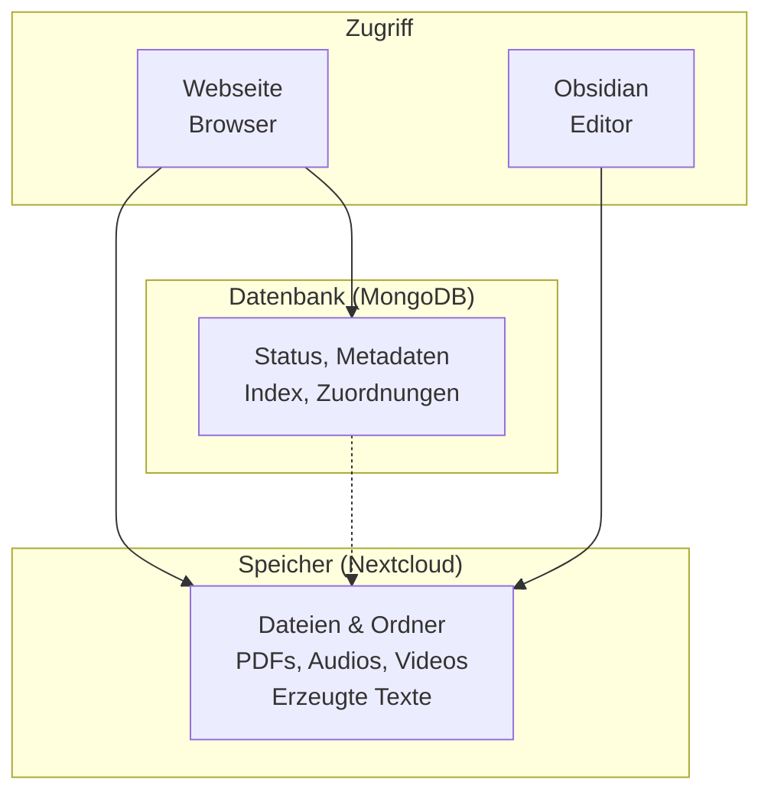
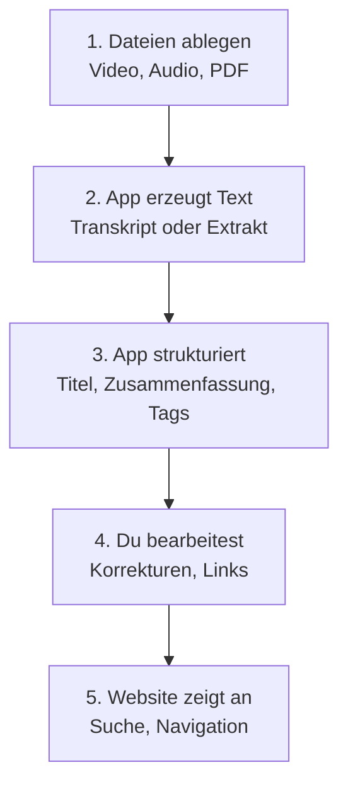
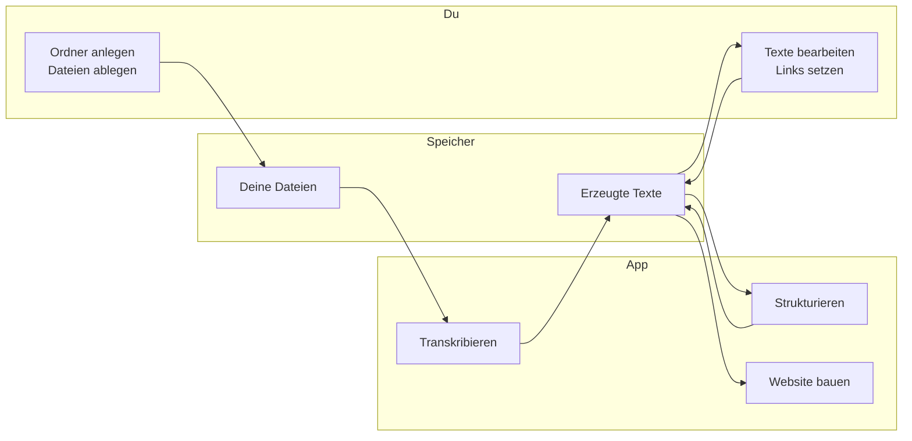

# AECED Workflow – für Anwender

## Was passiert hier?

Du legst **Dateien** ab (Videos, Audios, PDFs). Die App erzeugt daraus automatisch **Text** (Transkripte, Methodenbeschreibungen). Du kannst den Text **nachbearbeiten** und verlinken. Am Ende erscheint alles auf der **Website**.

**In einem Satz:** Deine Dateien sind die Quelle. Die App macht daraus durchsuchbaren, verlinkbaren Inhalt. Du behältst die Kontrolle.

---

## Systemarchitektur

Das System besteht aus drei Teilen: **Speicher** (Nextcloud), **Datenbank** (MongoDB) und **Website**. Du greifst über die **Website** oder **Obsidian** darauf zu.



**Was wo liegt:**

| Komponente | Enthält | Zugriff |
|------------|---------|---------|
| **Nextcloud (Speicher)** | Deine Dateien, erzeugte Texte, Zwillingsordner | Obsidian (bearbeiten), Website (lesen) |
| **MongoDB (Datenbank)** | Status, Verarbeitungszustand, Suchindex | Website (Anzeige, Suche) |
| **Website** | Anzeige, Suche, Navigation | Browser |
| **Obsidian** | Bearbeitung der Texte direkt in Nextcloud | Lokal oder über Nextcloud-Sync |

**Kurz:** Deine Inhalte liegen in Nextcloud. Die Datenbank hält Status und Index. Du bearbeitest mit Obsidian, siehst das Ergebnis auf der Website.

---

## Der Ablauf in einem Bild

Das folgende Diagramm zeigt den Weg von deinen Dateien bis zur Website. Die Pfeile bedeuten: „wird zu“ oder „geht weiter zu“.



**Was die Schritte bedeuten:**

| Schritt | Was passiert |
|--------|--------------|
| **1. Dateien ablegen** | Du legst z. B. ein PDF in den Ordner METHODEN oder ein Audio in AUDIOS. |
| **2. App erzeugt Text** | Die App transkribiert Audio/Video oder extrahiert Text aus PDFs. |
| **3. App strukturiert** | Der Text wird in ein Format gebracht (Titel, Zusammenfassung, Durchführung usw.). |
| **4. Du bearbeitest** | Du korrigierst, kürzt, setzt Verweise zwischen Methoden oder Themen. |
| **5. Website zeigt an** | Die Website liest die bearbeiteten Texte und zeigt sie mit Suche und Navigation. |

---

## Wer macht was?

Dieses Diagramm zeigt: **Du** und die **App** arbeiten zusammen. Deine Dateien liegen in Nextcloud und können mit Obsidian bearbeitet werden.



**Kurz erklärt:** Du legst Dateien ab und bearbeitest die Texte. Die App transkribiert, strukturiert und baut die Website. Alles liegt in deinem Speicher (Nextcloud).

---

## So sind die Ordner aufgebaut

Jede Datei (z. B. ein PDF) bekommt einen **Zwillingsordner** mit Unterstrich davor. Darin liegen alle erzeugten Texte und Bilder.

```text
/Dein Ordner (z. B. Simulation Hessenbox)
  /AUDIOS                      Audiodateien
    MeineAufnahme.m4a          ← Deine Originaldatei
    _MeineAufnahme.m4a/        ← Zwillingsordner (mit Unterstrich)
      MeineAufnahme.de.md      ← Erzeugtes Transkript

  /METHODEN/FINAL PDF         Methoden-PDFs
    10_GordischerKnoten.pdf    ← Deine Originaldatei
    _10_GordischerKnoten.pdf/  ← Zwillingsordner
      10_GordischerKnoten.de.md                    ← Extrakt aus dem PDF
      10_GordischerKnoten.extract_method_from_PDF.de.md  ← Strukturierte Methode
      img-0.jpeg               ← Bilder aus dem PDF

  /VIDEOs                     Videodateien (gleich wie AUDIOS)
  /MUSTERKARTEN               Musterkarten (gleich)
```

**Wichtig:** Deine Originale bleiben unverändert. Die App legt die Zwillingsordner an und füllt sie mit den erzeugten Texten.

---

## Die Schritte im Detail

### 1. Dateien ablegen

Du legst deine Dateien in die passenden Ordner: AUDIOS, METHODEN, VIDEOs, MUSTERKARTEN. Die App findet sie dort.

### 2. App erzeugt Text

- **Audio/Video:** Die App transkribiert (schreibt gesprochenes Wort als Text).
- **PDF:** Die App extrahiert den Text und erkennt Strukturen (Titel, Durchführung, Material usw.).

### 3. App strukturiert

Der Text wird in ein einheitliches Format gebracht: Titel, Zusammenfassung, Tags, Durchführung, Material usw. So kann die Website alles durchsuchen und anzeigen.

### 4. Du bearbeitest

Du öffnest die erzeugten Texte (z. B. in Obsidian), korrigierst Fehler, kürzt oder ergänzt. Du setzt Verweise zwischen Methoden, z. B. „siehe auch Gordischer Knoten“.

### 5. Website zeigt an

Die Website liest die bearbeiteten Texte und zeigt sie mit Suche und Navigation. Du änderst nichts direkt auf der Website – alles kommt aus deinen Dateien.

---

## Was du wissen solltest

**Deine Dateien sind die Wahrheit.** Änderungen machst du in den Textdateien (z. B. mit Obsidian). Die Website zeigt nur, was dort steht.

**Status wird in der App gepflegt.** Ob etwas „fertig“ oder „in Bearbeitung“ ist, siehst du in der App. Das steht nicht in den Dateien – sonst würde Nextcloud bei jeder Änderung synchronisieren und das erzeugt zu viel Traffic.

**Beispiel-Ergebnis:** Die Datei `10_GordischerKnoten_2025-20-10_DW.extract_method_from_PDF.de.md` in `template-samples/diva sample content/` zeigt, wie eine strukturierte Methodenbeschreibung aussieht.

