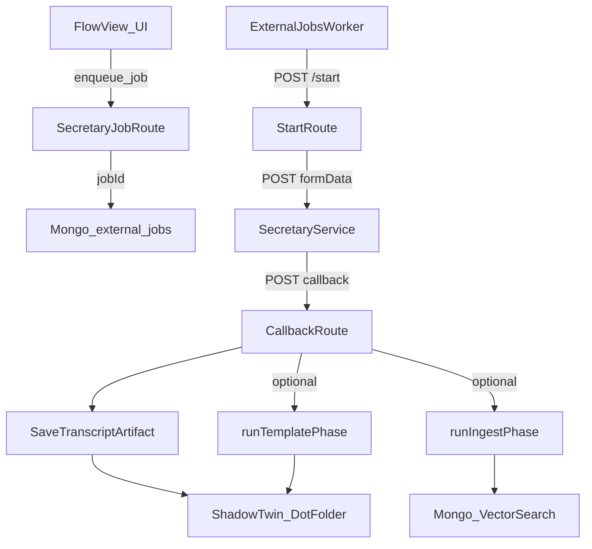

## Ziel und Kontext

Dieses Dokument beschreibt den **Ist‑Stand** der aktuellen Implementierung der artefakt‑zentrierten Pipeline (V3) im Repo und gleicht ihn mit den Architektur‑Dokumenten ab:

- `docs/architecture/artifact-pipeline-v3-design.md`
- `docs/architecture/requirements-artifact-pipeline-v3.md`
- `docs/architecture/shadow-twin.md`
- `docs/architecture/use-cases-and-personas.md`

Fokus: **medienunabhängiger Flow**, klare Trennung **generisch vs. medium‑spezifisch**, sowie eine Liste von **Verbesserungen** und **Test-Guardrails**, um Breaking Changes früh zu erkennen.

Status: Ist‑Stand (Code gelesen), keine produktive Verifikation durch reale Runs in diesem Dokument.

## Executive Summary (Ist‑Stand)

- **Orchestrierung ist generisch**: Ein externer Job läuft immer über Worker → `/start` → Secretary → `/callback` und führt danach optional Template‑Phase und Ingest‑Phase aus.
- **Artefaktmodell ist konsistent** (Naming + Resolver/Writer): Transcript `{base}.{lang}.md`, Transformation `{base}.{template}.{lang}.md`.
- **Medium‑Spezifika sind heute v.a. PDF‑lastig** (Mistral OCR Assets, Pages/Images, chapters/pages Heuristiken).
- **Audio/Video wurden repariert**: Secretary darf bei aktivierter Template‑Phase **kein Template** im Extract liefern → Transcript bleibt roh.
- **Dot‑Folder ist Zielzustand**, Siblings sind Legacy‑Read und sollen später durch einen Repair‑Run eliminiert werden.

## Begriffe (kurz)

- **Source**: Originaldatei (PDF/Audio/Video/…)
- **Shadow‑Twin**: abgeleitete Artefakte (Markdown + ggf. Assets) zur Source
- **Transcript**: roher Extract/Transkript‑Text als Markdown (typisch ohne Frontmatter)
- **Transformation**: template-basiertes Markdown mit Frontmatter/Metadata
- **Dot‑Folder**: `.{originalName}/` als kanonische Ablage für Artefakte

## Datenfluss (Ist‑Stand, High Level)

## Was ist generisch (medienunabhängig)?

### 1) External Jobs Orchestrierung

- **Worker**: `src/lib/external-jobs-worker.ts`
  - claimt atomar queued Jobs aus Mongo
  - triggert `POST /api/external/jobs/{jobId}/start`
  - fügt Trace-Header hinzu (`X-Worker-Id`, `X-Worker-Tick-Id`, `X-Start-Request-Id`) für Debugging.

- **StartRoute**: `src/app/api/external/jobs/[jobId]/start/route.ts`
  - lädt Source Binary aus Storage
  - prüft Policies/Gates und entscheidet, ob Secretary aufgerufen wird
  - startet Watchdog und schreibt Trace Events
  - **Duplicate Start Requests werden geloggt, nicht blockiert** (Observability statt harte Idempotenz‑Sperre).

- **CallbackRoute**: `src/app/api/external/jobs/[jobId]/route.ts`
  - prüft Callback Auth + Prozess‑Guard
  - verarbeitet Progress Events (Short‑Circuit)
  - erkennt Final Payload und orchestriert:
    - Extract‑Artefakt speichern
    - Template‑Phase (falls aktiv/benötigt)
    - Ingest‑Phase (falls aktiv)

### 2) Policies / Gates (Konzept)

- Policies kommen aus `job.parameters.policies` (oder Legacy Flags) und steuern:
  - extract
  - metadata (Template)
  - ingest

Relevante Dateien:
- `src/lib/processing/phase-policy.ts`
- `src/lib/processing/gates.ts`

Hinweis: `gateExtractPdf()` ist historisch PDF‑benannt, wird aber semantisch als „Shadow‑Twin existiert?“ genutzt. Für neue Medien sollte die Namensgebung/Abstraktion vereinheitlicht werden (siehe Verbesserungen).

### 3) Shadow‑Twin Contracts: Naming/Resolver/Writer

- Naming/Parsing: `src/lib/shadow-twin/artifact-naming.ts`
- Resolver: `src/lib/shadow-twin/artifact-resolver.ts`
- Writer: `src/lib/shadow-twin/artifact-writer.ts`

Eigenschaften:
- Deterministische Namen und „overwrite statt duplizieren“ (delete+upload).
- Resolver kann Dot‑Folder **und** (legacy) Siblings finden.

## Was ist medium‑spezifisch?

### PDF (heute am stärksten ausgebaut)

- Secretary Request: `src/lib/external-jobs/secretary-request.ts`
  - unterstützt `mistral_ocr` / `native`
  - Asset‑Parameter: `includePageImages`, `includeImages`, URLs/ZIP handling
- Callback: erkennt `pages_archive_url`, `mistral_ocr_raw_url` etc.
- Template‑Phase enthält PDF‑spezifische Logik rund um `pages`/`chapters` Rekonstruktion/Repair (muss perspektivisch abstrahiert werden).

### Audio/Video (aktueller Fokus: Transcript-Contract)

- Secretary Request: `src/lib/external-jobs/secretary-request.ts`
  - **Fix**: wenn Template‑Phase aktiv ist, wird bei Audio/Video **kein** `template` an den Secretary gesendet.
  - Resultat: Transcript `{base}.{lang}.md` bleibt **roh**.

## Was wurde konkret repariert (Delta)

### 1) Audio/Video: Transcript wurde mit Template-Output überschrieben

Ursache (alt):
- UI/Job sendet `template` direkt an `/audio/process` → Secretary liefert schon transformierten Text → wir speichern ihn als Transcript.

Fix (neu):
- In `prepareSecretaryRequest()` wird `template` bei Audio/Video **nur** gesendet, wenn Template‑Phase deaktiviert wäre. In unserem Zielbild („never“) bedeutet das: **Audio/Video Extract liefert immer nur Transcript**.

### 2) Artefakt‑Writes: falscher Parent (nicht Dot‑Folder)

Fix:
- In Callback/Storage Pfaden wird `shadowTwinFolderId` nach dem Transcript‑Save korrekt weitergereicht/aktualisiert, sodass subsequent Phasen im richtigen Dot‑Folder schreiben.

### 3) Doppelstarts / Unauthorized Callback Hash Mismatch

Fix:
- Client‑seitiger Start wurde entfernt; Start erfolgt über Worker.
- StartRoute blockiert Duplicate Requests nicht mehr hart, sondern schreibt Trace Events (`start_duplicate_request`) zur Ursachenanalyse.

### 4) UI Auto‑Open Loop

Fix:
- Pipeline Sheet Auto‑Open unterscheidet „nicht gesetzt“ vs „vom Nutzer geschlossen“ über Query‑Param `pipeline` (`'' | '1' | '0'`).

## Architektur‑Bewertung: Ist das Fundament sinnvoll für mehrere Medien?

Ja – **wenn** wir 2 Dinge konsequent halten:

1) **Phasen‑Interfaces bleiben medium‑agnostisch** (Extract → Template → Ingest), aber „Adapter“ kapseln medien-spezifische Details (Secretary endpoint, Asset‑Handling).
2) **Artefakt‑Contracts** (Naming/Storage/Dot‑Folder, Transcript vs Transformation) sind die stabile Schnittstelle zwischen Medien.

Aktuelles Risiko: PDF‑spezifische Kapitel/Pages‑Heuristiken sitzen in `phase-template.ts` und können unbeabsichtigt auf andere Medien „durchbluten“, wenn nicht sauber per UseCase/JobType gegated wird.

## Verbesserungen (3 Varianten)

### Variante A (minimal, kurzfristig)
- Dokumentation konsolidieren (Dot‑Folder kanonisch; Siblings nur Legacy‑Read).
- Integration Tests: **Warnung**, wenn Resolver ein Sibling‑Artefakt liefert.
- Ergänzende Unit Tests: SecretaryRequest‑Contract „Audio/Video niemals Template“.

### Variante B (mittel, strukturell)
- `gateExtractPdf` in `gateExtract` umbenennen + Gate‑Logik so formulieren, dass sie nicht PDF‑spezifisch wirkt.
- Template‑Phase trennt klar:
  - generisches Template Transform
  - PDF‑spezifische Post‑Processing Schritte (pages/images/chapters) in ein separates Modul.

### Variante C (strikt, langfristig)
- Ein echtes „UseCase Adapter“ Interface:
  - `buildSecretaryRequest(job)` (pro medium/job_type)
  - `normalizeExtractPayload(payload)` (pro medium)
  - `postprocessArtifacts()` (optional, pro medium)
- Contract Tests pro Adapter, plus E2E Integration Suites pro UseCaseId (pdf/audio/video).

## Tests: Breaking Changes früh erkennen (Ist‑Stand + Empfehlung)

### Unit Tests (vorhanden)
- `tests/unit/shadow-twin/*`: Naming/Resolver/Writer
- `tests/unit/external-jobs/secretary-request.test.ts`: Request‑Kontrakte
- `tests/unit/external-jobs/progress.test.ts`: Progress handling (Basis)

### Integration Tests (vorhanden, PDF)
- `src/lib/integration-tests/*`: Job orchestrieren, Artefakte + Mongo validieren.

### Empfehlung (Erweiterung)
- Kurzfristig: Integration Validators sollen **warnen**, wenn transformation/transcript als `location === 'sibling'` gefunden werden.
- Mittelfristig: zusätzliche UseCases `audio_transcript_report.*` und `video_transcript_report.*` analog zu PDF‑Suite.

## Konkreter Testplan (minimal, aber effektiv)

### Unit Tests (schnell, CI‑tauglich)

1) **Secretary Request Contract** (bereits teilweise vorhanden)
   - Audio/Video: **niemals `template`** an Secretary senden, wenn Template‑Phase aktiv (Zielbild).
   - PDF: `mistral_ocr` Parameter + Asset Flags bleiben stabil.

2) **Shadow‑Twin Contract Tests**
   - `buildArtifactName`/`parseArtifactName` für Basenames mit Punkten.
   - Resolver bevorzugt Dot‑Folder; Siblings nur Fallback.

3) **Writer Contract Tests**
   - deterministische Updates (delete+upload) bleiben update-semantisch.
   - (Zielbild) Dot‑Folder als Write‑Pfad: sobald umgesetzt, Tests auf „keine Siblings erzeugt“.

### Integration Tests (realistisch, langsam)

1) **PDF** (vorhanden)
   - happy path, gate skip, force recompute, repair frontmatter, HITL publish.

2) **Audio/Video (geplant)**
   - Happy path: Extract (Transcript) → Template → optional Ingest.
   - Contract Checks:
     - `{base}.{lang}.md` = rohes Transcript (kein Template‑Output).
     - `{base}.{template}.{lang}.md` = strukturierter Template‑Text.
   - Gate skip / force: analog zur PDF‑Suite.

3) **Legacy Warning (sofort)**
   - Wenn Validator ein Artefakt als `location=sibling` findet: **WARN**, nicht FAIL.
   - Nach Migration/Repair‑Run kann die Policy auf FAIL umgestellt werden.

