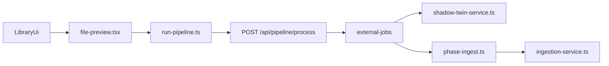

# Pipeline-Systemkarte

Diese Datei beschreibt das System in **einfacher Sprache**.

Ziel: Wenn du dich fragst

- wo die Archivsicht startet,
- wo ein Transkript erzeugt wird,
- wo eine Transformation erzeugt wird,
- und wo publiziert wird,

dann soll diese Datei dir schnell die Antwort geben.

Wichtig: Das ist eine **Code-Analyse**. Ich habe hier nichts durch echte Laufzeittests bewiesen.

---

## Policy: Standardweg und Scope

**Festgelegter Standardweg** für das **Bibliotheks-Archiv** (Liste/Vorschau):  
`FilePreview` → `run-pipeline.ts` → `POST /api/pipeline/process` → External Jobs (siehe Abschnitt „Der wichtigste Ablauf“).

**Kurz-Dokument mit Scope** (was dazu gehört, was absichtlich andere Einstiege hat):  
[`docs/analysis/pipeline-standard-path-policy.md`](./pipeline-standard-path-policy.md)

---

## Kurz gesagt

Im Moment gibt es **nicht nur einen Weg** durch das System.

Es gibt mindestens diese Wege:

1. Der neuere Hauptweg über `FilePreview` und `POST /api/pipeline/process`
2. Ältere **TransformService**-Pfadteile in Einzelkomponenten (z. B. Vorschau-Helfer) – ohne Batch-Dialoge in der Dateiliste
3. Den `creation-wizard.tsx`, der manches noch einmal auf eigene Weise macht (u. a. `ingest-markdown`)

Das ist der Hauptgrund, warum der Code schwer zu verstehen ist.

---

## Was ist mit „Archiv“ gemeint?

Es gibt im Projekt zwei verschiedene Dinge, die beide wie „Archiv“ wirken:

| Begriff | Was ist damit gemeint? | Wichtiger Einstieg |
|---|---|---|
| Bibliotheks-Archiv | Dateibaum, Dateiliste, Vorschau, Pipeline pro Datei | `src/app/library/page.tsx` und `src/components/library/library.tsx` |
| Event-Archiv | Archivierte Jobs oder Batches mit Downloads | `src/app/event-monitor/page.tsx` |

Für dein Thema ist fast immer das **Bibliotheks-Archiv** wichtig.

---

## Der wichtigste Ablauf

Einfach gesagt:

- Die **moderne UI** startet meist über `run-pipeline.ts`
- Das Backend erzeugt dann einen **External Job**
- Dieser Job macht je nach Einstellung:
  - Transkript
  - Transformation
  - Publishing / Ingestion

Parallel dazu gibt es aber noch ältere Wege.

---

## 1) Wo startet die Archivsicht?

Die Archivsicht startet hier:

- `src/app/library/page.tsx`
- `src/components/library/library.tsx`

Dort werden die wichtigsten UI-Teile zusammengebaut:

- Dateibaum
- Dateiliste
- Vorschau

Die Vorschau selbst liegt vor allem hier:

- `src/components/library/file-preview.tsx`

Wenn du also verstehen willst, was der Nutzer in der Archivsicht wirklich sieht, ist `file-preview.tsx` eine der wichtigsten Dateien.

### Review-Modus („Vergleichen“)

- **Layout** (`library.tsx`): Im Review-Modus gibt es **zwei horizontale Bereiche**: **Dateiliste** | **eine** `FilePreview`-Instanz für die ausgewählte Quelldatei (keine zweite Vorschau für ein separates Shadow-Twin-File mehr).
- **Dateiliste**: `compact` folgt der **gleichen** UI-Präferenz wie im Normal-Layout (`isListCompact` / Kompakt-Toggle im Header), damit Kopfzeile und Tabellenspalten nicht „zerschossen“ wirken.
- **Vergleich Inhalt**: In `file-preview.tsx` wird bei aktivem `reviewModeAtom` der Tab **Transkript** fokussiert; **unter** der gemeinsamen Tab-Leiste (Original / Transkript / …) zeigt der Transkript-Tab einen **Split**: links **Original** (Quelle), rechts **Transkript-Artefakt** — weiterhin **eine** Menüzeile, keine doppelte FilePreview.

---

## 2) Wo wird ein Transkript erzeugt?

### Neuer Hauptweg

Der neuere Weg läuft so:

1. `file-preview.tsx` oder `flow-actions.tsx` startet eine Pipeline
2. Das geht über `src/lib/pipeline/run-pipeline.ts`
3. Von dort geht ein Request an `POST /api/pipeline/process`
4. Dort wird ein `ExternalJob` angelegt
5. Danach übernimmt die External-Job-Logik

Die wichtigsten Dateien dafür:

- `src/lib/pipeline/run-pipeline.ts`
- `src/app/api/pipeline/process/route.ts`
- `src/app/api/external/jobs/[jobId]/start/route.ts`
- `src/lib/external-jobs/extract-only.ts`
- `src/lib/external-jobs/sources/*`

### Älterer Weg (Transkription)

Der frühere Batch-Dialog **`transcription-dialog.tsx`** wurde entfernt. Audio-/Video-Transkription läuft über den **Pipeline-Hauptweg** (siehe Abschnitt „Neuer Hauptweg“ oben).

`TransformService` wird weiterhin von anderen UI-Pfaden genutzt (z. B. PDF/Bild-Transformation in der Vorschau). Der frühere **`BatchTransformService`** und **`TransformationDialog`** wurden entfernt.

---

## 3) Wo wird eine Transformation erzeugt?

Auch hier gibt es mehrere Wege.

### Weg A: Über External Jobs

Wenn der neue Pipeline-Weg benutzt wird, dann läuft die Transformation vor allem hier:

- `src/lib/external-jobs/phase-template.ts`

Dazu kommen Hilfsdateien:

- `template-run.ts`
- `template-body-builder.ts`
- `preprocessor-transform-template.ts`
- `template-decision.ts`

Das ist im Kern die Logik:  
„Nimm Transkript oder Rohtext und baue daraus strukturiertes Markdown mit Frontmatter.“

### Weg B: ~~Über alten Batch-Dialog~~ (entfernt)

Der frühere **`transformation-dialog.tsx`** und **`batch-transform-service.ts`** sind entfernt.

Zusätzlich zur Pipeline gibt es weiter **einzelne UI-Pfade** mit `TransformService` (nicht als zentraler Batch-Dialog). Die kanonische Template-Phase für Jobs bleibt **`phase-template.ts`**.

---

## 4) Wo wird ein Sammel-Transkript gebaut?

Für mehrere Quellen gibt es das sogenannte Composite- oder Sammel-Transkript.

Die wichtigste Datei dafür ist:

- `src/lib/creation/composite-transcript.ts`

Wichtige Schritte:

- `buildCompositeReference()` erstellt die kleine persistierte Referenzdatei
- `resolveCompositeTranscript()` löst sie später für die LLM-Verarbeitung auf

Wichtige weitere Stellen:

- `src/app/api/library/[libraryId]/composite-transcript/route.ts`
- `src/lib/external-jobs/phase-shadow-twin-loader.ts`
- `src/components/library/file-list.tsx`

Wenn du dieses Thema verstehen willst, ist `composite-transcript.ts` die erste Datei, die du lesen solltest.

---

## 5) Wo passiert Publishing?

Hier muss man sauber trennen.

### Publishing in einem Job

Wenn der neue Pipeline-Weg läuft, kommt später die Ingest-Phase:

- `src/lib/external-jobs/phase-ingest.ts`
- `src/lib/external-jobs/ingest.ts`
- `src/lib/chat/ingestion-service.ts`

### Publishing direkt aus der UI

Zusätzlich kann die UI direkt publizieren über:

- `POST /api/chat/[libraryId]/ingest-markdown`

Wichtige Datei:

- `src/app/api/chat/[libraryId]/ingest-markdown/route.ts`

Diese Route wird unter anderem von hier benutzt:

- `src/components/creation-wizard/creation-wizard.tsx`
- weiteren Stellen in der Vorschau / Job-UI (z. B. Veröffentlichen), nicht mehr über einen **IngestionDialog** in der Dateiliste

---

## 6) Wo sieht man den Publish-Status?

Der Status wird in der UI nicht nur an einer Stelle berechnet.

Wichtige Datei:

- `src/components/library/shared/use-story-status.ts`

Diese Datei lädt Daten über:

- `GET /api/chat/[libraryId]/ingestion-status?compact=1`

Zusätzlich gibt es andere Statusdarstellungen, zum Beispiel bei PDF-spezifischen Phasen.

Das erklärt, warum Status-Anzeigen manchmal nicht aus einer einzigen Quelle kommen.

---

## 7) Legacy-Dialoge in der Dateiliste (Stand)

Die drei früheren Library-Dialoge sind **entfernt**:

- ~~`TranscriptionDialog`~~
- ~~`TransformationDialog`~~
- ~~`IngestionDialog`~~

**Transkription, Template-Transformation und Publishing** in der Archivsicht laufen über **Vorschau / Pipeline** (`run-pipeline.ts`) bzw. über andere UI-Teile (Wizard, Vorschau-Aktionen).

### Dateiliste: was bleibt?

In `file-list.tsx` gibt es weiter Checkbox-Auswahl und Toolbar-Aktionen **ohne** Dialoge:

- **Sammel-Transkript** → `POST /api/library/[libraryId]/composite-transcript`
- **Bulk-Löschen**
- `selectedBatchItemsAtom` / `selectedTransformationItemsAtom` nur noch für diese Zwecke

**Ingest** aus der Listen-Toolbar und `ingestion-dialog.tsx` gibt es nicht mehr; `ingest-markdown` bleibt als API für Wizard und andere Aufrufer.

---

## 8) Wenn du nur fünf Dateien lesen willst

Wenn du schnell wieder ein mentales Modell aufbauen willst, dann lies zuerst diese fünf Dateien:

1. `src/components/library/file-preview.tsx`
2. `src/lib/pipeline/run-pipeline.ts`
3. `src/app/api/pipeline/process/route.ts`
4. `src/lib/external-jobs/phase-template.ts`
5. `src/app/api/chat/[libraryId]/ingest-markdown/route.ts`

Damit verstehst du schon einen großen Teil des echten Flusses.

---

## 9) Mein Fazit

Das System ist nicht deshalb unübersichtlich, weil eine einzelne Datei schlecht ist.  
Es ist unübersichtlich, weil es **mehrere parallele Wege** für ähnliche Aufgaben gibt.

Die wichtigste strategische Entscheidung ist deshalb:

- Welcher Weg ist der **Standardweg**?
- Welche Wege sind nur noch **Legacy**?

**Als Policy festgehalten** (inkl. Scope): [`pipeline-standard-path-policy.md`](./pipeline-standard-path-policy.md)

Praktisch:

- `FilePreview` + `POST /api/pipeline/process` als Hauptweg im Bibliotheks-Archiv
- ältere Sonderwege (Wizard, `TransformService` in Einzelteilen) schrittweise angleichen oder in der Policy als Ausnahme führen

---

## Verwandte Dateien

- `docs/analysis/pipeline-standard-path-policy.md`
- `docs/analysis/pipeline-redundancy-audit.md`
- `docs/analysis/rules-gap-analysis.md`
- `docs/media-lifecycle-architektur.md`
