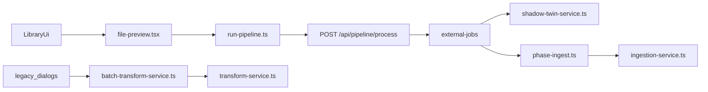

# Pipeline-Systemkarte

Diese Datei beschreibt das System in **einfacher Sprache**.

Ziel: Wenn du dich fragst

- wo die Archivsicht startet,
- wo ein Transkript erzeugt wird,
- wo eine Transformation erzeugt wird,
- und wo publiziert wird,

dann soll diese Datei dir schnell die Antwort geben.

Wichtig: Das ist eine **Code-Analyse**. Ich habe hier nichts durch echte Laufzeittests bewiesen.

---

## Kurz gesagt

Im Moment gibt es **nicht nur einen Weg** durch das System.

Es gibt mindestens diese Wege:

1. Der neuere Hauptweg über `FilePreview` und `POST /api/pipeline/process`
2. Ältere Dialoge über `BatchTransformService` und `TransformService`
3. Den `creation-wizard.tsx`, der manches noch einmal auf eigene Weise macht

Das ist der Hauptgrund, warum der Code schwer zu verstehen ist.

---

## Was ist mit „Archiv“ gemeint?

Es gibt im Projekt zwei verschiedene Dinge, die beide wie „Archiv“ wirken:

| Begriff | Was ist damit gemeint? | Wichtiger Einstieg |
|---|---|---|
| Bibliotheks-Archiv | Dateibaum, Dateiliste, Vorschau, Pipeline pro Datei | `src/app/library/page.tsx` und `src/components/library/library.tsx` |
| Event-Archiv | Archivierte Jobs oder Batches mit Downloads | `src/app/event-monitor/page.tsx` |

Für dein Thema ist fast immer das **Bibliotheks-Archiv** wichtig.

---

## Der wichtigste Ablauf

Einfach gesagt:

- Die **moderne UI** startet meist über `run-pipeline.ts`
- Das Backend erzeugt dann einen **External Job**
- Dieser Job macht je nach Einstellung:
  - Transkript
  - Transformation
  - Publishing / Ingestion

Parallel dazu gibt es aber noch ältere Wege.

---

## 1) Wo startet die Archivsicht?

Die Archivsicht startet hier:

- `src/app/library/page.tsx`
- `src/components/library/library.tsx`

Dort werden die wichtigsten UI-Teile zusammengebaut:

- Dateibaum
- Dateiliste
- Vorschau

Die Vorschau selbst liegt vor allem hier:

- `src/components/library/file-preview.tsx`

Wenn du also verstehen willst, was der Nutzer in der Archivsicht wirklich sieht, ist `file-preview.tsx` eine der wichtigsten Dateien.

---

## 2) Wo wird ein Transkript erzeugt?

### Neuer Hauptweg

Der neuere Weg läuft so:

1. `file-preview.tsx` oder `flow-actions.tsx` startet eine Pipeline
2. Das geht über `src/lib/pipeline/run-pipeline.ts`
3. Von dort geht ein Request an `POST /api/pipeline/process`
4. Dort wird ein `ExternalJob` angelegt
5. Danach übernimmt die External-Job-Logik

Die wichtigsten Dateien dafür:

- `src/lib/pipeline/run-pipeline.ts`
- `src/app/api/pipeline/process/route.ts`
- `src/app/api/external/jobs/[jobId]/start/route.ts`
- `src/lib/external-jobs/extract-only.ts`
- `src/lib/external-jobs/sources/*`

### Älterer Weg

Es gibt daneben noch einen älteren Weg:

- `src/components/library/transcription-dialog.tsx`
- `src/lib/transform/batch-transform-service.ts`
- `src/lib/transform/transform-service.ts`

Dieser Weg macht fachlich etwas Ähnliches, aber nicht über denselben Einstieg.

Genau das erzeugt Verwirrung.

---

## 3) Wo wird eine Transformation erzeugt?

Auch hier gibt es mehrere Wege.

### Weg A: Über External Jobs

Wenn der neue Pipeline-Weg benutzt wird, dann läuft die Transformation vor allem hier:

- `src/lib/external-jobs/phase-template.ts`

Dazu kommen Hilfsdateien:

- `template-run.ts`
- `template-body-builder.ts`
- `preprocessor-transform-template.ts`
- `template-decision.ts`

Das ist im Kern die Logik:  
„Nimm Transkript oder Rohtext und baue daraus strukturiertes Markdown mit Frontmatter.“

### Weg B: Über alte Dialoge

Zusätzlich gibt es:

- `src/components/library/transformation-dialog.tsx`
- `src/lib/transform/batch-transform-service.ts`
- `src/lib/transform/transform-service.ts`

Auch dieser Weg erzeugt Transformationen.

Das heißt: **dieselbe Fachidee ist an mehreren Stellen umgesetzt**.

---

## 4) Wo wird ein Sammel-Transkript gebaut?

Für mehrere Quellen gibt es das sogenannte Composite- oder Sammel-Transkript.

Die wichtigste Datei dafür ist:

- `src/lib/creation/composite-transcript.ts`

Wichtige Schritte:

- `buildCompositeReference()` erstellt die kleine persistierte Referenzdatei
- `resolveCompositeTranscript()` löst sie später für die LLM-Verarbeitung auf

Wichtige weitere Stellen:

- `src/app/api/library/[libraryId]/composite-transcript/route.ts`
- `src/lib/external-jobs/phase-shadow-twin-loader.ts`
- `src/components/library/file-list.tsx`

Wenn du dieses Thema verstehen willst, ist `composite-transcript.ts` die erste Datei, die du lesen solltest.

---

## 5) Wo passiert Publishing?

Hier muss man sauber trennen.

### Publishing in einem Job

Wenn der neue Pipeline-Weg läuft, kommt später die Ingest-Phase:

- `src/lib/external-jobs/phase-ingest.ts`
- `src/lib/external-jobs/ingest.ts`
- `src/lib/chat/ingestion-service.ts`

### Publishing direkt aus der UI

Zusätzlich kann die UI direkt publizieren über:

- `POST /api/chat/[libraryId]/ingest-markdown`

Wichtige Datei:

- `src/app/api/chat/[libraryId]/ingest-markdown/route.ts`

Diese Route wird unter anderem von hier benutzt:

- `src/components/library/ingestion-dialog.tsx`
- `src/components/creation-wizard/creation-wizard.tsx`

---

## 6) Wo sieht man den Publish-Status?

Der Status wird in der UI nicht nur an einer Stelle berechnet.

Wichtige Datei:

- `src/components/library/shared/use-story-status.ts`

Diese Datei lädt Daten über:

- `GET /api/chat/[libraryId]/ingestion-status?compact=1`

Zusätzlich gibt es andere Statusdarstellungen, zum Beispiel bei PDF-spezifischen Phasen.

Das erklärt, warum Status-Anzeigen manchmal nicht aus einer einzigen Quelle kommen.

---

## 7) Wo werden die alten Dialoge im UX wirklich geöffnet?

Das war eine der wichtigsten Nachfragen.  
Darum hier die klare Antwort mit Beleg aus dem Code.

### Grundaufbau

Die Dialog-Komponenten werden in `src/components/library/library.tsx` **immer mitgerendert**:

- `TranscriptionDialog`
- `TransformationDialog`
- `IngestionDialog`

Aber:  
Sie öffnen sich **nicht von selbst**.  
Sie werden über Jotai-Atoms geöffnet.

Die relevanten Atoms liegen in:

- `src/atoms/transcription-options.ts`

### Wichtige Erkenntnis

Repo-weit habe ich nur diese echten Öffnungsstellen gefunden:

- `setTranscriptionDialogOpen(true)`
- `setTransformationDialogOpen(true)`
- `setIngestionDialogOpen(true)`

Und **alle drei** kommen in derselben Datei vor:

- `src/components/library/file-list.tsx`

Das heißt:

- Die alten Dialoge werden aktuell **aus der Dateiliste heraus** geöffnet
- nicht aus `file-preview.tsx`
- nicht aus `flow-actions.tsx`
- nicht aus dem Wizard

### Wie sieht das im UI aus?

In `file-list.tsx` gibt es oberhalb der Liste eine kleine Aktionsleiste.

Dort erscheinen Buttons **nur dann**, wenn Dateien per Checkbox ausgewählt wurden.

### Alter Dialog 1: `TranscriptionDialog`

Wird geöffnet über:

- Button mit Titel/Aria-Label **`Transkribieren`**

Dieser Button erscheint, wenn `selectedBatchItems.length > 0`.

Welche Dateien landen dort?

- Audio-Dateien
- Video-Dateien

Denn beim Anhaken einer Datei gilt:

- Audio/Video gehen in `selectedBatchItems`
- Text/Dokumente gehen **nicht** dorthin

### Alter Dialog 2: `TransformationDialog`

Wird geöffnet über:

- Button mit Titel/Aria-Label **`Transformieren`**

Dieser Button erscheint, wenn `selectedTransformationItems.length > 0`.

Welche Dateien landen dort?

- Markdown
- Dokumente
- teilweise auch Ordner über dieselbe Auswahl-Logik

Wichtig:

- Der Dialog selbst verarbeitet intern effektiv vor allem Markdown und PDFs
- andere Dinge werden eher übersprungen

Das ist ein Hinweis darauf, dass Auswahl-UI und eigentliche Dialog-Logik nicht ganz sauber zusammenpassen.

### Alter Dialog 3: `IngestionDialog`

Wird geöffnet über:

- Button **`Ingest`**

Dieser Button erscheint ebenfalls bei `selectedTransformationItems.length > 0`.

Der Code prüft vor dem Öffnen zusätzlich:

- ob mindestens eine Markdown-Datei
- oder ein Ordner

ausgewählt ist.

Dieser Dialog ist also deutlich an den Batch-/Listen-Workflow gekoppelt.

### Sammel-Transkript ist kein Dialog

Zusätzlich gibt es in derselben Leiste noch:

- Button **`Sammel-Transkript erstellen`**

Das ist **kein** alter Dialog, sondern ein direkter API-Aufruf aus `file-list.tsx`:

- `POST /api/library/[libraryId]/composite-transcript`

### Kurzfazit zu den Legacy-Dialogen

Die alten Dialoge sind aktuell **nicht überall im Produkt verstreut**.  
Sie hängen sehr konkret an **einer Stelle**:

- `FileList`-Toolbar nach Checkbox-Auswahl

Das ist für das Aufräumen wichtig, weil man dadurch einen klaren Migrationspunkt hat.

---

## 8) Wenn du nur fünf Dateien lesen willst

Wenn du schnell wieder ein mentales Modell aufbauen willst, dann lies zuerst diese fünf Dateien:

1. `src/components/library/file-preview.tsx`
2. `src/lib/pipeline/run-pipeline.ts`
3. `src/app/api/pipeline/process/route.ts`
4. `src/lib/external-jobs/phase-template.ts`
5. `src/app/api/chat/[libraryId]/ingest-markdown/route.ts`

Damit verstehst du schon einen großen Teil des echten Flusses.

---

## 9) Mein Fazit

Das System ist nicht deshalb unübersichtlich, weil eine einzelne Datei schlecht ist.  
Es ist unübersichtlich, weil es **mehrere parallele Wege** für ähnliche Aufgaben gibt.

Die wichtigste strategische Entscheidung ist deshalb:

- Welcher Weg ist der **Standardweg**?
- Welche Wege sind nur noch **Legacy**?

Meine Empfehlung bleibt:

- `FilePreview` + `POST /api/pipeline/process` als Hauptweg
- ältere Dialoge und Sonderwege danach schrittweise angleichen

---

## Verwandte Dateien

- `docs/analysis/pipeline-redundancy-audit.md`
- `docs/analysis/rules-gap-analysis.md`
- `docs/media-lifecycle-architektur.md`
