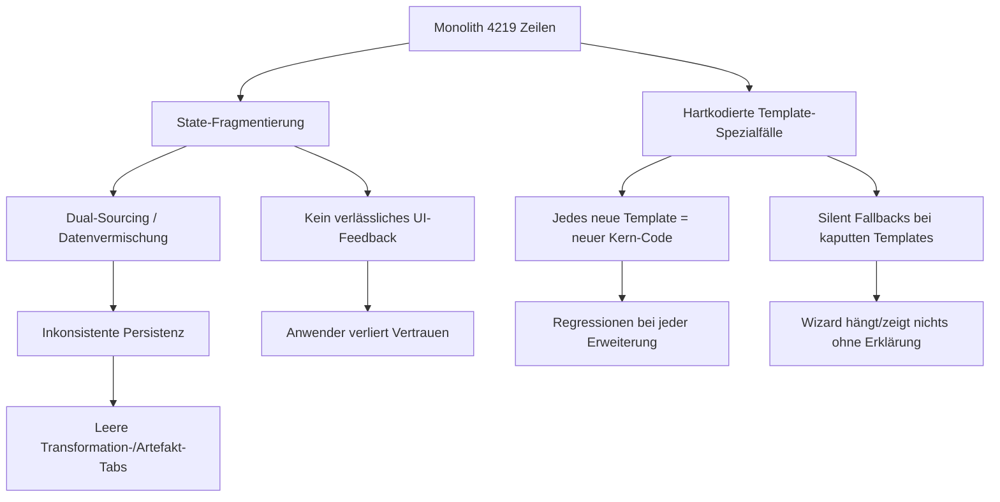

# Analyse: Schwachstellen im Creation-Wizard und in der Template-Verwaltung

> Stand: 2026-05-31. Konsolidierte Bestandsaufnahme der **architektonischen**
> und **UI/UX-Mängel** im Creation-Wizard und der Template-Verwaltung.
> Knüpft an bestehende Analysen an (siehe [Abschnitt 6](#6-bezug-zu-bestehenden-analysen)).
>
> Ziel der Analyse: Verständnis, warum der Wizard "nie so richtig
> funktioniert hat" und warum er einfache Anwender nicht zuverlässig
> durch die Erfassung von Stories und Daten führt.

## 0. Kernbefund in einem Satz

Der Wizard ist als **eine monolithische 4.219-Zeilen-Komponente** gebaut, die
fragmentierten `useState`-Wildwuchs, hartkodierte Template-Spezialfälle und
mehrere konkurrierende Speicherpfade in sich vereint. Daraus folgen direkt
sowohl die **Stabilitätsprobleme** (Race Conditions, Silent Fallbacks,
inkonsistente Persistenz) als auch die **UX-Probleme** (kein verlässliches
Feedback, kein "Single Path" für den einfachen Anwender, kaputte Templates
schlagen erst zur Laufzeit durch).

Die Mängel sind **nicht oberflächlich** — sie sind strukturell. Punktuelle
Bugfixes haben in der Vergangenheit nicht getragen, weil jede neue
Template-Variante neuen Spezialcode im Kern verursacht.

---

## 1. Architektonische Mängel

### 1.1 Monolith statt Komposition (Projektregel-Verstoß)

| Datei | Zeilen | Regel-Soll |
|---|---:|---|
| `src/components/creation-wizard/creation-wizard.tsx` | **4.219** | max. 200 |
| `src/components/creation-wizard/steps/collect-source-step.tsx` | **1.187** | max. 200 |
| `src/components/creation-wizard/steps/edit-draft-step.tsx` | 532 | max. 200 |

`AGENTS.md` schreibt **max. 200 Zeilen pro Datei** vor. Der Wizard-Kern
überschreitet das um das **21-fache**. In dieser einen Datei mischen sich:
State-Definition, Rendering, API-Calls, Job-Polling, Session-Logging und
template-spezifische Geschäftslogik. Das ist die Wurzel fast aller anderen
Probleme.

### 1.2 State-Fragmentierung – kein Single Source of Truth

- **`WizardState` mit 27+ Properties** auf konkurrierenden "Ebenen"
  (`collectedInput`, `generatedDraft`, `draftMetadata`, `reviewedFields`,
  `draftText`) — `creation-wizard.tsx:64-116`.
- **~24 State/Effect/Ref-Hooks** im Kern; `setWizardState` wird über 100×
  aufgerufen.
- **Dual-Sourcing bei der Persistenz**: beim Speichern wird die Metadaten-Quelle
  über eine Fallback-Kette geraten:
  ```ts
  const baseMetadata = wizardState.draftMetadata
    || wizardState.reviewedFields
    || wizardState.generatedDraft?.metadata
    || {}
  ```
  `creation-wizard.tsx:1852-1865`. In keinem Moment ist eindeutig, welche
  Quelle gültig ist → Datenverlust/-vermischung möglich.
- **Projektregeln verlangen Jotai + React Hook Form + Zod** für State/Forms
  (`.cursorrules`, Abschnitt State-Management). Der Wizard nutzt stattdessen
  rohes `useState` ohne Form-Library; Eingabefelder müssen manuell mit
  `draftMetadata` synchron gehalten werden.

### 1.3 Hartkodierte Template-Spezialfälle statt datengetriebenem Flow

Der Flow soll datengetrieben aus `template.creation.flow.steps` kommen — tut er
aber nur teilweise. Tatsächlich verzweigt der Kern an **14+ Stellen** auf
konkrete Template-IDs:

- `templateId === 'pdfanalyse'` — u.a. `:235, 1278, 1550, 2276, 3065, 3307, 3445`
- `templateId === 'event-finalize-de'` — `:2196, 3002, 3447`
- `templateId === 'file-transcript-de'` — `:1469`
- `templateId === 'audio-transcript-de'` — `:1197, 3103`
- `templateId.toLowerCase().includes('event-publish-final')` — **String-`includes`
  statt exaktem Match** — `:3446`

**`handleNext()` ist ein ~580-Zeilen-Imperativblock** (`:1232-1810`) mit
5–7 Ebenen verschachtelter `if`-Logik und je einem eigenen Extract-/Job-Wait-Loop
pro Template. **Konsequenz**: Jedes neue Template = neuer Code im Wizard-Kern.
Das Versprechen "Templates definieren den Flow" wird nicht eingelöst.

Außerdem fehlt eine **Step-Preset-Registry**: Das Mapping `preset → React-Komponente`
ist als hartkodierte if/else-Kette im Render implementiert
(`creation-wizard.tsx`, `renderStep()`), nicht als Lookup.

### 1.4 Mehrere konkurrierende Speicherpfade

Es gibt **keinen** einheitlichen Commit. Je nach Template läuft die Persistenz
über völlig verschiedene Wege:

| Template-Typ | Speicherweg |
|---|---|
| Standard | `provider.uploadFile()` → `targetFolder/name.md` |
| PDF-Analyse | `promoteWizardArtifacts()` → Shadow-Twin-Upsert (`:2611, 2672, 2735`) |
| Event-Finalize | `deleteItem()` + `uploadFile()` (Client-seitiger Datei-Swap, `:3649-3651`) |
| RAG-Index | optional `fetch(/api/chat/.../ingest-markdown)` (`:2378, 3509, 3934`) |

Probleme:
- **Wizard schreibt nie nach MongoDB**, der JobWorker schon → systematische
  Inkonsistenz (dokumentiert in
  `docs/analysis/wizard-speicherarchitektur-single-point-of-truth.md`: leerer
  Transformation-Tab, "Keine Transformation gefunden").
- **Dreifach-Upsert ohne Atomarität** (Markdown → Transform → optional Ingest):
  bricht einer ab, bleibt ein halb-publizierter Zustand.
- **Event-Finalize: Client-`delete`+`upload`** ändert die Datei-ID → verlinkte
  IDs/Slugs werden stale.

### 1.5 Silent Fallbacks (Projektregel-Verstoß `no-silent-fallbacks.mdc`)

- `} catch { /* ignore polling errors */ }` — `:1025`
- `} catch { /* ignore parse errors */ }` — `:1049`
- `resolvePdfAnalyseTransformFileId` gibt bei nicht gefundenem Shadow-Twin
  still `undefined` zurück; die leere ID wird später ignoriert — `:1057-1083`.
- `extractCreationFromFrontmatter()` gibt bei kaputtem `creation`-Block `null`
  zurück statt zu werfen — `template-frontmatter-utils.ts:674-677`. **Kaputte
  Templates landen unbemerkt in MongoDB und schlagen erst im Wizard zur Laufzeit
  durch.** Das ist der direkte Pfad zu "der Wizard hängt/zeigt nichts".

### 1.6 Race Conditions / fehlende Nebenläufigkeits-Kontrolle

- `addSource()` hat ein `wasUpdated`-Flag, aber kein Lock — schnelles
  Doppel-Hinzufügen kann Quellen verdoppeln (`:1090-1221`).
- `runExtraction()` triggert automatisch bei Quellen-Änderung **ohne Debounce
  oder Cancel-Token** (`:757`) — laufende Extraktionen werden nicht abgebrochen.
- `scheduleMetadataEditedLog()` nutzt einen einzelnen geteilten Timer (`:271`).

### 1.7 Template-System: Tri-modale Quelle ohne klare Priorität

Templates kommen aus **drei** Quellen mit **pro Endpunkt unterschiedlicher**
Merge-Reihenfolge:

1. **Datei-basiert (Legacy)** — `template-service.ts:96-245`
2. **Built-in (hartkodierte Markdown-Strings)** — `builtin-creation-templates.ts:18-205`
3. **MongoDB (primär)** — `template-service-mongodb.ts:153-177`

Die Merge-Logik unterscheidet sich zwischen `library-creation-config.ts:137-184`
und `/api/templates/[templateId]/config`. → Schwer vorhersehbar, welches Template
tatsächlich greift. Zusätzlich:

- **Keine Zod-Durchsetzung**: `template-management.tsx:42-48` akzeptiert beliebige
  `TemplateCreationConfig` ohne Runtime-Validierung.
- **Admin-Check 8× als identischer Stub `isAdmin = false`** dupliziert
  (`/api/templates/*`, `template-repo.ts:88-92`, …).
- **Doppelte Serialisierung**: `serializeTemplateWithoutCreation()` vs.
  `serializeTemplateToMarkdown()` — zwei Implementierungen derselben Aufgabe.
- **Frontmatter ist verschachtelt** (`creation.flow.steps[]…`) — widerspricht
  der Projektregel "flaches snake_case-Frontmatter" und erzwingt einen eigenen,
  fehleranfälligen YAML-Parser (`template-frontmatter-utils.ts:13-257`).

---

## 2. UI/UX-Mängel (für einfache Anwender)

Die UX-Probleme sind größtenteils **Symptome der Architektur**: Weil State und
Flow nicht sauber modelliert sind, kann die Oberfläche dem Anwender keinen
verlässlichen, verständlichen Weg anbieten.

### 2.1 Kein verlässliches, einheitliches Feedback

- Fehler werden **inkonsistent** angezeigt: mal `toast.error` (Sonner), mal ein
  `<p className="text-destructive">` im Step, mal eine `<Alert>` im Kern, mal
  **gar nicht** (Silent Catch). Der Anwender weiß nicht, ob etwas
  fehlgeschlagen ist oder noch läuft.
- **Silent Fehler** (1.5) bedeuten: Bei kaputtem Template oder fehlgeschlagenem
  Polling sieht der Anwender einen **leeren oder eingefrorenen Schritt ohne
  Erklärung** — der klassische "der Wizard tut nichts"-Eindruck.

### 2.2 Fortschritt/Orientierung schwach

- Der Step-Indicator zeigt nur Nummernkreise und `step.title || step.preset`
  (`:4121-4167`). Fällt ein Titel weg, sieht der Anwender technische
  Preset-Namen wie `collectSource` oder `selectFolderArtifacts`.
- **Schritte erscheinen/verschwinden dynamisch** je nach `sourceFolderId`
  (`:743-751`) — die Gesamtzahl der Schritte ändert sich unterwegs, was
  Orientierung und Vertrauen untergräbt ("wieso sind es jetzt plötzlich weniger
  Schritte?").
- Keine Lang-Operations-UX: Bei OCR/Transkription/LLM (potenziell Minuten)
  gibt es nur einen Fortschrittsbalken-State (`processingProgress`), aber keine
  klare "das dauert jetzt, du kannst warten / im Hintergrund"-Kommunikation.

### 2.3 "Weiter" verhält sich überladen und unvorhersehbar

- Der **gleiche Button** löst je nach Schritt grundverschiedene, teils
  langlaufende Aktionen aus (Extraktion starten, Job abwarten, publizieren),
  bleibt aber optisch ein simples "Weiter".
- Das Button-Label wird über eine verschachtelte Ternär-Kette berechnet
  (`:4201-4209`): "Weiter" / "Speichern" / "Fertig" / "Weiter zur Library" —
  ohne dem Anwender vorher zu sagen, was passieren wird.
- `canProceed()` (`:4069-4113`) hat pro Preset eigene, teils subtile Regeln
  (z.B. `reviewMarkdown` verlangt zusätzlich `hasConfirmedMarkdown`). Wenn
  "Weiter" deaktiviert ist, fehlt oft die sichtbare Begründung, **warum**.

### 2.4 Kein "Ein-Klick-Standardpfad" für den einfachen Fall

Die Finalize-Anforderungen (`finalize-wizard-requirements.md`) fordern explizit
"ein Klick → fertig" mit sinnvollen Defaults. Der reale Wizard verlangt
stattdessen aktive Bestätigungen (`hasConfirmedMarkdown`, `hasConfirmedSources`),
Quellen-Verwaltung und mehrere Review-Schritte. Für den **einfachen Anwender**,
der nur eine Story erfassen will, ist der Pfad zu lang und mit zu vielen
Entscheidungen gespickt.

### 2.5 Welcome/Review-Schritte erklären den Kontext kaum

- `welcome-step.tsx` rendert nur generisches Markdown ("Wir erklären kurz, was
  als Nächstes passiert.") — kein anwenderspezifischer Kontext, was diese
  konkrete Story/dieses Template tut.
- Review-Schritte zeigen Felder, aber das Verhältnis von `metadata.fields` zu
  `flow.steps[].fields` ist implizit: Felder, die nirgends gelistet sind,
  verschwinden **stillschweigend** aus der UI — der Anwender merkt nicht, dass
  er etwas hätte erfassen sollen.

### 2.6 Keine anfängertaugliche Template-Verwaltung

- Die einzige Template-Verwaltungs-UI (`template-management.tsx`) ist ein
  **Markdown-/JSON-Editor mit Schema** — für Entwickler, nicht für
  Content-Autoren. Es gibt **keinen visuellen Wizard-Builder**, keine
  geführte Validierung, keine Vorschau.
- Es gibt **keine UI-seitige Validierung** vor dem Speichern; kaputte Templates
  werden akzeptiert (1.5/1.7) und brechen später den Wizard.

---

## 3. Ursache → Wirkung (warum es "nie funktioniert hat")



Stabilität und UX sind also **kein separates Politur-Thema**, sondern direkte
Folge der Kernarchitektur.

---

## 4. Empfehlungen (priorisiert)

### 🔴 Sofort (Stabilität + Sichtbarkeit)

1. **Silent Fallbacks beseitigen** (1.5): Jeder `catch {}` bekommt
   entweder eine Wiederherstellung **oder** ein anwender-sichtbares Fehler-UI.
   `extractCreationFromFrontmatter()` wirft `TemplateValidationError` statt
   `null`.
2. **Einheitliche Fehler-/Statusanzeige**: Ein zentrales Wizard-Fehler-/
   Status-Element statt verstreuter toast/`<p>`/`<Alert>`-Mischung.
3. **Zod-Validierung beim Template-Speichern** (1.7): `TemplateCreationConfigSchema.parse()`
   in den POST/PUT-Routes → kaputte Templates kommen gar nicht erst in die DB.
4. **Race Conditions entschärfen** (1.6): Debounce + Cancel-Token für
   `runExtraction`, Lock/Idempotenz für `addSource`.

### 🟠 Mittelfristig (Architektur-Entkopplung)

5. **Wizard-Kern dekomponieren** (1.1): `creation-wizard.tsx` aufteilen in
   - Container (State + Orchestrierung),
   - **Step-Engine** (datengetriebene State-Machine über `flow.steps`),
   - **Step-Preset-Registry** (`preset → Komponente`-Lookup statt if/else),
   - **Persistenz-Service** (ein Commit-Endpunkt statt 3 Client-Pfade).
6. **State auf Jotai + React Hook Form + Zod umstellen** (1.2) mit klaren
   Zonen (collect → draft → reviewed) und **einer** kanonischen Metadaten-Quelle.
7. **Template-Spezialfälle aus `handleNext` herausziehen** (1.3): pro
   Step-Preset deklarative `onNext`-Handler; PDF/Event/Audio-Verhalten in
   konfigurierbare Step-Policies statt `if (templateId === …)`.
8. **Persistenz vereinheitlichen** (1.4): server-seitiger atomarer Commit;
   Wizard und JobWorker nutzen denselben Schreibpfad (behebt leeren
   Transformation-Tab).

### 🟡 UX-Ausbau

9. **Ein-Klick-Standardpfad** mit sinnvollen Defaults (2.4), Experten-Optionen
   einklappbar.
10. **Stabiler Step-Indicator** mit menschenlesbaren Labels und **fixer**
    Schritt-Anzahl (bedingte Schritte vorab anzeigen/ausgrauen statt
    dynamisch entfernen) (2.2).
11. **"Weiter"-Button erklärbar machen** (2.3): Vorschau der nächsten Aktion,
    sichtbare Begründung bei `disabled`.
12. **Visueller Template-Builder** für Content-Autoren mit Live-Validierung
    und Vorschau (2.6) — mittel-/langfristig.

---

## 5. Vorgeschlagene Ziel-Architektur (Skizze)

```
creation-wizard/
  wizard-container.tsx        # State (Jotai), Orchestrierung, < 200 Zeilen
  wizard-step-engine.ts       # State-Machine: flow.steps -> aktueller Step, Übergänge
  step-registry.ts            # preset -> Komponente + onNext/onBack/canProceed
  persistence/
    commit-service.ts         # EIN atomarer Commit (server-seitig)
  steps/
    *.tsx                     # reine Präsentation, je < 200 Zeilen
```

- Template definiert Flow + Felder **vollständig datengetrieben**.
- Neue Templates erfordern **keinen** Kern-Code mehr.
- Fehler sind nie still; jeder Schritt hat einen definierten Lade-/Fehler-/
  Erfolgs-Zustand.

---

## 6. Bezug zu bestehenden Analysen

Diese Analyse konsolidiert und erweitert:

- `docs/refactor/templates/00-audit.md` – Template-Modul-Bestandsaudit
- `docs/analysis/wizard-speicherarchitektur-single-point-of-truth.md` –
  MongoDB vs. Dateisystem, leerer Transformation-Tab (deckt sich mit 1.4)
- `docs/architecture/finalize-wizard-requirements.md` –
  "ein Klick → fertig"-Anspruch (deckt sich mit 2.4)
- `docs/architecture/template-system.md` – Template-System-Architektur
- `docs/architecture/generic-finalize-wizard.md` – generischer Wizard (Zielbild)

Alle Belege oben verweisen auf `file:line` im Stand 2026-05-31 und sind als
Einstieg für die Refactor-Welle gedacht.
