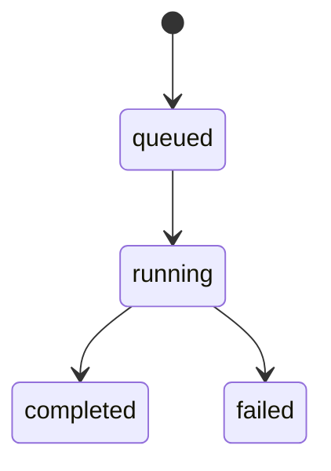
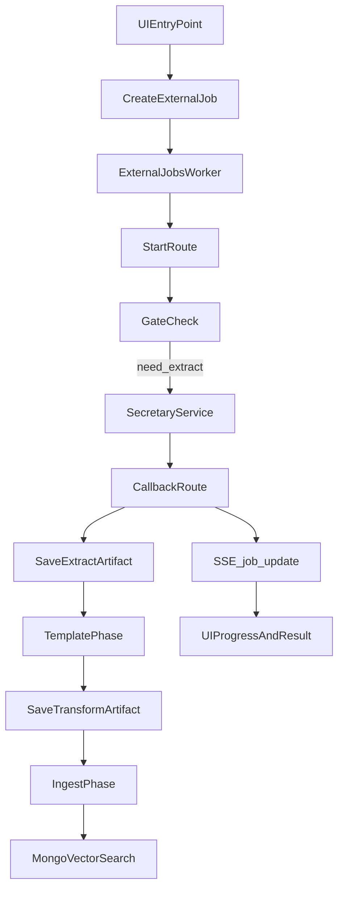

## Ziel

Dieses Dokument beschreibt das technische Design der **Artefakt‑zentrierten Pipeline (Variante 3)**, die:

- **Secretary-only** für Extraction/Transformation nutzt
- den bestehenden **External-Jobs-Orchestrator** (Strangler) wiederverwendet
- über **Artefakte + Gates/Policies** idempotent und resumable ist

V0 Fokus: **PDF Mistral OCR inkl. Pages/Images** (File‑Liste Single‑File).

## Begriffe

- **SourceRef**: Referenz auf eine einzelne Quelle (Datei/URL) inkl. Identität (`itemId`, `parentId`, Name, MIME).
- **SourceBundle**: Sammlung mehrerer Quellen (Event) mit eigener stabiler Identität (`bundleId`).
- **Artefakt**: abgeleitete Datei im Shadow‑Twin (Extract/Transcript, Transformation, Assets/Refs).
- **Template**: Zielschema für Bericht (Markdown + Frontmatter), **quelle‑agnostisch**.
- **Gates**: prüfen Artefakt-Existenz, um Phasen zu skippen.
- **Policies**: überschreiben Gates (`force`) oder deaktivieren Phasen (`ignore`).

## Artefaktmodell (Naming + Storage)

### Naming (kanonisch)
- **Extract/Transcript**: `{base}.{lang}.md`
- **Transformation**: `{base}.{template}.{lang}.md`

### Storage
- Artefakte liegen im **Shadow‑Twin**. Zielbild: **Dot‑Folder ist kanonisch** (Write-Pfad).  
  **Siblings** sind eine **Legacy-Altlast** und sollen nur noch im **Read-Only** Modus funktionieren (Resolver-Fallback).  
  Ein späterer Repair/Migration-Run verschiebt Sibling-Artefakte in den Dot‑Folder und eliminiert sie.
- Große Binärdaten (Pages/Images ZIP) werden als **URLs/Refs** gehandhabt; optionaler Download/Spiegelung im Storage ist eine separate Optimierung.

## Phasenmodell

## User journey (Story Creator)

The UI entry point for single-file processing is the **Story Creator** (library page + dedicated route). It frames the pipeline in user terms:

1. **Text erzeugen** (OCR/Extract or Transkription)
2. **Transformieren** (template-based LLM structuring)
3. **Veröffentlichen** (RAG ingestion/index)

Internally this maps 1:1 to the technical phases below.

### PhaseExtract
Input: `SourceRef`, `targetLanguage`, format-spezifische Optionen (z.B. `extractionMethod=mistral_ocr`).\n
Output: Extract/Transcript Artefakt + Asset‑Refs.

### PhaseTransformTemplate
Input: ExtractedText/Korpus, `templateName`.\n
Output: Transformation Artefakt `{base}.{template}.{lang}.md` inkl. Frontmatter.

### PhaseIngestRag
Input: Transformation Artefakt (bevorzugt), fallback auf Extract nur wenn kein Transform existiert.\n
Output: Mongo Vector Search (Meta + Chunks).

## Gates & Policies

### Gate‑Regeln (Prinzip)
- **Template‑Phase** skip, wenn Transformation‑Artefakt existiert (und nicht `force`).
- **Ingest‑Phase** skip, wenn Ingest bereits existiert (und nicht `force`).
- **Extract‑Phase** skip, wenn Extract/Transcript oder Transformation bereits existiert (und nicht `force`).

### Policies
- `ignore`: Phase nie ausführen
- `do`: ausführen, wenn Gate nicht greift
- `force`: ausführen, auch wenn Gate greift

## Orchestrierung (Strangler)

### Komponenten
- Worker: External Jobs Worker
- Start: `/api/external/jobs/{jobId}/start`
- Callback: `/api/external/jobs/{jobId}`
- Phasenmodule: `phase-template`, `phase-ingest` (Extract startet Secretary und wird über Callback finalisiert)
- UI Updates: SSE `/api/external/jobs/stream`

### Zustandsautomat (Job)

### Datenfluss (High Level)

## V0 (PDF Mistral OCR + Pages/Images) – Design Notes

### Input
- `extractionMethod=mistral_ocr`
- `includePageImages=true`, `includeOcrImages=true`
- `templateName` (Name-only)

### Output Contracts
- Extract Artefakt `{base}.{lang}.md` enthält den OCR‑Markdown/Text (frontmatter optional).
- Transformation Artefakt `{base}.{template}.{lang}.md` enthält **Frontmatter** inkl. `template`, `target_language`, `source_file(_id)`, `pages`, `chapters` (oder begründeter Fallback).
- Asset‑Refs: `pages_archive_url`/`images_archive_url` (oder äquivalente Felder).

## Entry‑Points (Mapping)

### File‑Liste (Archiv‑Pro)
- Startet exakt 1 Job pro Datei.
- Ergebnis: Artefakt wird selektiert/öffnbar nach `completed`.

### Batch/Verzeichnis (Archiv‑Pro)
- Erzeugt N Jobs (optional mit `batchId/batchName`).
- Monitoring über Job Monitor Panel + SSE.

### Wizard (Wizard‑User)
- Startet Job und subscribed SSE.
- Preview/Save basiert auf Transformation‑Artefakt.

### Automation
- Job erstellen + Polling/Webhook, result refs konsumieren.

