# Dependency Graph

Visual representation of module dependencies in the Common Knowledge Scout application.

## Mermaid Dependency Graph

```mermaid
graph TB
    subgraph "Layer 1: Core Infrastructure"
        MW[middleware.ts]
        LAYOUT[app/layout.tsx]
        INST[instrumentation.ts]
        ENV[lib/env.ts]
        AUTH[lib/auth.ts]
        DB[lib/mongodb-service.ts]
    end
    
    subgraph "Layer 2: Storage Layer"
        STYPES[lib/storage/types.ts]
        SFACTORY[lib/storage/storage-factory.ts]
        FSPROVIDER[lib/storage/filesystem-provider.ts]
        ODPROVIDER[lib/storage/onedrive-provider.ts]
        SERVERPROV[lib/storage/server-provider.ts]
        SCONTEXT[contexts/storage-context.tsx]
        USEPROV[hooks/use-storage-provider.tsx]
    end
    
    subgraph "Layer 3: Library System"
        LTYPES[types/library.ts]
        LATOMS[atoms/library-atom.ts]
        LSERVICE[lib/services/library-service.ts]
        LIBCOMP[components/library/library.tsx]
    end
    
    subgraph "Layer 4: Chat System"
        CTYPES[types/chat.ts]
        CCONST[lib/chat/constants.ts]
        CORCH[lib/chat/orchestrator.ts]
        CLOADER[lib/chat/loader.ts]
        CSTREAM[app/api/chat/.../stream/route.ts]
    end
    
    subgraph "Layer 5: API Routes & Components"
        APIROUTES[app/api/**/*.ts]
        COMPONENTS[components/**/*.tsx]
    end

    %% Core Infrastructure (no dependencies)
    
    %% Storage Layer dependencies
    SFACTORY --> STYPES
    SFACTORY --> FSPROVIDER
    SFACTORY --> ODPROVIDER
    FSPROVIDER --> STYPES
    ODPROVIDER --> STYPES
    ODPROVIDER --> LTYPES
    SERVERPROV --> SFACTORY
    SERVERPROV --> LSERVICE
    SERVERPROV --> ENV
    SCONTEXT --> SFACTORY
    SCONTEXT --> LATOMS
    USEPROV --> LATOMS
    USEPROV --> SFACTORY
    
    %% Library System dependencies
    LATOMS --> LTYPES
    LATOMS --> STYPES
    LSERVICE --> DB
    LSERVICE --> LTYPES
    LIBCOMP --> SCONTEXT
    LIBCOMP --> LATOMS
    
    %% Chat System dependencies
    CORCH --> CLOADER
    CORCH --> CCONST
    CORCH --> CTYPES
    CLOADER --> LSERVICE
    CLOADER --> DB
    CSTREAM --> CORCH
    CSTREAM --> CLOADER
    CSTREAM --> CCONST
    
    %% API Routes dependencies
    APIROUTES --> LSERVICE
    APIROUTES --> SFACTORY
    APIROUTES --> DB
    APIROUTES --> CORCH
    
    %% Components dependencies
    COMPONENTS --> SCONTEXT
    COMPONENTS --> LATOMS
    COMPONENTS --> LIBCOMP
```

## Dependency Layers

### Layer 1: Core Infrastructure
- **No internal dependencies**
- Provides foundational services (auth, database, env)
- Used by all other layers

### Layer 2: Storage Layer
- **Depends on**: Layer 1 (env, auth, db)
- **Provides**: Storage abstraction
- **Used by**: Layer 3 (Library System), Layer 5 (API Routes)

### Layer 3: Library System
- **Depends on**: Layer 2 (Storage Layer)
- **Provides**: Library management and UI
- **Used by**: Layer 4 (Chat System), Layer 5 (Components)

### Layer 4: Chat System
- **Depends on**: Layer 3 (Library System), Layer 2 (Storage)
- **Provides**: RAG-based chat functionality
- **Used by**: Layer 5 (API Routes, Components)

### Layer 5: API Routes & Components
- **Depends on**: All previous layers
- **Provides**: User-facing interfaces
- **No dependencies from other modules**

## Key Dependencies

### Most Imported Modules
1. `@/lib/storage/storage-factory.ts` - Used by contexts, API routes, components
2. `@/lib/storage/types.ts` - Used by all storage-related files
3. `@/lib/services/library-service.ts` - Used by API routes, storage, chat
4. `@/types/library.ts` - Used throughout the application
5. `@/lib/mongodb-service.ts` - Used by services and repositories

### Critical Paths
- **Storage Access**: `components` → `contexts/storage-context` → `storage-factory` → `providers`
- **Chat Flow**: `api/chat/stream` → `chat/orchestrator` → `chat/loader` → `library-service` → `mongodb-service`
- **Library Management**: `components/library` → `atoms/library-atom` → `services/library-service` → `mongodb-service`

## Circular Dependencies

### Potential Issues (To Verify)
1. **Storage Factory ↔ Providers**: Factory creates providers, providers may reference factory
2. **Library Service ↔ Storage Factory**: Service uses storage, storage may reference library types
3. **Chat Orchestrator ↔ Chat Loader**: Orchestrator uses loader, loader may use orchestrator utilities

## Notes

- Dependencies flow downward (Layer 1 → Layer 5)
- Each layer can only depend on layers below it
- Type definitions (types/) have no runtime dependencies
- Components depend on hooks, contexts, and library code
- API routes depend on services, storage, and chat systems

