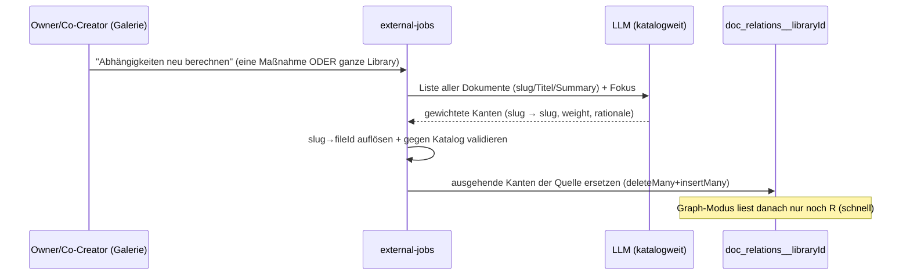
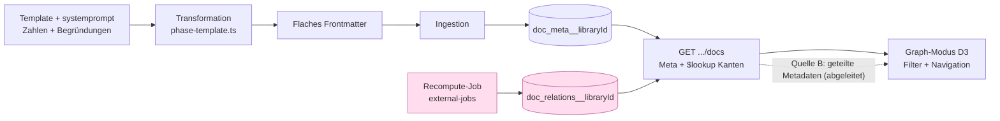

# Zielbild: Dokument-Bewertung & Beziehungs-Graph (generisch)

> Status: **Entwurf zur Abstimmung** · Letzte Aktualisierung: 2026-05-30
> Verwandt: [`perspektiven-bruecken-zielbild.md`](./perspektiven-bruecken-zielbild.md),
> [`mongodb-repository-pattern.md`](./mongodb-repository-pattern.md),
> Klimamaßnahmen-Template [`template-samples/klimamassnahme-detail1-de.md`](../../template-samples/klimamassnahme-detail1-de.md),
> ADR [`0001-event-job-vs-external-jobs.md`](../adr/0001-event-job-vs-external-jobs.md)
> Vorbild (Schwester-Repo): `bcoop-notion2wiki` — D3-Graph + Bubble-Diagramm

---

## 1. Kontext & Einordnung

Wir wollen Dokumente einer Library **bewerten**, **vergleichbar** machen,
**priorisieren** und ihre **Beziehungen** als interaktiven Graphen sichtbar
machen — als zusätzliche Navigationsoberfläche.

Erster Anwendungsfall ist der **Klimamaßnahmen-Katalog** (Südtirol). Das Bild aus
der Präsentation:

- **Vier Perspektiven** je Maßnahme (Wirkung · Lebensqualität & Soziales ·
  Struktur & Rahmenbedingungen · Unterstützung & Bewusstsein).
- **Bewertungs-Trichter**: Maßnahme → Einschätzung → Vergleichbarkeit →
  Orientierung.
- **Zwei Sichtweisen**: *Fachliche Einschätzung* („was ist möglich") und
  *Praxis-/Akteursperspektive* („was passiert tatsächlich") → zusammen entsteht
  ein Bild **tragfähiger** Maßnahmen.

> **Dieses Dokument** deckt die *Fachliche Einschätzung* + die Visualisierung ab.
> Die *Akteursperspektive* liefern die
> [Perspektiven-Brücken](./perspektiven-bruecken-zielbild.md).

> **🔑 Generisch, nicht klima-spezifisch.** Die Klimamaßnahmen sind nur der erste
> Anwendungsfall. Bewertung, Beziehungs-Graph und Graph-Modus sind eine
> **generische, pro Library konfigurierbare** Fähigkeit. Klima-Felder wie
> `co2_einsparung_kt` sind nur *die Konfiguration dieser einen Library* (siehe §8).

> **🕸 Mehrere Kantenquellen.** Der Graph baut sich aus **umschaltbaren Quellen**
> auf: aus **berechneten Beziehungen** (LLM: „welche Maßnahme stützt welche") —
> *oder* aus **gemeinsamen Metadaten** (Obsidian-Stil: Dokumente verbinden sich
> über gleiche Tags/Handlungsfelder). Die berechnete „Supports"-Sicht ist nur
> **eine** mögliche Ansicht (siehe §5).

**Vorbild:** Das Schwester-Projekt `bcoop-notion2wiki` hat bereits einen
interaktiven D3-Kraftgraphen + ein Circle-Packing-Bubble-Diagramm im gleichen
Stack — wir übernehmen das Rendering und ersetzen die Datengrundlage (§6.7).

---

## 2. Leitprinzipien

1. **Generisch & pro Library konfigurierbar.** Keine Hardcodierung auf
   Klimamaßnahmen oder die `climateAction`-Detailansicht.
2. **Template-getrieben.** Die Einzelbewertungen entstehen über das Template.
3. **Jede Einschätzung hat eine Begründung** — auf Südtirol bezogen, vom LLM.
4. **KI-first.** Vorerst rein KI-gestützt; menschliches Übersteuern ist ein
   späterer, zweiter Schritt.
5. **Graph = Navigationsoberfläche.** Ein eigener Top-Level-Modus neben „Inhalt"
   und „Story-Mode". Klick auf einen Knoten öffnet dieselbe Detailansicht.
6. **Mehrere Kantenquellen.** Der Graph baut sich aus berechneten Beziehungen
   *oder* gemeinsamen Metadaten (Obsidian-Stil) auf — umschaltbar.
7. **Öffentlich sichtbar, Neuberechnung nur für Berechtigte.** Ansehen darf
   jede:r (auch anonym); neu rechnen nur Owner/Co-Creator.
8. **Schnelles Laden.** Berechnete Kanten werden **vorberechnet** und aus MongoDB
   geladen; Metadaten-Kanten entstehen sofort aus den geladenen Werten.

---

## 3. Die drei Bausteine

| Baustein | Was | Wo gespeichert |
|---|---|---|
| **A — Bewertung** | LLM schätzt je Dokument Zahlen **+ Begründung**. | Flaches Frontmatter (Template). |
| **B — Kantenquellen** | Woraus sich der Graph aufbaut: **berechnete** Beziehungen *oder* **gemeinsame Metadaten** (Obsidian-Stil). | Berechnet → MongoDB; Metadaten → abgeleitet (kein Speicher). |
| **C — Visualisierung** | Interaktiver Graph-Modus als Navigation. | Client (D3), liest A + B. |

---

## 4. Baustein A — Bewertungsmodell (pro Dokument, via Template)

### 4.1 Neue Felder (flach, snake_case, Obsidian-kompatibel)

Erweiterung des Templates
[`klimamassnahme-detail1-de.md`](../../template-samples/klimamassnahme-detail1-de.md).
Alle Felder bleiben **flach** ([AGENTS.md](../../AGENTS.md)). **Zu jeder Zahl
gehört eine Begründung.** Beziehungen stehen **nicht** im Frontmatter (siehe §5).

| Feld | Typ | Bedeutung |
|---|---|---|
| `co2_einsparung_kt` | number | Geschätztes CO₂-Einsparpotenzial in Kilotonnen/Jahr (Südtirol-Maßstab). |
| `co2_einsparung_kt_begruendung` | string | **Warum** diese Größenordnung — Südtirol-bezogen. |
| `durchsetzbarkeit` | number `0..1` | 0 = kaum durchsetzbar, 1 = breiter Konsens. |
| `durchsetzbarkeit_begruendung` | string | Warum dieser Wert (Widerstände, Akteure). |
| `kosten_eur` | number | Geschätzte Kosten in Euro (Größenordnung). |
| `kosten_eur_begruendung` | string | Warum diese Kostenschätzung. |
| `score_wirkung` | number `0..1` | Perspektive Schlüsselmaßnahme / Emissionsminderung. |
| `score_soziales` | number `0..1` | Perspektive Lebensqualität & Soziales. |
| `score_struktur` | number `0..1` | Perspektive Struktur & Rahmenbedingungen. |
| `score_bewusstsein` | number `0..1` | Perspektive Unterstützung & Bewusstsein. |
| `perspektiven_begruendung` | string | Warum diese 4 Werte (Profil der Maßnahme). |
| `dominant_perspektive` | string | `wirkung` \| `soziales` \| `struktur` \| `bewusstsein` (Argmax). Treibt die **Knoten-Farbe** generisch. |
| `bewertung_modell` | string | LLM-Modell der Schätzung (Transparenz). |
| `bewertung_stand` | string | Datum `YYYY-MM-DD`. |

### 4.2 Befüllung über das Template

Alle Felder (Zahl **und** Begründung) sind **generative** Felder im
`systemprompt`/`Antwortschema`-Block des Templates — ein LLM-Aufruf je Dokument
in der bestehenden Transformation
([`phase-template.ts`](../../src/lib/external-jobs/phase-template.ts)). Der
Prompt verlangt explizit den Südtirol-Bezug für jede Begründung.

### 4.3 Rating

```
rating_raw = ( co2_einsparung_kt × durchsetzbarkeit ) / max(kosten_eur, ε)
```

- Anzeige als **Prioritäts-Score 0..100** (Perzentil über die Library).
- **Guards (keine Silent Fallbacks):** `kosten_eur` fehlt/0 → „Kosten unbekannt",
  nicht verschlucken ([no-silent-fallbacks.mdc](../../.cursor/rules/no-silent-fallbacks.mdc)).
- **Enabler bleiben sichtbar:** Maßnahmen mit `co2 ≈ 0`, die viele andere
  *ermöglichen*, ranken niedrig — ihre Bedeutung zeigt der **Graph** (viele
  ausgehende Kanten). Rating = direkte Wirkung, Graph = systemische Wirkung.

### 4.4 Generisch betrachtet

Die Klima-Felder sind **die Bewertung dieser Library**. Eine andere Library
definiert in ihrem Template andere Zahlen + Begründungen. Der Graph-Modus liest
generisch konfigurierte Feldnamen (§8) — er kennt „CO₂" nicht.

---

## 5. Baustein B — Wie der Graph sich aufbaut (mehrere Kantenquellen)

Knoten sind immer die Dokumente. **Kanten** kommen aus einer **umschaltbaren
Quelle** — die berechneten „Supports"-Kanten sind nur eine davon.

### 5.1 Quelle A — Berechnete Beziehungen (LLM, gerichtet, gewichtet)

Gerichtete, **gewichtete** Kante `A → B, weight 0..1` („A unterstützt/ermöglicht
B, wie stark") + kurze `rationale`. Beziehungstyp pro Library konfigurierbar
(Default „unterstützt"). Braucht einen **Vorberechnungs-Lauf** (§5.5) und wird
**gespeichert** (§5.4).

### 5.2 Quelle B — Gemeinsame Metadaten (Obsidian-Stil)

Dokumente verbinden sich über **gleiche Facetten-Werte** (Tags, Handlungsfeld
`category`, `arbeitsgruppe`, Jahr …) — wie Obsidians Tag-Graph. **Kein LLM, kein
Speicher, sofort**, weil die Werte schon mit `DocCardMeta` geladen sind und die
Filter automatisch greifen. Zwei Spielarten:

- **Tag-Hub (bipartit):** Metadaten-Werte werden zu eigenen **Hub-Knoten**;
  Dokumente hängen an ihren Werten. Cluster entstehen um die Hubs (wie Obsidian).
- **Projektion (Dokument↔Dokument):** zwei Dokumente verbinden sich direkt, wenn
  sie ≥ N Werte teilen; Gewicht = Anzahl/Jaccard gemeinsamer Werte.

Welche Felder Kanten bilden, ist pro Library konfigurierbar (§8).

### 5.3 Quelle C — Embedding-Ähnlichkeit *(optional/später)*

Da je Dokument bereits Vektoren existieren
([`vector-repo.ts`](../../src/lib/repositories/vector-repo.ts)), ließe sich ein
„semantische Nachbarn"-Graph bauen (Top-K). Voll generisch, ohne LLM-Autorenschaft
— als spätere dritte Quelle vorgemerkt.

### 5.4 Speicherung der berechneten Beziehungen (nur Quelle A, entschieden)

Nur **Quelle A** braucht Speicher; B/C sind **abgeleitet** (Client/Aggregation).
Eigene **Per-Library-Collection** `doc_relations__<libraryId>` — konsistent mit
dem Muster `doc_meta__<libraryId>` / `vectors__<libraryId>`
([Repository-Pattern](./mongodb-repository-pattern.md)).

```
DocRelationEdge = {
  libraryId:    string
  sourceFileId: string     // STABILER Schlüssel (nicht slug/nr) — überlebt Reslug/Reindex
  targetFileId: string
  sourceSlug?:  string      // denormalisiert, nur für Anzeige
  targetSlug?:  string
  weight:       number      // 0..1 Stärke der Abhängigkeit
  rationale?:   string
  relationType: string      // generisch, Default "unterstuetzt"
  computedAt:   Date
  computedBy:   string       // Modell/User (Audit)
}
```

**Indizes:** `{libraryId, sourceFileId}`, `{libraryId, targetFileId}`,
`{libraryId, computedAt}`, optional `{libraryId, sourceFileId, weight}`.

- **Schnelles Laden:** ganzer Graph einer Library in *einem* Query; für die
  Detailansicht eines Dokuments per `$lookup` (gleiches Muster wie die
  Favoriten-/Kommentar-Lookup-Stages in
  [`vector-repo.ts`](../../src/lib/repositories/vector-repo.ts)).
- **„Eingehend" wird abgeleitet:** Jede Maßnahme „besitzt" ihre **ausgehenden**
  Kanten; „wird unterstützt von" = Query auf `targetFileId`. Kein doppeltes
  Speichern.
- **Identitäts-Brücke:** Das LLM arbeitet mit `slug`+Titel; beim Speichern wird
  `slug → fileId` über `doc_meta` aufgelöst und gegen die Library validiert
  (unbekannte Referenzen werden **protokolliert**, nicht still verworfen).

### 5.5 Neuberechnungs-Flow (nur Quelle A, entschieden)

Wie eine Story-Mode-Frage **aus der Galerie heraus angestoßen**, aber als
**eigener asynchroner Task** (`external-jobs`, [ADR 0001](../adr/0001-event-job-vs-external-jobs.md)),
weil der Lauf katalogweiten Kontext braucht und länger dauern kann:



- **Zwei Granularitäten:** (a) **eine Maßnahme** → ersetzt nur deren ausgehende
  Kanten (`deleteMany({libraryId, sourceFileId})` + `insertMany`); (b) **ganze
  Library** → ersetzt alle.
- **Auslöser:** Button in Galerie/Detailansicht; optional automatisch
  einreihen, wenn eine Maßnahme neu angelegt/geändert wird.
- **Status/Reload:** Fortschritt über das bestehende Job-Monitoring; ein
  Ergebnis-/Cache-Eintrag (Hash über den Katalog-Stand) zeigt **Veraltung** an,
  wenn sich seit der letzten Berechnung Dokumente geändert haben.
- **Recompute = nur Owner/Co-Creator** (teurer LLM-Schreibvorgang). Anonyme
  sehen nur das vorberechnete Ergebnis. **Metadaten-Graphen (Quelle B) brauchen
  keine Neuberechnung** — sie sind immer sofort live.

### 5.6 Anzeige-Begrenzung (Hairball-Schutz)

Gewichtete (berechnete) Kanten → nur die **stärksten** zeigen: pro Knoten ein
Limit (z. B. Top 5 ausgehend) und/oder global die ~20 wichtigsten,
Liniendicke = Gewicht. Die Grenzwerte sind pro Library konfigurierbar (§8).

---

## 6. Baustein C — Visualisierung & Navigation

### 6.1 Graph-Modus als dritter ViewMode

Neben **Inhalt** (Galerie) und **Story-Mode** gibt es einen **Graph-Modus** —
umgesetzt als **dritter ViewMode der Galerie** (`grid | table | graph`), damit er
**denselben gefilterten Dokumentbestand** und dieselbe **Filter-Sidebar** wie die
Galerie teilt. Oben im Graph-Modus wählt man die **Kantenquelle**:

> Verbinde nach: [ Berechnete Beziehungen ▾ | Handlungsfeld | Tags | Arbeitsgruppe | … ]

Die Default-Quelle ist pro Library konfigurierbar (§8).

### 6.2 Generische visuelle Kodierung (config-getrieben)

Der Graph liest **konfigurierte Feldnamen**, keine festen Klima-Felder:

| Merkmal | generischer Config-Wert | Klima-Belegung |
|---|---|---|
| Knoten-**Größe** | `graph.sizeField` (numerisch) | `co2_einsparung_kt` (mit Mindest-Radius) |
| Knoten-**Farbe** | `graph.colorField` (kategorisch) + `colorMap` | `dominant_perspektive` (grün/orange/blau/gelb) |
| Knoten-**Deckkraft** | `graph.opacityField` (`0..1`) | `durchsetzbarkeit` |
| **Kanten** | je nach Kantenquelle (§5): berechnet *oder* geteilte Metadaten | „unterstützt" / gemeinsame Tags |

Im **Tag-Hub-Modus** (Quelle B) gibt es zusätzlich **Hub-Knoten** für die
Metadaten-Werte (eigenes Styling, Größe = Anzahl Dokumente).

### 6.3 Navigation: Klick → Detailansicht über dem Graphen

Der große Graph bleibt im **Hintergrund** stehen; ein Klick auf einen Knoten
öffnet **dieselbe** bestehende Detailansicht
([`detail-overlay.tsx`](../../src/components/library/gallery/detail-overlay.tsx))
als Overlay. Diese ist bereits generisch über `detailViewType` (book/session/
climateAction/…) — also **keine** Klima-Sonderlogik nötig.

### 6.4 Filter wirken auf den Graphen

Die linke Facetten-Auswahl filtert **gleichzeitig** den Graphen: ausgefilterte
Knoten werden ausgeblendet, Kanten nur zwischen sichtbaren Knoten gezeigt.
Technisch derselbe gefilterte Dokumentbestand wie in der Galerie
(`GET /api/chat/[libraryId]/docs`,
[route](../../src/app/api/chat/[libraryId]/docs/route.ts)).

### 6.5 Interaktivität

- **Knoten-Klick:** Detailansicht öffnen **und** Nachbarschaft hervorheben
  (ein-/ausgehende Kanten farblich getrennt, Rest abblenden).
- **Tooltip/Panel:** Rating + alle Zahlen **mit Begründung**.
- **Drag / Zoom / Pan**, **Legende** (Farbe = Perspektive, Größe, Deckkraft),
  **Filter** wie Galerie.

### 6.6 Zugriff

Ansehen **öffentlich** (im veröffentlichten Galerie-Modus) **und** für
Mitglieder; **Neuberechnen** nur Owner/Co-Creator (§5.3).

### 6.7 Wiederverwendung aus `bcoop-notion2wiki`

Gleicher Stack, D3 v7, zwei eigenständige Komponenten:
`src/components/ProjectVisualizer.tsx` (Kraftgraph) und
`src/components/CirclePackingVisualizer.tsx` (Bubble). Mapping: Radius=claps →
`sizeField`; Farbe=status → `colorField`; Deckkraft=claps → `opacityField`;
**berechnete Ähnlichkeit → gespeicherte gerichtete, gewichtete Kanten**. Umbau:
Pfeilspitzen, Nachbarschafts-Highlight, Daten-Interface auf `DocCardMeta`,
Farb-/Enum-Maps aus der Library-Config.

---

## 7. Datenfluss (Gesamtbild)



---

## 8. Per-Library-Konfiguration (macht es generisch)

Neuer Block unter `config.chat.gallery.graph` (Per-Library-Config-Feld nach der
[Checkliste](../../.cursor/rules/library-config-field.mdc)):

```
graph: {
  enabled:          boolean
  defaultEdgeSource:'relations' | 'sharedMeta' | 'similarity'
  sizeField:        string                 // numerischer meta-Key → Knotengröße
  opacityField?:    string                 // 0..1 meta-Key → Deckkraft
  colorField?:      string                 // kategorischer meta-Key → Farbe
  colorMap?:        Record<string,string>  // Wert → Farbe
  maxEdgesPerNode?: number                 // z. B. 5
  maxEdgesTotal?:   number                 // z. B. 20
  minWeight?:       number
  edgeSources: {
    relations?:  { enabled, relationType, relationPrompt? }            // berechnet (Quelle A)
    sharedMeta?: { enabled, fields: string[], mode: 'hub'|'projection', minShared? } // Obsidian (Quelle B)
    similarity?: { enabled, topK }                                     // Embeddings (Quelle C, später)
  }
}
```

Damit ist die *Klima*-Bedeutung nur Konfiguration; jede Library kann den
Graph-Modus mit ihren eigenen Feldern aktivieren.

---

## 9. Konformität mit Projektregeln

- **Flaches Frontmatter** ([AGENTS.md](../../AGENTS.md)): nur Skalare; das
  **verschachtelte Graph-Modell** lebt downstream in `doc_relations__<libraryId>`.
- **Domänen-Trennung** ([ADR 0001](../adr/0001-event-job-vs-external-jobs.md)):
  Recompute = `external-jobs`.
- **Keine Silent Fallbacks**: fehlende Zahlen, `kosten=0`, unbekannte
  Kanten-Referenzen → jeweils explizit.
- **Storage-Abstraktion**: Viz liest aus `GET …/docs` + Relations-Collection,
  nicht aus dem Storage.
- **Facetten/Sortierung**: numerische Felder bleiben Facetten/Sort-Keys → Rating-
  Sortierung in der normalen Galerie fällt gratis ab.

---

## 10. Offene Fragen (Rest)

1. **Knoten-Größe & Rating-„Wirkung":** `co2_einsparung_kt` (Vorschlag) oder
   `score_wirkung`?
2. **Rating-Normalisierung:** Perzentil 0..100 vs. feste Schwellen; Umgang mit
   „Kosten unbekannt" im Ranking.
3. **Metadaten-Graph:** Tag-Hub (bipartit, wie Obsidian) oder Dokument↔Dokument-
   Projektion — welche Spielart als Default? (Beide anbieten, eine als Default.)
4. **Default-Kantenquelle** je Library: berechnete Beziehungen oder Metadaten?
5. **Begründungen je Perspektive:** eine gemeinsame `perspektiven_begruendung`
   (Vorschlag) oder vier einzelne?
6. **Auto-Recompute:** beim Anlegen/Ändern automatisch einreihen, oder nur
   manueller Button?
7. **Zyklen:** Abhängigkeitskreise erkennen/markieren?
8. **Erste Sicht:** Netzwerk (Vorschlag) vs. Bubble vs. Quadranten-Streudiagramm.

---

## 11. Entschiedene Festlegungen (Stand 2026-05-30)

- **Bewertung über das Template**, jede Zahl **mit Südtirol-Begründung**.
- **KI-first**; menschliches Übersteuern erst im zweiten Schritt.
- **Mehrere Kantenquellen** (umschaltbar): **berechnete** Beziehungen *oder*
  **gemeinsame Metadaten** (Obsidian-Stil) — die „Supports"-Sicht ist nur eine.
  Metadaten-Graphen brauchen kein LLM/keinen Speicher und sind sofort live.
- **Berechnete Kanten sind gewichtet** (0..1); Anzeige der stärksten (Top-N / pro Knoten).
- **Speicher (nur berechnete Kanten):** `doc_relations__<libraryId>`, Schlüssel
  `fileId`; schnelles Laden aus MongoDB, nicht bei jedem Aufruf neu rechnen.
- **Neuberechnung** aus der Galerie als eigener `external-jobs`-Task; pro
  Maßnahme oder ganze Library; nur Owner/Co-Creator.
- **Graph-Modus** als **dritter ViewMode** (`grid|table|graph`) neben Inhalt +
  Story-Mode, **öffentlich** sichtbar, dient der **Navigation** (Klick →
  Detailansicht über dem Graphen), **Filter wirken** auf den Graphen.
- **Generisch**: pro Library über `config.chat.gallery.graph` konfigurierbar —
  nicht auf Klimamaßnahmen/`climateAction` festgenagelt.
