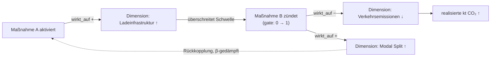
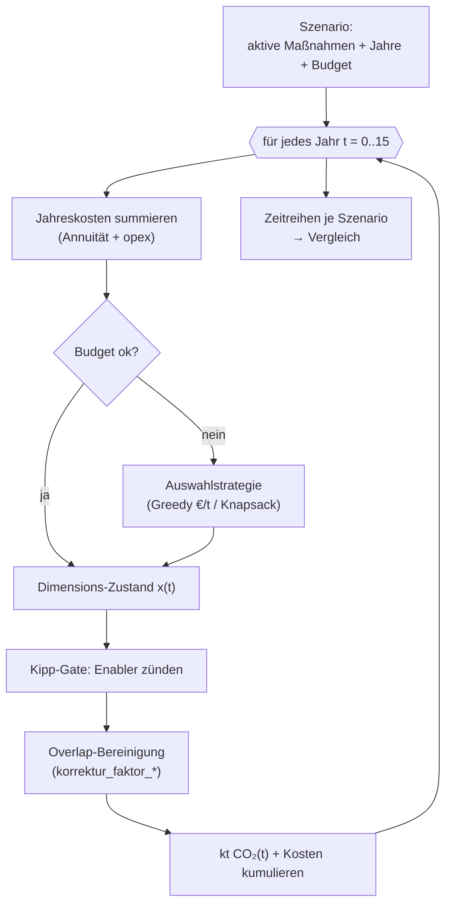

# Zielbild: Dimensionen-Faktormodell, Kosten-Annualisierung & Wirkungssimulation

> Status: **Entwurf zur Abstimmung** · Letzte Aktualisierung: 2026-07-18
> Verwandt:
> [`massnahmen-beziehungen-skalierung.md`](./massnahmen-beziehungen-skalierung.md)
> (Provides/Requires-Idee, direkte Vorstufe),
> [`massnahmen-bewertung-und-graph-zielbild.md`](./massnahmen-bewertung-und-graph-zielbild.md)
> (Bausteine A/B/C, bestehende Bewertungsfelder),
> Plan [`summen-und-synergie-aggregation`](../../.cursor/plans/summen-und-synergie-aggregation_a7c3e912.plan.md)
> (Overlap-/Enabler-Mathe), ADR [`0001`](../adr/0001-event-job-vs-external-jobs.md).

---

## 0. Zusammenfassung (TL;DR)

Die heutige Berechnung „welche Maßnahme wirkt auf welche" ist **teuer**: sie fährt
pro Maßnahme einen katalogweiten LLM-Pass (siehe §1). Dieses Zielbild beschreibt
eine **billigere, systemische** Alternative:

1. **Einmal ein Wirkungs-Dimensionsschema** aus allen Maßnahmen + Kategorien
   ableiten (~40 Dimensionen, §2).
2. Jede Maßnahme **einmal** über zwei Vektoren einschätzen: *worauf sie wirkt*
   (`wirkt_auf`) und *wovon sie abhängt* (`haengt_ab_von`) (§3) → **O(n) statt O(n²)**.
3. Die Maßnahme→Maßnahme-Wirkung **rechnet sich daraus deterministisch** als
   Matrixprodukt `E·Sᵀ` — kein paarweiser LLM-Vergleich mehr, und **interpretierbar**
   (welche Dimension trägt die Kante, §4).
4. Über die `haengt_ab_von`-Schwellen lassen sich **Kipppunkte/Kaskaden**
   modellieren („aktiviere ich A, kippen dann B, C, D?", §5).
5. Die **Kosten** werden von einer Einmalsumme auf ein **Jahresprofil** über 15
   Jahre umgestellt (nicht-linear: Investition vorne, Betrieb laufend,
   Wirkungsaufbau verzögert, §6) — erst dadurch werden €/Jahr und CO₂/Jahr
   vergleichbar.
6. Darauf setzt eine **Jahres-Simulation** auf: Szenarien mit begrenztem Budget
   durchspielen und Schwerpunkte verlagern (§7).
7. Als **optionale Analyseschicht** kann der Wirkungsgraph nach **Neo4j**
   projiziert werden (GDS: Hebel, Cluster, Kaskaden). Quelle der Wahrheit bleibt
   MongoDB (§8).

Dieses Dokument ist **Konzept, kein Code**. Es benennt Wiederverwendung (§9),
Konformität und offene Fragen (§10).

---

## 1. Problem & Einordnung

### 1.1 Die heutige, teure Methode

Die gerichteten „unterstützt"-Kanten (Quelle A im Bewertungs-Zielbild) entstehen
in [`phase-doc-relations.ts`](../../src/lib/external-jobs/phase-doc-relations.ts):
ein **fokussierter LLM-Pass pro Maßnahme**, jeder mit dem **ganzen Katalog** im
Kontext. Das ist bewusst kein „alle-gegen-alle" (der Prompt wählt nur die
wichtigsten Kanten, `DEFAULT_MAX_OUTGOING = 10`), aber die Kosten wachsen mit der
Katalog­größe pro Pass — deshalb der harte Deckel
`MAX_LIBRARY_FOCUS = 150` ([`relations-limits.ts`](../../src/lib/gallery/relations-limits.ts))
und die Owner-Beschränkung. Für 606 Maßnahmen ist der volle Lauf bereits jenseits
des Deckels.

Der naive paarweise Vergleich wäre **O(n²)** und laut
[`massnahmen-beziehungen-skalierung.md`](./massnahmen-beziehungen-skalierung.md)
„weder bezahlbar noch latenz-tauglich" (1.000 Maßnahmen → ~1 Mio. Paare).

### 1.2 Was schon existiert (und wiederverwendbar ist)

- **Ein erster Dimensionsvektor pro Maßnahme:** das SDG-Profil `sdg_1..sdg_17`
  (0..1) plus die vier Perspektiven `score_wirkung/soziales/struktur/bewusstsein`
  — siehe Template
  [`klimamassnahme-detail1-de.md`](../../template-samples/klimamassnahme-detail1-de.md).
  Diese sind **einfach-signiert** („unterstützt Ziel X"), **ohne** Trennung in
  *wirkt-auf* vs. *hängt-ab-von* — genau die Zutat, die §3 ergänzt.
- **Overlap-/Doppelzählungs-Korrektur:** `korrektur_faktor_co2/kosten` je Maßnahme
  ([`overlap-report-*`](../../src/lib/external-jobs/)).
- **Enabler-Hebel (1 Hop, Dämpfung β=0,5):**
  [`enabler-leverage.ts`](../../src/lib/graph/enabler-leverage.ts).
- **Synergie-bereinigte Summen (Greedy):**
  [`synergy-sum.ts`](../../src/lib/graph/synergy-sum.ts).
- **Prioritäts-Indikator** `rating = co2·durchsetzbarkeit/kosten`:
  [`rating.ts`](../../src/lib/gallery/rating.ts).

### 1.3 Was fehlt

1. Eine **kausale Richtung** (wer ermöglicht wen) ohne O(n²)-LLM.
2. Ein **Kipppunkt-/Kaskadenmodell** (nicht nur 1-Hop-Vererbung).
3. **Jährliche Kosten** statt einer Einmalsumme, damit Kosten und Wirkung über die
   Zeit vergleichbar werden.
4. Ein **Szenario-Simulator** (heute gibt es nur die D3-Layout-„simulation").

---

## 2. Wirkungs-Dimensionsschema (neu, eigen)

**Kernidee:** Statt Maßnahmen paarweise zu vergleichen, führen wir eine
**gemeinsame Zwischenschicht** ein — einen kleinen, benannten, menschenlesbaren
Satz von **Dimensionen** („Stellschrauben" des Systems). Maßnahmen berühren sich
nur noch **über diese Dimensionen**.

### 2.1 Drei Schichten von Dimensionen

| Typ | Kürzel | Bedeutung | Beispiele |
|---|---|---|---|
| **Emissions-/Wirkungsdimension** | `E` | Messbare Zielgröße, an der CO₂ hängt. | Verkehrsemissionen, Gebäudewärmebedarf, Strommix-Emissionsfaktor, Prozess-/Methanemissionen, Bodenkohlenstoff |
| **Enabler-/Voraussetzung** | `V` | Struktureller Hebel, der andere Maßnahmen erst ermöglicht. | Netzkapazität, Ladeinfrastruktur, Rechtsrahmen, Förderbudget, Datengrundlage/Monitoring, Fachkräfte, öffentliche Akzeptanz, Planungskapazität Gemeinden |
| **Verhaltens-/Bestandsgröße** | `B` | Langsam veränderlicher Zustand mit Rückkopplung. | Modal Split, Sanierungsrate, Anteil erneuerbare Wärme, Flächenverbrauch, Ernährungsmuster |

Die Trennung ist wichtig: **`E`** sind die Größen, über die sich CO₂ am Ende
bilanzieren lässt; **`V`** erklärt, *warum* eine Wirkungsmaßnahme ohne ihre
Enabler nicht greift (→ Kipppunkte, §5); **`B`** liefert die Trägheit für die
Jahres-Simulation (§7).

### 2.2 Ableitung: ein einmaliger Katalog-Pass

Ein **einziger** Long-Context-LLM-Lauf bekommt alle Maßnahmen (Nr, Titel,
`summary`) **plus** die vorhandenen Kategorien (`arbeitsgruppe`, `category` /
Handlungsfeld) und **clustert** die wiederkehrenden Wirk- und Voraussetzungs-Themen
zu **benannten Dimensionen**. Ergebnis ist **ein Dimensions-Register** (nicht pro
Maßnahme gespeichert), z. B.:

```yaml
# Dimensions-Register (ein Dokument, downstream in MongoDB)
- key: verkehrsemissionen_strasse
  name: "Straßenverkehrsemissionen"
  typ: E
  beschreibung: "Territoriale CO2e aus Straßenverkehr (PKW, Nutzfahrzeuge)."
- key: ladeinfrastruktur
  name: "Ladeinfrastruktur E-Mobilität"
  typ: V
  beschreibung: "Dichte/Verfügbarkeit öffentlicher und privater Ladepunkte."
- key: modal_split_oepnv
  name: "Modal Split ÖPNV/Rad"
  typ: B
  beschreibung: "Anteil ÖPNV/Rad an Wegen."
# … ~40 Einträge
```

Dieser Schritt ist **O(1)** in der Anzahl LLM-Läufe (ein Pass, ggf. in wenige
Chunks geteilt) und **cachebar**.

### 2.3 „Wie viele Dimensionen braucht es?"

Statt eine feste Zahl vorzugeben, verwenden wir ein **Kriterium**:

- **Abdeckung:** Jede Maßnahme sollte mit **~3–8 Dimensionen** belegt sein (weniger
  → zu grob; deutlich mehr → das Schema erklärt nichts mehr).
- **Redundanz:** Keine zwei Dimensionen dürfen über den Katalog hinweg
  **> 0,9 korrelieren** (sonst zusammenlegen).
- **Startgröße ~40**, dann empirisch nach oben/unten justieren (Split zu grober,
  Merge redundanter Dimensionen). Der User-Wunsch „vielleicht so hundert"
  ist die Obergrenze; realistisch pendelt sich ein interpretierbares Schema eher
  bei **30–60** ein.

> Die Wahl der Dimensionszahl ist ein **Ergebnis der Analyse**, kein Input — sie
> wird an Abdeckung/Redundanz kalibriert (siehe offene Frage §10).

### 2.4 Kandidaten-Register (v0) — zum Weiterdenken

> **Herkunft & Status.** Dieses v0-Register ist **strukturell abgeleitet** aus den
> im Repo bekannten Fakten (5 Arbeitsgruppen, Südtiroler Sektor-Kennzahlen aus dem
> Template-Systemprompt, Ressort-/Zuständigkeitsliste, SDG-17 + 4 Perspektiven) —
> es ist **noch nicht empirisch** aus den 606 Maßnahmentexten geclustert. Es dient
> als Denk-/Diskussionsgrundlage. Der **echte Lauf** (§2.2, ein Long-Context-LLM-Pass
> über den Katalog nach dem Muster der bestehenden „Statistik-Dokumente" —
> Overlap-/Enabler-Bericht) **ersetzt** dieses v0 und eicht es an Abdeckung/Redundanz.

**E — Emissions-/Wirkungsdimensionen** (an den Südtiroler Sektoren)

| key | Name | Kurzbeschreibung |
|---|---|---|
| `verkehr_pkw` | MIV/PKW-Emissionen | CO₂ aus motorisiertem Individualverkehr |
| `verkehr_gueter_schwer` | Schwer-/Güterverkehr | CO₂ aus Waren-/Schwerverkehr (Brennerachse) |
| `gebaeude_waermebedarf` | Gebäude-Wärmebedarf | Raumwärme-/Warmwasser-Energiebedarf |
| `heizung_fossil_anteil` | Fossiler Heizanteil | Öl-/Gasanteil an Heizsystemen |
| `strommix_emissionsfaktor` | Strommix-Emissionsfaktor | Emissionsintensität des Stromverbrauchs |
| `industrie_prozess` | Industrie-/Prozessemissionen | Energie-/Prozessemissionen Gewerbe & Industrie |
| `lw_methan_tierhaltung` | Methan Tierhaltung | CH₄ aus Nutztierhaltung |
| `lw_lachgas_boden` | Lachgas Düngung/Boden | N₂O aus Düngung/Böden |
| `wald_boden_senke` | CO₂-Senke Wald/Boden | Kohlenstoffsenke (Wirkung erhöht Senke) |
| `abfall_emissionen` | Abfall-/Deponieemissionen | Emissionen Abfallwirtschaft |
| `tourismus_emissionen` | Tourismusemissionen | Beherbergung, An-/Abreise, Betrieb |
| `konsum_graue_emissionen` | Graue Emissionen Konsum | indirekte Emissionen aus Konsum/Beschaffung |

**V — Enabler / Voraussetzungen** (Governance + Infrastruktur)

| key | Name | Kurzbeschreibung |
|---|---|---|
| `rechtsrahmen_regulierung` | Rechtsrahmen | Landesgesetze/Verordnungen/Standards |
| `foerder_budget` | Förderbudget | öffentliche Fördermittel/Budget |
| `gemeinde_planungskapazitaet` | Gemeinde-Kapazität | Verwaltungs-/Planungskapazität Gemeinden |
| `daten_monitoring` | Daten & Monitoring | Datengrundlage, Bilanzierung, Controlling |
| `stromnetz_kapazitaet` | Stromnetz-Kapazität | Netzausbau/-kapazität Strom |
| `ladeinfrastruktur` | Ladeinfrastruktur | Ladepunkte E-Mobilität |
| `waermenetz` | Wärmenetze | Nah-/Fernwärme-Infrastruktur |
| `ee_erzeugung_kapazitaet` | EE-Erzeugungskapazität | Ausbau PV/Wasser/Wind/Biomasse |
| `fachkraefte_handwerk` | Fachkräfte/Handwerk | Kapazität Sanierung/Installation |
| `oeffentliche_akzeptanz` | Öffentliche Akzeptanz | gesellschaftliche Zustimmung |
| `beratung_bildung` | Beratung & Bildung | Informations-/Beratungs-/Bildungsangebote |
| `interkommunale_koordination` | Koordination | Land–Gemeinden–Akteure abstimmen |
| `oepnv_angebot` | ÖPNV-Angebot | Takt/Netz/Angebot öffentlicher Verkehr |
| `rad_fuss_infrastruktur` | Rad-/Fußinfrastruktur | Wege-/Abstellinfrastruktur aktiv Mobilität |
| `beschaffung_hebel` | Öffentliche Beschaffung | Nachfragehebel über Vergabe |

**B — Verhaltens-/Bestandsgrößen** (langsam, mit Rückkopplung)

| key | Name | Kurzbeschreibung |
|---|---|---|
| `modal_split_umweltverbund` | Modal Split Umweltverbund | Anteil ÖPNV/Rad/Fuß an Wegen |
| `sanierungsrate` | Sanierungsrate | energetische Sanierungsquote Bestand |
| `anteil_ee_waerme` | Anteil EE-Wärme | erneuerbarer Anteil an Wärme |
| `flotte_elektrifizierung` | Flotten-Elektrifizierung | E-Anteil der Fahrzeugflotte |
| `flaechenverbrauch` | Flächenverbrauch | Versiegelung/Bodenverbrauch |
| `ernaehrung_pflanzlich_regional` | Ernährung pflanzlich/regional | Anteil pflanzlich/regionaler Ernährung |
| `lebensmittelverschwendung` | Lebensmittelverschwendung | Menge Lebensmittelabfälle |
| `kreislauf_reparatur` | Kreislauf/Reparatur | Wiederverwendungs-/Reparaturquote |
| `geraete_effizienz` | Geräte-/Anlageneffizienz | Effizienz im Gerätebestand |
| `tourismus_intensitaet` | Tourismus-Nachhaltigkeit | Intensität/Nachhaltigkeit des Tourismusmodells |

**Umfang:** 12 E + 15 V + 10 B = **37 Dimensionen** (im Zielkorridor 30–60, §2.3).
Abdeckung der 5 Arbeitsgruppen: *Energie* (Strommix, EE-Kapazität, Netz, EE-Wärme),
*Mobilität* (MIV, Güter, Lade-/ÖPNV-/Rad-Infrastruktur, Modal Split, Flotte),
*Wohnen* (Wärmebedarf, Heizung, Wärmenetz, Sanierung, Fläche), *Ernährung &
Landnutzung* (Methan, Lachgas, Senke, Ernährung, Lebensmittel), *Konsum &
Produktion* (Industrie, Abfall, Tourismus, graue Emissionen, Beschaffung,
Kreislauf, Geräte). Die V-Dimensionen 13–16, 21–24 sind **querschnittlich** (sie
ermöglichen Maßnahmen über alle Gruppen — genau die Enabler-Hebel aus §5).

> **Nächster Schritt zum Eichen:** den Katalog-LLM-Lauf (§2.2) über die echten
> Maßnahmen fahren (Kontext: `nr, title, summary, category, arbeitsgruppe` + die
> bekannten `sdg_*`/`score_*` als Signal), das Ergebnis mit diesem v0 abgleichen
> (fehlende/überzählige Dimensionen, Redundanz > 0,9) und v0 ersetzen.

---

## 3. Faktormodell pro Maßnahme (signiert, provides/requires)

Jede Maßnahme `A` bekommt **zwei Vektoren** über die `m` Dimensionen:

| Vektor | Symbol | Wertebereich | Bedeutung |
|---|---|---|---|
| `wirkt_auf` (provides/effect) | `eₐ ∈ [−1, 1]ᵐ` | −1 … +1 | Richtung **und** Stärke, wie A jede Dimension verändert. `+` = hebt/verbessert (z. B. baut Ladeinfrastruktur aus), `−` = senkt Druck/Bedarf (z. B. reduziert Verkehrsemissionen). |
| `haengt_ab_von` (requires/sensitivity) | `sₐ ∈ [0, 1]ᵐ` | 0 … 1 | Wie stark A's **eigene** Wirkung von der Erfüllung jeder Dimension abhängt (Voraussetzungen). Optional `schwelleₐ,d`: ab welchem Dimensions-Niveau A „zündet". |

**Beispiel** „Kaufprämie E-Nutzfahrzeuge":
- `wirkt_auf`: `verkehrsemissionen_strasse: −0,7`, `strommix_bedarf: +0,2`
- `haengt_ab_von`: `ladeinfrastruktur: 0,8` (ohne Ladenetz verpufft die Prämie),
  `foerderbudget: 0,6`

### 3.1 Befüllung — O(n), kein paarweiser Vergleich

Je Maßnahme **ein** LLM-Pass gegen das **feste** Dimensions-Register (Muster wie
die bestehende Bewertung in
[`phase-template.ts`](../../src/lib/external-jobs/phase-template.ts)): „Ordne diese
Maßnahme in *dieses* Register ein — welche Dimensionen bewegt sie (mit Vorzeichen),
von welchen hängt sie ab?" Damit wachsen die Kosten **linear** (606 Läufe), sind
parallelisierbar und cachebar. Jede Zahl trägt — wie im bestehenden Modell — eine
kurze **Begründung** (Südtirol-Bezug).

### 3.2 Speicherort — Contract-konform

Das **flache Frontmatter** ([AGENTS.md](../../AGENTS.md)) darf keine dichten
Vektoren/verschachtelten Objekte aufnehmen. Register **und** Vektoren liegen daher
**downstream in MongoDB**, in neuen Per-Library-Collections analog
[`doc_relations`](../../src/lib/repositories/doc-relations-repo.ts):

```
impact_dimensions__<libraryId>          # das Register (§2.2)
  { libraryId, key, name, typ:E|V|B, beschreibung, computedAt, computedBy }

measure_dimension_vectors__<libraryId>  # zwei Vektoren je Maßnahme (§3)
  { libraryId, fileId, massnahmeNr,
    wirktAuf:   [ {dimKey, wert:-1..1, begruendung} ],
    haengtAbVon:[ {dimKey, wert:0..1, schwelle?, begruendung} ],
    computedAt, computedBy }
```

Optionale, aggregierte Skalare (z. B. „Anzahl belegter Dimensionen") dürfen als
flache Frontmatter-Facetten zurückfließen — die **dichten** Vektoren nicht.

---

## 4. Maßnahme→Maßnahme-Wirkung (deterministisch, kein LLM)

Sei `E` die `n×m`-Matrix der `wirkt_auf`-Vektoren, `S` die `n×m`-Matrix der
`haengt_ab_von`-Vektoren. Der gerichtete Einfluss von `A` auf `B`:

```
Einfluss(A → B) = Σ_d  eₐ(d) · s_b(d)
```

„A beeinflusst B, wenn A **Dimensionen bewegt, die B braucht**." In Matrixform ist
die volle Einflussmatrix

```
W = E · Sᵀ        (n×n, Low-Rank ≤ m)
```

- **Vorzeichen bleibt erhalten:** ein negatives `eₐ(d)` (A senkt Dimension d) auf
  ein positives `s_b(d)` (B braucht ein hohes d) ergibt einen **hemmenden**
  Einfluss — Zielkonflikte werden sichtbar, nicht nur Synergien.
- **Interpretierbar:** die tragenden Terme `eₐ(d)·s_b(d)` liefern die
  **`rationale` gratis** („A → B über Dimension *Ladeinfrastruktur*").
- **Kosten:** reine Rechnung. Als Vektorsuche (die `haengt_ab_von`-Vektoren
  indexieren, je Maßnahme Top-k über ihren `wirkt_auf`-Vektor suchen) sogar
  **O(n·k)** über die vorhandene Atlas-Vektorsuche
  ([`vector-repo.ts`](../../src/lib/repositories/vector-repo.ts)).

### 4.1 Kostenvergleich

| Ansatz | LLM-Aufrufe | Bei 606 Maßnahmen |
|---|---|---|
| Paarweiser LLM-Vergleich (naiv) | O(n²) | ~367.000 |
| Heute: fokussierter Pass je Maßnahme (Katalog im Kontext) | O(n) Pässe × großer Kontext | 606 teure Pässe (Deckel 150) |
| **Dimensions-Faktormodell (dieses Zielbild)** | **O(n) kleine Pässe** (Register-Einordnung) | **606 günstige Pässe** |
| Kanten aus `W = E·Sᵀ` | **0** (reine Rechnung) | — |
| Optionaler LLM-Feinschliff nur Top-k | O(n·k) | z. B. k=10 → 6.060 |

Die Kanten aus `W` können die bestehende
[`doc_relations`](../../src/lib/repositories/doc-relations-repo.ts)-Collection
befüllen (`relationType` z. B. `beeinflusst`, `computedBy = "faktormodell"`) —
der Graph-Modus rendert sie unverändert.

---

## 5. Kipppunkte / Kaskaden („Kippen")

Der Dimensionslayer wird zum **Zustandsvektor** `x ∈ ℝᵐ` (aktueller Stand jeder
Stellschraube, normiert auf 0..1). Zwei Regeln:

1. **Antrieb:** Eine aktive Maßnahme `A` schiebt `x` entlang ihres
   `wirkt_auf`-Vektors: `x ← x ⊕ eₐ` (geklippt auf 0..1).
2. **Gate/Zündung:** `A` entfaltet ihre volle Wirkung erst, wenn ihre
   `haengt_ab_von`-Dimensionen die jeweilige `schwelle` überschreiten. Realisierter
   Wirkungsfaktor:

   ```
   gate(A) = Π_d   ramp( x(d) ; schwelle_{A,d} )      über alle d mit s_A(d) > 0
   ```

   (`ramp` = weiche Stufe, z. B. logistisch, damit es differenzierbar bleibt).

**Kaskade:** Aktiviert man `A`, hebt das Dimensionen → weitere Maßnahmen
überschreiten ihre Schwellen → deren `wirkt_auf` hebt weitere Dimensionen → usw.
Das ist ein **Linear-Threshold-/Watts-Kaskadenmodell** auf der Dimensions-Ebene.

- Berechnung als **Iteration bis Fixpunkt** (Zustand ändert sich nicht mehr).
- Der Relations-Graph hat **Zyklen** (A ermöglicht B, B verstärkt A). Wie bei der
  bestehenden [`enabler-leverage.ts`](../../src/lib/graph/enabler-leverage.ts)
  wird pro Hop mit **β (Default 0,5)** gedämpft, damit die Iteration konvergiert und
  Kredit nicht ins Unendliche wächst.
- **Ergebnis:** „Wenn ich Maßnahme A aktiviere, kippen dann B, C, D über ihre
  Schwelle?" — genau die systemische Frage aus dem Auftrag.



---

## 6. Kosten-Annualisierung über 15 Jahre

**Problem:** `kosten_eur` ist heute eine **Einmalsumme** unklarer Semantik
(Investition? Gesamtkosten?), während `co2_einsparung_kt` **pro Jahr** gilt. Ein
direkter Vergleich (auch das heutige `rating`) mischt Bestands- und Stromgrößen.

**Lösung:** ein **Kostenprofil** je Maßnahme statt einer Zahl:

| Feld | Bedeutung |
|---|---|
| `capex_eur` | Einmalige Investition bei Aktivierung (Jahr 0). |
| `opex_eur_pa` | Laufende Betriebs-/Förderkosten pro Jahr. |
| `wirkung_rampup_jahre` | Jahre bis zur Vollwirkung (Wirkung baut sich auf, nicht sofort). |
| `nutzungsdauer_jahre` | Lebensdauer / Reinvestitionszyklus. |

### 6.1 Annualisierung (Annuitätenmethode)

Die Investition wird über die Nutzungsdauer `n` mit Diskontsatz `i` **annuitätisch**
verteilt:

```
annuität(capex) = capex · i / (1 − (1 + i)^(−n))
jahreskosten(t) = annuität(capex) + opex_eur_pa
```

Damit ist **jedes Jahr** eine vergleichbare €-Zahl. Die Wirkung ramped über
`wirkung_rampup_jahre` hoch (linear oder S-Kurve) und bleibt dann bis
`nutzungsdauer_jahre` auf Plateau:

```
wirkung(t) = co2_einsparung_kt · ramp(t / wirkung_rampup_jahre)
```

Die **Nicht-Linearität** (Investition vorne, Betrieb laufend, Wirkung verzögert)
ist damit explizit abgebildet — genau die Vermutung aus dem Auftrag.

### 6.2 Vermeidungskosten (MACC)

Aus Jahreskosten und Jahreswirkung folgt die **€/t-CO₂-Kennzahl** über den
Horizont — die Grundlage einer **Marginal Abatement Cost Curve**:

```
vermeidungskosten (€/t) = Σ_t diskont(jahreskosten(t)) / Σ_t wirkung(t)·1000
```

### 6.3 Durchgerechnetes Mini-Beispiel

Maßnahme „Kaufprämie E-Nutzfahrzeuge":
`capex_eur = 3.000.000`, `opex_eur_pa = 200.000`, `nutzungsdauer_jahre = 15`,
`i = 3 %`, `co2_einsparung_kt = 5,0`, `wirkung_rampup_jahre = 3`.

- Annuitätsfaktor: `0,03 / (1 − 1,03⁻¹⁵) = 0,03 / (1 − 0,6419) = 0,03 / 0,3581 ≈ 0,0838`
- `annuität(capex) = 3.000.000 · 0,0838 ≈ 251.400 €`
- `jahreskosten ≈ 251.400 + 200.000 = 451.400 €/Jahr`
- Wirkung: Jahr 1 ≈ 1,67 kt, Jahr 2 ≈ 3,33 kt, ab Jahr 3 = 5,0 kt/Jahr.
  Summe über 15 Jahre (linearer Ramp über 3 J.): `(1,67+3,33) + 13·5,0 = 5,0 + 65,0 = 70,0 kt`
- Kosten über 15 Jahre (undiskontiert, zur Illustration):
  `15 · 451.400 ≈ 6,77 Mio. €`
- **Vermeidungskosten ≈ 6.771.000 € / 70.000 t ≈ 97 €/t CO₂.**

> Die Zahlen sind ein **Rechenbeispiel zur Methode**, kein realer Wert. Diskontierung
> der Kosten würde den €/t-Wert leicht senken; die Formel oben zeigt die Stelle.

---

## 7. Jahres-Simulation / Szenarien

Auf Faktormodell (§3–5) und Kostenprofil (§6) setzt die eigentliche **Simulation**
auf. Ein **Szenario** = Menge aktivierter Maßnahmen + je Maßnahme ein
**Aktivierungsjahr** + ein **Jahresbudget**.

**Pro Jahr `t`:**

1. **Budget:** `jahreskosten(t)` aller aktiven Maßnahmen summieren; überschreitet
   die Summe das Budget, greift die Auswahlstrategie (s. u.) — kein stilles
   Überziehen.
2. **Dimensions-Zustand:** `x(t)` aus den aktiven Maßnahmen × ihrem
   Ramp-Fortschritt aufbauen (§5, Antrieb).
3. **Kipp-Gate:** realisierte Wirkung jeder Maßnahme mit `gate(A)` aus §5 skalieren
   (Enabler zünden Wirkungsmaßnahmen).
4. **Overlap-Bereinigung:** gegen Doppelzählung die bestehenden
   `korrektur_faktor_co2/kosten` anwenden
   ([`overlap-report-*`](../../src/lib/external-jobs/)).
5. **Bilanz:** realisierte `kt CO₂(t)` und Kosten kumulieren.

**Output:** je Szenario zwei **Zeitreihen** (kumulative CO₂ und Kosten über 15
Jahre) → Szenarienvergleich: „Was, wenn ich mit begrenztem Budget den Schwerpunkt
von Wirkungs- auf Enabler-Maßnahmen verlagere?" Die Kaskade (§5) macht sichtbar,
dass ein früher Enabler späte Wirkungsmaßnahmen erst zündet.

**Auswahlstrategien** (bei Budgetknappheit): Greedy nach €/t (MACC-Reihenfolge),
oder budgetbeschränkte Optimierung (Knapsack je Jahr) unter Beachtung der
Dimensions-Abhängigkeiten. Die Engine ist eine **reine, deterministische
Code-Funktion** (testbar, kein LLM), die Register + Vektoren + Kostenprofile aus
MongoDB liest.



---

## 8. Neo4j-Datenmodell (optionale Analyseschicht)

**Entscheidung:** Quelle der Wahrheit bleibt **MongoDB + flaches Frontmatter**.
Neo4j ist eine **optionale, read-only Projektion** für Graph-Analytik, die in
MongoDB umständlich ist (Pfade, Zentralität, Communities). Die Simulation (§7)
läuft als Code-Engine und **braucht** Neo4j nicht.

### 8.1 Knoten & Kanten

```cypher
// Knoten
(:Measure    {nr, title, co2_kt, capex, opex, rampup, nutzungsdauer})
(:Dimension  {key, name, typ})      // typ ∈ {E, V, B}
(:Category   {name})                // Handlungsfeld
(:Arbeitsgruppe {name})

// Kanten (aus den zwei Vektoren §3)
(:Measure)-[:WIRKT_AUF     {gewicht: -1..1}]->(:Dimension)
(:Measure)-[:HAENGT_AB_VON {gewicht: 0..1, schwelle}]->(:Dimension)
(:Measure)-[:IN_KATEGORIE]->(:Category)
(:Measure)-[:IN_ARBEITSGRUPPE]->(:Arbeitsgruppe)

// abgeleitet (aus W = E·Sᵀ, §4) — materialisiert für schnelle Abfragen
(:Measure)-[:BEEINFLUSST {gewicht, via: [dimKeys]}]->(:Measure)
```

### 8.2 Beispiel-Abfragen (GDS)

```cypher
// Systemische Hebel: Maßnahmen, die viel ermöglichen (PageRank auf BEEINFLUSST)
CALL gds.pageRank.stream('wirkungsgraph')
YIELD nodeId, score
RETURN gds.util.asNode(nodeId).title AS massnahme, score
ORDER BY score DESC LIMIT 10;

// Thematische Cluster (Louvain) auf dem Wirkungsgraph
CALL gds.louvain.stream('wirkungsgraph') YIELD nodeId, communityId ...

// Kaskadenpfad: was zündet Maßnahme X über 2 Hops?
MATCH p = (x:Measure {nr:$nr})-[:BEEINFLUSST*1..2]->(y:Measure)
RETURN p;
```

### 8.3 Sync

Ein **Export-Job** (MongoDB → Neo4j, ETL) projiziert Register + Vektoren + die
abgeleiteten Kanten. Läuft nach jeder Neuberechnung, ist idempotent, und ist die
**einzige** Schreibrichtung — Neo4j wird nie zur eigenständigen Quelle. Damit bleibt
die [Storage-Abstraktion](../../.cursor/rules/storage-abstraction.mdc) gewahrt.

```mermaid
flowchart LR
    T["Katalog (Maßnahmen)"] --> P1["LLM-Pass 1:<br/>Dimensions-Register (§2)"]
    P1 --> DR[("impact_dimensions__lib")]
    T --> P2["LLM-Pässe O(n):<br/>2 Vektoren je Maßnahme (§3)"]
    DR --> P2
    P2 --> MV[("measure_dimension_vectors__lib")]
    MV --> W["W = E·Sᵀ (§4, reine Rechnung)"]
    W --> REL[("doc_relations__lib")]
    MV --> SIM["Simulations-Engine (§7, Code)"]
    REL --> SIM
    MV -. "optionaler ETL-Export" .-> NEO[("Neo4j (Analyse, §8)")]
    REL -. .-> NEO
    style NEO fill:#eef,stroke:#88b
```

---

## 9. Abgrenzung & Wiederverwendung

- Das Faktormodell ist die **primäre, billige** Methode; der heutige teure
  paarweise/fokussierte LLM-Pass bleibt als **optionaler Feinschliff der Top-k**
  bzw. für sehr kleine Kataloge erhalten (§4.1) — konsistent mit der Empfehlung in
  [`massnahmen-beziehungen-skalierung.md`](./massnahmen-beziehungen-skalierung.md).
- **Wiederverwendet** (nicht neu gebaut): `rating.ts`, `overlap-report-*`
  (`korrektur_faktor_*`), `enabler-leverage.ts` (β-Dämpfung), `synergy-sum.ts`,
  `config.chat.gallery.graph`, `doc_relations`-Repo/-Rendering, Atlas-Vektorsuche.
- **Generisch:** wie das bestehende Bewertungs-Zielbild ist auch dies keine
  Klima-Sonderlogik — das Dimensions-Register ist die Konfiguration *dieser*
  Library; eine andere Library leitet ein anderes Register ab.

---

## 10. Konformität & offene Fragen

### 10.1 Konformität mit Projektregeln

- **Flaches Frontmatter** ([AGENTS.md](../../AGENTS.md)): dichte Vektoren + Register
  leben **downstream** in MongoDB (§3.2), nie im Template-Frontmatter.
- **Keine Silent Fallbacks**
  ([no-silent-fallbacks.mdc](../../.cursor/rules/no-silent-fallbacks.mdc)): fehlende
  Dimensionswerte, `kosten=0`, nicht-gezündete Maßnahmen → **explizit** ausweisen,
  nicht als 0 verschlucken.
- **Domänen-Trennung** ([ADR 0001](../adr/0001-event-job-vs-external-jobs.md)):
  Register-Ableitung, Vektor-Befüllung und Neo4j-Export sind **external-jobs**.
- **Storage-Abstraktion**: Neo4j read-only Projektion; UI liest aus `GET …/docs` +
  Collections, nie aus dem Storage.

### 10.2 Offene Fragen (vor einer möglichen Umsetzung)

1. **Dimensionszahl & -stabilität:** Kalibrierung an Abdeckung/Redundanz (§2.3);
   wie stabil ist das Register bei Katalog-Änderungen (Re-Ableitung vs. Anhängen)?
2. **Diskontsatz `i`** und **Ramp-Kurvenform** (linear vs. S) — Default-Werte
   festlegen und als Annahme ausweisen.
3. **Schwellen-Kalibrierung** (`schwelle_{A,d}`): rein LLM-geschätzt vs. an
   Bestandsgrößen (`B`) verankert?
4. **Zyklen-Stabilität** der Kaskaden-Iteration (β, Abbruchkriterium, Divergenz-Schutz).
5. **Validierung** des Faktormodells gegen die teure LLM-Methode: korrelieren die
   Top-Kanten aus `W = E·Sᵀ` mit den heutigen `doc_relations`? (Precision@k.)
6. **Neo4j-Betrieb:** lohnt der zusätzliche Betriebsaufwand, oder reichen die
   Graph-Analytik-Bausteine in Code/Mongo für die absehbaren Fragen?

> Diese Fragen sind der Übergang von **Konzept** zu einem **Prototyp**: Dimensionen
> aus den echten ~606 Maßnahmen ableiten, `W` berechnen, eine Simulation fahren und
> gegen die bestehende Methode validieren.
