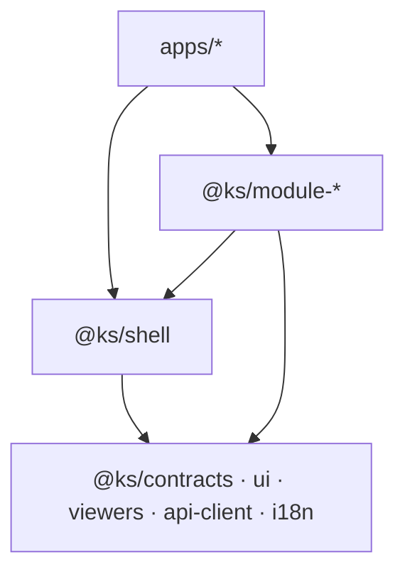

# Modul-Landkarte — Zielbild der Modularisierung

Konzeption zu ADR [0007](../adr/0007-modularisierung-monorepo-schale-module.md)
(Pakete), [0008](../adr/0008-deployment-ziele.md) (eine Instanz, viele Sites),
[0009](../adr/0009-library-foederation.md) (Föderation),
[0010](../adr/0010-retrieval-profile.md) (Profile): Welche Pakete es geben
soll, was aus dem heutigen Code hineinwandert, wie der API-Schnitt aussieht
und in welchen Wellen migriert wird. Die realen Einsatzfälle stehen in
[`library-steckbriefe.md`](library-steckbriefe.md) (Beschreibung des Owners)
und [`einsatz-szenarien.md`](einsatz-szenarien.md) (abgeleitete Muster);
die Umbau-Garantien in [`migrations-strategie.md`](migrations-strategie.md).

Status: Zielbild (vorgeschlagen). Quell-Pfade beschreiben den Stand 2026-08-25.

## 1. Ziel-Paketlandkarte

Namenskonvention: Workspace-intern `@ks/*`; bei späterer Veröffentlichung
`@bcommonslab/ks-*` (Registry existiert bereits).

### Schicht 1 — Shared Libraries (keine Fachlogik-Hoheit)

| Paket | Inhalt | Heutige Quellen (Auszug) |
|---|---|---|
| `@ks/contracts` | Types, DTOs, SiteConfig-Schema, Detail-View-Registry-Typen | `src/types/`, `src/lib/storage/types.ts`, `src/lib/detail-view-types/` |
| `@ks/ui` | shadcn-Basis, Icons, Theme | `src/components/ui/`, `src/components/theme-provider.tsx`, `src/components/icons.tsx`<br>**M4b erledigt**: 39 shadcn-Dateien + `cn`. `theme-provider` liegt seit M3 in `@ks/shell/providers` (Provider-Kette); `icons.tsx` hat null Importeure und bleibt als Löschkandidat liegen; `llm-model-selector` ist kein Primitive und ging nach `src/components/shared/` |
| `@ks/viewers` | Markdown-Viewer, PDF-Viewer, Audio-Player, Image-Preview | `src/components/library/markdown-preview/`, `src/lib/markdown/`, `src/lib/pdf/`, `src/components/library/audio-player.tsx`, `src/components/library/image-preview.tsx` |
| `@ks/api-client` | typisierter Fetch-Client + TanStack-Query-Hooks für Core- und Modul-APIs, BaseURL/Token aus SiteConfig | heute verstreute `fetch`-Aufrufe in Komponenten/Hooks |
| `@ks/i18n` | Locale-Ermittlung + Provider, Strings | `src/lib/i18n/`, `src/components/providers/*locale*`, `src/lib/strings/` |

### Schicht 2 — Schale

| Paket | Inhalt | Heutige Quellen |
|---|---|---|
| `@ks/shell` | Provider-Kette (Theme, Jotai, QueryClient, Locale, Storage-Context), Auth (Clerk, abschaltbar), Library-Bootstrap (Libraries laden, aktive Library aus SiteConfig/URL), konfigurierbare TopNav, Host→Library-Mapping | `src/app/layout.tsx` (Logik), `src/components/layouts/`, `src/components/top-nav*.{ts,tsx}`, `src/atoms/library-atom.ts`, `src/contexts/storage-context.tsx`, `src/hooks/use-library-config.ts`, `src/lib/root-landing.ts`, `src/lib/domain-library-map.ts`<br>**M3 verschoben**: `top-nav-config.ts`, `domain-library-map.ts`, `theme-provider.tsx`, `query-provider.tsx`; Rest blockiert bis `@ks/ui`/`@ks/i18n` (Begruendung: `docs/refactor/modularisierung/AGENT-BRIEF-M3.md`) |

### Schicht 3 — Modul-Pakete (UI + Hooks + API-Handler)

| Paket | Inhalt | Heutige Quellen (Auszug) | API-Namespace |
|---|---|---|---|
| `@ks/module-explorer` | Galerie, Story, Chat/RAG, Doc-Detail, Website-Rendering | `src/app/explore/`, `src/components/library/{gallery,story,chat,website}/`, `src/components/public/`, `src/hooks/gallery/`, `src/lib/{chat,gallery,website}/` | `chat/[libraryId]/*` (Lese-Teil), `public/*`, `markdown/*` |
| `@ks/module-archive` | Archiv: Datei-Liste/-Baum/-Vorschau, Shadow-Twin-UI, Upload, Ingestion | `src/components/library/{file-list,file-preview,…}/`, `src/lib/{shadow-twin,ingestion,storage}/` | `library/[libraryId]/*` (ohne `agent-view`), `storage/*`, `chat/[libraryId]/ingest*` (heute falsch einsortiert, s. §3) |
| `@ks/module-agent-view` | Agentensicht/Werkbank — nach W1–W8 + A1–A6 das **größte** Modul (111 Dateien): Coverage-Scan, Vorhaben-Baum, Artefakt-Abnahme, Kuration nach ADR 0006, Themen, Worklists, MCP-Anbindung | `src/components/library/agent-view/`, `src/hooks/agent-view/`, `src/lib/agent-view/`, `src/lib/mcp/` | `library/[libraryId]/agent-view/*`, `mcp/*`, `account/mcp-*` |
| `@ks/module-creation` | Creation-Wizard, Wartekorb/Submissions, Secretary-Erfassung | `src/components/creation-wizard/`, `src/components/submissions/`, `src/lib/{creation,secretary,submissions}/` | `secretary/*`, `submissions/*`, `wizard-sessions/*`, `creation/*`, `stream-ingest/*` |
| `@ks/module-templates` | Template-Verwaltung | `src/app/templates/`, `src/components/templates/`, `src/lib/templates/` | `templates/*`, `metadata/template/*` |
| `@ks/module-jobs` | Event-Monitor, Session-Manager, External Jobs (Admin) | `src/app/{event-monitor,session-manager}/`, `src/components/{event-monitor,session}/`, `src/lib/{events,external-jobs}*` | `event-job/*`, `external/*`, `sessions/*` |
| `@ks/module-settings` | Library-/Account-/Storage-Settings | `src/app/settings/`, `src/components/settings/` | `settings/*`, `admin/*`, `auth/onedrive/*` |

**Modul-Kandidaten aus den Steckbriefen** (Zuschnitt erst bei Projektstart,
Muster P7/P9 in [`einsatz-szenarien.md`](einsatz-szenarien.md)):

- `@ks/module-import` — Session/Event aus Multi-Quellen (Video + Slides +
  Webseite) aufbauen; wiederverwendet `secretary/process-video|pdf` (SFSCON, CAST).
- `@ks/module-workbench` — Massen-Annotation/-Klassifikation mit Queue-UI und
  Ähnlichkeitsansicht (Diva-Texturen; nutzt `src/lib/graph/`-Bausteine).

**MCP als Modul-Oberfläche** (ADR 0008 §4): `@ks/module-agent-view` exportiert
neben UI und HTTP-Handlern auch seine MCP-Tools (heute `src/lib/mcp/tools-*.ts`);
Sites aktivieren sie per SiteConfig.

### Apps (Laufzeit-Hüllen, NICHT „eine App pro Site")

Per ADR 0008 gilt „ein Deployment, viele Sites": Sites sind
SiteConfig-Einträge auf der einen Instanz. `apps/` enthält nur je Laufzeit-
Hülle einen Eintrag:

| App | Inhalt |
|---|---|
| `apps/knowledgescout` | Die EINE Multi-Site-Instanz: Schale + alle Module + Host→SiteConfig-Resolver. Voll-App = Default-Site; heutige URLs und heutiges Verhalten unverändert. |
| `apps/electron` | Electron-Hülle (heute `electron/`): lädt Module als Wurzelkomponenten, `local-first` (Peters Archiv, Diva-Werkbank). |
| `apps/embed-demo` | Demo-/Testseite für die npm-Embed-Komponente (`@ks/embed`, AECED) — kein Produktions-Deployment. |

## 2. SiteConfig — Laufzeit-Konfiguration pro Site (Host)

SiteConfigs sind DATEN, keine Build-Artefakte (ADR 0008 §1): Die eine Instanz
löst pro Request den Host gegen eine Host→SiteConfig-Registry auf —
Verallgemeinerung von `PUBLIC_DOMAIN_LIBRARY_MAP` +
`getRootLandingTargetForHost()` (`src/lib/root-landing.ts`). Die Schale lädt
die aktivierten Module per `next/dynamic`; nicht aktivierte Module liefern im
Client keine Chunks und in der API 404.

```ts
interface SiteConfig {
  /** Stabile Kennung der Site — benennt Registry-Eintraege in Logs/Fehlern. */
  id: string
  /** Aktive Module — bestimmt geladene Client-Chunks UND freigeschaltete API-Handler. */
  modules: Array<'explorer' | 'archive' | 'agent-view' | 'creation'
    | 'templates' | 'jobs' | 'settings' | 'import' | 'workbench'>
  /** Library-Bindung: Primär-Library + optional föderierte Libraries (ADR 0009). */
  libraries: {
    primary: { slug: string } | { mode: 'user-selected' }   // Voll-App: user-selected
    federated?: Array<{
      slug: string
      role: 'question-bridge' | 'content-bridge' | 'capture-target'
    }>
  }
  /** Schale: App-Menü, Library-Menü oder gar keins (vorkonfigurierte Site). */
  chrome: { topNav: 'app-menu' | 'library-menu' | 'none'; footer?: 'site' | 'none' }
  /** Auth: öffentlich, Clerk optional (Login schaltet Profil/Pflege frei) oder Pflicht. */
  auth: { mode: 'public' } | { mode: 'clerk'; optional?: boolean }
  /** Datenzugang (ADR 0008 §3): local = diese Instanz; remote nur für embed/electron-Hüllen. */
  api?: { mode: 'local' } | { mode: 'remote'; baseUrl: string }
  /** PWA-Flag: Manifest + Service Worker für diese Site (Naturmuseum). */
  pwa?: boolean
  /** Hosts, die auf diese Site auflösen (ersetzt PUBLIC_DOMAIN_LIBRARY_MAP). */
  domains?: string[]
}
```

**Umsetzungsstand (Welle M3)**: Das Schema liegt in `@ks/contracts`
(`site-config.ts`, mit Type-Guard `isSitePrimaryBySlug`), der Resolver in
`@ks/shell` (`site/site-registry.ts`). Ausgewertet wird bisher NUR
`libraries.primary` — von `src/lib/root-landing.ts`. Die uebrigen Felder sind
der deklarierte Vertrag fuer das Modul-Gate (M4) und die erste eigenstaendige
Site (M6); sie jetzt zu konsumieren waere eine Verhaltensaenderung (G4).

Beispiele je Einsatz-Muster: [`einsatz-szenarien.md`](einsatz-szenarien.md).
Die Voll-App ist die Default-Site der Registry:
`{ modules: [alle], libraries: { primary: { mode: 'user-selected' } }, chrome: { topNav: 'app-menu' } }`.

Abgrenzung zur **Library-Config** (MongoDB, `src/types/library.ts`): Die
Library-Config beschreibt EINE Library (Facetten, `detailViewType`,
`agentViewEnabled`, Galerie-Texte, künftig Profile nach ADR 0010) und bleibt
die Quelle für Inhalts-Verhalten — auf jeder Site gleich. Die SiteConfig
beschreibt EINE Site (Module, Library-Bindung, Chrome, Auth).
`buildTopNavConfig()` konsumiert künftig beide.

## 3. API-Schnitt

### Core-API (Sammel-Endpoints, von allen Modulen genutzt)

Gemountet in JEDER App; Vertrag gehört zu `@ks/contracts`, Client-Seite zu
`@ks/api-client`:

- `libraries/*` — Liste, Config, Zugriff (`access-check`, Invites, Members, Tokens)
- `user*`, `user-info` — Identität, Rollen, Pending Invites
- `llm-models*`, `public/llm-models` — Modell-Katalog

### Modul-APIs (per SiteConfig freigeschaltet)

Zuordnung siehe Paket-Tabelle §1. Prinzip: **die Route-Handler liegen im
Modul-Paket** und werden von der Multi-Site-Instanz in dünnen
`route.ts`-Dateien re-exportiert; ein SiteConfig-Gate prüft pro Request, ob
das Modul für die angefragte Site aktiv ist (inaktiv ⇒ 404):

```ts
// packages/module-explorer/src/api/index.ts
export function createExplorerApiHandlers(deps: ExplorerApiDeps) { /* … */ }

// apps/knowledgescout/app/api/chat/[libraryId]/stream/route.ts
export const POST = withSiteGate('explorer', explorerHandlers.stream)
```

**Umsetzungsstand (Welle M4)**: Das Gate existiert, die Handler-Fabrik noch
nicht. Die Handler-Rümpfe hängen an App-Modulen (`@/lib/chat/loader`,
`vector-repo`, Clerk) und können erst umziehen, wenn diese extrahiert sind —
ein Wrapper um einen App-Handler verlagert nichts. Deshalb liegt das Gate
heute als **Guard am Anfang des Handlers**:

```ts
export async function GET(request: NextRequest) {
  const gated = explorerGate(request)   // @ks/module-explorer → siteGate('explorer', …)
  if (gated) return gated
  // …
}
```

Welche Routen zum Explorer gehören und welche nicht, steht als Code in
`packages/module-explorer/src/api/namespaces.ts` (Präfixe + begründete
Ausnahmen) und wird von
`tests/unit/packages/module-explorer/api-gate-coverage.test.ts` gegen den
echten Route-Baum geprüft — in beide Richtungen.

> **Grundsatzfolge für M6 (Befund aus M4)**: Ein host-abhängiges Gate und eine
> host-unabhängige Zwischenspeicherung schließen einander aus. Das Gate liest
> den Host; in einer statisch optimierten oder per ISR gecachten Route
> (`public/libraries/[slug]` mit `revalidate = 60`, `markdown/[...path]` ohne
> Zugriff aufs Request-Objekt) würde dieser Zugriff die Route dynamisch machen.
> Beide sind deshalb ausgenommen. Wer eine Site mit reduziertem Modul-Satz
> schneidet, braucht dort einen host-abhängigen Cache-Schlüssel (Muster:
> `getRootLandingTargetForHost`) oder den Verzicht auf die Zwischenspeicherung.

Embed-/Electron-Hüllen mounten selbst gar nichts; ihr `@ks/api-client` zeigt
auf die zentrale Instanz (`remote`, CORS + Token — Detail-Design in Welle M5)
bzw. auf den lokalen Serverteil (`local-first`).

### Bekannte Unschärfen (Umbenennungs-/Verschiebe-Kandidaten, NICHT sofort umbauen)

- `chat/[libraryId]/ingest*`, `upsert-file`, `index*`: Ingestion/Indexierung
  liegt im Explorer-Namespace, gehört fachlich zur Verarbeitung
  (Archiv/Jobs). Kandidat: eigener Namespace `ingest/[libraryId]/*`.
- `chat/[libraryId]/docs/publish*`, `docs/delete`: Kuratierung, nicht Lesen —
  gehört zur Archiv-/Moderationsseite des Explorers.
- `diva-texture/*`, `video/*`, `db-test`, `test-route`, `debug-libraries`:
  Spezial-/Debug-Routen ohne Modulzuordnung — pro Route entscheiden
  (Modul, Dev-only oder Löschkandidat).
- `secretary/*` wird von Erfassung UND Archiv-Transformationen genutzt —
  beim Schnitt von `@ks/module-creation` als geteilter Service prüfen
  (ggf. eigenes Server-Paket `@ks/secretary-api`).

## 4. Grenzregeln (Import-Richtung)



- Module importieren NIE andere Module; Austausch nur über Core-API,
  `@ks/contracts` oder URL-Navigation.
- Shared Libraries importieren weder Shell noch Module.
- **Durchsetzung (aktiv seit Welle M2b)** — zwei Wächter, die automatisch laufen:
  1. `pnpm lint` — `no-restricted-imports` für `packages/**` in `.eslintrc.json`
     verbietet `@/*` und `../../src/*`. **Wichtig**: `next lint` scannt nur
     Next-Standardverzeichnisse; das `lint`-Script trägt deshalb
     `--dir src --dir packages`. Ohne diese Flags wäre die Regel wirkungslos.
  2. `pnpm typecheck:packages` — typecheckt jedes Paket **isoliert** gegen sein
     eigenes `tsconfig.json` (ohne die Root-`paths`). Das ist der schärfere
     Nachweis: Ein Rückwärts-Import scheitert hier mit `TS2307`, auch wenn der
     Gesamt-Build ihn über die Root-Pfade auflösen würde.
- Muster, wenn ein Paket etwas aus der App braucht: **Injection**, nicht Import
  — siehe `packages/viewers/src/logger.ts` (Interface + Setter mit
  No-op-Default) und `src/components/providers/viewer-logger-bridge.tsx`.
- Ergänzend `knip` für tote Exporte; die bestehenden Architektur-Contracts
  ([`storage-abstraction.md`](../contracts/storage-abstraction.md),
  [`no-silent-fallbacks.md`](../contracts/no-silent-fallbacks.md))
  gelten paketübergreifend weiter.

## 5. Migrationspfad in Wellen

Zwei Phasen nach [`migrations-strategie.md`](migrations-strategie.md):
**Phase A** modularisiert die bestehende Anwendung IN PLACE (nur ein
Deployment, jede Welle verhaltensneutral), **Phase B** liefert die
Spezial-Ziele additiv — ohne neue Deploy-Infrastruktur. Jede Welle eine PR
nach den Diff-Limits aus `AGENTS.md`; Wellen-Naming nach
[`refactor-naming-konvention.mdc`](../contracts/refactor-naming-konvention.md).
**Start freigegeben (2026-08-27):** Der Werkbank-Strang (W1–W8, A1–A6) ist
abgeschlossen, die Juni-Roadmap ruht — die Modularisierung ist der laufende
Strang und beginnt mit M1.

| Phase | Welle | Inhalt | Beweis-Ziel |
|---|---|---|---|
| A | M1 | `pnpm-workspace.yaml` + `transpilePackages` + `@ks/viewers` (Start: Markdown-Viewer) | Workspace-Build, Voll-App unverändert |
| A | M2 | `@ks/contracts` + `@ks/api-client` (zunächst Core-API) | ein Modul konsumiert den Client statt roher `fetch`es |
| A | M3 | `@ks/shell` (Provider, TopNav, Bootstrap) + Host→SiteConfig-Resolver | Voll-App läuft als Default-Site der Registry |
| A | M4 | `@ks/module-explorer` als **montierbare Wurzelkomponente** (ADR 0008 §4) inkl. Handler-Export + SiteConfig-Gate<br>**Stand**: Gate + API-Namensraum erledigt; Wurzelkomponente offen (braucht `@ks/ui`/`@ks/i18n` — Welle M4b) | Voll-App mountet Explorer aus dem Paket |
| B | M5 | **AECED-Pilot**: `@ks/embed` (npm-React-Komponente) + Headless-Lese-API mit Token auf der bestehenden Instanz | Galerie/Story in der Fremdanwendung, KEIN neues Deployment |
| B | M6 | „Oldies for Future" als erster SiteConfig-Eintrag der Multi-Site-Runtime | schlanker Client (nur Explorer-Chunks) ohne zweites Deployment |
| B | M7 | `@ks/module-agent-view` inkl. MCP-Export; Electron-Hülle auf Paketbasis (Peters Archiv, Diva-Werkbank) | zweites Modul + `local-first`-Hülle |
| B | M8 | Föderation (ADR 0009, Klimamaßnahmen) + Retrieval-Profile (ADR 0010, Naturmuseum) | Multi-Library-Site + Laie/Experte-Profil |

Übergang A→B nur, wenn die Voll-App nachweislich auf den extrahierten Paketen
läuft (Kriterien in der Migrationsstrategie).

## 6. Offene Fragen

- ~~**Jotai über Paketgrenzen**~~ — **entschieden in M3**: Atome bleiben
  vorerst in der App, `@ks/shell` exportiert keine. `library-atom` hängt an
  `ClientLibrary` (`src/types/library.ts`, 824 Zeilen) — die Frage ist erst
  beantwortbar, wenn dieser Typ in `@ks/contracts` liegt. Richtung steht
  fest: Wenn die Atome umziehen, dann als **Hook-Oberfläche**
  (`useActiveLibrary()`), nicht als exportierte Atome — ein exportiertes Atom
  bindet jeden Konsumenten an dieselbe Jotai-Instanz und macht das Paket in
  einer Fremdanwendung (AECED, M5) unbrauchbar.
- ~~**`storage-context` / `use-storage-provider`**~~ — **entschieden in M3**:
  gehört NICHT in die Schale. Der Kontext hängt an `StorageFactory`,
  Clerk-Hooks und einem Reauth-Dialog; er ist die Zugriffsschicht des Archivs,
  nicht Schalen-Infrastruktur. Er bleibt in der App und geht später direkt
  nach `@ks/module-archive` — sonst trüge jede Site Storage-Code, die gar
  kein Archiv aktiviert hat.
- ~~**SiteConfig-Registry-Ablage**~~ — **entschieden in M3**: Startpunkt ist
  die bestehende ENV-Zuordnung `PUBLIC_DOMAIN_LIBRARY_MAP`, aus der
  `buildSiteRegistry()` die Sites ableitet. Keine neue MongoDB-Collection:
  Die ENV-Variable existiert, ist auditierbar und deployment-nah; eine
  DB-gestützte Registry bräuchte Settings-UI und Migration und wäre damit
  eine Verhaltensänderung statt einer Extraktion.
- **Electron- und `build:package`-Builds**: müssen auf `apps/knowledgescout`
  zeigen; klären in M1.
- **Remote-Modus-Auth**: Token-Modell für Embed/Headless gegen die
  Zentral-Instanz (anonym-öffentlich vs. Site-Token) — Detail-Design in M5
  (AECED), Anforderungen aus den Einsatz-Mustern P2/P8.
- **Detail-View-Registry** (`src/lib/detail-view-types/registry.ts`):
  Spezialansichten (Klimamaßnahmen-Widgets, Diva, Refurbed …) müssen pro Site
  registrierbar sein, ohne dass jede Site alle Renderer lädt — Schnittstelle
  in `@ks/contracts` (ab M2), Implementierungen bei den Modulen/Sites.
