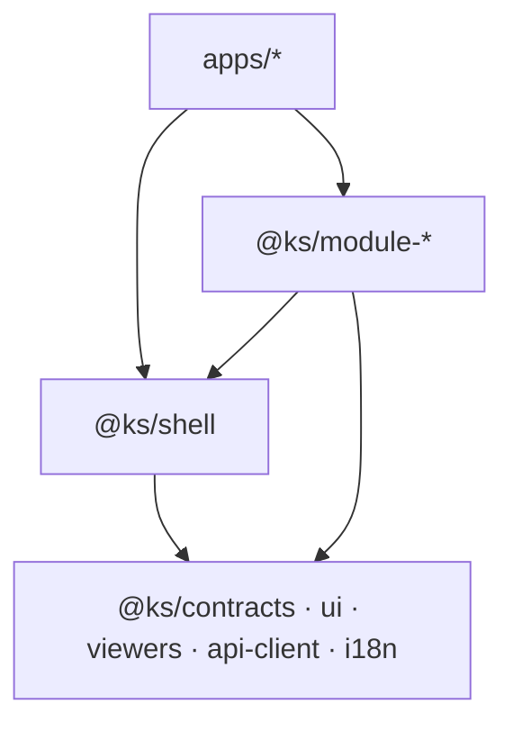

# Modul-Landkarte — Zielbild der Modularisierung

Konzeption zu [ADR 0006](../adr/0006-modularisierung-monorepo-schale-module.md):
Welche Pakete es geben soll, was aus dem heutigen Code hineinwandert, wie der
API-Schnitt aussieht und in welchen Wellen migriert wird. Die realen
Einsatzfälle, die dieses Zielbild tragen muss, stehen in
[`einsatz-szenarien.md`](einsatz-szenarien.md).

Status: Zielbild (vorgeschlagen). Quell-Pfade beschreiben den Stand 2026-08-25.

## 1. Ziel-Paketlandkarte

Namenskonvention: Workspace-intern `@ks/*`; bei späterer Veröffentlichung
`@bcommonslab/ks-*` (Registry existiert bereits).

### Schicht 1 — Shared Libraries (keine Fachlogik-Hoheit)

| Paket | Inhalt | Heutige Quellen (Auszug) |
|---|---|---|
| `@ks/contracts` | Types, DTOs, SiteConfig-Schema, Detail-View-Registry-Typen | `src/types/`, `src/lib/storage/types.ts`, `src/lib/detail-view-types/` |
| `@ks/ui` | shadcn-Basis, Icons, Theme | `src/components/ui/`, `src/components/theme-provider.tsx`, `src/components/icons.tsx` |
| `@ks/viewers` | Markdown-Viewer, PDF-Viewer, Audio-Player, Image-Preview | `src/components/library/markdown-preview/`, `src/lib/markdown/`, `src/lib/pdf/`, `src/components/library/audio-player.tsx`, `src/components/library/image-preview.tsx` |
| `@ks/api-client` | typisierter Fetch-Client + TanStack-Query-Hooks für Core- und Modul-APIs, BaseURL/Token aus SiteConfig | heute verstreute `fetch`-Aufrufe in Komponenten/Hooks |
| `@ks/i18n` | Locale-Ermittlung + Provider, Strings | `src/lib/i18n/`, `src/components/providers/*locale*`, `src/lib/strings/` |

### Schicht 2 — Schale

| Paket | Inhalt | Heutige Quellen |
|---|---|---|
| `@ks/shell` | Provider-Kette (Theme, Jotai, QueryClient, Locale, Storage-Context), Auth (Clerk, abschaltbar), Library-Bootstrap (Libraries laden, aktive Library aus SiteConfig/URL), konfigurierbare TopNav, Host→Library-Mapping | `src/app/layout.tsx` (Logik), `src/components/layouts/`, `src/components/top-nav*.{ts,tsx}`, `src/atoms/library-atom.ts`, `src/contexts/storage-context.tsx`, `src/hooks/use-library-config.ts`, `src/lib/root-landing.ts`, `src/lib/domain-library-map.ts` |

### Schicht 3 — Modul-Pakete (UI + Hooks + API-Handler)

| Paket | Inhalt | Heutige Quellen (Auszug) | API-Namespace |
|---|---|---|---|
| `@ks/module-explorer` | Galerie, Story, Chat/RAG, Doc-Detail, Website-Rendering | `src/app/explore/`, `src/components/library/{gallery,story,chat,website}/`, `src/components/public/`, `src/hooks/gallery/`, `src/lib/{chat,gallery,website}/` | `chat/[libraryId]/*` (Lese-Teil), `public/*`, `markdown/*` |
| `@ks/module-archive` | Archiv: Datei-Liste/-Baum/-Vorschau, Shadow-Twin-UI, Upload, Ingestion | `src/components/library/{file-list,file-preview,…}/`, `src/lib/{shadow-twin,ingestion,storage}/` | `library/[libraryId]/*` (ohne `agent-view`), `storage/*`, `chat/[libraryId]/ingest*` (heute falsch einsortiert, s. §3) |
| `@ks/module-agent-view` | Agentensicht (Coverage, Worklists, Bericht, MCP-Anbindung) | `src/components/library/agent-view/`, `src/hooks/agent-view/`, `src/lib/agent-view/`, `src/lib/mcp/` | `library/[libraryId]/agent-view/*`, `mcp/*`, `account/mcp-*` |
| `@ks/module-creation` | Creation-Wizard, Wartekorb/Submissions, Secretary-Erfassung | `src/components/creation-wizard/`, `src/components/submissions/`, `src/lib/{creation,secretary,submissions}/` | `secretary/*`, `submissions/*`, `wizard-sessions/*`, `creation/*`, `stream-ingest/*` |
| `@ks/module-templates` | Template-Verwaltung | `src/app/templates/`, `src/components/templates/`, `src/lib/templates/` | `templates/*`, `metadata/template/*` |
| `@ks/module-jobs` | Event-Monitor, Session-Manager, External Jobs (Admin) | `src/app/{event-monitor,session-manager}/`, `src/components/{event-monitor,session}/`, `src/lib/{events,external-jobs}*` | `event-job/*`, `external/*`, `sessions/*` |
| `@ks/module-settings` | Library-/Account-/Storage-Settings | `src/app/settings/`, `src/components/settings/` | `settings/*`, `admin/*`, `auth/onedrive/*` |

### Apps (Deployments)

| App | Inhalt |
|---|---|
| `apps/knowledgescout` | Voll-App: Schale + ALLE Module, heutige URLs und heutiges Verhalten. Ist nur „die größte SiteConfig". |
| `apps/<site>` | Schlanke Site: Schale + SiteConfig + 1–n Module. Beispiele in [`einsatz-szenarien.md`](einsatz-szenarien.md). |

## 2. SiteConfig — Konfiguration pro Deployment/URL

```ts
/** Eine Datei pro Deployment, z. B. apps/oldiesforfuture/site.config.ts */
interface SiteConfig {
  /** Aktive Module — bestimmt UI-Routen UND gemountete API-Handler. */
  modules: Array<'explorer' | 'archive' | 'agent-view' | 'creation' | 'templates' | 'jobs' | 'settings'>
  /** Library-Bindung: fest (Slug) oder frei (User wählt, wie heute). */
  library: { mode: 'fixed'; slug: string } | { mode: 'user-selected' }
  /** Schale: Menü/Chrome sichtbar? Eine vorkonfigurierte Site braucht keins. */
  chrome: { topNav: boolean; footer: boolean }
  /** Auth: öffentlich (anonym lesbar) oder Clerk-geschützt. */
  auth: { mode: 'public' } | { mode: 'clerk'; optional?: boolean }
  /** API: eigene Route-Handler oder zentrale Instanz (Fundament für Embed). */
  api: { mode: 'local' } | { mode: 'remote'; baseUrl: string }
  /** Optionales Host-Mapping (heute PUBLIC_DOMAIN_LIBRARY_MAP). */
  domains?: string[]
}
```

Beispiel „nur Explorer, Menü aus, anonym, API remote":

```ts
const config: SiteConfig = {
  modules: ['explorer'],
  library: { mode: 'fixed', slug: 'commoning' },
  chrome: { topNav: false, footer: false },
  auth: { mode: 'public' },
  api: { mode: 'remote', baseUrl: 'https://knowledgescout.org' },
}
```

Abgrenzung zur **Library-Config** (MongoDB, `src/types/library.ts`): Die
Library-Config beschreibt EINE Library (Facetten, `detailViewType`,
`agentViewEnabled`, Galerie-Texte …) und bleibt unverändert die Quelle für
Inhalts-Verhalten. Die SiteConfig beschreibt EIN Deployment (welche Module,
welche Library-Bindung, welches Chrome). `buildTopNavConfig()` konsumiert
künftig beide.

## 3. API-Schnitt

### Core-API (Sammel-Endpoints, von allen Modulen genutzt)

Gemountet in JEDER App; Vertrag gehört zu `@ks/contracts`, Client-Seite zu
`@ks/api-client`:

- `libraries/*` — Liste, Config, Zugriff (`access-check`, Invites, Members, Tokens)
- `user*`, `user-info` — Identität, Rollen, Pending Invites
- `llm-models*`, `public/llm-models` — Modell-Katalog

### Modul-APIs (nur gemountet, wenn das Modul aktiv ist)

Zuordnung siehe Paket-Tabelle §1. Prinzip: **die Route-Handler liegen im
Modul-Paket** und werden von der App in dünnen `route.ts`-Dateien
re-exportiert:

```ts
// packages/module-explorer/src/api/index.ts
export function createExplorerApiHandlers(deps: ExplorerApiDeps) { /* … */ }

// apps/<site>/app/api/chat/[libraryId]/stream/route.ts
export const { POST } = explorerHandlers.stream
```

Im Remote-Modus entfällt das Mounten komplett; `@ks/api-client` zeigt auf die
zentrale Instanz (CORS + Token nötig — Detail-Design in der Embed-Welle M7).

### Bekannte Unschärfen (Umbenennungs-/Verschiebe-Kandidaten, NICHT sofort umbauen)

- `chat/[libraryId]/ingest*`, `upsert-file`, `index*`: Ingestion/Indexierung
  liegt im Explorer-Namespace, gehört fachlich zur Verarbeitung
  (Archiv/Jobs). Kandidat: eigener Namespace `ingest/[libraryId]/*`.
- `chat/[libraryId]/docs/publish*`, `docs/delete`: Kuratierung, nicht Lesen —
  gehört zur Archiv-/Moderationsseite des Explorers.
- `diva-texture/*`, `video/*`, `db-test`, `test-route`, `debug-libraries`:
  Spezial-/Debug-Routen ohne Modulzuordnung — pro Route entscheiden
  (Modul, Dev-only oder Löschkandidat).
- `secretary/*` wird von Erfassung UND Archiv-Transformationen genutzt —
  beim Schnitt von `@ks/module-creation` als geteilter Service prüfen
  (ggf. eigenes Server-Paket `@ks/secretary-api`).

## 4. Grenzregeln (Import-Richtung)



- Module importieren NIE andere Module; Austausch nur über Core-API,
  `@ks/contracts` oder URL-Navigation.
- Shared Libraries importieren weder Shell noch Module.
- Durchsetzung: ESLint-Import-Regeln pro Paket + `knip`; die bestehenden
  Architektur-Rules ([`storage-abstraction.mdc`](../../.cursor/rules/storage-abstraction.mdc),
  [`no-silent-fallbacks.mdc`](../../.cursor/rules/no-silent-fallbacks.mdc))
  gelten paketübergreifend weiter.

## 5. Migrationspfad in Wellen

Jede Welle eine PR nach den Diff-Limits aus `AGENTS.md`; Wellen-Naming nach
[`refactor-naming-konvention.mdc`](../../.cursor/rules/refactor-naming-konvention.mdc).
Start ERST nach Plan 1/Plan 2 des aktuellen Fahrplans
([Roadmap](../roadmap-formatunabhaengige-library-und-onboarding.md)).

| Welle | Inhalt | Beweis-Ziel |
|---|---|---|
| M1 | `pnpm-workspace.yaml` + erstes risikoarmes Paket `@ks/viewers` (Start: Markdown-Viewer) | Workspace-Build + Voll-App unverändert |
| M2 | `@ks/contracts` + `@ks/api-client` (zunächst Core-API) | ein Modul konsumiert den Client statt roher `fetch`es |
| M3 | `@ks/shell` (Provider, TopNav, Bootstrap) + SiteConfig-Schema | Voll-App läuft als „größte SiteConfig" |
| M4 | `@ks/module-explorer` inkl. Route-Handler-Export | Explorer-Routen aus dem Paket gemountet |
| M5 | erste schlanke Beispiel-Site `apps/<site>` (Szenario aus [`einsatz-szenarien.md`](einsatz-szenarien.md)) | Deployment ohne Archiv-/Jobs-Code |
| M6 | `@ks/module-agent-view`; weitere Module nach Bedarf | zweites Modul bestätigt den Schnitt |
| M7 | Embed-Ausbaustufe `@ks/embed` (Web Component/iframe, Token-Auth, CORS) | Modul in fremder Seite |

## 6. Offene Fragen

- **Jotai über Paketgrenzen**: `library-atom` u. a. werden Teil der
  Shell-Oberfläche — Module lesen über Hooks, nicht über Atom-Importe?
  Zu entscheiden in M3.
- **`storage-context` / `use-storage-provider`**: gehört zur Shell, wird aber
  fast nur vom Archiv gebraucht — evtl. erst in M4/M6 aus der Shell in
  `@ks/module-archive` schieben.
- **Electron- und `build:package`-Builds**: müssen auf `apps/knowledgescout`
  zeigen; klären in M1.
- **Remote-Modus-Auth**: Token-Modell für anonyme öffentliche Sites vs.
  eingeloggte Nutzer gegen die Zentral-Instanz — Detail-Design in M7,
  Anforderungen aus den Einsatz-Szenarien.
- **Detail-View-Registry** (`src/lib/detail-view-types/registry.ts`):
  Spezialansichten (Diva, Refurbed …) müssen pro Site registrierbar sein,
  ohne dass jede Site alle Renderer lädt — Schnittstelle in `@ks/contracts`,
  Implementierungen bei den Modulen/Sites.
