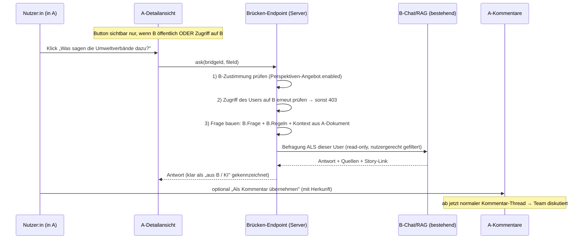

# Zielbild: Perspektiven-Brücken zwischen Bibliotheken

> Status: **Entwurf zur Abstimmung** · Letzte Aktualisierung: 2026-05-30
> Verwandt: [`kollaborative-favoriten-kommentare-zielbild.md`](./kollaborative-favoriten-kommentare-zielbild.md),
> [`docs/adr/0002-galerie-sterne-ohne-clerk-read.md`](../adr/0002-galerie-sterne-ohne-clerk-read.md)

---

## 1. Worum geht es? (in einfachen Worten)

Wir haben unterschiedliche Bibliotheken von unterschiedlichen Akteuren — zum
Beispiel eine Bibliothek mit **Klimamaßnahmen** und eine andere mit dem **Wissen
von Stakeholdern** (Umweltverbände, Sozialverbände, …).

Eine **Perspektiven-Brücke** ist ein **Button** in der Detailansicht eines
Dokuments, der eine *andere* Bibliothek befragt und deren Sicht zurückbringt:

> 🌿 **„Was sagen die Umweltverbände zu dieser Klimamaßnahme?"**

Ein Klick holt eine kurze, KI-generierte Antwort aus der fremden Bibliothek.
Diese Antwort kann man **als Kommentar übernehmen** und dann im Team
**diskutieren**. So führen wir die Sichtweisen verschiedener Akteure an *einem*
Dokument zusammen.

**Wichtig:** Der Button ist nur eine **Einladung**. Er gibt keine vollen
Zugriffsrechte auf die fremde Bibliothek. Wer tiefer einsteigen will, wird in
den **Story-Modus der Quelle** geleitet und muss sich **dort** anmelden.

---

## 2. Begriffe (damit wir dieselbe Sprache sprechen)

| Begriff | Bedeutung |
|---|---|
| **Bibliothek** | Eine Sammlung von Dokumenten (z. B. „Klimamaßnahmen"). |
| **Konsument-Bibliothek (A)** | Die Bibliothek, in der der Button **erscheint** (hier: Klimamaßnahmen). |
| **Quelle-Bibliothek (B)** | Die Bibliothek, die **befragt** wird (hier: Stakeholder-Wissen). |
| **Perspektiven-Brücke** | Ein konfigurierter Button von A nach B. Eine Brücke = ein Button = eine fremde Stimme. |
| **Perspektiven-Angebot** | Die Freigabe + Regeln, die **B** setzt: „Ja, ich darf befragt werden, und so soll geantwortet werden." |
| **Story-Modus** | Die bestehende geführte Fragen/Antwort-Ansicht einer Bibliothek (für den tieferen Einstieg). |

---

## 3. Leitprinzipien (die Grundregeln)

1. **Einladung, kein Voll-Zugriff.** Der Button stellt *eine* vordefinierte
   Frage. Mehr Tiefe = Wechsel in B's Story-Modus mit eigener Anmeldung.
2. **B bestimmt das Antwortverhalten.** Die Quelle legt die Frage, die
   Prompt-Regeln (z. B. „keine Namen nennen") und die Persona fest. A kann ihre
   Inhalte nicht beliebig „abgreifen".
3. **A bestimmt die Platzierung.** Die Konsument-Bibliothek wählt, *welche*
   Quellen als Button erscheinen und wie die Einladung heißt.
4. **Sichtbar nur mit Berechtigung.** Ist B geschützt, sieht den Button nur, wer
   B auch sehen darf. Ist B öffentlich, sieht ihn jede:r.
5. **Transparenz.** Jede Antwort ist klar als „aus Bibliothek B, KI-generiert"
   gekennzeichnet — inkl. Quellen. Niemals als A-eigenes Faktum.
6. **Read-only zur Quelle.** Die Brücke *liest* nur aus B. Geschrieben wird
   ausschließlich in **A's** Kommentare.

---

## 4. Rollen & Berechtigungen

| Aktion | Anonym (nur bei öffentlicher A+B) | Eingeloggt, kein Mitglied | Mitglied von A (Owner/Co-Creator) |
|---|---|---|---|
| Button sehen (B öffentlich) | ✅ | ✅ | ✅ |
| Button sehen (B geschützt) | – | nur wenn Zugriff auf B | nur wenn Zugriff auf B |
| Die eine Frage stellen | ✅ | ✅ | ✅ |
| Antwort **als Kommentar übernehmen** | – (Login nötig) | ✅ | ✅ |
| Übernommenen Kommentar **diskutieren** | – | eigene sehen | alle sehen + reagieren |
| „Mehr Antworten" → B's Story-Modus | Link sichtbar, Login bei B nötig | – „ – | – „ – |
| Perspektiven-**Angebot** auf B konfigurieren | – | – | nur B's Owner |
| Perspektiven-**Brücke** auf A konfigurieren | – | – | nur A's Owner |

---

## 5. User Stories

### Quelle (B-Owner) — „Ich gebe mein Wissen kontrolliert frei"

- **US-B1:** Als Verwalter der Stakeholder-Bibliothek möchte ich **aktiv
  erlauben**, dass meine Bibliothek als Perspektiven-Quelle befragt werden darf,
  damit nichts ohne meine Zustimmung passiert.
  *Akzeptanz:* Solange das Häkchen nicht gesetzt ist, kann **keine** Brücke auf
  meine Bibliothek zeigen (auch nicht bei öffentlicher Bibliothek).
- **US-B2:** Als B-Owner möchte ich **die Frage und Prompt-Regeln selbst
  bestimmen** (z. B. „nenne keine Personennamen", „antworte sachlich"), damit
  meine Inhalte korrekt und datenschutzkonform wiedergegeben werden.
- **US-B3:** Als B-Owner möchte ich einen **Link in meinen Story-Modus**
  hinterlegen, damit Interessierte für mehr Antworten zu mir kommen — und sich
  **dort** anmelden müssen.

### Konsument (A-Owner) — „Ich hole Perspektiven an mein Dokument"

- **US-A1:** Als Verwalter der Klimamaßnahmen-Bibliothek möchte ich **Buttons
  konfigurieren**, die andere Bibliotheken befragen, damit mein Team fremde
  Sichtweisen direkt am Dokument sieht.
- **US-A2:** Als A-Owner möchte ich pro Button **Text und Icon** bestimmen
  („Was sagen die Umweltverbände dazu?"), damit die Einladung verständlich ist.
- **US-A3:** Als A-Owner möchte ich **mehrere Brücken** zu verschiedenen Quellen
  anlegen (Umwelt, Soziales, …), damit unterschiedliche Stakeholder-Sichten
  nebeneinander stehen.
- **US-A4:** Als A-Owner möchte ich nur Quellen auswählen können, die ich
  **selbst sehen darf** und die **zugestimmt** haben.

### Nutzer:in in A — „Ich will die Perspektive verstehen und diskutieren"

- **US-U1:** Als Nutzer:in möchte ich am Dokument auf einen Button klicken und
  **sofort** die Sicht der Umweltverbände sehen, ohne die Bibliothek zu wechseln.
- **US-U2:** Als Nutzer:in möchte ich **klar erkennen**, dass die Antwort aus
  einer anderen Bibliothek stammt und KI-generiert ist — mit Quellenangaben.
- **US-U3:** Als Nutzer:in möchte ich die Antwort **als Kommentar übernehmen**,
  damit mein Team sie diskutieren und gemeinsam einordnen kann.
- **US-U4:** Als Nutzer:in möchte ich bei Interesse über **„Mehr Antworten"** in
  den Story-Modus der Quelle springen (und mich dort anmelden).
- **US-U5:** Als Nutzer:in **ohne** Zugriff auf eine geschützte Quelle soll ich
  den Button **gar nicht sehen** — keine leeren Klicks, keine Fehlermeldung.

### Anonymer Besucher (nur öffentliche A + öffentliche B)

- **US-X1:** Als anonymer Besucher kann ich die **eine Frage stellen** und die
  Antwort sehen. Zum **Übernehmen/Diskutieren** und für **mehr** muss ich mich
  anmelden.

---

## 6. UX-Schema

### 6.1 Detailansicht mit Brücken-Buttons (in A)

Die Buttons leben im bestehenden Detail-Overlay der Galerie — direkt **über**
dem schon vorhandenen Kommentar-Bereich.

```
┌─ Klimamaßnahme: „Radwege-Ausbau Innenstadt" ──────────────── ✕ ┐
│  [⭐ Favorit]   [Bewerten]   [Teilen]                            │
│                                                                  │
│  … Dokumentinhalt / Metadaten …                                  │
│                                                                  │
│  ── Perspektiven einholen ──────────────────────────────────    │
│   [🌿 Was sagen die Umweltverbände dazu?]                        │
│   [🤝 Was sagen die Sozialverbände dazu?]                        │
│                                                                  │
│  ── Kommentare (3) ─────────────────────────────────────────    │
│   …                                                              │
└──────────────────────────────────────────────────────────────────┘
```

### 6.2 Antwort-Panel (nach Klick)

```
┌─ 🌿 Umweltverbände — Perspektive ──────────────────────────── ✕ ┐
│  ℹ Antwort aus Bibliothek »Stakeholder-Wissen« · KI-generiert    │
│                                                                  │
│  „Die Umweltverbände begrüßen den Radwege-Ausbau, mahnen aber    │
│   eine Entsiegelung der Parkflächen an …"                        │
│                                                                  │
│  Quellen (in »Stakeholder-Wissen«):                              │
│   [1] Positionspapier Verkehr 2025                               │
│   [2] Stellungnahme Innenstadt-Mobilität                         │
│                                                                  │
│   → Mehr Antworten im Story-Modus der Quelle  (Anmeldung nötig)  │
│                                                                  │
│   [💬 Als Kommentar übernehmen]            [Schließen]           │
└──────────────────────────────────────────────────────────────────┘
```

Sonderzustände (kein stilles Verschlucken):
- **Kein Zugriff / B hat nicht zugestimmt:** Button erscheint gar nicht erst.
- **Keine relevanten Treffer in B:** „Zu dieser Maßnahme liegt in der Quelle
  keine Einschätzung vor."
- **Quelle nicht erreichbar / gelöscht:** „Diese Perspektiven-Quelle ist derzeit
  nicht verfügbar."

### 6.3 Konfiguration auf der **Quelle (B)** — „Perspektiven-Angebot"

`Einstellungen → Bibliothek (B) → Perspektiven-Angebot`

```
☑ Diese Bibliothek darf als Perspektiven-Quelle befragt werden

Frage an diese Bibliothek (Platzhalter {{context}} = Dokument aus A):
 ┌──────────────────────────────────────────────────────────┐
 │ Was ist die Position der Umweltverbände zu: {{context}} ?  │
 └──────────────────────────────────────────────────────────┘

Prompt-Regeln (z. B. Anonymisierung):
 ┌──────────────────────────────────────────────────────────┐
 │ Nenne keine Personennamen. Antworte sachlich und kurz.     │
 └──────────────────────────────────────────────────────────┘

Antwort-Persona: [Fachlich ▾]      Antwortlänge: [Kurz ▾]
Link „Mehr Antworten": [ /story/stakeholder-wissen ]
```

### 6.4 Konfiguration auf dem **Konsument (A)** — „Perspektiven-Brücken"

`Einstellungen → Bibliothek (A) → Perspektiven-Brücken`

```
Brücke 1
  Quelle:        [ Stakeholder-Wissen ▾ ]   (nur sichtbare + zustimmende Quellen)
  Button-Text:   [ Was sagen die Umweltverbände dazu? ]
  Icon:          [ 🌿 ]
  Kontext aus Dokument: [ {{title}} — {{summary}} ]
  ☑ aktiv

[ + Brücke hinzufügen ]
```

---

## 7. Ablauf



---

## 8. Datenmodell (konzeptuell)

Drei additive Bausteine — kein Umbau bestehender Strukturen.

### 8.1 Auf der Quelle B — `Library.config.perspectiveOffer`

```
perspectiveOffer = {
  enabled:          boolean   // Zustimmung des B-Owners (Pflicht, Default false)
  questionTemplate: string    // B bestimmt die Frage, Platzhalter {{context}}
  promptRules?:     string    // B's Regeln (Anonymisierung etc.) → System-Prompt
  persona?:         { character?, accessPerspective?, socialContext? }
  answerLength?:    'kurz' | 'mittel' | 'ausführlich'
  storyModeLink:    string    // Deep-Link in B's Story-Modus („Mehr Antworten")
}
```

### 8.2 Auf dem Konsument A — `Library.config.perspectiveBridges[]`

```
perspectiveBridge = {
  id:              string
  targetLibraryId: string     // = B
  buttonLabel:     string      // die Einladung, z. B. „Was sagen die Umweltverbände dazu?"
  icon?:           string
  contextTemplate: string      // welche A-Felder den Kontext bilden, z. B. „{{title}} — {{summary}}"
  enabled:         boolean
}
```

### 8.3 Herkunft am Kommentar — additive Erweiterung von `SourceComment`

```
SourceComment.origin? = {
  kind:            'perspective-bridge'
  bridgeId:        string
  targetLibraryId: string
  targetLabel:     string      // „Stakeholder-Wissen / Umweltverbände" (Snapshot)
  model?:          string
  references:      Quelle[]     // B's zitierte Quellen (Snapshot)
  triggeredByEmail:string       // wer die Perspektive eingeholt hat
  generatedAt:     Date
}
```

Damit rendert ein übernommener Kommentar mit eigenem Badge
(„KI-Antwort aus fremder Bibliothek") und der Audit-Trail bleibt ehrlich.

---

## 9. Technische Umsetzung

### 9.1 Wiederverwendung statt Neubau

| Funktion | Bestehender Baustein | Rolle in der Brücke |
|---|---|---|
| Befragung (RAG/Chat) | [`api/chat/[libraryId]/stream/route.ts`](../../src/app/api/chat/[libraryId]/stream/route.ts) | Liefert Antwort + Quellen, **bereits pro User berechtigt**. |
| Zugriffsprüfung | [`library-service.ts`](../../src/lib/services/library-service.ts) (`getLibrary`) | Gibt B nur bei Berechtigung zurück (sonst `null`). |
| Kommentar-Thread | [`source-comments-repo.ts`](../../src/lib/repositories/source-comments-repo.ts), [`source-comment.ts`](../../src/types/source-comment.ts) | Antwort übernehmen = Kommentar an `(A, fileId)`. |
| Detail-UI | [`detail-overlay.tsx`](../../src/components/library/gallery/detail-overlay.tsx) | Heimat der Buttons (Kommentare hängen schon hier). |
| Sichtbare Libraries (Client) | [`library-atom.ts`](../../src/atoms/library-atom.ts) | Enthält alle Libraries, die der User sehen darf. |

**Kerngedanke:** Die Brücke baut **keinen neuen, privilegierten Lesepfad** in B,
sondern ruft B's vorhandenen Befragungs-Endpoint **mit der Identität des
aktuellen Users** auf. So erbt sie automatisch B's komplette Berechtigungslogik.

### 9.2 Sichtbarkeit in zwei Schichten

- **Client (nur Anzeige, kosmetisch):** Button erscheint, wenn
  `B ist öffentlich` **oder** `library-atom enthält B`. Vermeidet Clerk-Lookups
  auf dem Lesepfad (konform zu [ADR 0002](../adr/0002-galerie-sterne-ohne-clerk-read.md)).
- **Server (die echte Grenze):** Beim Klick prüft der Endpoint **unabhängig**
  erneut die Zustimmung von B **und** den Zugriff des Users auf B. Das
  Client-Ausblenden ist nie die Sicherheitsgrenze.

### 9.3 Neuer, dünner Endpoint

`POST /api/library/[libraryId]/perspective-bridges/[bridgeId]/ask` mit
`{ fileId }`. Server-Schritte:

1. Auth + User-E-Mail (wie [API-Konventionen](../../docs/architecture/api-route-conventions.md)).
2. A + Brücken-Config laden, B laden.
3. **Zustimmung** prüfen: `B.config.perspectiveOffer.enabled` — sonst expliziter
   Fehler (kein stilles Ausblenden).
4. **Zugriff** prüfen: `getLibrary(email, B) ≠ null` **oder** B öffentlich —
   sonst `403`.
5. Frage bauen: `B.questionTemplate` (mit `{{context}}` aus A-Dokument) +
   `B.promptRules`.
6. B's Orchestrator **als dieser User** aufrufen (read-only, nutzergerecht
   gefilterte Treffer).
7. Antwort + Quellen + `storyModeLink` zurückgeben.

„Übernehmen" ist ein separater Aufruf gegen den **bestehenden**
Kommentar-Endpoint von A, ergänzt um den `origin`-Block.

### 9.4 Konformität mit Projektregeln

- **Keine Silent Fallbacks** ([Regel](../../.cursor/rules/no-silent-fallbacks.mdc)):
  Zustimmung fehlt, kein Zugriff, keine Treffer, B gelöscht → jeweils **expliziter**
  Zustand.
- **Storage-Abstraktion** ([Regel](../../.cursor/rules/storage-abstraction.mdc)):
  A fasst B's Storage nie an; alles läuft über `libraryId` + B's API.
- **Per-Library-Config-Feld** ([Checkliste](../../.cursor/rules/library-config-field.mdc)):
  `perspectiveOffer` (B) und `perspectiveBridges` (A) folgen dem 6-Schritte-Muster
  (Typ → Server→Client-Mapping → Form-Schema/Defaults → Reset-Stellen → Submit → UI).

---

## 10. Sicherheit & Datenschutz (worauf wir achten)

1. **Niemals als Service-Account befragen.** B wird **mit der User-Identität**
   befragt, damit B's Filter (Entwürfe, Reader-Scope) greifen. Sonst leckt
   geschütztes B-Wissen an Nicht-Berechtigte.
2. **B kontrolliert die Auslieferung.** Da B die Frage + Regeln (z. B.
   Anonymisierung) festlegt, entscheidet B, was über die Brücke nach außen geht.
   Das ist die zentrale Datenschutz-Stellschraube — und der Grund, warum die
   Brücke nur „einlädt" statt frei abzufragen.
3. **Übernahme macht die Antwort teamweit sichtbar.** Ein übernommener Kommentar
   ist für alle A-Mitglieder lesbar. Weil B's Antwort bereits durch B's Regeln
   „freigabesicher" ist, ist das vertretbar — die Herkunft wird trotzdem klar
   markiert.
4. **Kontext-Weitergabe begrenzen.** Es wird nur der definierte `contextTemplate`
   (Titel/Zusammenfassung) an B gesendet, nicht der Volltext. Entwürfe in A
   sollten nicht brückbar sein.
5. **Kosten/Missbrauch.** Jeder Klick = eine LLM-Abfrage. Bei öffentlich→öffentlich
   greifen Rate-Limit und der bestehende Query-Cache von B.
6. **Anonym darf fragen, nicht übernehmen.** Übernehmen/Diskutieren erfordert
   Login; „Mehr Antworten" erfordert Anmeldung **bei B**.

---

## 11. Offene Fragen

1. **Zustimmungs-Granularität:** Reicht das globale „darf befragt werden"-Häkchen
   auf B, oder braucht B eine **Allowlist** konkreter Konsument-Bibliotheken
   („nur Klimamaßnahmen-Archiv darf mich befragen")?
2. **Story-Modus-Deep-Link:** Springt „Mehr Antworten" auf die **konkrete Frage/
   das Thema** in B, oder auf B's Story-Startseite? Wie läuft der Login-Redirect?
3. **Quellen im Kommentar:** Werden B's Quellen als **Live-Links** (nur mit
   B-Zugriff öffenbar) oder als **Text-Snapshot** gespeichert?
4. **Kostenträger:** Wer „zahlt" die LLM-Abfrage — die fragende (A) oder die
   antwortende (B) Bibliothek? Relevant für Limits/Abrechnung.
5. **Sichtbarkeit für B:** Soll B's Owner sehen können, **wer/wie oft** über
   Brücken befragt wird (Nutzungs-Statistik)?
6. **Mehrsprachigkeit:** Folgt die Antwort der **A-Oberflächensprache** oder B's
   Vorgabe?

---

## 12. Locked Decisions (abgestimmt am 2026-05-30)

- **Zustimmung Pflicht:** B's Owner muss „darf als Perspektiven-Quelle befragt
  werden" aktiv setzen.
- **Ein-Schuss:** Genau eine, von B definierte Frage pro Button. Kein Frei-Chat.
- **B besitzt Frage + Prompt-Regeln** (z. B. Anonymisierung).
- **Button = Einladung:** Tieferer Einstieg nur über B's Story-Modus mit eigener
  Anmeldung.
- **Heimat des Buttons:** Galerie-Detail-Overlay (`detailViewType: 'climateAction'`),
  bei den Kommentaren.
