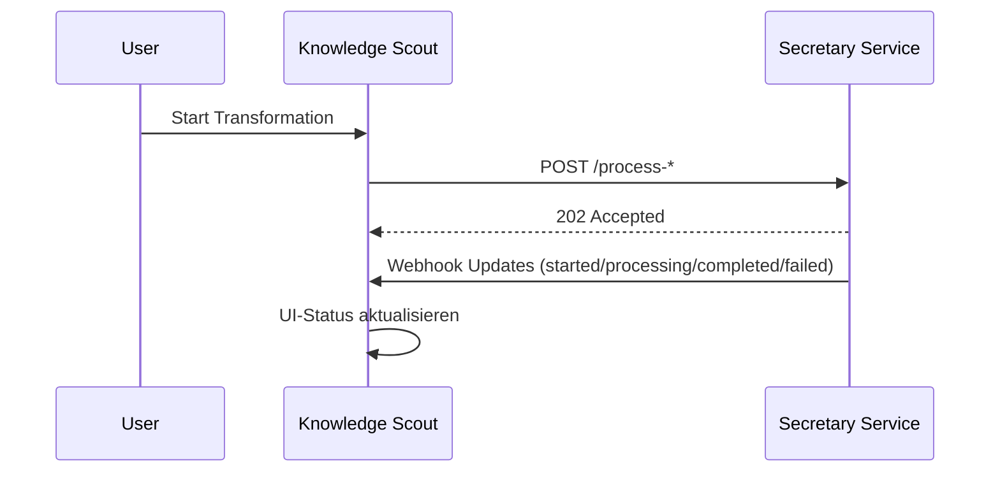

# Transformation Service Integration

> Status: 🟡 Teilweise umgesetzt (Audio, Image, PDF, Text vorhanden; YouTube-Endpunkt nicht gefunden)

Überblick über die asynchrone Verarbeitung (Audio, Bild, PDF, YouTube, Text) via Secretary Service mit Webhook-Status.

## Unterstützte Transformationen
- Audio (/process-audio): Transkription, Templates, Mehrsprachigkeit
- Bild (/process-image): OCR, Templates, Mehrsprachigkeit
- PDF (/process-pdf): Texterkennung, Templates, Mehrsprachigkeit
- YouTube (/process-youtube): Transkription, Templates, Mehrsprachigkeit
- Text (/transform-text): Template-Verarbeitung

## Event- und Datenfluss (vereinfacht)

