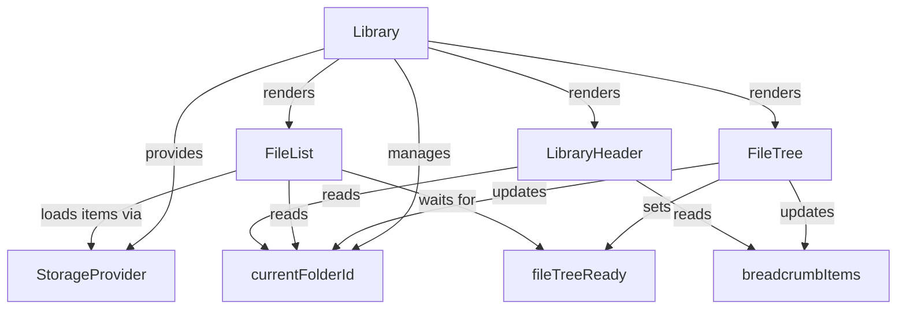

# Library Komponenten

Überblick über State-Management, Initialisierung und zentrale Komponenten der Library-Ansicht (FileTree, FileList, FilePreview, MarkdownPreview, MarkdownMetadata).

## State und Initialisierung (Kurzüberblick)
- Jotai-Atome: `currentFolderIdAtom`, `breadcrumbItemsAtom`, `fileTreeReadyAtom`, `activeLibraryIdAtom`
- Reihenfolge: Library mount → FileTree init → FileList render

## Komponenten-Interaktion (Mermaid)

## Performance-Notizen
- Lazy Loading, Caching, Memoization
- Virtualisierte Listen für große Ordner

