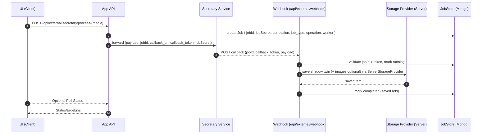

title: Externe Medien-Transformation (Batch) – Architektur, Webhooks und Speicherung
---

## Ziel und Kontext

Langlaufende Medien-Verarbeitungen (PDF, Audio, Video, Bild, Text) über den Secretary Service sollen robust, wiederaufnehmbar und nutzerfreundlich abgebildet werden – ohne, dass der Client online bleiben muss. Ergebnisse sollen automatisch in der Ziel-Bibliothek landen (lokal oder Cloud wie OneDrive). Zusätzlich benötigen wir Transparenz über den Status einzelner Jobs (wartend, laufend, abgeschlossen, fehlgeschlagen).

Diese Seite beschreibt ein generisches Konzept, das sowohl für Einzel-Jobs als auch für Bulk-Imports funktioniert. Es priorisiert einfache, robuste Server-Mechanik und minimale Client-Abhängigkeiten und ist kompatibel mit dem generischen JobWorker (Jobs/Batches).

## Varianten (Design-Optionen)

- Variante A – Direkter Serverspeicher (empfohlen):
  - Pro Job wird serverseitig ein Eintrag mit zufälligem Job-Secret erzeugt. Secretary ruft unseren Webhook mit `jobId` und `callback_token` auf. Der Webhook speichert sofort ins Ziel (lokal via FileSystemProvider; OneDrive via Server-Writer mit Refresh-Token). Fallback bei Fehler: Puffer in DB.
- Variante B – Hybrid (Server-Puffer + Server-Worker):
  - Webhook validiert und legt Ergebnis in DB ab. Ein Server-Worker speichert (mit Refresh-Token) asynchron in die Bibliothek. Bei Engpässen greift der Client optional ein.
- Variante C – Minimal (Client-Speicherung):
  - Webhook speichert nur in DB. Ein Client pollt und speichert. Geringe Server-Komplexität, aber abhängig vom Client-Online-Zustand.

Empfehlung: Variante A. Sie ist am einfachsten im Alltag: Ergebnisse landen auch bei Client-Abbruch automatisch am Ziel.

## Architekturüberblick

- Entities
  - Library (lokal/Cloud), ServerStorageProvider (vereinheitlichte Server-API), External Job (Secretary), JobStore (MongoDB), Webhook-Secret pro Job.
  - ServerStorageFactory: liefert je Library den passenden Provider (Filesystem/OneDrive/…)
- Prinzip
  1) Start: Anfrage erzeugt Job (mit `jobId`, `jobSecret`, Korrelation).
  2) Secretary verarbeitet und ruft Webhook mit `jobId`/`callback_token`/Payload.
  3) Webhook validiert und speichert Ergebnis direkt in der Bibliothek. Fehler → Job als „pending-storage“ in DB.
  4) Statusanzeige visualisiert alle offenen/abgeschlossenen Jobs.

### Sequenz (Einzel-Job, Worker: secretary)

## Datenmodell (JobStore, MongoDB)

- Collection: `external_jobs`
  - `jobId: string`
  - `jobSecretHash: string` (kein Klartext; Hash/HMAC)
  - `job_type: 'pdf'|'audio'|'video'|'image'|'text'|'session'|string`
  - `operation: 'extract'|'transcribe'|'transform'|'summarize'|string`
  - `worker: 'secretary'|string`
  - `status: "queued"|"running"|"completed"|"failed"|"pending-storage"`
  - `libraryId: string`
  - `correlation: { source: { itemId: string, parentId: string, mediaType?: string, mimeType?: string, name?: string }, options: object }`
  - `processId?: string` (vom externen Worker)
  - `payload?: { extractedText?: string, imagesArchiveData?: string, meta?: object }`
  - `result?: { savedItemId?: string, savedItems?: string[] }`
  - `createdAt, updatedAt`

Idempotenz: Der Webhook prüft `jobId` und `status`; doppelte Calls werden erkannt und ignoriert.

## API-Änderungen

1) Proxy-Start (z. B. `POST /api/external/secretary/process-{media}`)
   - Vor dem Forward an den Secretary: Job erzeugen (`jobId`, zufälliges `jobSecret`).
   - An Secretary zusätzlich senden (minimiert):
     - `jobId`
     - `callback_url = <APP_URL>/api/external/webhook`
     - `callback_token = jobSecret`
     - Optional: `X-Signature` (HMAC über Raw-Body) und `X-Timestamp` (Replay-Schutz)
   - Media-spezifisches Payload bleibt pro Endpunkt (z. B. PDF: Datei + extractionMethod/includeImages; Audio/Video: Flags).

2) Generischer Webhook (`POST /api/external/webhook`)
   - Header: `X-Worker: secretary`, optional `X-Signature`, `X-Timestamp`
   - Body: `jobId`, `callback_token`, `process`, `data` (z. B. PDF: `extracted_text`, optional `images_archive_data`).
   - Schritte:
     - Job lookup + Token-Validierung (Hash), optional HMAC-Prüfung, Statuswechsel `running`.
     - Interne Parameter (libraryId, correlation.source.parentId, …) ausschließlich aus DB laden.
     - Ergebnis aufbereiten (Markdown + YAML-Frontmatter).
     - Speicherung:
       - Lokal: FileSystemProvider (Shadow Twin + ggf. Bilder in `.{basename}`).
       - OneDrive: Server-Writer (Refresh-Token → Access-Token);
       - Bilder optional via `ImageExtractionService.saveZipArchive`.
     - Erfolg: `completed` (mit Referenzen), Fehler: `pending-storage` oder `failed` (mit Error).

3) Job-Status-API (optional)
   - `GET /api/external/jobs?libraryId=...` → offene/zuletzt geänderte Jobs
   - `GET /api/external/jobs/{jobId}` → Detailstatus

## Server-Storage-Layer (vereinheitlicht)

- Interface (ServerStorageProvider – Teilmenge von StorageProvider):
  - `uploadFile(parentId: string, file: File)`
  - `createFolder(parentId: string, name: string)`
  - `getPathById(itemId: string)` (für Logging/Pfade)
- Implementierungen:
  - Filesystem: Wrap des bestehenden `FileSystemProvider` (serverfähig)
  - OneDrive: Server-Variante (Access-Token via Refresh; Upload/CreateFolder per Graph API)
- Factory:
  - `ServerStorageFactory.getProvider(library)` → liefert passenden Provider anhand `library.type`
- Webhook nutzt ausschließlich den Provider:
  - Shadow‑Twin: `uploadFile(source.parentId, markdown)`
  - Bilder: `createFolder(source.parentId, .{basename})`, dann `uploadFile(...)` je Bild und Seiten‑Markdown
  - Keine Provider‑Sonderfälle mehr im Webhook; nur Logs bleiben spezifisch (z. B. IDs/Pfade)

## Sicherheit

 - Data Minimization: Externe Dienste sehen nur `jobId`, `callback_url`, `callback_token`.
 - Pro-Job-Secret (`jobSecret`) statt globaler Library-Secrets. Speicherung als Hash.
 - HTTPS erzwingen; Secret nicht loggen.
 - Optional: `X-Signature` HMAC über Raw-Body + `X-Timestamp` (Replay‑Schutz).
 - Refresh-Token in `library.config` verschlüsselt (ENV `WEBHOOK_KMS_KEY`).
 - Webhook verarbeitet nur Rückgaben; keine Client-Secrets verlassen den Server.

## Logging (Server)

- Job Logs (DB `external_jobs.logs`): `request_sent`, `request_ack`, `webhook_received`, `stored_local`/`stored_cloud`, `images_extracted`.

## UI-Verhalten
- Hinweis: Client bleibt storage‑agnostisch; Speicherung läuft vollständig serverseitig über den Provider.

## Umsetzungsschritte

1) Interface definieren: `ServerStorageProvider` (uploadFile, createFolder, getPathById)
2) Factory implementieren: `ServerStorageFactory.getProvider(library)`
3) Provider bauen/anpassen:
   - Filesystem: Adapter um bestehenden `FileSystemProvider`
   - OneDrive: Server‑Provider (Token‑Refresh intern, Upload/CreateFolder via Graph)
4) Webhook refaktorieren:
   - Provider über Factory beziehen (statt Branches im Code)
   - Shadow‑Twin/Bilder nur über Provider‑Methoden speichern
5) Tests:
   - Lokal + OneDrive (mit/ohne Bilder) → Logs `stored_local`/`stored_cloud`, `images_extracted`
   - Fehlerpfade (409/Token‑Refresh) → `pending-storage`/Retry

- Client zeigt sofort „Job eingereicht“ (Toast) nach `accepted`; Abschluss/Links via Statusansicht oder Auto-Refresh.

## Bulk-Import

- Für jedes enqueued Item (egal welcher Medientyp) entsteht ein eigenständiger Job mit eigenem Secret.
- Secretary erhält eine Liste von Items (oder verarbeitet sequenziell) – der Callback erfolgt pro Item/Job.
- UI zeigt Fortschritt: „Wartend“, „Laufend“, „Fertig“, „Fehler“ inkl. Links zu gespeicherten Items.

## UI/Monitoring

- Neue Seite „Externe Jobs“ pro Bibliothek (Filter/Sortierung):
  - Spalten: Datei (Original), Status, Start/Ende, Prozess-ID, Fehler, Ergebnis-Links.
  - Optional: Auto-Refresh.

## Frontmatter und Inhalte

- Frontmatter-Felder analog `TransformService` (Quelle, process_id, cache_used, tokens, etc.).
- PDF-Beispiel: Bilder in Ordner `.{pdfname-ohne-ext}`, Dateien `page_###.png/jpg` + optionale `page_###.{lang}.md` (seitenweise Text).

## Testplan (kritisch)

- Einzel-Job (PDF) lokal: Secretary ruft Webhook → Shadow-Twin + Bilder vorhanden; Client offline währenddessen.
- Einzel-Job (PDF) OneDrive: Refresh-Token vorhanden → Datei wird hochgeladen; Ordner und Dateinamen korrekt.
- Idempotenz: Doppelte Webhook-Calls ändern Status nicht und erzeugen keine Duplikate.
- Fehlerfall (Rate-Limit/Token): Job `pending-storage`; manuelle Retry-Funktion speichert erfolgreich.
- Bulk: 10–100 PDFs; Statusverläufe korrekt, parallele Jobs kollidieren nicht.
- Sicherheit: Falsches Token → 401; Logs ohne Secret.

## Risiken und Mitigation

- Token-Verwaltung: Refresh-Token müssen sicher verschlüsselt sein → ENV-Key-basierte Verschlüsselung, Rotation.
- Graph-API-Limits: Exponentielles Backoff + Retry-Queue.
- Duplikate: Eindeutige Namen, Idempotenz über `jobId` und vorhandene Datei-Checks.
- Payload-Größen (images_archive_data): Streaming/Chunking möglich; aktuell Base64 bis zu sinnvollen Limits.

## Minimaler Implementationsschnitt

- Proxies (`/api/external/secretary/process-{media}`): Job anlegen, Callback-Felder mitsenden.
- Webhook (`/api/external/webhook`): Validieren, speichern (lokal/OneDrive), Job updaten.
- OneDrive-ProviderWriter (Server): Upload/CreateFolder + Token-Refresh
- Monitoring: einfache Jobs-API + Tabelle.

