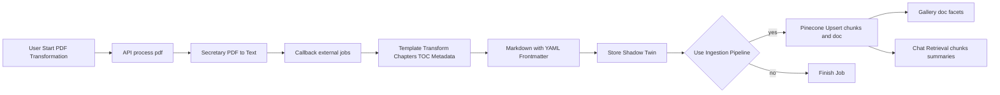

## Ziel
Dieser Leitfaden beschreibt den technischen End-to-End‑Workflow: PDF‑Extraktion → Markdown mit YAML‑Frontmatter → Metadaten-/Kapitelanalyse → Ingestion in Pinecone (Chunks + Dokumenteintrag) → Nutzung in Galerie und Chat. Er dient als Referenz für Entwickler und als Anwenderbeschreibung.

## Überblick (Schematisch)


## Komponenten und Verantwortlichkeiten
- API `POST /api/secretary/process-pdf`: Legt `ExternalJob` an, initialisiert Schritte (`extract_pdf`, `transform_template`, `store_shadow_twin`, `ingest_rag`), persistiert `parameters`.
- Callback `POST /api/external/jobs/[jobId]`: Orchestriert Schritte, reichert `metaHistory`, `cumulativeMeta` an, erzeugt Markdown (Frontmatter), speichert Shadow‑Twin, optional Ingestion.
- Ingestion `IngestionService.upsertMarkdown`: Chunking, Embedding, Upsert in Pinecone; zusätzlich Dokumenteintrag `kind:"doc"` inkl. kompakter Metadaten (`docMetaJson`).
- Galerie `GET /api/chat/[libraryId]/docs`: Liest `kind:"doc"` aus Pinecone, aggregiert Facetten.
- Chat `POST /api/chat/[libraryId]`: Retrieval über `retriever=chunk|doc`, Facettenfilter via Query‑Parameter.

## YAML‑Frontmatter Struktur (Beispiel)
Frontmatter wird in `TransformService.createMarkdownWithFrontmatter` erzeugt. Werte sind flach (primitive Typen), komplexe Strukturen vermeiden.

```yaml
---
source_file: "MyPaper.pdf"
source_file_id: "base64id=="
source_file_type: "application/pdf"
target_language: "de"
process_id: "sec-12345"
processor: "secretary:template/pdfanalyse.md"
processing_duration_ms: 53210
model_used: "gpt-4o-mini"
cache_used: true
cache_key: "hash:..."
# Extrahierte Felder (vereinheitlicht)
title: "A Taxonomy of RAG"
authors: "Doe, Jane; Smith, John"
year: 2024
short_title: "RAG Taxonomy"
region: "EU"
doc_type: "paper"
tags: "rag, retrieval, taxonomy"
chapters_count: 12
toc_pages: 3
---

# Inhalt …
```

Hinweise:
- Strings escapen; Zahlen/Booleans als Literale; keine geschachtelten Objekte.
- Kapitel/TOC werden primär als strukturierte Metadaten in `cumulativeMeta` gepflegt und für Pinecone als JSON serialisiert (siehe unten).

## Pinecone Schema und Ingestion
- Chunk‑Vektoren: `id = ${fileId}-${i}`
  - `metadata`: `{ kind: 'chunk', user, libraryId, fileId, fileName, chunkIndex, text(<=1000), upsertedAt }`
- Dokument‑Vektor: `id = ${fileId}-doc` (oder `-meta` in älteren Pfaden)
  - `metadata`: `{ kind: 'doc', user, libraryId, fileId, fileName, upsertedAt, docMetaJson }`
  - `docMetaJson` ist stets ein komprimierter JSON‑String (max ~8KB), enthält u. a.: `title`, `authors[]`, `year`, `shortTitle`, `region`, `docType`, `source`, `tags[]`, `chapters[]`, `toc[]`.

Idempotenz:
- Schlüsselbasis ist das ursprüngliche PDF (`correlation.source.itemId`) → stabile `fileId` über Re‑Runs.
- Vor Neu‑Ingestion ggf. `deleteByFilter` einsetzen, wenn vollständige Ersetzung gewünscht ist.

## Facetten‑Taxonomie (Konsistenzregeln)
Problem: Uneinheitliche Metadaten (Freitext, unterschiedliche Schreibweisen). Lösung: Normalisierungsschicht vor Frontmatter/Ingestion.

Vorschlag Facetten und Typen:
- `authors`: Liste<string> (Form „Nachname, Vorname“)
- `year`: Zahl (YYYY)
- `region`: Enum-ähnliche Liste (z. B. `EU`, `US`, `Global`)
- `docType`: Liste<string> kontrolliert (z. B. `paper`, `report`, `slide`, `web`)
- `source`: Liste<string> (Herkunft/Publisher)
- `tags`: Liste<string> (kleinbuchstaben, kebab‑case)

Normalisierung (Beispiele):
- Whitespace trimmen, Unicode‑Normalize (NFKC), Klein-/Großschreibung vereinheitlichen.
- `authors`: Split an `;`, Namen in „Nachname, Vorname“ bringen.
- `region`: Mapping‑Tabelle ("EU", "Europe" → `EU`).
- `docType`: Map Freitext → kontrolliertes Vokabular.
- `tags`: Klein schreiben, Leerzeichen → `-`, Duplikate entfernen.

Persistenzorte:
- Frontmatter: flache, lesbare Felder (titel, authors, year …) für Menschen.
- Pinecone: `docMetaJson` mit vollständigen, normalisierten Strukturen für Facetten.
- Jobs: `cumulativeMeta` + `metaHistory` zur Nachvollziehbarkeit.

## Endanwender-Flows
1) PDF transformieren
- In der Library PDF auswählen → Dialog „PDF transformieren“.
- Option „Use Ingestion Pipeline“ aktivieren, Template wählen (z. B. `pdfanalyse.md`).
- Nach Abschluss: Shadow‑Twin `.md` im selben Ordner; Report‑Tab zeigt Metadaten, Schritte, Logs.

2) Galerie nutzen
- Menü „Gallery“: zeigt `kind:"doc"`‑Einträge als Karten (Titel, Autoren, Jahr, Short‑Title).
- Linke Filterleiste: Facetten nach obigem Schema (autoren, region, year, docType, source, tags).

3) Chat verwenden
- Chat im Gallery‑Layout oder eigener Seite.
- Retriever‑Umschalter: „Chunks“ (semantische Suche) oder „Summaries/Dokumente“.
- Filter werden aus der Galerie übernommen und auf Retrieval angewendet.
- Bei fehlenden Quellen antwortet das System: „Keine passenden Inhalte gefunden“.

## Schnittstellen (Referenz)
- Start: `POST /api/secretary/process-pdf`
- Callback: `POST /api/external/jobs/[jobId]`
- Galerie Docs: `GET /api/chat/[libraryId]/docs?author=...&year=...`
- Galerie Facets: `GET /api/chat/[libraryId]/facets`
- Chat: `POST /api/chat/[libraryId]?retriever=chunk|doc&author=...`

## Qualitätssicherung und Logging
- Zentral: `FileLogger`/`UILogger` mit Phasen (`extract_pdf`, `transform_template`, `store_shadow_twin`, `ingest_rag`).
- Job‑Detail: `steps`, `parameters`, `cumulativeMeta`, `metaHistory`, `ingestion` (Vektorzähler, Index).
- Fehlerpfade klar loggen; Pinecone‑Fehlertexte durchreichen.

## Offene Punkte / Nächste Schritte
- Vollständige Normalisierungspipeline (Mapping‑Tabellen, Validierung, Tests).
- Konfigurierbare Facetten je Library (`config.chat.gallery.facets`).
- Konsistenzprüfungen bei Re‑Runs (Stale‑Check mit `docModifiedAt`).


