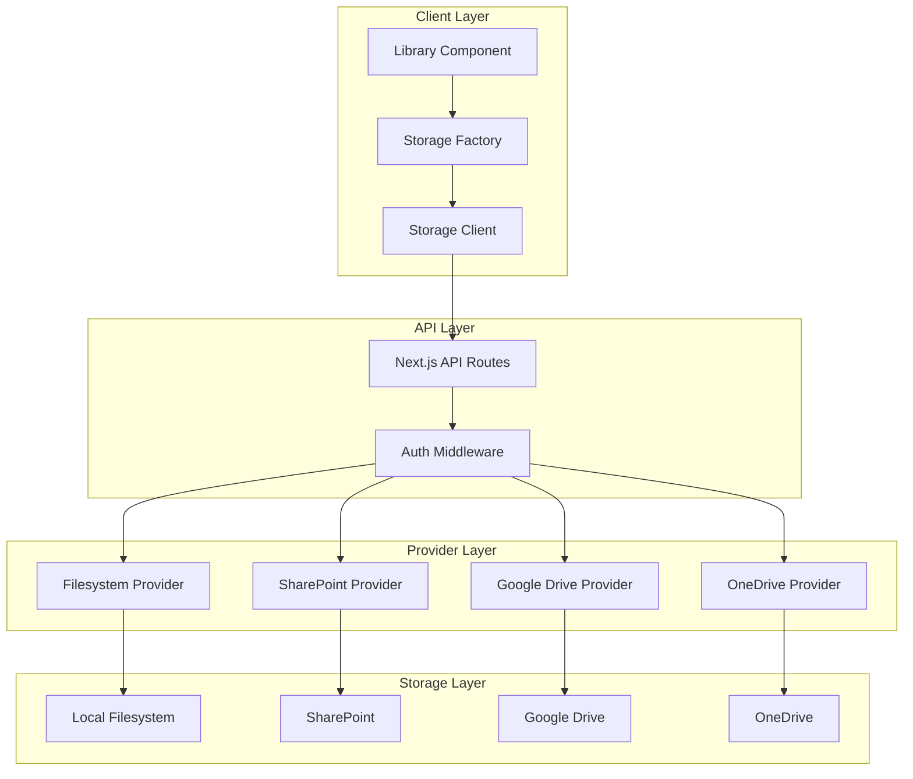
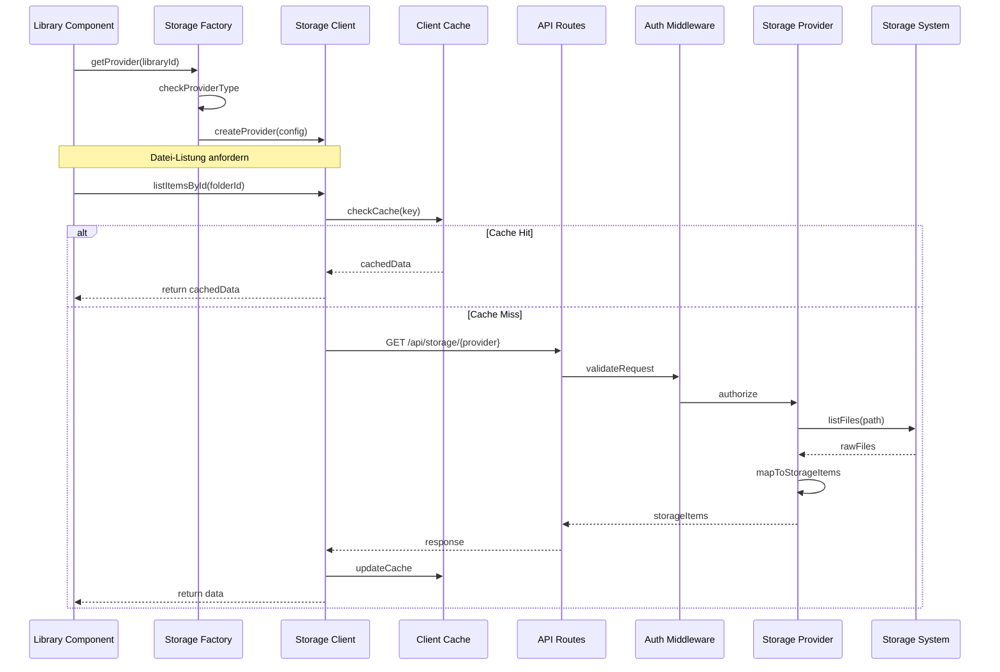

# Storage Provider System

Das Storage Provider System ist eine modulare Architektur zur Abstraktion verschiedener Dateispeicher-Backends. Es ermöglicht die einheitliche Handhabung von Dateien und Ordnern über verschiedene Speichersysteme hinweg.

## Core Features

- Modulare Provider-Architektur
- Intelligentes Caching (Client/Server)
- Robuste, typisierte Fehlerbehandlung
- Performance-Optimierungen (Streaming, Chunk-Upload, Parallelisierung)

## Architektur-Übersicht



## Datenfluss und Interaktionen



## Implementierungsebenen (Auszug)

1. UI (`src/components/library/*`): Interaktion, State, Provider-Auswahl
2. Factory (`src/lib/storage/storage-factory.ts`): Instanziierung, Konfiguration
3. Client (`src/lib/storage/filesystem-client.ts`): HTTP, Caching, Fehlerbehandlung
4. API (`app/api/storage/[provider]/route.ts`): Endpunkte, Auth, Logging
5. Provider (`src/lib/storage/providers/*`): Backend-Integration, Datei-Operationen

## Fehlerbehandlung (Typisiert)

```typescript
class StorageError extends Error {
  constructor(
    message: string,
    public code: string,
    public statusCode: number,
    public details?: unknown
  ) {
    super(message);
    this.name = 'StorageError';
  }
}
```


