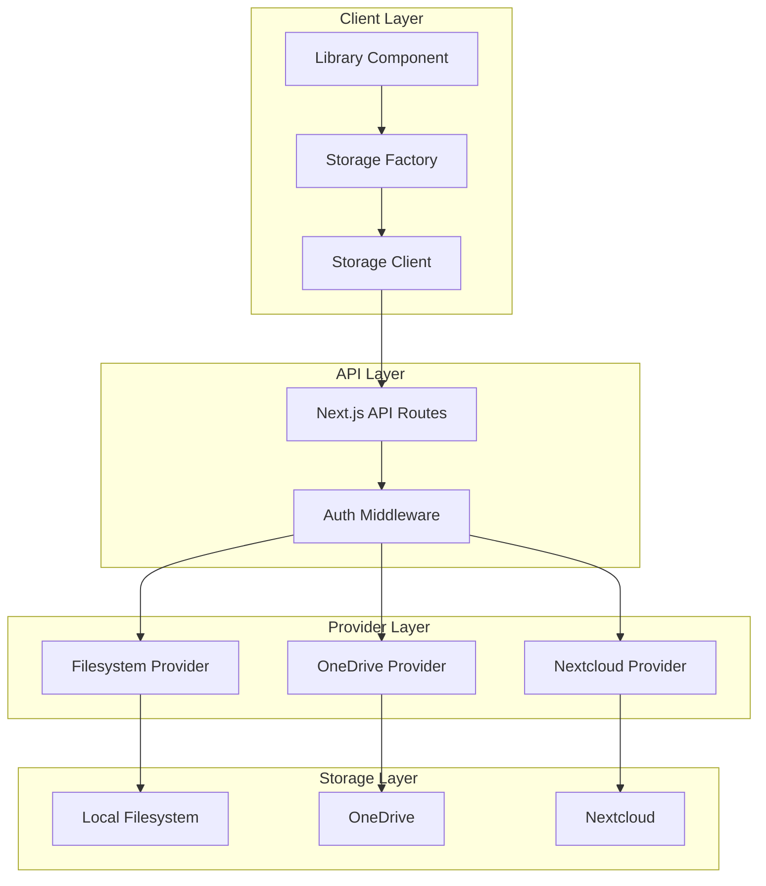

# Storage Provider System

The Storage Provider System is a modular architecture for abstracting various file storage backends. It enables unified handling of files and folders across different storage systems.

## Core Features

- Modular provider architecture
- Intelligent caching (Client/Server)
- Robust, typed error handling
- Performance optimizations (Streaming, Chunk-Upload, Parallelization)

## Supported Storage Providers

- **Local File System**: Direct access to local filesystem (✅ Implemented)
- **OneDrive**: Integration with Microsoft OneDrive (✅ Implemented)
- **Nextcloud**: Integration with Nextcloud for self-hosted cloud storage (🚧 In Development)

## Architecture Overview



## Data Flow and Interactions


## Implementation Layers (Excerpt)

1. UI (`src/components/library/*`): Interaction, State, Provider selection
2. Factory (`src/lib/storage/storage-factory.ts`): Instantiation, Configuration
3. Client (`src/lib/storage/filesystem-client.ts`): HTTP, Caching, Error handling
4. API (`app/api/storage/[provider]/route.ts`): Endpoints, Auth, Logging
5. Provider (`src/lib/storage/providers/*`): Backend integration, File operations

## Error Handling (Typed)

```typescript
class StorageError extends Error {
  constructor(
    message: string,
    public code: string,
    public statusCode: number,
    public details?: unknown
  ) {
    super(message);
    this.name = 'StorageError';
  }
}
```

