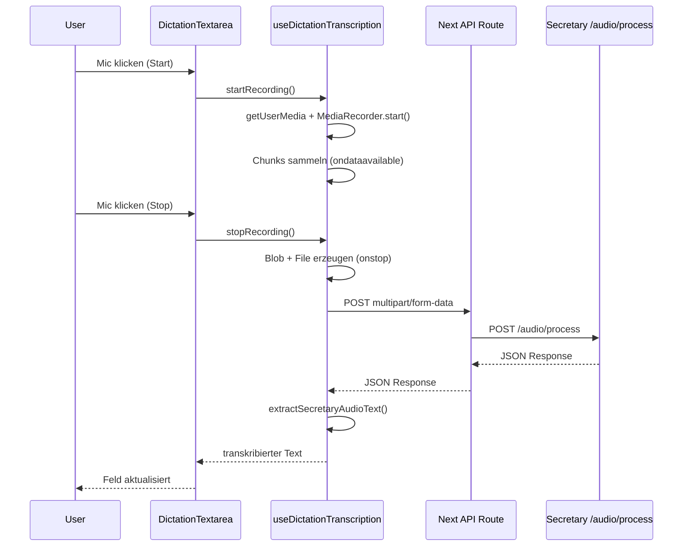

# Diktat und Secretary Service: Ablauf und Wiederverwendung

Dieses Dokument beschreibt den aktuellen Diktat-Flow in der App:
- Welche UI-Komponenten beteiligt sind
- Wie Audio aufgenommen und übertragen wird
- Wie der Secretary Service aufgerufen wird
- Was für die Wiederverwendung in einem anderen Projekt benötigt wird

## Zielbild in einem Satz

Die App nimmt Audio lokal im Browser auf, erstellt beim Stoppen **eine** Audio-Datei und sendet diese als `multipart/form-data` an eine Next.js-API-Route, die den Request an den Secretary Service (`/audio/process`) weiterleitet.

## Beteiligte Komponenten

### 1) `DictationTextarea`

- Datei: `src/components/shared/dictation-textarea.tsx`
- Aufgabe:
  - Textarea mit Mic-Button rendern
  - optionales Oszilloskop anzeigen
  - transkribierten Text in das Feld übernehmen
- Verwendet intern den Hook `useDictationTranscription`.

### 2) `useDictationTranscription`

- Datei: `src/components/shared/use-dictation-transcription.ts`
- Aufgabe:
  - `MediaRecorder` starten/stoppen
  - Audio-Chunks sammeln
  - beim Stop aus allen Chunks ein Blob bauen
  - Datei an den API-Endpoint senden
  - Text aus der Secretary-Response extrahieren

### 3) `extractSecretaryAudioText`

- Datei: `src/lib/secretary/extract-audio-text.ts`
- Aufgabe:
  - robustes Mapping verschiedener Secretary-Response-Formate
- Reihenfolge bei der Text-Extraktion:
  1. `data.output_text`
  2. `data.translated_text`
  3. `data.original_text`
  4. `data.transcription.text`
  5. `data.segments[].text` (zusammengefügt)

### 4) Optional: `AudioOscilloscope`

- Datei: `src/components/shared/audio-oscilloscope.tsx`
- Aufgabe:
  - visuelle Live-Rückmeldung während der Aufnahme

## Aufrufkette (End-to-End)

## 1) Browser: Aufnahme starten

- User klickt auf Mic.
- Hook ruft `navigator.mediaDevices.getUserMedia({ audio: true })`.
- `MediaRecorder` startet.
- `ondataavailable` sammelt Chunks in `audioChunksRef`.

## 2) Browser: Aufnahme stoppen

- User klickt erneut auf Mic.
- `MediaRecorder.stop()` wird ausgelöst.
- In `onstop`:
  - `new Blob(audioChunksRef.current, { type: ... })`
  - `new File([blob], "dictation.webm", { type: ... })`
  - POST an Transkriptions-Endpoint (`fetch`, `FormData`)

Wichtig: Es gibt hier **kein** kontinuierliches Chunk-Streaming zum Backend.  
Der Upload erfolgt gesammelt nach dem Stop.

## 3) Next.js API-Proxy

### Auth-Flow

- Route: `src/app/api/secretary/process-audio/route.ts`
- prüft Auth (Clerk)
- nimmt `file`, `source_language`, `target_language`, optional `template`
- setzt `useCache=false`
- forwardet an `${SECRETARY_SERVICE_URL}/audio/process`

### Public-Flow

- Route: `src/app/api/public/secretary/process-audio/route.ts`
- validiert `libraryId`, `eventFileId`, `writeKey` (falls nötig)
- nimmt `file`, `source_language`, `target_language`, optional `template`
- setzt `useCache=false`
- forwardet an `${SECRETARY_SERVICE_URL}/audio/process`

## 4) Secretary Service Verarbeitung

- Endpoint: `/audio/process`
- Input: Multipart-Datei (`file`) + Sprachparameter
- Verarbeitung intern ggf. segmentiert
- Antwort enthält je nach Version/Fall unterschiedliche Textfelder
- App extrahiert den Volltext über `extractSecretaryAudioText`

## Sequenzdiagramm



## Wiederverwendung in anderem Projekt

Für eine saubere Übernahme sind diese Bausteine ausreichend:

1. `src/components/shared/dictation-textarea.tsx`
2. `src/components/shared/use-dictation-transcription.ts`
3. `src/lib/secretary/extract-audio-text.ts`
4. optional `src/components/shared/audio-oscilloscope.tsx`
5. eine eigene API-Route als Proxy auf den Secretary Service

### Minimales Nutzungsbeispiel

```tsx
<DictationTextarea
  label="Erzähl mir was"
  value={text}
  onChange={setText}
  showOscilloscope={true}
  transcribeEndpoint="/api/secretary/process-audio"
  sourceLanguage="de"
  targetLanguage="de"
/>
```

## Hinweise zu langen Aufnahmen

- Lange Aufnahmen erhöhen Dateigröße und Upload-Zeit.
- Im Public-Endpoint gilt aktuell ein Dateilimit von 25 MB.
- Da nicht live gestreamt wird, hängt die Robustheit bei sehr langen Diktaten von Browser-Ressourcen und Upload-Stabilität ab.

## Validierung / Tests

Relevante Tests:

- `tests/unit/secretary/extract-audio-text.test.ts`
- `tests/unit/dictation/merge-dictation-text.test.ts`

Beispielausführung:

```bash
pnpm vitest run tests/unit/secretary/extract-audio-text.test.ts tests/unit/dictation/merge-dictation-text.test.ts
```
