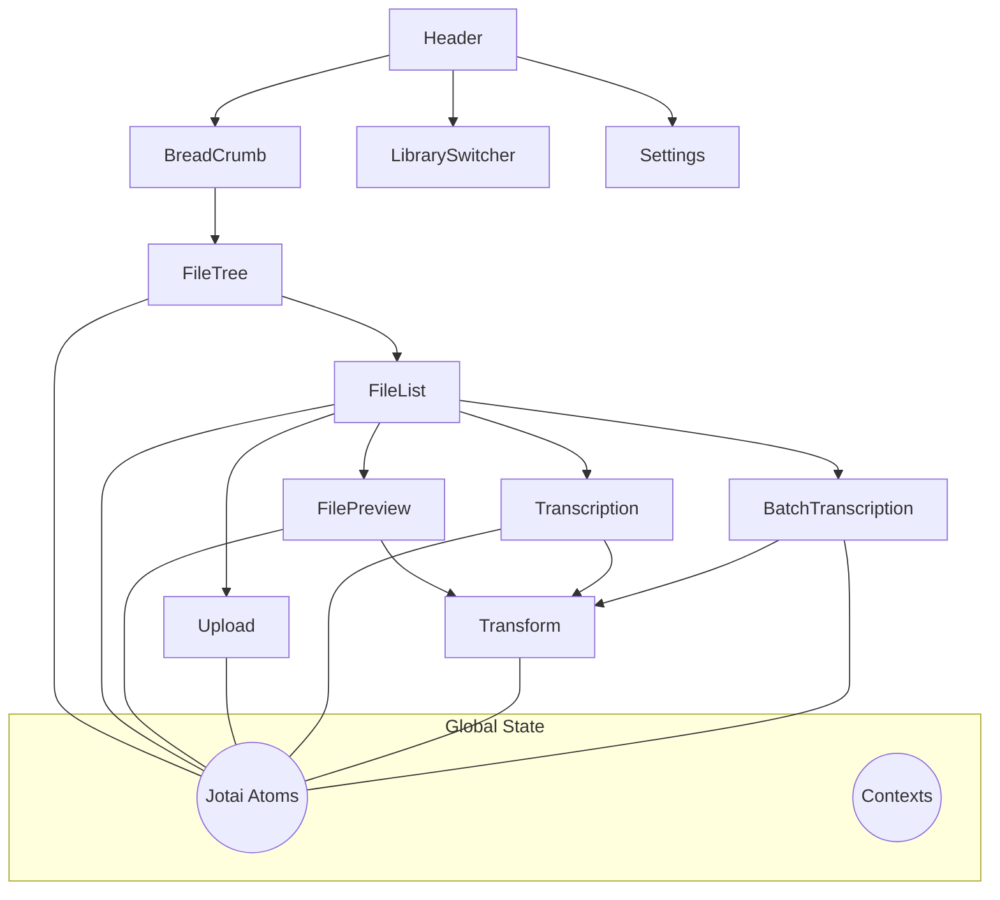

# Übersicht: Library-Komponenten

Dieses Dokument gibt einen Überblick über die Hauptkomponenten der Library-Ansicht in Knowledge Scout. Ziel ist eine klare, modulare Gliederung und die Dokumentation aller Kernfunktionen gemäß der Cursor-Regel `reorganizing-components`.

## Ziel
- Jede Kernfunktionalität ist in eine eigene, klar abgegrenzte Komponente ausgelagert.
- Komponenten kommunizieren primär über globale State-Atoms (Jotai) oder Contexts.
- Die Dokumentation jeder Komponente erfolgt in einer eigenen Datei unter `/docs/library_concept/`.

## Komponentenübersicht

| Komponente         | Zweck / User Story (Kurz)                |
|--------------------|------------------------------------------|
| Header             | Navigation, Bibliothekswechsel, Settings |
| BreadCrumb         | Pfadnavigation, schnelle Ordnerwahl      |
| FileTree           | Ordnerstruktur, Drag & Drop              |
| FileList           | Dateiansicht, Sortierung, Batch-Select   |
| Upload             | Datei-Upload, Fortschritt, Fehler        |
| FilePreview        | Vorschau für Audio, Video, Text, etc.    |
| Transcription      | Einzel-Transkription                     |
| Transform          | Text-/Audio-/Video-Transformation        |
| BatchTranscription | Mehrfach-Transkription                   |

## Architektur (Mermaid)

## Weiteres Vorgehen
- Für jede Komponente wird eine eigene Datei nach dem Standard-Template angelegt.
- Jede Datei enthält: User Stories, Initialisierung, Features, Abhängigkeiten, API Calls, Auffälligkeiten & Verbesserungsmöglichkeiten, ToDos.
- Komplexe Abläufe werden mit Mermaid-Diagrammen visualisiert. 