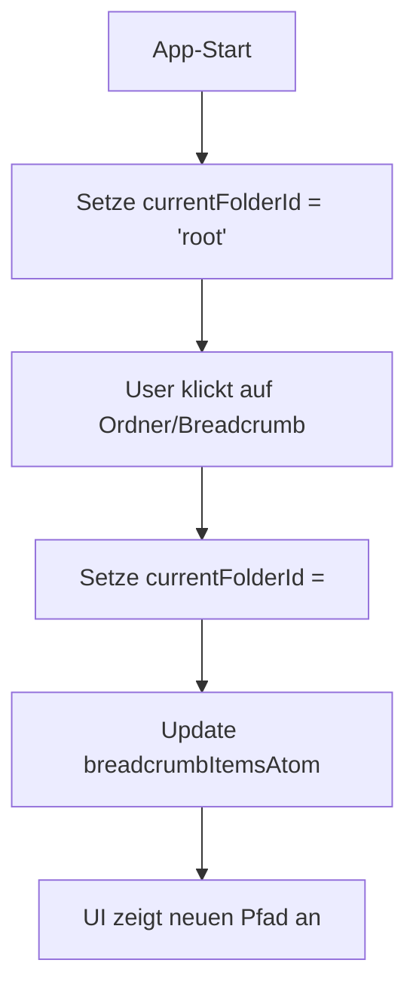
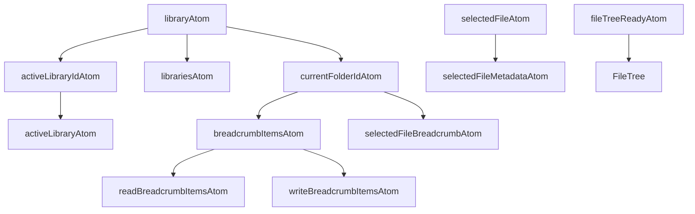

# Global State (Atoms & Contexts)

## 1. User Stories
- Als Entwickler möchte ich nachvollziehen, wie der globale Zustand verwaltet wird.
- Als Entwickler möchte ich wissen, welche Atoms und Contexts für die Kommunikation genutzt werden.

## 2. Initialisierung
- Atoms werden beim Laden der App initialisiert.
- Contexts werden über Provider im Komponentenbaum bereitgestellt.

## 3. Features
- Zentrale Verwaltung von UI- und Datenzustand
- Kommunikation zwischen Komponenten ohne direkte Props
- Persistenz von Auswahl, Navigation, Einstellungen

## 4. Abhängigkeiten
- **Verwendet in:**
  - Fast allen Library-Komponenten
- **Externe Abhängigkeiten:**
  - Jotai (Atoms)
  - React Context API

## 5. API Calls
- Keine direkten API-Calls.
- Indirekt: Atoms können API-Trigger auslösen (z.B. beim Laden von Dateien, Authentifizierung)

## 6. Auffälligkeiten & Verbesserungsmöglichkeiten
- Teilweise Überschneidungen zwischen Atoms und Contexts
- Manche Atoms sind zu generisch benannt
- Persistenz im LocalStorage uneinheitlich

## 7. ToDos
- Konsolidierung und klare Benennung aller Atoms
- Dokumentation aller Atoms und Contexts mit Typen
- Einheitliche Persistenzstrategie
- Übersichtliches Diagramm aller State-Flows erstellen 

## 8. Verzeichnishierarchie & Root-Logik

### Was ist "ROOT"?
- Die Root ist das logische Wurzelverzeichnis einer Bibliothek.
- Im globalen State wird die Root immer durch die ID "root" repräsentiert.
- "root" ist ein konstanter String, der in allen relevanten Atoms, Komponenten und Providern als Platzhalter für das Wurzelverzeichnis dient.
- In den Storage-Providern (OneDrive, Filesystem) wird "root" als Spezialfall behandelt, z.B. für API-Calls oder Pfadauflösung.

### Speicherung & Aktualisierung im Global State
- Die zentrale Struktur ist das Interface LibraryContextData:
  ```ts
  interface LibraryContextData {
    libraries: ClientLibrary[];
    activeLibraryId: string;
    currentFolderId: string; // "root" für das Wurzelverzeichnis
  }
  ```
- currentFolderId ist der zentrale Schlüssel für die Navigation.
- Initialwert: "root" (siehe initialState im Code).
- Wird über das Atom currentFolderIdAtom gelesen und geschrieben.
- Jeder Ordnerwechsel (z.B. Klick im FileTree oder Breadcrumb) setzt currentFolderId auf die neue Ordner-ID.
- Klick auf das Root-Element setzt currentFolderId explizit auf "root".
- Die Anzeige des aktuellen Pfads prüft, ob currentFolderId === "root", um den Wurzelzustand darzustellen.

### Anzeige des Namens
- Für "root" wird der Name der aktiven Bibliothek (ClientLibrary.label) angezeigt.
- Für Unterordner wird der Name aus dem jeweiligen StorageItem.metadata.name gezogen.

### Persistenz
- Der zuletzt geöffnete Ordner einer Bibliothek wird im localStorage gespeichert (folder-${libraryId}).
- Beim Laden der Bibliothek wird dieser Wert ausgelesen und als currentFolderId gesetzt, falls vorhanden.

### Beispiel: State-Flow für Navigation


## 9. ToDo: Auslagerung der Breadcrumb-Komponente

**Ziel:**
- Breadcrumb als eigene Komponente, die ausschließlich über den globalen State (breadcrumbItemsAtom, currentFolderIdAtom, ggf. activeLibraryIdAtom) arbeitet.

**Vorgehen:**
1. Neue Komponente breadcrumb.tsx in src/components/library/ anlegen.
2. Verwendung von Jotai-Atoms:
   - const [breadcrumbItems] = useAtom(breadcrumbItemsAtom);
   - const [currentFolderId, setCurrentFolderId] = useAtom(currentFolderIdAtom);
   - const [activeLibraryId] = useAtom(activeLibraryIdAtom);
   - Für die Anzeige des Root-Namens: Hole die aktuelle Bibliothek aus dem globalen State.
3. Klick-Handler:
   - Klick auf Root: setCurrentFolderId("root")
   - Klick auf Breadcrumb-Item: setCurrentFolderId(item.id)
4. UI:
   - Zeige Root und alle Items aus breadcrumbItems als Buttons an.
   - Markiere das aktuell ausgewählte Item.

**Vorteile:**
- Zentrale, wiederverwendbare Breadcrumb-Logik.
- Keine Props-Boilerplate mehr zwischen Header und anderen Komponenten.
- Immer konsistent mit dem globalen Navigationszustand.

## 10. Verbesserungsbedarf & Ausblick
- Atoms und Contexts konsolidieren, eindeutige Benennung.
- Einheitliche Persistenzstrategie (z.B. für zuletzt gewählten Ordner).
- Dokumentation aller Atoms und Contexts mit Typen (siehe oben).
- Übersichtliches Diagramm aller State-Flows (siehe Mermaid oben). 

## 11. Globale Atome: Übersicht & Typisierung

In diesem Abschnitt werden alle globalen Atome, die für die Library-Komponenten relevant sind, detailliert beschrieben. Die Atome befinden sich in `src/atoms/library-atom.ts` und bilden das Rückgrat des globalen State-Managements.

### 11.1 libraryAtom
- **Typ:** `atom<LibraryContextData>`
- **Initialwert:**
  ```ts
  {
    libraries: [],
    activeLibraryId: "",
    currentFolderId: "root"
  }
  ```
- **Zweck:** Hauptcontainer für den globalen Zustand der Bibliotheksansicht (Libraries, aktive Bibliothek, aktueller Ordner).

### 11.2 activeLibraryIdAtom
- **Typ:** `atom<string>`
- **Initialwert:** `""`
- **Zweck:** ID der aktuell ausgewählten Bibliothek. Setter/Getter für `libraryAtom.activeLibraryId`.

### 11.3 librariesAtom
- **Typ:** `atom<ClientLibrary[]>`
- **Initialwert:** `[]`
- **Zweck:** Liste aller verfügbaren Bibliotheken. Setter/Getter für `libraryAtom.libraries`.

### 11.4 activeLibraryAtom
- **Typ:** `atom<ClientLibrary | undefined>`
- **Initialwert:** `undefined`
- **Zweck:** Liefert das aktuell aktive Bibliotheksobjekt basierend auf `activeLibraryIdAtom`.

### 11.5 currentFolderIdAtom
- **Typ:** `atom<string>`
- **Initialwert:** `"root"`
- **Zweck:** ID des aktuell geöffneten Ordners. Setter/Getter für `libraryAtom.currentFolderId`.

### 11.6 breadcrumbItemsAtom
- **Typ:** `atom<StorageItem[]>`
- **Initialwert:** `[]`
- **Zweck:** Array aller Ordner (als `StorageItem`), die den aktuellen Pfad von Root bis zum aktuellen Ordner abbilden. Wird für Breadcrumb und Navigation verwendet.

### 11.7 selectedFileAtom
- **Typ:** `atom<StorageItem | null>`
- **Initialwert:** `null`
- **Zweck:** Die aktuell ausgewählte Datei (z.B. für Preview oder Aktionen).

### 11.8 selectedFileBreadcrumbAtom
- **Typ:** `atom<{ items: StorageItem[]; currentId: string; }>`
- **Initialwert:** `{ items: [], currentId: 'root' }`
- **Zweck:** Speichert den Breadcrumb-Pfad und die aktuelle ID für die ausgewählte Datei.

### 11.9 selectedFileMetadataAtom
- **Typ:** `atom<{ name: string; size: number; type: string; modified: Date; created: Date; transcriptionEnabled?: boolean; } | null>`
- **Initialwert:** `null`
- **Zweck:** Metadaten der aktuell ausgewählten Datei (z.B. für Anzeige oder Transformation).

### 11.10 readBreadcrumbItemsAtom
- **Typ:** `atom<StorageItem[]>`
- **Initialwert:** `[]`
- **Zweck:** Schreibgeschütztes Derivat von `breadcrumbItemsAtom` (nur Lesen).

### 11.11 writeBreadcrumbItemsAtom
- **Typ:** `atom<null, [StorageItem[]], void>`
- **Initialwert:** `null`
- **Zweck:** Nur-Schreiben-Atom für Breadcrumb-Items mit Validierung (verhindert unnötige Updates).

### 11.12 fileTreeReadyAtom
- **Typ:** `atom<boolean>`
- **Initialwert:** `false`
- **Zweck:** Signalisiert, ob der FileTree initialisiert und bereit ist.

**Hinweis:**
Alle Atome sind mit `debugLabel` versehen, um Debugging und Nachvollziehbarkeit zu erleichtern. Die Typisierung ist strikt und folgt den Projektkonventionen.

## 12. Übersicht: Atom-Flow & Zusammenspiel

