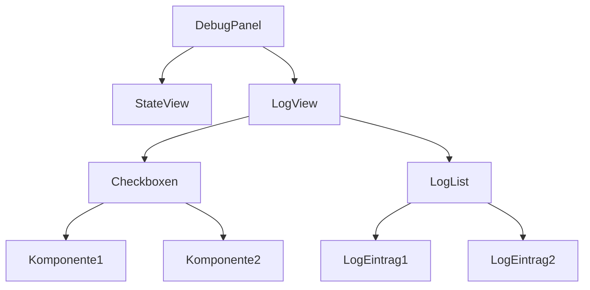

# Error Handling, Logging & Testing

## 1. User Stories
- Als Entwickler möchte ich Fehler und Logs gezielt pro Komponente einsehen können.
- Als Entwickler möchte ich Fehlerquellen schnell erkennen und reproduzieren können.
- Als Entwickler möchte ich gezielt Komponenten-Logs ein- und ausblenden können (z.B. im DebugPanel).
- Als Entwickler möchte ich automatisierte Tests für alle Kernfunktionen haben.
- **Als Entwickler möchte ich die aktuellen States und wichtigsten Parameter (z.B. ausgewählte Datei, aktiver Ordner, Provider-Status) jederzeit überwachen können.**

## 2. Initialisierung
- Fehler- und Logging-Mechanismen werden global initialisiert (z.B. Logger, Error Boundaries).
- DebugPanel ist immer verfügbar und kann minimiert werden.

## 3. Features
- Zentrale Fehlerbehandlung (Error Boundaries, typisierte Fehler)
- Logging-Strategie: Logs pro Komponente, Filterung nach Komponententyp
- DebugPanel: Anzeige von State, Logs, Fehlern, mit Checkboxen zum Ein-/Ausblenden von Komponenten-Logs
- Automatisierte Tests (Unit, Integration, E2E)
- **DebugPanel: Anzeige der wichtigsten State-Parameter (aktuelle Bibliothek, Ordner, Auswahl, Provider, Status, etc.)**

## 4. Abhängigkeiten
- **Komponenten:**
  - DebugPanel (src/components/debug/debug-panel.tsx)
  - Error Boundaries
- **Libraries:**
  - sonner (Toasts), Jotai, Testing Library, Vitest, Playwright

## 5. API Calls
- Keine direkten API-Calls.
- Indirekt: Fehler und Logs können durch API-Fehler ausgelöst werden (z.B. provider-Methoden)

## 6. Auffälligkeiten & Verbesserungsmöglichkeiten
- DebugPanel zeigt aktuell nur State, keine echten Logs/Fehler pro Komponente
- Keine Filterung/Checkboxen für Logs im DebugPanel
- Fehlerhandling ist teilweise inkonsistent (z.B. try/catch, Toasts, Error Boundaries)
- Testabdeckung ist nicht für alle Komponenten gleich hoch

## 7. ToDos
- DebugPanel erweitern: Logs pro Komponente, Checkboxen für Sichtbarkeit
- Zentrale Logging-API mit Komponententags einführen
- Fehlerhandling vereinheitlichen (Error Boundaries, typisierte Fehler)
- Teststrategie und Coverage-Reports für alle Kernkomponenten

---

## 8. Konzept: Erweiterung DebugPanel (Logs, Filter, Logging-API)

### Ziel
- Logs und Fehler pro Komponente im DebugPanel sichtbar machen
- Checkboxen zum gezielten Ein-/Ausblenden von Logs pro Komponente
- Zentrale Logging-API, die Logs mit Komponententag und Level (info, warn, error) entgegennimmt
- State-Überwachung bleibt als separater Bereich erhalten

### Skizze (UI/UX)



- **StateView:** Zeigt wie bisher die wichtigsten State-Parameter
- **LogView:**
  - Checkboxen für jede Komponente (z.B. FileList, FileTree, Upload, ...)
  - LogList zeigt nur Logs der aktivierten Komponenten
  - Logs werden nach Level (info, warn, error) farblich markiert

### Logging-API (Konzept)

```ts
// logging.ts
export type LogLevel = 'info' | 'warn' | 'error';
export interface LogEntry {
  timestamp: Date;
  component: string;
  level: LogLevel;
  message: string;
  data?: unknown;
}

export function log(component: string, level: LogLevel, message: string, data?: unknown) {
  // LogEntry erzeugen und globalen Log-Atom updaten
}
```

- Jeder Komponenten-Code ruft `log('FileList', 'info', 'Datei geladen', { ... })` auf
- DebugPanel liest globalen Log-Atom und filtert nach Checkboxen

### Vorteile
- Entwickler können gezielt Logs pro Komponente einsehen
- Logs und State sind klar getrennt, aber gemeinsam sichtbar
- Logging-API kann später für Remote-Logging erweitert werden

### ToDos (konkret)
- Logging-API und globalen Log-Atom implementieren
- DebugPanel um LogView und Checkboxen erweitern
- Bestehende Komponenten auf neue Logging-API umstellen 