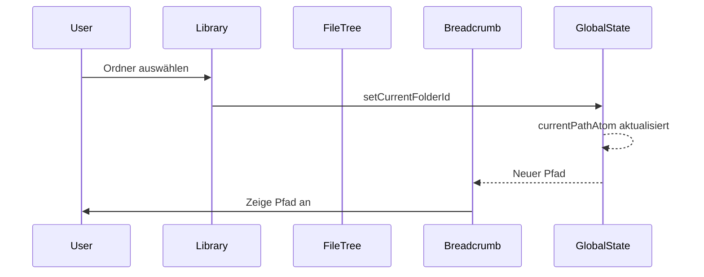

# Initialisierungssequenz

## Übersicht
Die Initialisierung der Library-Komponenten erfolgt in einer definierten Reihenfolge, um Race Conditions zu vermeiden und eine stabile Benutzererfahrung zu gewährleisten.

## Initialisierungsreihenfolge

### 1. Library-Auswahl (LibrarySwitcher)
- User wählt eine Library aus
- `activeLibraryIdAtom` wird gesetzt
- `currentFolderIdAtom` wird auf "root" zurückgesetzt

### 2. Provider-Initialisierung (Library)
- StorageProvider wird basierend auf Library-Typ erstellt
- Provider wird an alle Child-Komponenten weitergegeben
- Zentrale Pfad-Verwaltung wird initialisiert

### 3. FileTree-Initialisierung
- **Globaler State**: Nutzt `fileTreeReadyAtom` für Initialisierungsstatus
- **Provider-Wechsel**: Bei Änderung des Providers:
  - `fileTreeReadyAtom` wird auf `false` zurückgesetzt
  - `loadedChildren` und `rootItems` werden geleert
  - Neue Initialisierung wird gestartet
- **Initialisierung**: 
  - Root-Items werden geladen
  - `fileTreeReadyAtom` wird auf `true` gesetzt
  - Stellt `loadPath`-Funktion bereit
  - Fehlerbehandlung mit Logging

### 4. FileList-Initialisierung
- Wartet auf Provider-Verfügbarkeit
- Lädt Items für `currentFolderId`
- Aktualisiert bei Änderung von `currentFolderId`

### 5. Breadcrumb-Aktualisierung
- Reagiert auf Änderungen von `currentPathAtom`
- Rendert den Pfad basierend auf dem abgeleiteten State
- Handhabt Navigations-Klicks
- Keine eigene Pfad-Logik

## Pfad-Verwaltung

### Zentrale Koordination durch Atoms
Die Pfad-Verwaltung erfolgt automatisch durch abgeleitete Atoms:

```typescript
// Zentrales Pfad-Atom
export const currentPathAtom = atom(
  (get) => {
    const currentFolderId = get(currentFolderIdAtom);
    const currentLibrary = get(activeLibraryAtom);
    
    if (!currentLibrary || !currentFolderId) return [];
    
    // Pfad aus dem Ordner-Cache berechnen
    const folderCache = currentLibrary.folderCache;
    if (!folderCache) return [];
    
    return resolvePath(folderCache, currentFolderId);
  }
);
currentPathAtom.debugLabel = "currentPathAtom";
```

### Komponenten-Verantwortlichkeiten

#### FileTree
- Stellt `loadPath`-Funktion bereit
- Lädt Ordner-Hierarchie
- Keine direkte Pfad-Manipulation

#### Library
- Zentrale Ordner-Navigation
- Atomic State Updates
- Fehlerbehandlung
- Cache-Verwaltung

#### Breadcrumb
- Reine Anzeige-Komponente
- Rendert `currentPathAtom`
- Leitet Klicks an Library weiter

## State-Synchronisation

### Globale Atome
- `fileTreeReadyAtom`: FileTree-Initialisierungsstatus
- `currentFolderIdAtom`: Aktueller Ordner
- `currentPathAtom`: Abgeleiteter Breadcrumb-Pfad
- `activeLibraryIdAtom`: Aktive Library

### Provider-Tracking
- `previousProviderIdRef`: Verhindert doppelte Initialisierung
- Provider-ID wird aus `provider?.id` abgeleitet

## Best Practices

1. **Automatische Pfad-Verwaltung**: Pfad wird aus currentFolderId abgeleitet
2. **Atomic Updates**: State-Änderungen in `startTransition`
3. **Klare Verantwortlichkeiten**: Komponenten haben eindeutige Aufgaben
4. **Fehlerbehandlung**: Zentrales Error-Handling in Library
5. **Performance**: Parallele Promises für Items und Pfad

## Mermaid-Diagramm



## Implementierungs-Richtlinien

### Library Component
```typescript
// Ordner-Navigation
const handleFolderSelect = async (item: StorageItem) => {
  try {
    const items = await listItems(item.id);
    
    React.startTransition(() => {
      setCurrentFolderId(item.id);
      setFolderItems(items);
    });
  } catch (error) {
    handleError(error);
  }
};
```

### Breadcrumb Component
```typescript
// Reine Anzeige-Komponente
export function Breadcrumb() {
  const [currentPath] = useAtom(currentPathAtom);
  const [currentFolderId] = useAtom(currentFolderIdAtom);
  
  return (
    <div className="flex gap-2">
      {currentPath.map(item => (
        <BreadcrumbItem
          key={item.id}
          item={item}
          isActive={item.id === currentFolderId}
        />
      ))}
    </div>
  );
}
```

## Erwartetes Verhalten

1. **Initialisierung**:
   - Library wird geladen
   - FileTree initialisiert
   - Root-Pfad wird automatisch gesetzt

2. **Ordner-Navigation**:
   - Items laden
   - currentFolderId setzen
   - Pfad aktualisiert sich automatisch
   - Breadcrumb rendert neuen Pfad

3. **Fehlerszenarien**:
   - Provider nicht verfügbar
   - Ordner nicht gefunden
   - Netzwerkfehler

## Monitoring & Debugging

### Zu überwachende Metriken
1. Zeit für Pfad-Auflösung
2. Anzahl der State-Updates
3. Race Conditions
4. Fehlerrate

### Debug-Logs
```typescript
StateLogger.info('Library', 'Folder navigation', {
  folderId,
  path: currentPath.map(i => i.name)
});
```

## Konkrete Fixes

### Fix 1: FileTree darf nur Root laden
```typescript
// file-tree.tsx
useEffect(() => {
  if (!provider || isInitialized) return;
  
  loadRootItems().then(() => {
    setFileTreeReady(true);
    setIsInitialized(true);
  });
}, [provider]); // NUR provider als dependency
```

### Fix 2: Library wartet auf FileTree
```typescript
// library.tsx
useEffect(() => {
  if (!isFileTreeReady) return;
  if (!provider) return;
  
  loadCurrentFolderItems();
}, [isFileTreeReady, provider, currentFolderId]);
```

### Fix 3: Keine doppelten Loads
```typescript
// library.tsx
const loadingRef = useRef<string | null>(null);

const loadItems = async (folderId: string) => {
  // Verhindere doppelte Loads
  if (loadingRef.current === folderId) return;
  loadingRef.current = folderId;
  
  try {
    const items = await provider.listItems(folderId);
    setFolderItems(items);
  } finally {
    loadingRef.current = null;
  }
};
```

## Monitoring & Metriken

### Zu überwachende Metriken
1. **Anzahl der listItems-Aufrufe pro Ordner**
2. **Zeit zwischen Initialisierung und erster Anzeige**
3. **Anzahl der "Skip load" Meldungen**
4. **Memory-Leaks durch nicht gecleante useEffects**

### Debug-Output Format
```typescript
interface InitMetrics {
  timestamp: Date;
  phase: 'provider' | 'filetree' | 'filelist';
  action: string;
  duration: number;
  success: boolean;
  metadata?: Record<string, any>;
}
```

## ToDos

| Aufgabe | Priorität | Geschätzte Zeit |
|---------|-----------|-----------------|
| currentPathAtom implementieren | Hoch | 2h |
| Breadcrumb auf currentPathAtom umstellen | Hoch | 1h |
| Debug-Filter implementieren | Mittel | 2h |
| Metriken-Sammlung einbauen | Mittel | 3h |
| Test-Suite für Initialisierung | Niedrig | 4h |
| Dokumentation aktualisieren | Niedrig | 1h |

## Erwartetes Ergebnis

Nach der Implementierung sollten wir sehen:
1. **Genau eine** Root-Items Ladung beim Start
2. **Genau eine** FileList-Items Ladung pro Ordnerwechsel
3. **Keine** "Skip load - not ready" Meldungen nach Initialisierung
4. **Automatische** Pfad-Aktualisierung bei Ordnerwechsel 