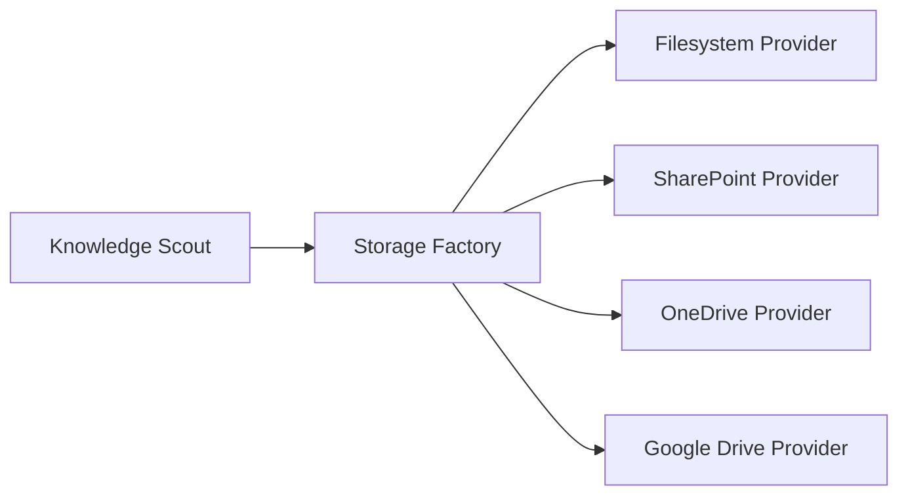
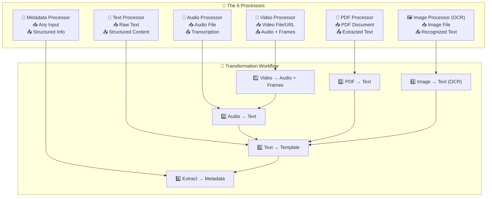

# Knowledge Scout - Modernes Dokumentenmanagementsystem
## PowerPoint Präsentation (Markdown Format)

---

## Folie 1: Titel & Überblick
### 🔍 Knowledge Scout
**Modernes Dokumentenmanagementsystem**

- **Next.js 14** + **TypeScript** + **Tailwind CSS**
- Multi-Provider Storage System
- Kollaborative Dokumentenverwaltung
- Enterprise-Ready Solution

*Entwickelt für effiziente Wissensorganisation und -verwaltung*

---

## Folie 2: Problem & Lösung
### Das Problem
- **Fragmentierte Dokumente** über verschiedene Plattformen
- **Keine einheitliche Verwaltung** von SharePoint, OneDrive, Google Drive
- **Komplizierte Berechtigungsstrukturen**
- **Fehlende Kollaborationsmöglichkeiten**

### Unsere Lösung: Knowledge Scout
✅ **Einheitliche Oberfläche** für alle Storage-Provider  
✅ **Intelligente Bibliotheksverwaltung**  
✅ **Rollenbasierte Berechtigungen**  
✅ **Nahtlose Kollaboration**

---

## Folie 3: Kernfunktionalitäten
### 📁 Multi-Provider Storage System
- **Lokales Dateisystem**
- **SharePoint Integration**
- **OneDrive & Google Drive** (vorbereitet)
- **Einheitliche API-Abstraktion**

### 🔍 Erweiterte Dokumentenverwaltung
- **Hierarchische Ordnerstruktur**
- **Datei-Vorschau & -Bearbeitung**
- **Metadaten-Verwaltung**
- **Volltextsuche**

### 👥 Benutzer & Berechtigungen
- **Rollenbasierte Zugriffssteuerung**
- **Bibliotheks-spezifische Verwaltung**
- **Feingranulare Berechtigungen**
- **Aktivitätsprotokollierung**

---

## Folie 4: Technische Architektur
### 🏗️ Modern Tech Stack
```
Frontend: Next.js 14 + React 18 + TypeScript
Styling: Tailwind CSS + shadcn/ui + Radix UI
State: Jotai + React Hook Form + Zod
Auth: Clerk Authentication
Build: pnpm Package Manager
```

### 🔧 Architektur-Prinzipien
- **Server Components** als Standard
- **API Routes** für Backend-Logik
- **Atomarer Zustand** mit Jotai
- **Type-Safe** Development
- **Komponentenbasierte** UI-Architektur

---

## Folie 5: UI/UX Highlights
### 🎨 Moderne Benutzeroberfläche
- **Responsive Design** für alle Geräte
- **Dark Mode Support**
- **Intuitive Navigation** mit Breadcrumbs
- **Drag & Drop** Funktionalität

### 🔍 Smart Features
- **Datei-Vorschau** für alle Formate
- **Live-Suche** mit Filtering
- **Toast Notifications**
- **Resizable Panels** für optimale Nutzung
- **Tree-View** für Ordnerstrukturen

---

## Folie 6: Benutzerrollen & Workflows
### 👤 Rollenkonzept
| Rolle | Berechtigungen |
|-------|---------------|
| **Administrator** | Vollzugriff, System-Konfiguration |
| **Bibliotheks-Manager** | Bibliotheks-Verwaltung, Benutzer einladen |
| **Standard-Benutzer** | Dokumente verwalten, Ordner erstellen |
| **Gast-Benutzer** | Lesezugriff auf freigegebene Inhalte |

### 🔄 Typische Workflows
1. **Upload & Organisation**: Dokumente hochladen → Organisieren → Metadaten
2. **Suche & Zugriff**: Suchen → Filtern → Vorschau → Bearbeiten
3. **Kollaboration**: Freigeben → Berechtigungen → Gemeinsam bearbeiten

---

## Folie 7: Storage Provider System
### 🏢 Flexible Storage-Integration


### 📦 Provider Features
- **Einheitliche API** für alle Provider
- **Automatische Synchronisation**
- **Konfliktbehandlung**
- **Offline-Unterstützung** (geplant)

---

## Folie 7a: Secretary Service - The 6 Processors
### 🔥 Complete Media Processing


### 🚀 Supported Formats
- **Video**: MP4, AVI, MOV, WebM → Audio Extraction + Frame Extraction
- **Audio**: MP3, WAV, M4A → Whisper Transcription
- **PDF**: All PDF versions → Text Extraction + OCR
- **Images**: JPG, PNG, WebP → Tesseract OCR
- **Text**: TXT, MD, CSV → Template Transformation
- **URLs**: YouTube, Websites → Content Extraction

---

## Folie 8: Sicherheit & Compliance
### 🔒 Sicherheitskonzept
- **Clerk Authentication** für sichere Anmeldung
- **Rollenbasierte Zugriffskontrolle** (RBAC)
- **Hierarchische Berechtigungen** mit Vererbung
- **API-Sicherheit** mit Token-Validierung

### 📋 Compliance Features
- **Aktivitätsprotokolle** für Audit-Trails
- **Datenexport-Funktionen**
- **Berechtigungsberichte**
- **DSGVO-konforme** Datenhaltung

---

## Folie 9: Entwicklungsvorteile
### 🚀 Developer Experience
- **TypeScript** für Type Safety
- **Hot Reload** in Development
- **Komponentenbasierte** Architektur
- **ESLint & Prettier** für Code Quality

### 🔧 Erweiterbarkeit
- **Plugin-System** für neue Provider
- **Custom Hooks** für wiederverwendbare Logik
- **Theme System** für Corporate Design
- **API-First** Approach

---

## Folie 10: Technische Features im Detail
### 📊 State Management
- **Jotai Atoms** für globalen Zustand
- **React Hook Form** für Formulare
- **TanStack Query** für Server State
- **Zod Validation** für Type Safety

### 🎯 Performance Optimierung
- **Server Components** reduzieren Client-Bundle
- **Image Optimization** mit Next.js
- **Code Splitting** automatisch
- **Lazy Loading** für bessere Performance

---

## Folie 11: Setup & Deployment
### ⚡ Quick Start
```bash
# Repository klonen
git clone [repository-url]

# Dependencies installieren
pnpm install

# Umgebungsvariablen konfigurieren
cp .env.example .env.local

# Entwicklungsserver starten
pnpm dev
```

### 🚢 Deployment Options
- **Vercel** (empfohlen für Next.js)
- **Docker** Container Support
- **Self-Hosted** Server
- **Cloud Platforms** (AWS, Azure, GCP)

---

## Folie 12: Roadmap & Zukunft
### 🎯 Kurzfristige Ziele (Q1/Q2)
- **OneDrive Integration** vervollständigen
- **Google Drive Provider** implementieren
- **Advanced Search** mit Elasticsearch
- **Mobile App** (React Native)

### 🚀 Langfristige Vision
- **KI-gestützte Dokumentenanalyse**
- **Automatische Kategorisierung**
- **Workflow-Automation**
- **Enterprise SSO Integration**

---

## Folie 13: Live Demo
### 🎬 Demo-Bereiche
1. **Bibliothek erstellen** und konfigurieren
2. **Dokumente hochladen** und organisieren
3. **Berechtigungen** verwalten
4. **Suchfunktion** nutzen
5. **Kollaboration** in Aktion

### 💡 Highlights zeigen
- Drag & Drop Upload
- Live-Vorschau verschiedener Dateitypen
- Benutzerfreundliche Navigation
- Responsive Design auf verschiedenen Geräten

---

## Folie 14: Q&A und Diskussion
### ❓ Häufige Fragen
- **Skalierbarkeit**: Wie viele Benutzer/Dokumente?
- **Integration**: Bestehende Systeme anbinden?
- **Kosten**: Lizenzmodell und Betriebskosten?
- **Support**: Wartung und Updates?

### 💬 Diskussionspunkte
- Spezifische Anforderungen des Unternehmens
- Integration in bestehende IT-Landschaft
- Pilotprojekt und Rollout-Strategie
- Training und Change Management

---

## Folie 15: Kontakt & Next Steps
### 📧 Kontakt
**Projekt-Team Knowledge Scout**
- Email: [team@knowledge-scout.dev](mailto:team@knowledge-scout.dev)
- GitHub: [github.com/company/knowledge-scout](https://github.com/company/knowledge-scout)
- Dokumentation: [docs.knowledge-scout.dev](https://docs.knowledge-scout.dev)

### 🎯 Next Steps
1. **Pilot-Installation** in Testumgebung
2. **Requirements Workshop** mit Stakeholdern
3. **Integration Planning** mit IT-Team
4. **Training Plan** erstellen
5. **Go-Live Strategie** definieren

---

## Anhang: Technische Details
### 📋 Systemanforderungen
- **Node.js** >= 18
- **pnpm** >= 9.15
- **Modern Browser** (Chrome, Firefox, Safari, Edge)
- **Storage Provider** Zugangsdaten

### 🔗 Wichtige Links
- [Projektdokumentation](../index.md)
- [API Dokumentation](../reference/api/overview.md)
- [Setup Guide](../guide/setup.md)
- [Architektur Details](../architecture/architecture.md)