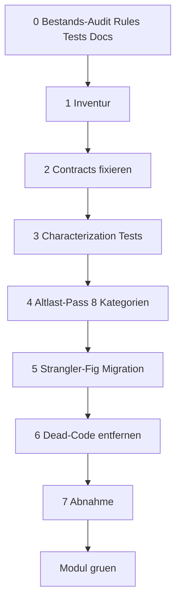

# Refactor-Playbook (8 Schritte je Modul)

Quelle: [.cursor/plans/refactor-strategie-drift-eliminieren_06fd8014.plan.md](../../.cursor/plans/refactor-strategie-drift-eliminieren_06fd8014.plan.md) Sektion 2.

Das Playbook ist die wiederholbare Methodik gegen Strategie-Drift.
Jedes Modul wird in dieser Reihenfolge bearbeitet. **Tests vor Refactor.**

## Workflow-Regeln (gelten fuer JEDE Welle)

Diese Regeln entstanden aus der Pilot-Welle `external-jobs` (siehe
[`docs/_analysis/ci-race-condition-2026-04-25.md`](../_analysis/ci-race-condition-2026-04-25.md)
und Retrospektive vom 25.04.2026). Sie sind nicht verhandelbar.

### R1 — Eine Welle, ein Test-Cycle, ein Push

```
Plan → Code → autom. Tests → User-UI-Smoke → User-OK → Push
```

- Eine Welle wird **komplett** abgeschlossen und lokal verifiziert, bevor der naechste Modul-Refactor startet.
- "Komplett" heisst: alle Schritte 0–7 fuer EIN Modul.
- **Kein Push auf `master`** ohne explizites User-OK nach lokalem Test.
- Bei mehreren PRs innerhalb einer Welle: **seriell mergen** mit ≥6 Min Abstand
  (CI-Build-Dauer abwarten) ODER alle in EINEN Squash-Merge buendeln.

### R2 — Default = 1 Cloud-Agent, kein Parallelismus

| Variante | Wann verwenden? |
|---|---|
| **1 Cloud-Agent** seriell durch alle 8 Schritte (DEFAULT) | Standardfall fuer jede Welle. User kann parallel andere Arbeit machen, Agent liefert PR(s) am Ende zum Review |
| **IDE-Agent (Claude im Cursor-Chat)** | nur fuer kleine Hotfix-Mini-Wellen (1-2 Files, klare Grenzen) oder wenn User direkt mit-debuggen will |
| **NIE** mehrere Cloud-Agents parallel | nur ausnahmsweise und mit Stacked-PRs (Branch B baut auf Branch A) |

Begruendung: Pilot-Welle nutzte 5 parallele Cloud-Agents → 6× derselbe
Bootstrap-Commit, CI-Race-Condition beim Merge, Acceptance-Bericht aus
unvollstaendigem Stand. Nutzen war marginal, Kosten + Komplexitaet hoch.
Ein einzelner Cloud-Agent, der die Welle seriell abarbeitet, vermeidet
diese Probleme komplett.

### R3 — User-Verifikation ist Pflicht-Phase, nicht "nice to have"

Vor Push einer Welle:

1. **Automatisierte Tests lokal**: `pnpm test` + (falls relevant) `pnpm test:integration:api`
2. **UI-Smoke**: User klickt durch die betroffenen UseCases. Agent stellt vorher eine
   konkrete Test-Liste bereit als `docs/refactor/<modul>/05-user-test-plan.md`.
3. **User-OK ausdruecklich abwarten** (kein "ich mach mal weiter").
4. Erst dann: Commit + Push.

### R4 — Push-Disziplin

- **Doku-only-Commits** mit `[skip ci]` im Subject (sonst triggern sie unnoetig
  Production-Deploy).
- **Keine 2 Pushes in 6 Min** auf `master` ohne CI-Statuscheck.
- **CI-Status pruefen** nach jedem Push, bevor weiterer Push folgt.

### R5 — Definition of Done zweiteilen

Plan und Acceptance-Berichte trennen explizit zwischen:

- **Methodik-DoD**: Was beweist, dass die Welle methodisch sauber war?
  (z.B. Audit existiert, Char-Tests existieren, Playbook befolgt)
- **Modul-DoD**: Was misst echte Modul-Verbesserung?
  (z.B. "−10 leere Catches", "phase-template.ts < 1.500 Zeilen")

Beides darf realistisch dimensioniert sein — lieber kleine erreichte Ziele als
grosse unerfuellte.



## Schritt 0 — Bestands-Audit (Rules, Tests, Docs)

Output: `docs/refactor/<modul>/00-audit.md` mit drei Tabellen.

### Vorlage Audit-File

```markdown
# Audit: <modul>

## A. Cursor Rules

| Rule-Datei | Bezug zum Modul | Status | Aktion | Begruendung |
|---|---|---|---|---|
| `.cursor/rules/example.mdc` | direkt | aktuell | keep | dokumentiert geltende Regel |

## B. Tests

| Test-Datei | Testet welchen Code | Code existiert? | Vertrag korrekt? | Aktion |
|---|---|---|---|---|
| `tests/unit/<modul>/example.test.ts` | `myFunction` aus `src/lib/<modul>/file.ts` | ja | ja | keep |

## C. Docs

| Doc-Datei | Beschreibt was | Status | Aktion |
|---|---|---|---|
| `docs/example.md` | Architektur-Analyse | aktuell | keep |
```

Audit-Aktionen werden in den nachfolgenden Schritten **direkt umgesetzt**:

- Status `delete` → Schritt 6 (Dead-Code)
- Status `update` → Schritt 2 (Contracts) bzw. Schritt 3 (Tests)
- Status `merge` → Schritt 5 (Strangler-Fig)
- Status `keep` → unberuehrt; bleibt als Sicherheitsnetz

## Schritt 1 — Inventur (Code)

Output: `docs/refactor/<modul>/01-inventory.md` mit Code-Health-Stats.

```bash
node scripts/module-health.mjs --module <modul>
```

Tabelle pro Modul: Datei, Zeilen, hat Test ja/nein, `any`-Anzahl, leere Catches, `'use client'`-Direktiven.

## Schritt 2 — Contracts fixieren

Pro Modul `.cursor/rules/<modul>-contracts.mdc`. Vorbild: [.cursor/rules/contracts-story-pipeline.mdc](../../.cursor/rules/contracts-story-pipeline.mdc).

### Vorlage Contract-Rule

```markdown
---
description: Harte Invarianten fuer das Modul <modul>
globs: ["src/lib/<modul>/**/*.ts"]
alwaysApply: true
---

# Contracts: <modul>

## §1 Determinismus
- <Funktion X> ist rein, keine Seiteneffekte
- Reihenfolge der Argumente ist Teil des Vertrags

## §2 Fehler-Semantik
- Ungueltige Eingabe → wirft `<ErrorType>`
- Erwarteter Fehlerpfad → loggt via `logging/query-logger`, kein silent fallback
- Kein `catch {}` und kein `?? defaultValue` ohne Begruendung im Kommentar

## §3 Erlaubte / verbotene Abhaengigkeiten
- DARF abhaengen von: `src/lib/storage`, `src/lib/logging`
- DARF NICHT abhaengen von: UI-Code, `src/components/**`

## §4 Skip- / Default-Semantik
- Wenn Eingabe X fehlt: <konkretes dokumentiertes Verhalten>
```

**Audit-Findings beachten**: Rules mit Status `update`/`merge` aus Schritt 0 hier umsetzen.

## Schritt 3 — Characterization Tests

Vitest-Tests, die das **aktuelle** Verhalten festschreiben (auch wenn buggy).
Quelle: Michael Feathers, *Working Effectively with Legacy Code*.

- Mindestens 1 Happy-Path + 1 Fehler-Pfad pro oeffentlich exportierter Funktion
- Tests landen unter `tests/unit/<modul>/`

**Audit-Findings beachten**:

- Tests mit Status `migrate` aus Schritt 0 hier aktualisieren (z.B. neuer Importpfad nach Modul-Split)
- Tests mit Status `delete` werden in Schritt 6 entfernt (nicht hier — Sicherheitsnetz!)
- Tests mit Status `keep` bleiben unangetastet

## Schritt 4 — Altlast-Pass (8 Kategorien)

Jede Datei wird gegen die 8 Punkte geprueft, Funde direkt gefixt:

1. **Fehlende Tests** — in Schritt 3 abgedeckt
2. **Silent Fallbacks** (`catch {}`, `?? []`) → durch `throw` oder bewusstes Default mit Kommentar + Logging via `src/lib/logging`
3. **UI/Storage-Branches** in Komponenten → in Service-Layer verschieben (siehe [.cursor/rules/storage-abstraction.mdc](../../.cursor/rules/storage-abstraction.mdc))
4. **`any`-Drift** → `unknown` + Type-Guard
5. **Duplikate** → eine Implementierung wird kanonisch, andere via Strangler-Fig in Schritt 5 abloesen
6. **Toter Code** → in Schritt 6
7. **Datei > 200 Zeilen** → in Sub-Module aufsplitten
8. **Unnoetiges `'use client'`** → Direktive entfernen, Server-Komponente

## Schritt 5 — Strangler-Fig Migration

Bei Duplikaten oder grundlegender Umstellung **nicht** in-place ersetzen, sondern parallel:

- Neue saubere Implementierung unter `src/lib/<modul>/v2/` oder klar versioniertem Namen
- Alte Implementierung `@deprecated` markieren + Warnung im Log bei Aufruf
- Aufrufer schrittweise umstellen, beobachtbar via Deprecation-Logs
- Erst wenn keine Aufrufer mehr da sind: alte loeschen (Schritt 6)

## Schritt 6 — Dead-Code entfernen

```bash
pnpm knip
```

Tool findet ungenutzte Exporte, Files, Dependencies. Findings pruefen, dann loeschen.
Commit pro Datei fuer saubere History.

**Audit-Findings beachten** (Cleanup von Bestands-Artefakten):

- Tests mit Status `delete` aus Schritt 0 hier entfernen
- Rules mit Status `delete` aus `.cursor/rules/` entfernen
- Docs mit Status `delete` oder `archive` aus `docs/` entfernen oder nach `docs/archive/` verschieben

## Schritt 7 — Abnahme

Modul gilt als "gruen", wenn alle Punkte erfuellt sind:

**Methodik-DoD** (siehe R5):

- Audit-File `docs/refactor/<modul>/00-audit.md` existiert mit allen 3 Tabellen
- Inventur-File `docs/refactor/<modul>/01-inventory.md` existiert
- Test-Plan-File `docs/refactor/<modul>/05-user-test-plan.md` existiert (siehe R3)
- Modul-spezifische Contract-Rule existiert
- Acceptance-File `docs/refactor/<modul>/04-acceptance.md` existiert mit Methodik+Modul-DoD-Status

**Modul-DoD** (Welle-spezifisch, im Plan VORHER festgelegt):

- `pnpm test` (Vitest) gruen, neue Tests in `tests/unit/<modul>/`
- `pnpm lint` ohne neue Warnings
- Falls Pipeline-Modul: `pnpm test:integration:api` mit relevanten Testcases gruen
- **User-Verifikation lokal** durchgefuehrt und dokumentiert (Datum, Befund, Use-Cases)
- Konkrete Modul-Ziele (z.B. "−N leere Catches", "Datei X < Y Zeilen") erfuellt
- `pnpm health --module <modul>` zeigt die im Plan vereinbarten Werte

## Werkzeuge (alle in `pnpm`)

| Tool | Zweck | Aufruf |
|---|---|---|
| Vitest | Unit-Tests | `pnpm test` |
| ESLint | `any`/leere Catches verhindern | `pnpm lint` |
| Modul-Health | Stats pro Modul | `pnpm health` oder `pnpm health -- --module <name>` |
| knip | Dead-Code | `pnpm knip` |
| Integration-Tests | Pipeline-End-to-End | `pnpm test:integration:api` |

## Werkzeug-Setup-Status

- [x] `knip` als devDependency installiert (Tooling-Setup PR)
- [x] `scripts/module-health.mjs` mit npm-Script `pnpm health` (Tooling-Setup PR)
- [x] `.eslintrc.json` enthaelt `no-explicit-any: error`, `no-unused-vars: error`, `no-empty: warn` (Tooling-Setup PR; `no-empty` startet als `warn`, weil Bestands-Codebasis ~99 leere Catches hat — pro Modul-Refactor wird hochgesetzt)
- [x] `knip.json` mit Entry-Points fuer Next.js App Router + Electron + Skripte
