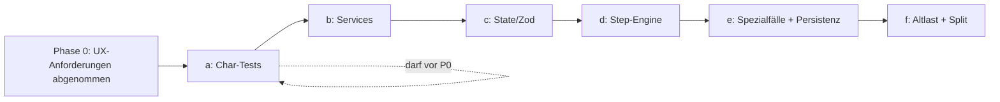

# Refactor-Plan: Welle 3-VI Creation-Wizard

> Stand: 2026-05-31. Plan für die im Strategie-Plan reservierte
> **Welle 3-VI** (`refactor-strategie-drift-eliminieren_*.plan.md`,
> Eintrag `welle-3vi-creation-wizard-ux-first`).
>
> **Grundlage**: `docs/analysis/wizard-template-schwachstellen-architektur-und-ux.md`
> (Schwachstellen-Analyse mit file:line-Belegen, Stand 2026-05-31).

---

## 0. Verbindliche Strategie: UX-First, DANN Refactor

Der Strategie-Plan legt für diese Welle eine **zwingende Reihenfolge** fest
(Entscheidung 2026-05-01):

1. **UX-Anpassungen zuerst** — User dokumentiert UX-Bedürfnisse vorab unter
   `docs/creation-wizard/ux-anforderungen.md`.
2. **DANN refaktorisieren** — der Refactor friert die *saubere* UX-Struktur
   ein, nicht die instabile alte.

**Konsequenz für diesen Plan**: Phase 0 (UX) ist Voraussetzung. Die
Refactor-Sub-Wellen 3-VI-a…f starten erst, wenn die UX-Anforderungen
abgenommen sind. Bis dahin gilt dieser Plan als **Refactor-Vorbereitung**:
Die Sub-Wellen A (Audit + Char-Tests) und das Skelett dürfen schon erstellt
werden, weil sie reines Sicherheitsnetz sind und keine UX einfrieren.

> **Stop-Gate**: Keine strukturelle Code-Änderung an Flow/State/Steps, bevor
> `ux-anforderungen.md` Status `abgenommen` hat.

---

## 1. Ausgangslage (Fakten)

| Metrik | Wert | Soll |
|---|---:|---|
| `creation-wizard.tsx` | **4.219 Zeilen** | < 200 |
| `collect-source-step.tsx` | **1.187 Zeilen** | < 200 |
| `edit-draft-step.tsx` | 532 Zeilen | < 200 |
| React-Hooks im Kern | ~24 | wenige, je Komponente |
| Wizard-Tests (Char-Tests) | **0** | Sicherheitsnetz nötig |
| Silent Catches im Kern | ≥ 4 | 0 (`no-silent-fallbacks`) |
| Storage-Branch in UI | ja (`primaryStore === 'mongo'`, `:2666`) | 0 (`storage-abstraction`) |
| `window`-Hack | `__collectSourceStepBeforeLeave` (`:1268`, `collect-source-step.tsx:491`) | eliminieren |
| Template-Spezialfälle | 14+ `if (templateId === …)` | datengetrieben |
| Speicherpfade | 3+ konkurrierend | 1 atomarer Commit |

Geschätzter Modul-Umfang: ~17 Files, ~8.000 Zeilen → bei Diff-Limits
(max 5.000z brutto/PR) sind **mehrere Sub-Wellen-PRs** zwingend.

---

## 2. Zielarchitektur (Soll)

```
src/components/creation-wizard/
  wizard-container.tsx        # Orchestrierung + State-Provider, < 200 Z.
  engine/
    wizard-step-engine.ts     # State-Machine über template.creation.flow.steps
    step-registry.ts          # preset -> { Component, canProceed, onNext, onBack }
    step-presets.ts           # Preset-Typen + deklarative Policies
  state/
    wizard-atoms.ts           # Jotai-Atoms (template, sources, draft, ui-status)
    wizard-schema.ts          # Zod-Schema der kanonischen Wizard-Daten
  services/
    job-runner.ts             # Job-Polling/SSE inkl. Cancel-Token
    persistence.ts            # EIN atomarer Commit (ruft Server-Endpoint)
    session-logger.ts         # (bestehend, ggf. konsolidiert)
  steps/
    *.tsx                     # reine Präsentation, je < 200 Z.
```

Invarianten danach:
- Template definiert Flow + Felder **vollständig datengetrieben** → neues
  Template = **kein** Kern-Code.
- **Eine** kanonische Datenquelle (Zod-validiert) statt der Fallback-Kette.
- Jeder Step hat definierte `idle | loading | error | success`-Zustände.
- Kein `window`-Hack, kein Storage-Branch in der UI, kein Silent Catch.

---

## 3. Sub-Wellen (1 PR pro Sub-Welle)

Reihenfolge ist verbindlich (Tests → Helper → State → Engine → Persistenz →
Altlast). Jede Sub-Welle endet mit Cleanup + Acceptance im selben PR.

Branch-Schema: `cursor/refactor-welle-3-vi-<sub>-<suffix>`.

---

### Sub-Welle 3-VI-a — Audit + Characterization-Tests (Sicherheitsnetz)

**Darf vor UX-Abnahme laufen** (reines Netz, keine Verhaltensänderung).

| # | Commit | Inhalt | Budget |
|---|---|---|---:|
| 1 | docs | `01-inventory.md` + `00-audit.md` (Files, Hooks, Catches, Aufrufer) | ~250 |
| 2 | test | Char-Tests Flow-Steuerung: Step-Filter (`:743`), `canProceed` je Preset (`:4069`), Navigation vor/zurück | ~400 |
| 3 | test | Char-Tests Persistenz-Mapping: `baseMetadata`-Fallback (`:1852`), Standard- vs. PDF- vs. Event-Pfad (gemockt) | ~400 |
| 4 | test | Char-Tests Job-Runner: `waitForJobCompletionWithProgress` (SSE + Poll-Fallback, `:950`) | ~300 |

**Smoke-Test**: keiner nötig (nur Tests). **Exit**: `pnpm test` grün, Verhalten
dokumentiert als Snapshot der Ist-Logik. **Stop-Gate**: Findet ein Char-Test
einen bestehenden Bug → dokumentieren, **nicht** im selben Commit fixen.

---

### Sub-Welle 3-VI-b — Service-Extraktion (kein Render, isoliert)

Reine Logik aus dem Kern in testbare Module ziehen. Verhalten unverändert.

| # | Commit | Inhalt | Budget |
|---|---|---|---:|
| 1 | refactor | `services/job-runner.ts` — Job-Polling/SSE extrahieren, **Cancel-Token** ergänzen (behebt Race `:757`) | ~500 |
| 2 | refactor | `services/session-logger`-Aufrufe konsolidieren (Timer-Race `:271`) | ~300 |
| 3 | fix | **Silent Catches beseitigen** (`:1025, 1049, 1080`) → Fehler an UI-Status melden (`no-silent-fallbacks`) | ~250 |
| 4 | cleanup | ungenutzte Imports im Kern nach Extraktion | ~100 |

**Smoke-Test (≤4 Klicks)**: 1 Audio-Transkript-Job starten → Fortschritt
sichtbar → Abbruch beim Step-Wechsel testen → Fehlerfall (Job killen) zeigt
sichtbaren Fehler statt Stillstand.

---

### Sub-Welle 3-VI-c — Kanonischer State (Jotai + Zod)

Behebt 1.2 der Analyse (Single Source of Truth).

| # | Commit | Inhalt | Budget |
|---|---|---|---:|
| 1 | feat | `state/wizard-schema.ts` (Zod) + `state/wizard-atoms.ts` | ~400 |
| 2 | refactor | `WizardState` → Atoms; **eine** kanonische Metadaten-Quelle statt Fallback-Kette (`:1852`) | ~700 |
| 3 | refactor | `edit-draft-step` auf React Hook Form + Zod (`:Felder-Sync`) | ~500 |
| 4 | cleanup | tote State-Properties entfernen | ~150 |

**Smoke-Test (≤6 Klicks)**: Story im Formular-Modus erfassen → Felder editieren →
zurück/vor → Werte bleiben erhalten → speichern → in Library prüfen, dass
**alle** editierten Felder persistiert sind (kein Verlust durch Fallback).

> **Stop-Gate**: Wenn der Speicher-Pfad pro Template unterschiedliche
> Metadaten erwartet → in 3-VI-e (Persistenz) klären, hier nur State.

---

### Sub-Welle 3-VI-d — Step-Engine + Preset-Registry (datengetrieben)

Behebt 1.3 (hartkodierter Flow) und das if/else-Preset-Mapping.

| # | Commit | Inhalt | Budget |
|---|---|---|---:|
| 1 | feat | `engine/step-registry.ts` (`preset → {Component, canProceed, onNext}`) | ~400 |
| 2 | feat | `engine/wizard-step-engine.ts` — State-Machine über `flow.steps`, ersetzt `renderStep`-if/else | ~600 |
| 3 | refactor | `canProceed` je Preset in Registry verschieben (`:4069-4113`) | ~400 |
| 4 | refactor | `handleNext`-Verzweigung → deklarative `onNext`-Handler je Preset (Basis, **ohne** Template-Spezialfälle) | ~700 |
| 5 | cleanup | Kern schrumpft; ungenutzte Step-Imports | ~150 |

**Smoke-Test (≤8 Klicks)**: je 1 Durchlauf Standard-Template + 1 Template mit
bedingten Schritten → Reihenfolge korrekt, Step-Indicator stimmt, "Weiter"
ent-/aktiviert wie erwartet.

---

### Sub-Welle 3-VI-e — Template-Spezialfälle entkoppeln + Persistenz vereinheitlichen

Behebt 1.3 (Spezialfälle) und 1.4 (Speicherpfade). **Riskanteste Sub-Welle** →
ggf. in zwei PRs (e1 Spezialfälle, e2 Persistenz).

| # | Commit | Inhalt | Budget |
|---|---|---|---:|
| 1 | feat | Step-Policies im Template (`extract/metadata/ingest`) deklarativ statt `if (templateId === 'pdfanalyse')` (`:1278, 1550`) | ~700 |
| 2 | refactor | PDF/Event/Audio-Sonderlogik in Preset-Policies/Server verschieben (`:1469, 2196, 3002`) | ~800 |
| 3 | feat | `services/persistence.ts` — **ein** Commit-Endpunkt; Triple-Upsert (`:2611,2672,2735`) server-seitig atomar bündeln | ~700 |
| 4 | fix | **Storage-Branch aus UI entfernen** (`primaryStore === 'mongo'`, `:2666`) → Server entscheidet (`storage-abstraction`) | ~300 |
| 5 | cleanup | tote Template-ID-Checks entfernen | ~200 |

**Smoke-Test (≤10 Klicks)**: PDF-Analyse, Event-Finalize, Audio-Transkript,
Standard-Story je 1× durchlaufen → jeweils Datei + Transformation-Tab + Galerie
prüfen (behebt leeren Transformation-Tab aus
`wizard-speicherarchitektur-single-point-of-truth.md`).

> **Stop-Gate**: Wenn Persistenz-Vereinheitlichung Server-Endpunkte ändern
> muss, die andere Domänen (external-jobs) berühren → ADR-0001 beachten,
> getrennt halten, mit User klären.

---

### Sub-Welle 3-VI-f — Altlast-Pass + collect-source-step-Split

| # | Commit | Inhalt | Budget |
|---|---|---|---:|
| 1 | refactor | **`window`-Hack eliminieren** (`__collectSourceStepBeforeLeave`) → Engine-Callback (`:1268`, `collect-source-step.tsx:491`) | ~400 |
| 2 | refactor | `collect-source-step.tsx` (1.187 Z.) in Quell-Typ-Module splitten (Text/Datei/PDF/Audio/Web) | ~900 |
| 3 | refactor | `creation-wizard.tsx` final auf `wizard-container.tsx` < 200 Z. reduzieren | ~500 |
| 4 | cleanup + docs | letzte ungenutzte Imports + `06-acceptance.md` | ~250 |

**Smoke-Test (≤10 Klicks)**: alle Quell-Typen je 1× hinzufügen → Wechsel
zwischen Steps ohne Datenverlust → kompletter Story-Durchlauf bis Library.

---

## 4. Diff-/PR-Budget (Kontrolle)

| Sub-Welle | Commits | Brutto-Diff (geschätzt) | Hart-Limit-Risiko |
|---|---:|---:|---|
| a | 4 | ~1.350 | ok |
| b | 4 | ~1.150 | ok |
| c | 4 | ~1.750 | ok |
| d | 5 | ~2.250 | Commit 2/4 nah an 1.000 → ggf. splitten |
| e | 5 | ~2.700 | **ggf. in e1/e2 teilen** |
| f | 4 | ~2.050 | Commit 2 (~900) beobachten |

Alle PRs < 5.000z brutto, < 15 Commits. Kein `pnpm build` im Cloud-Agent
außer bei konkretem Build-Fehler-Verdacht (AGENTS.md).

---

## 5. Querschnitt-Regeln (bei jeder Sub-Welle)

- **Char-Tests vor Code-Änderung** (Sub-Welle a liefert das Netz).
- **`pnpm test` grün vor jedem Push**; `pnpm lint` Pflicht.
- **Cleanup im selben PR** wie die Ursache (`refactor-batch-strategy`).
- **Kein Silent Fallback** neu einführen (`no-silent-fallbacks`).
- **UI kennt kein Storage-Backend** (`storage-abstraction`).
- **DetailViewType-Vertrag** nicht brechen (`detail-view-type-checklist`).
- **ADR-0001**: `event-job` und `external-jobs` nicht vermischen.

---

## 6. Stop-Gates (sofort abbrechen + melden)

- UX-Anforderungen noch nicht abgenommen, aber strukturelle Flow/State-Änderung
  geplant (Phase-0-Gate).
- Char-Test deckt vor-existierenden Bug auf → dokumentieren, nicht im
  Refactor-Commit fixen.
- 1 Commit > 1.000z → splitten.
- Persistenz-Änderung berührt external-jobs-Domäne → ADR-0001, mit User klären.
- > 3 fehlgeschlagene Versuche für dieselbe Änderung.
- React-Error-Boundary-Fehler nach Engine-Umbau → mit User klären.

---

## 7. Reihenfolge-Abhängigkeiten



Sub-Welle **a** ist die einzige, die vor der UX-Abnahme erstellt werden darf
(reines Sicherheitsnetz). Alles ab **b** wartet auf die abgenommenen
UX-Anforderungen, damit der Refactor die finale UX einfriert, nicht die alte.

---

## 8. Nächster Schritt

1. **User**: `docs/creation-wizard/ux-anforderungen.md` ausfüllen/abnehmen
   (Skelett aus der Schwachstellen-Analyse ist dort vorbereitet).
2. **Agent**: Sub-Welle 3-VI-a (Char-Tests) als erste PR — kann sofort starten.
