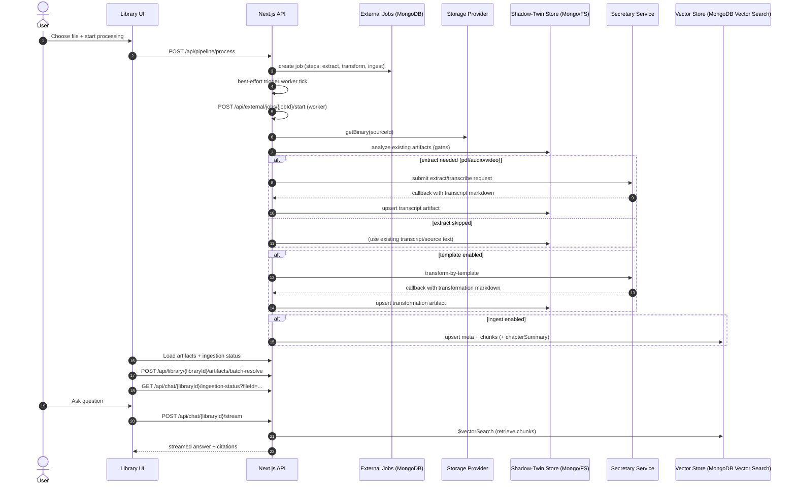

## File → Story → Askable (End-to-End)

### 1) Goal: “From file → story → askable”

This page explains the **end-to-end path** of a file (PDF / audio / video / markdown) through:

- **Shadow‑Twin** (transcript + transformation artifacts)
- **Ingestion** (MongoDB Vector Search: meta + chunks)
- **Explorer / Chat** (story UI + RAG Q&A)

It is designed as an **operational overview** and links to the deeper architecture docs where needed.

### 2) Terms (quick glossary)

- **Source**: the original file in a library (PDF/audio/video/markdown).
- **Shadow‑Twin**: derived artifacts for a source (markdown artifacts + binary fragments).
- **Transcript**: extracted text as markdown (often minimal frontmatter).
- **Transformation**: template-based markdown with frontmatter/metadata (structured “story input”).
- **Ingestion**: converting transformation/transcript into:
  - **meta doc** (for gallery/explorer + facets)
  - **chunk docs** (for semantic retrieval)
- **MetaDoc**: the per-document “metadata record” stored in the vector collection (`kind: 'meta'`).
- **Chunk**: a text segment with an embedding (`kind: 'chunk'`).

### 3) End-to-end flow (numbered)

#### Step 0 — The file exists in a Library (Storage Provider)

The source file lives in your library storage (filesystem / OneDrive / … via a provider abstraction).

#### Step 1 — Start a pipeline job (Unified endpoint)

You trigger processing via the unified endpoint:

- `POST /api/pipeline/process`

This creates an **External Job** with steps:

- `extract_*` (pdf/audio/video)
- `transform_template`
- `ingest_rag`

Reference: `docs/architecture/pipeline-phases.md`

#### Step 2 — Job start: load source binary + analyze Shadow‑Twin

The worker starts the job:

- loads source bytes from the provider (`getBinary`)
- analyzes existing Shadow‑Twin state (so gates can skip redundant work)

#### Step 3 — Extract (transcribe/OCR) → Transcript artifact

For PDFs/audio/video, phase 1 creates a **transcript** artifact (markdown).

For markdown sources, “extract” is effectively skipped: the source is already text.

#### Step 4 — Transform (template) → Transformation artifact (story-ready markdown)

Template transformation generates the “story-ready” markdown:

- validated/extended frontmatter
- chapters / summary / teaser / facets, etc.

This is the best ingestion input because it includes structured metadata.

Reference: `docs/architecture/shadow-twin.md`, `docs/architecture/template-system.md`

#### Step 5 — Ingest (RAG) → MongoDB Vector Search (meta + chunks)

Ingestion turns the (preferably transformed) markdown into:

- `kind: 'meta'` document: for gallery/explorer + facets
- `kind: 'chunk'` documents: for semantic retrieval
- `kind: 'chapterSummary'` docs (optional) for chapter-focused retrieval

Reference: `docs/analysis/ingestion.md`, `docs/architecture/mongodb-vector-search.md`

#### Step 6 — Explorer & Chat (askable story)

- Explorer/Gallery reads meta documents to render cards (title, teaser, cover, etc.)
- Chat retrieves relevant chunks using `$vectorSearch` and generates answers (RAG)

Reference: `docs/use-cases/chat-exploration.md`

### Mermaid: Sequence overview (systems + APIs)

### 4) Storage matrix (what lives where?)

| Data | What it is | File Storage (Provider) | MongoDB (Shadow‑Twin) | Azure Blob (Binary) | MongoDB Vector Search |
|---|---|---:|---:|---:|---:|
| Source file | PDF/audio/video/markdown | ✅ | ✖️ | (optional) | ✖️ |
| Transcript artifact | extracted markdown | ✅ (FS mode) | ✅ (mongo mode) | ✖️ | ✖️ |
| Transformation artifact | template markdown + frontmatter | ✅ (FS mode) | ✅ (mongo mode) | ✖️ | ✖️ |
| Binary fragments metadata | image references (cover, slides, etc.) | (possible) | ✅ | ✖️ | ✖️ |
| Binary fragments bytes | images, PDFs (optional) | ✅ (FS fallback) | ✖️ | ✅ | ✖️ |
| MetaDoc | `kind: 'meta'` | ✖️ | ✖️ | ✖️ | ✅ |
| Chunks | `kind: 'chunk'` | ✖️ | ✖️ | ✖️ | ✅ |
| Chapter summaries | `kind: 'chapterSummary'` | ✖️ | ✖️ | ✖️ | ✅ |

Notes:

- Shadow‑Twin “primary store” is configurable per library (`filesystem` vs `mongo`).
- In mongo mode, binaries are typically served via **Azure URLs** (fallback exists via `/api/storage/filesystem` when a `fileId` exists).

### 5) Typical failure modes (and how to recognize them)

#### A) Missing `templateName` for transformations (determinism break)

Symptoms:

- transformation not found / wrong transformation chosen
- cover upload/frontmatter patch fails or updates “the wrong one”

Fix direction:

- treat `templateName` as required input for transformation operations
- avoid “pick newest transformation” as a default behavior in new call-sites

#### B) Azure container missing / misconfigured

Symptoms:

- cover/slides/pdf upload fails with “container does not exist”
- ingestion completes but without expected URLs

Fix direction:

- ensure Azure storage configuration is present and the container exists
- keep FS fallback for development where Azure is unavailable

#### C) Ingestion input empty / too short

Symptoms:

- `ingest_rag` fails early, or results in “no chunks”

Fix direction:

- treat empty ingestion input as a hard error (pipeline should not mark success)
- verify transformation/transcript output first

#### D) Vector Search index not READY / missing token-index fields

Symptoms:

- `$vectorSearch` errors
- errors like “Path 'authors' needs to be indexed as token”

Fix direction:

- check index status (can take time: INITIAL_SYNC)
- ensure the index definition includes token indexing for array fields used in filters

### 6) Debug entry points (fastest way to locate the break)

#### External Job steps

Look at job steps for:

- `extract_pdf` / `extract_audio` / `extract_video`
- `transform_template`
- `ingest_rag`

Key contract:

- job `completed` must not have any step still `pending` or `running`

#### Ingestion status API

- `GET /api/chat/{libraryId}/ingestion-status?fileId=...`

Use it to verify:

- meta doc exists
- chunkCount / chaptersCount make sense
- doc is not stale compared to your current artifact

#### Chat stream processing steps (live)

- `POST /api/chat/{libraryId}/stream` emits structured steps such as:
  - retriever selection
  - retrieval start/progress
  - (optional) cache checks
  - completion or error

Use these steps to decide whether the failure is:

- “retrieval” (Vector Search) vs
- “generation” (LLM) vs
- “missing ingestion” (no indexed docs)

### Related docs (deep dives)

- Pipeline phases: `docs/architecture/pipeline-phases.md`
- Shadow‑Twin model: `docs/architecture/shadow-twin.md`
- Ingestion runtime: `docs/analysis/ingestion.md`
- Vector search architecture: `docs/architecture/mongodb-vector-search.md`
- Chat use case: `docs/use-cases/chat-exploration.md`

